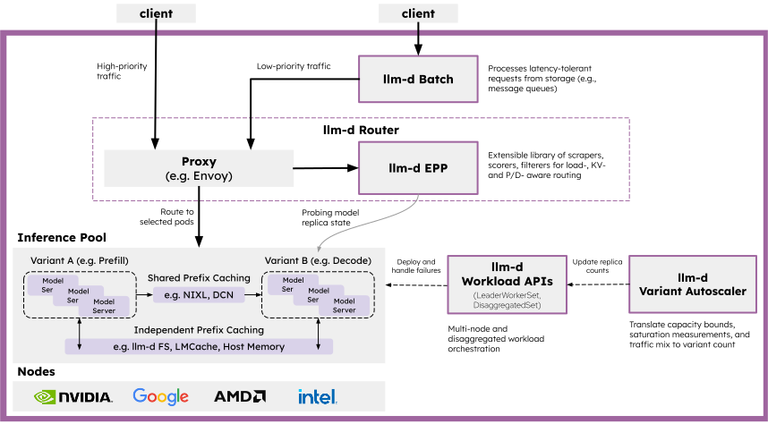

  <picture>
    <source media="(prefers-color-scheme: dark)">
    
  </picture>

<h2 align="center">
Achieve SOTA Inference Performance On Any Accelerator
</h2>

 
 
 
 

llm-d is a high-performance distributed inference serving stack optimized for production deployments on Kubernetes. We help you achieve the fastest "time to state-of-the-art (SOTA) performance" for key OSS large language models across most hardware accelerators and infrastructure providers with well-tested guides and real-world benchmarks.

## What does llm-d offer to production inference?

Model servers like [vLLM](https://docs.vllm.ai) and [SGLang](https://github.com/sgl-project/sglang) handle efficiently running large language models on accelerators. llm-d provides state of the art orchestration above model servers to serve high-scale real world traffic efficiently and reliably:

1. [Intelligent Inference Scheduling](./guides/inference-scheduling/README.md) - Deploy [vLLM](https://docs.vllm.ai) behind a smart Envoy load balancer enhanced with an [inference scheduler](https://github.com/llm-d/llm-d-inference-scheduler) to decrease serving latency and increase throughput with [prefix-cache aware routing](./guides/precise-prefix-cache-aware/README.md), utilization-based load balancing, fairness and prioritization for multi-tenant serving, and [predicted latency balancing (experimental)](./guides/predicted-latency-based-scheduling).
2. [Disaggregated Serving (prefill/decode disaggregation)](./guides/pd-disaggregation/README.md) - Reduce time to first token (TTFT) and get more predictable time per output token (TPOT) by splitting inference into prefill servers handling prompts and decode servers handling responses, primarily on large models such as gpt-oss-120b and when processing very long prompts.
3. [Wide Expert-Parallelism](./guides/wide-ep-lws/README.md) - Deploy very large Mixture-of-Experts (MoE) models like [DeepSeek-R1](https://github.com/vllm-project/vllm/issues/16037) for much higher throughput for RL and latency-insensitive workloads, using [Data Parallelism and Expert Parallelism](https://docs.vllm.ai/en/latest/serving/data_parallel_deployment.html) over fast accelerator networks.
4. [Tiered KV Prefix Caching with CPU and Storage Offload](./guides/tiered-prefix-cache/README.md) - Improve prefix cache hit rate by offloading KV-cache entries to CPU memory, local SSD, and remote high-performance filesystem storage.
5. [Workload Autoscaling](./guides/workload-autoscaling/README.md) - Autoscale multi-model workloads on heterogeneous shared hardware with SLO-aware cost optimization using the [Workload Variant Autoscaler](./guides/workload-autoscaling/README.wva.md) or autoscale workloads on homogeneous hardware where each model scales independently using [HPA with IGW metrics](./guides/workload-autoscaling/README.hpa-igw.md).

These [guides](./guides/README.md) provide tested and benchmarked recipes and Helm charts to start serving quickly with best practices common to production deployments. They are extensible and customizable for particulars of your models and use cases, using standard open source components like Kubernetes, Envoy proxy, NIXL, and vLLM. Our intent is to eliminate the heavy lifting common in tuning and deploying generative AI inference on modern accelerators.

## Get Started Now

We recommend new users start with a deployment of the inference scheduler and vLLM together through our [step-by-step quickstart](./guides/QUICKSTART.md).

### Latest News 🔥

- [2026-02] The [v0.5](https://llm-d.ai/blog/llm-d-v0.5-sustaining-performance-at-scale) introduces reproducible benchmark workflows, hierarchical KV offloading, cache-aware LoRA routing, active-active HA, UCCL-based transport resilience, and scale-to-zero autoscaling; validated ~3.1k tok/s per B200 decode GPU (wide-EP) and up to 50k output tok/s on a 16×16 B200 prefill/decode topology with order-of-magnitude TTFT reduction vs round-robin baseline.
- [2025-12] The [v0.4](https://llm-d.ai/blog/llm-d-v0.4-achieve-sota-inference-across-accelerators) release demonstrates 40% reduction in per output token latency for DeepSeek V3.1 on H200 GPUs, Intel XPU and Google TPU disaggregation support for lower time to first token, a new well-lit path for prefix cache offload to vLLM-native CPU memory tiering, and a preview of the workload variant autoscaler improving model-as-a-service efficiency.

<!-- Previous News  -->
<!-- - [2025-08] Read more about the [intelligent inference scheduler](https://llm-d.ai/blog/intelligent-inference-scheduling-with-llm-d), including a deep dive on how different balancing techniques are composed to improve throughput without overloading replicas. -->

## 🧱 Architecture

llm-d accelerates distributed inference by integrating industry-standard open technologies: vLLM as default model server and engine, [Kubernetes Inference Gateway](https://gateway-api-inference-extension.sigs.k8s.io/) as control plane API and load balancing orchestrator, and Kubernetes as infrastructure orchestrator and workload control plane.

  <picture>
    <source media="(prefers-color-scheme: dark)">
    
  </picture>

### llm-d adds:

- [**Model Server Optimizations in vLLM:**](https://github.com/vllm-project/vllm) The llm-d team contributes and maintains high performance distributed serving optimizations in upstream vLLM, including disaggregated serving, KV connector interfaces, support for frontier OSS mixture of experts models, and production-ready observability and resiliency. 

- [**Inference Scheduler:**](https://github.com/llm-d/llm-d-inference-scheduler) llm-d uses the Envoy proxy and its extensible balancing policies to make customizable “smart” load-balancing decisions specifically for LLMs without reimplementing a full featured load balancer. Leveraging operational telemetry, the Inference Scheduler implements the filtering and scoring algorithms to make decisions with P/D-, KV-cache-, SLA-, and load-awareness. Advanced users can implement their own scorers to further customize the algorithm while benefiting from IGW features like flow control and latency-aware balancing. The control plane for the load balancer is the Kubernetes API but can also be run standalone.

- [**Disaggregated Serving Sidecar:**](https://github.com/llm-d/llm-d-inference-scheduler/tree/main/cmd/pd-sidecar) llm-d orchestrates prefill and decode phases onto independent instances - the scheduler decides which instances should receive a given request, and the transaction is coordinated via a sidecar alongside decode instances. The sidecar instructs vLLM to provide point to point KV cache transfer over fast interconnects (IB/RoCE RDMA, TPU ICI, and DCN) via NIXL.

- [**vLLM Native CPU Offloading**](https://docs.vllm.ai/en/latest/examples/basic/offline_inference/#cpu-offload) and [**llm-d filesystem backend**:](https://github.com/llm-d/llm-d-kv-cache/tree/main/kv_connectors/llmd_fs_backend) llm-d uses vLLM's KVConnector abstraction to configure a pluggable KV cache hierarchy, including offloading KVs to host, remote storage, and systems like LMCache, Mooncake, and KVBM. 

- [**Variant Autoscaling over Hardware, Workload, and Traffic**](https://github.com/llm-d-incubation/ig-wva): A traffic- and hardware-aware autoscaler that (a) measures the capacity of each model server instance, (b) derive a load function that takes into account different request shapes and QoS, and (c) assesses recent traffic mix (QPS, QoS, and shapes) to calculate the optimal mix of instances to handle prefill, decode, and latency-tolerant requests, enabling use of HPA for SLO-level efficiency.

For more details of architecture see the [project proposal](./docs/proposals/llm-d.md).

### What is in scope for llm-d

llm-d currently targets improving the production serving experience around:

- Online serving and online batch of Generative models running in PyTorch or JAX
  - Large language models (LLMs) with 1 billion or more parameters
  - Using most or all of the capacity of one or more hardware accelerators
  - Running in throughput, latency, or multiple-objective configurations
- On recent generation datacenter-class accelerators - NVIDIA A100+, AMD MI250, Google TPU v5e or newer, and Intel GPU Max seriers or newer
- On Kubernetes 1.29+, integrated via code into [Ray](https://docs.ray.io), or as a standalone service

See the [accelerator docs](./docs/accelerators/README.md) for points of contact for more details about the accelerators, networks, and configurations tested and our [roadmap](https://github.com/llm-d/llm-d/issues/146) for what is coming next.

## 🔍 Observability

- [Monitoring & Metrics](./docs/monitoring/README.md) - Prometheus, Grafana dashboards, and PromQL queries
- [Distributed Tracing](./docs/monitoring/tracing/README.md) - OpenTelemetry tracing across vLLM, routing proxy, and EPP

## 📦 Releases

Our [guides](./guides/README.md) are living docs and kept current. For details about the Helm charts and component releases, visit our [GitHub Releases page](https://github.com/llm-d/llm-d/releases) to review release notes.

Check out our [roadmap for upcoming releases](https://github.com/llm-d/llm-d/issues?q=is%3Aissue%20state%3Aopen%20%22%5BRoadmap%5D%22).

## Contribute

- See [our project overview](PROJECT.md) for more details on our development process and governance.
- Review [our contributing guidelines](CONTRIBUTING.md) for detailed information on how to contribute to the project.
- Join one of our [Special Interest Groups (SIGs)](SIGS.md) to contribute to specific areas of the project and collaborate with domain experts.
- We use Slack to discuss development across organizations. Please join: [Slack](https://llm-d.ai/slack)
- We host a weekly standup for contributors on Wednesdays at 12:30 PM ET, as well as meetings for various SIGs. You can find them in the [shared llm-d calendar](https://red.ht/llm-d-public-calendar)
- We use Google Groups to share architecture diagrams and other content. Please join: [Google Group](https://groups.google.com/g/llm-d-contributors)

## License

This project is licensed under Apache License 2.0. See the [LICENSE file](LICENSE) for details.
