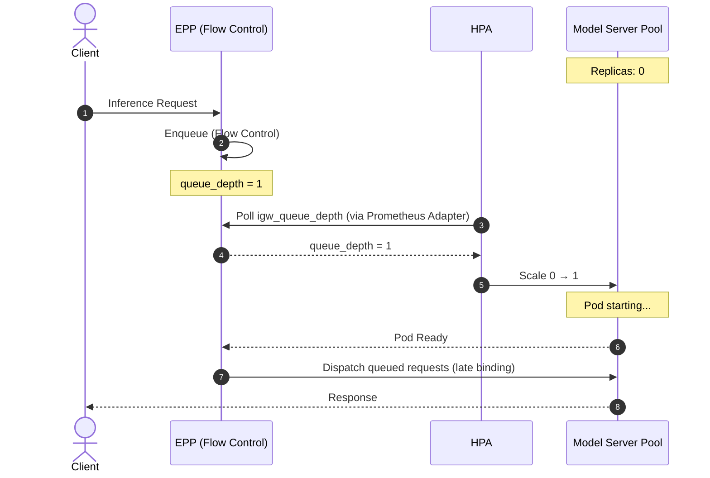

# HPA/KEDA with EPP Metrics

The EndPoint Picker (EPP) HPA/KEDA integration enables Kubernetes Horizontal Pod Autoscaler (HPA) to scale model server replicas using demand-side signals sourced from the EPP. Rather than relying on coarse resource utilization metrics, it exposes the EPP's internal queuing state as the authoritative signal for LLM inference load. This approach is well-suited for homogeneous deployments where each model scales independently.

## Functionality

The EPP HPA/KEDA integration provides:

- **Demand-driven scaling**: Model server replicas are added or removed based on EPP queue depth and active request count — metrics that directly reflect inference load rather than resource saturation.
- **Scale to zero**: When traffic drops to zero, model server replicas are fully removed and GPU resources are reclaimed. Incoming requests during this state are buffered in EPP Flow Control queues until pods are ready.

## Design

### The LLM Autoscaling Problem

Traditional Kubernetes autoscaling relies on resource utilization (CPU, GPU memory). For LLM inference, this is poorly suited: during active token generation, GPU compute is consistently at or near 100% utilization regardless of whether the model is handling one request or a saturated batch. A utilization-based autoscaler cannot distinguish between "running at optimal capacity" and "overloaded."

Without a better signal, the autoscaler has three bad options:

- **React too late**: Scale out only after latency has already degraded, because utilization was already high before the overload.
- **React too early**: Scale out preemptively but wastefully, because utilization spikes even on a lightly-loaded GPU during a single large request.
- **Never scale in**: Keep excess replicas running indefinitely because utilization never drops to zero as long as a single request is in flight.

EPP Flow Control addresses this by shifting queuing to the gateway. The EPP's `llm_d_epp_flow_control_queue_size` metric directly counts requests that the current pool cannot absorb — a precise, actionable signal for scale-out.

### Architecture Overview

The scaling pipeline connects EPP metrics to the Kubernetes HPA through a standard adapter layer:

The steps are:

1. **Metric Emission**: The EPP exposes `llm_d_epp_flow_control_queue_size` (requests buffered in Flow Control) and `inference_objective_running_requests` (active in-flight requests) on its `/metrics` endpoint.
2. **Metric Collection**: Prometheus scrapes these metrics via the `ServiceMonitor` deployed with each llm-d inference stack.
3. **Metric Translation**: The Prometheus Adapter translates the Prometheus series into Kubernetes External Metrics, exposing them as `igw_queue_depth` and `igw_running_requests` through the `external.metrics.k8s.io` API.
4. **Scaling Decision**: The HPA polls external metrics on each evaluation interval. When a metric exceeds its configured target, the HPA computes a desired replica count and reconciles the model server `Deployment`.

> [!NOTE]
> Although `igw_queue_depth` and `igw_running_requests` are emitted by the EPP pod, the HPA uses `type: External` rather than `type: Pods`. `type: Pods` requires metrics to be sourced from the pods being scaled — the model servers. Since the EPP is a separate `Deployment` acting as a gateway, its metrics are treated as external signals with respect to the model server pool.

### Dual-Metric Strategy

Using both metrics in a single HPA creates a more robust autoscaling response:

| Metric | Signal | HPA Target Type | Interpretation |
|---|---|---|---|
| `igw_queue_depth` | Queue saturation | `Value` (raw total) | A non-zero queue depth means the pool cannot absorb incoming traffic at the current rate. Scale out immediately. |
| `igw_running_requests` | Active concurrency | `AverageValue` (per pod) | Tracks total in-flight load and drives the HPA to maintain a target concurrency per replica under sustained traffic. |

When either metric exceeds its target, the HPA takes the more aggressive of the two computed replica counts — ensuring the deployment responds to both sudden load spikes (queue filling) and sustained high throughput.

### Scale to Zero

EPP Flow Control is the enabling mechanism for seamless scale-from-zero. When all model server replicas are removed, the EPP buffers incoming requests in its in-memory queues rather than rejecting them. This decouples the user-facing availability guarantee from the provisioning state of the backend.

The steps are:

1. **Buffering during cold start**: When a zero-replica deployment receives traffic, the EPP Flow Control layer accepts and queues requests in memory. Users experience a latency spike equal to the pod startup time but receive no 5xx errors (unless the scale up time is too long, causing request times outs).
2. **Scale-out trigger**: A non-zero `igw_queue_depth` is immediately visible to the HPA or KEDA, which provisions the first replica.
3. **Late binding dispatch**: The EPP holds queued requests until the model server reports readiness, then dispatches them using its standard scheduling logic.

Two paths are supported to enable scale-to-zero:

- **Native HPA** — The `HPAScaleToZero` alpha feature gate allows `minReplicas: 0`. This is the preferred path when the cluster supports the feature gate.
- **KEDA** — When `HPAScaleToZero` is unavailable, a KEDA `ScaledObject` monitors `igw_queue_depth` and scales the deployment from 0 to 1 as soon as the queue is non-empty. Standard HPA (with `minReplicas: 1`) then handles scaling from 1 to N.

> [!NOTE]
> KEDA ships with its own metrics server (`keda-operator-metrics-apiserver`) and a native Prometheus scaler that queries Prometheus directly via PromQL. When using KEDA, the separate Prometheus Adapter installation step is not required.

> [!IMPORTANT]
> EPP Flow Control queues are stored in memory only. If the EPP process restarts while requests are queued, those requests are lost. Clients will receive an HTTP 500 during a graceful EPP shutdown (as requests are evicted) or a hard connection drop on an abrupt crash. Plan EPP replicas and disruption budgets accordingly.
