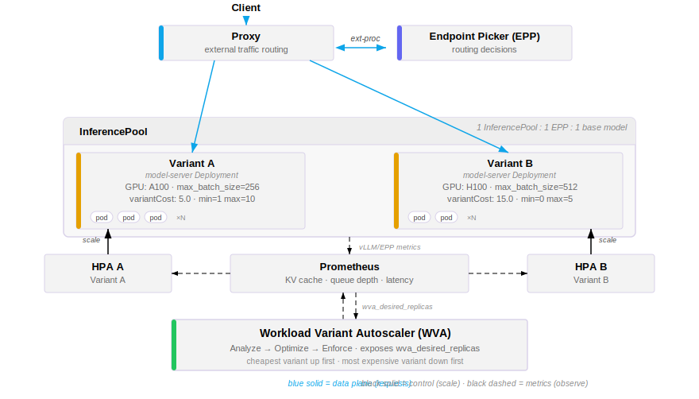
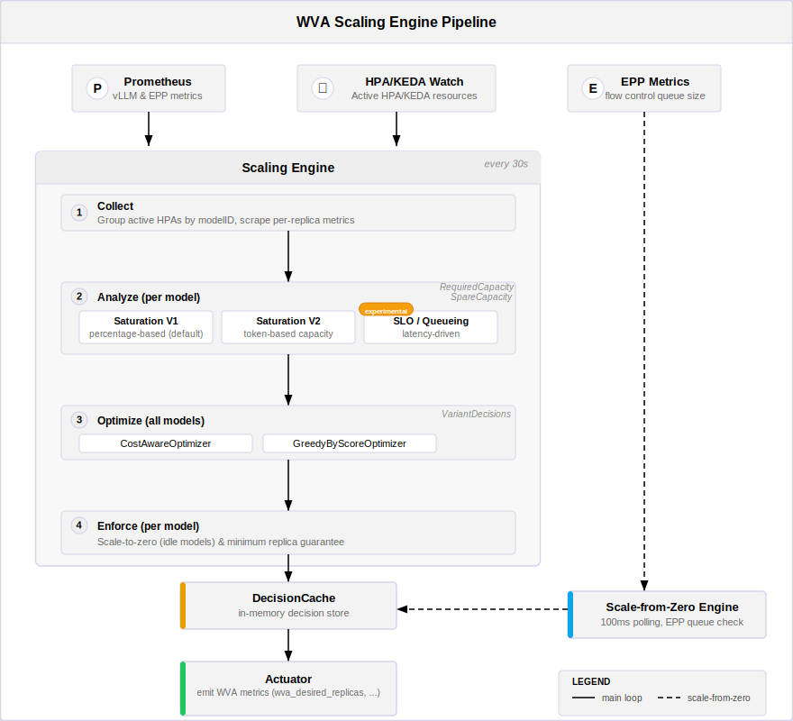

# HPA/KEDA with WVA Metrics

> [!WARNING]
> **Deprecation Notice:** The `VariantAutoscaling` (VA) CRD-based approach described in this document is deprecated. The recommended path is the [HPA + WVA guide](../../../../guides/workload-autoscaling/README.wva.md), which configures HPA directly with WVA-published metrics without requiring the `VariantAutoscaling` CRD. If you are currently using VA objects, see the [Migration from VA to HPA + WVA](#migration-from-va-to-hpa--wva) section below.

## Functionality

The Workload Variant Autoscaler (WVA) is an optimizer and a Kubernetes controller that automatically scales LLM inference workloads based on real-time resource utilization and performance metrics. As an optimizer, it analyzes supply and demand signals across all InferencePool variants to produce globally cost-efficient scaling decisions. As a controller, it reconciles those decisions by managing the replica count of model-serving deployments (Deployments, StatefulSets, or LeaderWorkerSets), observing vLLM metrics scraped via Prometheus.

WVA introduces the concept of **variants** -- multiple model servers in an InferencePool that all serve the same base model but differ in hardware configuration (e.g., GPU type), serving configuration (e.g., tensor parallelism, max batch size, quantization), or both, each with an associated cost. The autoscaler optimizes across variants to minimize total cost while meeting capacity or latency requirements.

> [!NOTE]
> WVA assumes a 1:1:1 relationship between InferencePool, Endpoint Picker (EPP), and base model. All variants within an InferencePool share the same EPP and therefore the same EPP metrics (e.g., request queue size).

WVA provides two main scaling analyzers:

- **Saturation Analyzer** -- Scales based on resource saturation signals (KV cache utilization, request queue depth, and token-level capacity). When the system detects that model servers are saturated (running out of KV cache space or building up queues), it triggers scale-up on the cheapest available variant. When spare capacity is detected, it scales down the most expensive variant. This is the default analyzer. It has two sub-variants: `saturation-percentage-based` (default) and `saturation-token-based` (experimental).

- **SLO Analyzer (Queueing Model)** *(Experimental)* -- Scales based on latency SLO targets using queueing theory. It uses a Kalman filter to learn hardware-specific performance parameters online, then applies a state-dependent Markovian queueing model to determine the maximum sustainable request rate per replica that meets target TTFT (Time To First Token) and ITL (Inter-Token Latency). The desired replica count is computed as the ratio of observed arrival rate to this capacity.

Both analyzers integrate with a pipeline that includes cost-aware optimization, scale-to-zero enforcement, and optional GPU resource limiting.

## Design

### Relation to llm-d Components

The following diagram shows how WVA fits into the overall llm-d architecture:



### Scaling Engine Architecture

The WVA scaling engine runs as a background goroutine alongside the Kubernetes controller, communicating scaling decisions through an in-memory decision cache and a trigger channel.

> [!NOTE]
> The engine supports both a `saturation-percentage-based` and `saturation-token-based` analysis path. `saturation-percentage-based` is the default. `saturation-token-based` is an experimental token-based approach that is not yet production-ready. The architecture described here covers both pipelines.

The engine follows a three-stage pipeline pattern:



**Pipeline stages:**

1. **Analyzer** -- Each analyzer produces capacity signals (required capacity, spare capacity) and a priority score per InferencePool. The analyzer does not make scaling decisions directly; it quantifies how much capacity is needed or can be freed.

2. **Optimizer** -- The optimizer receives scaling requests (one per InferencePool) and produces variant decisions specifying the target replica count per variant. Two modes exist:
   - **Cost-aware** (default, unlimited mode): Processes each InferencePool independently. Scales up the most cost-efficient variant; scales down the most expensive variant.
   - **Greedy-by-score** (limited mode, `enableLimiter: true`): Fair-shares available GPU resources across all InferencePools based on priority scores.

3. **Enforcer** -- Applies post-optimization policies: scale-to-zero when an InferencePool is idle (no requests in the retention period), or minimum replica enforcement (at least 1 replica on the cheapest variant) when scale-to-zero is disabled.

### Saturation Analyzer

The saturation analyzer determines scaling needs based on how saturated the InferencePools are.

#### `saturation-percentage-based` -- Default

The `saturation-percentage-based` analyzer uses percentage thresholds on two dimensions:

- **KV cache utilization** -- A replica is saturated if the KV cache usage meets or exceeds the threshold (default 0.80).
- **Queue length** -- A replica is saturated if the queue length meets or exceeds the threshold (default 5).

Scale-up triggers when the average spare KV capacity drops below the spare trigger (default 0.10) or the average spare queue capacity drops below the queue spare trigger (default 3). It adds 1 replica to the cheapest variant, skipping variants with pending replicas.

Scale-down is safe when at least 2 non-saturated replicas exist and a simulated N/(N-1) load redistribution still leaves adequate headroom. It removes 1 replica from the most expensive variant.

`saturation-percentage-based` blocks all scaling when any variant is transitioning (desired != current replicas).

#### `saturation-token-based` -- Experimental

The `saturation-token-based` analyzer uses absolute token counts instead of percentages, enabling cross-variant capacity comparison and more precise scaling.

Each replica's capacity is modeled with two bounds:

- **k1 (memory-bound)**: Total KV capacity in tokens multiplied by the KV cache threshold -- how many tokens the KV cache can hold.
- **k2 (compute-bound)**: determined via a priority chain:
  1. **Observed**: When the queue is saturated (queue length meets or exceeds the threshold), the current tokens in use is taken directly.
  2. **Historical**: Rolling average from previous observations (window size 10).
  3. **Derived from deployment args**: Computed from the effective max batched tokens, max num seqs, and average input/output token lengths using a steady-state batching model.
  4. **Fallback**: k1 (memory-only).

The **effective capacity** per replica is the minimum of k1 and k2. Per-variant capacity is aggregated using the median across ready replicas.

**Demand** per replica is the sum of tokens currently in use and the queued requests multiplied by the average input token length. The EPP queue demand (from `inference_extension_flow_control_queue_size` and `inference_extension_flow_control_queue_bytes`metrics) is added to the InferencePool-level totals.

Scaling signals:

- **Required capacity**: total demand divided by the scale-up threshold, minus anticipated supply. A positive value means scale-up is needed.
- **Spare capacity**: total supply minus total demand divided by the scale-down boundary. A positive value means scale-down is possible.

Default thresholds: scale-up threshold 0.85, scale-down boundary 0.70.

Key improvements over `saturation-percentage-based`:

- Token-level granularity enables cross-variant and cross-InferencePool capacity comparison
- Dual-bound capacity model (memory + compute) captures both resource bottlenecks
- Capacity knowledge is cached for zero-replica variants, enabling accurate cost estimation before scaling
- Supports P/D (Prefill/Decode) disaggregation with per-role capacity attribution
- Considers EPP queue demand (requests queued before reaching any vLLM pod)
- Output-length workload bucketing for compute-bound history (short < 100, medium < 500, long >= 500 tokens)

### SLO Analyzer (Queueing Model) -- Experimental

The SLO analyzer scales based on latency targets rather than resource saturation. It is activated by the presence of a `wva-queueing-model-config` ConfigMap.

The analyzer operates in three phases:

1. **Online Parameter Learning (Tuner)** -- Uses a Kalman filter to learn three hardware-specific parameters from observed metrics:
   - **alpha**: baseline iteration overhead (ms)
   - **beta**: per-token compute time (ms)
   - **gamma**: per-token KV cache memory access time (ms)

   The tuner builds environment snapshots from per-replica metrics (arrival rate, average input/output tokens, average TTFT, average ITL) and runs the Kalman filter to estimate these parameters.

2. **SLO Target Determination** -- Two approaches:
   - **Explicit**: From the ConfigMap (`targetTTFT`, `targetITL` in milliseconds).
   - **Inferred** (default): Uses the idle-latency multiplier approach. The target TTFT and ITL are derived by multiplying the predicted idle latency (based on alpha, beta, gamma, and average token lengths) by the SLO multiplier k (default 3.0, giving a target utilization of approximately 0.67).
   - **Fallback**: Observed TTFT/ITL multiplied by 1.5 headroom, capped at reasonable maximums.

3. **Capacity Computation** -- Uses an M/M/1/k queueing theory model to compute the maximum request rate per replica that meets the SLO targets. The desired replica count is the total arrival rate divided by this maximum rate, rounded up.

Metrics used by the SLO analyzer:

- `inference_extension_scheduler_attempts_total{status="success"}` -- per-pod arrival rate (requests/sec)
- `vllm:time_to_first_token_seconds` -- TTFT histogram (sum/count for average)
- `vllm:time_per_output_token_seconds` -- ITL histogram (sum/count for average)
- `vllm:request_generation_tokens` -- average output tokens (sum/count)
- `vllm:request_prompt_tokens` -- average input tokens (sum/count)

### Scale To and From Zero

#### Scale-to-Zero

Scale-to-zero is handled by the **Enforcer** pipeline stage, which runs after the optimizer produces scaling decisions.

For each InferencePool:

1. Check if scale-to-zero is enabled (per-inferencepool config > global ConfigMap default > `WVA_SCALE_TO_ZERO` env var > false).
2. If enabled, query `sum(increase(vllm:request_success_total{...}[retentionPeriod]))` for the InferencePool.
3. If the request count is 0 over the retention period (default 10 minutes), set all variant target replicas to 0.
4. If scale-to-zero is disabled, ensure at least 1 replica on the cheapest variant.

Scale-to-zero is skipped entirely when any variant has `MinReplicas > 0` in the VA spec.

#### Scale-from-Zero

Scale-from-zero runs as a separate engine with a fast 100ms polling interval, independent of the main 30-second saturation engine loop. This ensures rapid response to incoming requests for idle InferencePools.

For each VA with 0 replicas:

1. Find the matching InferencePool from the datastore.
2. Query the EPP (Endpoint Picker) metrics source for `inference_extension_flow_control_queue_size{target_model_name=<modelID>}`.
3. If queue size > 0 (pending requests exist), scale the deployment directly to 1 replica.
4. Record the scaling decision and trigger controller reconciliation.

The scale-from-zero engine processes inactive VAs concurrently with configurable max concurrency.

## Metric Collection

WVA collects metrics through a source registry that holds named metrics source implementations. Two types of sources are used:

- **Prometheus source** -- Registered at startup. Executes PromQL queries for model server metrics (KV cache utilization, queue depth, latency, etc.).
- **Pod scraping sources** -- Added dynamically as InferencePool resources are discovered. When a new pool is set in the datastore, WVA creates a dedicated pod scraping source configured with the pool's EPP service name, namespace, and metrics port. These sources are used to collect EPP-level metrics (e.g., flow control queue size) directly from pods rather than through Prometheus. Sources are automatically removed when their associated pool is deleted.

Each metrics source provides three main capabilities:

- Returning the query registry for registering query templates
- Executing queries and updating the cache
- Retrieving a cached value for a query with given parameters

### Registered Queries

**Saturation queries** (per-pod, 1-minute windows):

| Query Name | PromQL | Purpose |
|---|---|---|
| `kv_cache_usage` | `max by (pod) (max_over_time(vllm:kv_cache_usage_perc{...}[1m]))` | KV cache utilization (0-1) |
| `queue_length` | `max by (pod) (max_over_time(vllm:num_requests_waiting{...}[1m]))` | Pending request queue depth |
| `cache_config_info` | `max by (pod, num_gpu_blocks, block_size) (vllm:cache_config_info{...})` | KV cache configuration (total capacity) |
| `avg_output_tokens` | `rate(vllm:request_generation_tokens_sum[5m]) / rate(..._count[5m])` | Average output token count |
| `avg_input_tokens` | `rate(vllm:request_prompt_tokens_sum[5m]) / rate(..._count[5m])` | Average input token count |
| `prefix_cache_hit_rate` | `rate(vllm:prefix_cache_hits[5m]) / rate(vllm:prefix_cache_queries[5m])` | Prefix cache hit ratio |
| `scheduler_queue_size` | `sum(inference_extension_flow_control_queue_size{...})` | Upstream EPP queue depth |
| `scheduler_queue_bytes` | `sum(inference_extension_flow_control_queue_bytes{...})` | Upstream EPP queue bytes |

**Queueing model queries** (per-pod, 1-minute windows):

| Query Name | PromQL | Purpose |
|---|---|---|
| `scheduler_dispatch_rate` | `sum by (pod_name) (rate(inference_extension_scheduler_attempts_total{status="success",...}[1m]))` | Per-pod arrival rate |
| `avg_ttft` | `rate(vllm:time_to_first_token_seconds_sum[1m]) / rate(..._count[1m])` | Average time to first token |
| `avg_itl` | `rate(vllm:time_per_output_token_seconds_sum[1m]) / rate(..._count[1m])` | Average inter-token latency |

**Scale-to-zero query**:

| Query Name | PromQL | Purpose |
|---|---|---|
| `model_request_count` | `sum(increase(vllm:request_success_total{...}[retentionPeriod]))` | Total requests in retention window |

**Scale-from-zero** uses EPP (Endpoint Picker) metrics directly (not via Prometheus):

| Metric | Purpose |
|---|---|
| `inference_extension_flow_control_queue_size` | Pending requests in the EPP flow control queue |

The replica metrics collector orchestrates query execution and populates per-pod metric data for consumption by the analyzers.

## The VariantAutoscaling (VA) Object

The VariantAutoscaling (short name: `va`) is the core CRD that represents an autoscaling configuration for a single InferencePool variant. API group: `llmd.ai/v1alpha1`.

### Spec

| Field | Type | Default | Description |
|---|---|---|---|
| `scaleTargetRef` | object reference | (required) | Reference to the scalable resource (Deployment, StatefulSet, or LeaderWorkerSet) |
| `modelID` | string | (required) | Unique identifier linking this VA to an InferencePool; all VAs with the same value form a variant group |
| `minReplicas` | integer | `1` | Lower bound on replica count. Set to `0` to enable scale-to-zero |
| `maxReplicas` | integer | `2` | Upper bound on replica count |
| `variantCost` | string | `"10.0"` | Cost per replica for this variant (used in cost-aware optimization) |

Validation: `minReplicas <= maxReplicas`.

### Status

| Field | Type | Description |
|---|---|---|
| `desiredOptimizedAlloc.numReplicas` | integer | Target replica count from the optimization engine |
| `desiredOptimizedAlloc.lastRunTime` | timestamp | Timestamp of the last optimization run |
| `desiredOptimizedAlloc.accelerator` | string | *(Deprecated)* Accelerator type |
| `actuation.applied` | boolean | Whether the scaling decision was successfully applied |
| `conditions` | list of conditions | Observable state conditions |

### Conditions

| Type | Description |
|---|---|
| `TargetResolved` | Whether the scale target (Deployment/LWS) was found |
| `MetricsAvailable` | Whether vLLM metrics are available from Prometheus |
| `OptimizationReady` | Whether the optimization engine ran successfully |

### Multi-Variant InferencePool Example

Multiple VA objects with the same `modelID` represent variants of the same InferencePool, each served on different hardware. The optimizer considers all variants together:

```yaml
# Variant 1: Cost-effective GPU
apiVersion: llmd.ai/v1alpha1
kind: VariantAutoscaling
metadata:
  name: llama-8b-a10g
spec:
  scaleTargetRef:
    apiVersion: apps/v1
    kind: Deployment
    name: llama-8b-a10g
  modelID: "meta/llama-3.1-8b"
  minReplicas: 1
  maxReplicas: 10
  variantCost: "5.0"
---
# Variant 2: High-performance GPU
apiVersion: llmd.ai/v1alpha1
kind: VariantAutoscaling
metadata:
  name: llama-8b-a100
spec:
  scaleTargetRef:
    apiVersion: apps/v1
    kind: Deployment
    name: llama-8b-a100
  modelID: "meta/llama-3.1-8b"
  minReplicas: 0
  maxReplicas: 5
  variantCost: "15.0"
```

## Configuration

WVA uses a layered configuration system. Configuration sources are resolved in the following precedence: **CLI flags > environment variables > config file > ConfigMap > defaults**.

ConfigMaps provide dynamic runtime configuration and must have the label `app.kubernetes.io/name: workload-variant-autoscaler`. They are watched for changes and reloaded dynamically. Namespace-local ConfigMaps override global ConfigMaps, enabling per-namespace tuning.

### Scaling Engine Configuration

#### General Architecture

The engine is configured through the `wva-saturation-scaling-config` ConfigMap. This ConfigMap controls which analyzer is used, the thresholds for scaling decisions, and the optimizer mode.

#### Saturation Analyzer Configuration

The `wva-saturation-scaling-config` ConfigMap controls saturation analyzer behavior. Per-InferencePool overrides are supported using `model_id` and `namespace` fields.

```yaml
apiVersion: v1
kind: ConfigMap
metadata:
  name: wva-saturation-scaling-config
  labels:
    app.kubernetes.io/name: workload-variant-autoscaler
data:
  default: |
    # Analyzer selection: "" or omit for saturation-percentage-based (default), "saturation" for saturation-token-based (experimental)
    analyzerName: "saturation"

    # saturation-percentage-based thresholds (used when analyzerName is "" or omitted)
    kvCacheThreshold: 0.80        # KV cache saturation threshold (0-1)
    queueLengthThreshold: 5       # Queue depth saturation threshold
    kvSpareTrigger: 0.10          # Scale-up trigger: spare KV capacity below this
    queueSpareTrigger: 3          # Scale-up trigger: spare queue capacity below this

    # saturation-token-based thresholds (used when analyzerName is "saturation")
    scaleUpThreshold: 0.85        # Utilization above this triggers scale-up
    scaleDownBoundary: 0.70       # Utilization below this allows scale-down

    # Optimizer mode
    enableLimiter: false          # false: CostAwareOptimizer, true: GreedyByScoreOptimizer
    priority: 1.0                 # Model priority for GreedyByScore (default 1.0)

  # Per-model override example
  llama-override: |
    model_id: "meta/llama-3.1-8b"
    namespace: "llm-inference"
    scaleUpThreshold: 0.90
    scaleDownBoundary: 0.75
```

#### SLO Analyzer (Queueing Model) Configuration -- Experimental

The SLO analyzer is activated by the presence of a `wva-queueing-model-config` ConfigMap with a `"default"` entry. When present, it takes priority over the saturation analyzer.

```yaml
apiVersion: v1
kind: ConfigMap
metadata:
  name: wva-queueing-model-config
  labels:
    app.kubernetes.io/name: workload-variant-autoscaler
data:
  default: |
    sloMultiplier: 3.0            # k factor (target utilization rho = 1 - 1/k)
    tuningEnabled: true           # Enable Kalman filter for online parameter learning

  # Per-model override with explicit SLO targets
  llama-slo: |
    model_id: "meta/llama-3.1-8b"
    namespace: "llm-inference"
    targetTTFT: 500               # Target TTFT in milliseconds
    targetITL: 100                # Target ITL in milliseconds
```

#### Scale-to-Zero Configuration

```yaml
apiVersion: v1
kind: ConfigMap
metadata:
  name: wva-model-scale-to-zero-config
  labels:
    app.kubernetes.io/name: workload-variant-autoscaler
data:
  default: |
    enable_scale_to_zero: true
    retention_period: "10m"       # Period to check for model inactivity

  # Disable scale-to-zero for a specific model
  llama-override: |
    model_id: "meta/llama-3.1-8b"
    enable_scale_to_zero: false
```

### Metric Collection Configuration

Prometheus connectivity is configured via the unified config:

| Setting | Source | Default | Description |
|---|---|---|---|
| Prometheus URL | Config file / CLI | -- | Base URL for Prometheus API |
| TLS config | Config file | -- | TLS certificates for Prometheus connection |

### VA Object Configuration

The VA object itself is the primary user-facing configuration surface. See the [VA Object section](#the-variantautoscaling-va-object) for the full spec reference.

Key configuration decisions per VA:

- **`minReplicas: 0`** enables scale-to-zero for this variant.
- **`variantCost`** determines scaling preference order: cheaper variants scale up first, expensive variants scale down first.
- Multiple VAs with the same **`modelID`** form a variant group for an InferencePool, optimized together.

### CLI Flags

Key controller flags:

| Flag | Default | Description |
|---|---|---|
| `--config-file` | -- | Path to configuration file |
| `--metrics-bind-address` | `:8080` | Metrics endpoint bind address |
| `--health-probe-bind-address` | `:8081` | Health probe bind address |
| `--leader-elect` | `false` | Enable leader election for HA |
| `--watch-namespace` | -- | Restrict to a single namespace |
| `--leader-election-lease-duration` | `60s` | Leader election lease duration |
| `--leader-election-renew-deadline` | `50s` | Leader election renew deadline |
| `--rest-client-timeout` | `60s` | Kubernetes API client timeout |

## Migration from VA to HPA + WVA

The new [HPA + WVA](../../../../guides/workload-autoscaling/README.wva.md) approach replaces the `VariantAutoscaling` (VA) CRD with standard Kubernetes HPA objects that consume the `wva_desired_replicas` external metric published by WVA. This removes the need to manage VA resources and makes scaling intent visible through the standard `kubectl get hpa` surface.

### Key Differences

| | VA (Deprecated) | HPA + WVA (Recommended) |
|---|---|---|
| **Scaling object** | `VariantAutoscaling` CRD | Standard `HorizontalPodAutoscaler` |
| **Scale target** | Managed by WVA via `scaleTargetRef` in VA spec | Managed by HPA via standard `scaleTargetRef` |
| **WVA discovery** | WVA watches `VariantAutoscaling` resources | WVA discovers HPA via `llm-d.ai/managed: "true"` annotation |
| **Scaling metric** | WVA directly sets replica counts | WVA publishes `wva_desired_replicas`; HPA acts on it |
| **CRD requirement** | Requires `llmd.ai/v1alpha1` `VariantAutoscaling` CRD | No custom CRDs required |
| **Observability** | `kubectl get va` | `kubectl get hpa` |

### Migration Steps

1. **Delete existing VA objects** for each deployment you are migrating:

   ```bash
   kubectl delete va <va-name> -n <namespace>
   ```

   > [!NOTE]
   > Deleting a VA object stops WVA from managing that deployment's replica count. Scale the deployment to its desired replica count manually before deleting the VA if you need to avoid disruption.

2. **Create HPA objects** with the `llm-d.ai/managed: "true"` annotation. WVA discovers these and publishes `wva_desired_replicas` labeled with `variant_name` and `exported_namespace`:

   ```yaml
   apiVersion: autoscaling/v2
   kind: HorizontalPodAutoscaler
   metadata:
     name: <deployment-name>
     namespace: <namespace>
     annotations:
       llm-d.ai/managed: "true"
   spec:
     scaleTargetRef:
       apiVersion: apps/v1
       kind: Deployment
       name: <deployment-name>
     minReplicas: 1
     maxReplicas: <max>
     metrics:
       - type: External
         external:
           metric:
             name: wva_desired_replicas
             selector:
               matchLabels:
                 variant_name: <deployment-name>
                 exported_namespace: <namespace>
           target:
             type: AverageValue
             averageValue: "1"
   ```

   The `variantCost` previously set on the VA can be carried over as an annotation: `llm-d.ai/variant-cost: "<cost>"`. WVA reads this annotation to preserve cost-aware optimization across variants.

3. **Verify** that WVA is discovering the HPA and publishing the metric:

   ```bash
   kubectl get hpa <deployment-name> -n <namespace>
   kubectl get --raw "/apis/external.metrics.k8s.io/v1beta1/namespaces/<namespace>/wva_desired_replicas" | jq .
   ```

4. **Remove the VA CRD** once all VAs have been migrated and the HPAs are healthy:

   ```bash
   kubectl delete crd variantautoscalings.llmd.ai
   ```

See the [HPA + WVA guide](../../../../guides/workload-autoscaling/README.wva.md) for a complete end-to-end setup walkthrough including Prometheus Adapter and WVA controller installation.
