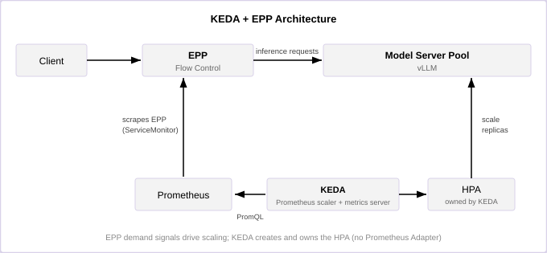

# KEDA with EPP Metrics

The Endpoint Picker (EPP) and KEDA integration scales model server replicas
using demand-side signals from EPP. Rather than relying on coarse resource
utilization, KEDA queries EPP metrics from Prometheus, exposes evaluated scaler
values through its metrics server, and creates an HPA that consumes those
external metrics. This approach is well-suited for homogeneous deployments where
each target model-server pool can be isolated by metrics and scaled
independently.

This is the recommended autoscaling path in llm-d. The
[WVA path](./wva.md) is deprecated.

## Functionality

The KEDA+EPP integration provides:

- **Demand-driven scaling**: Replicas are added or removed based on EPP signals
  — queue depth, active request count, pool saturation, in-flight tokens, or
  estimated latency — which reflect inference demand rather than accelerator
  utilization.
- **Standard Kubernetes actuation**: KEDA owns an `autoscaling/v2` HPA, so HPA
  status and behavior remain available through standard Kubernetes APIs.
- **Optional scale-to-zero**: KEDA can remove all model server replicas when
  traffic is idle and reactivate the Deployment from an EPP Flow Control queue.
- **No custom controller and no Prometheus Adapter**: the whole loop is KEDA,
  Prometheus, and a `ScaledObject`.

## Design

### The LLM Autoscaling Problem

During active token generation, GPU utilization can remain high whether a
model server is lightly loaded or saturated. A utilization-based autoscaler
cannot reliably distinguish spare serving capacity from an overloaded batch.

EPP Flow Control moves excess demand to the gateway, where it can be measured
before end-user latency degrades. EPP exposes that demand as metrics that map
directly onto scaling decisions — reactive saturation signals (queued requests),
proactive concurrency signals (running requests, in-flight tokens), and
objective-relative signals (pool saturation, estimated latency against an SLO).

### Architecture

### Scaling Pipeline

The scaling pipeline is:

1. **Metric emission**: EPP exposes its metrics (for example
   `llm_d_epp_flow_control_queue_size` and `llm_d_epp_request_running`) on its
   metrics endpoint.
2. **Metric collection**: Prometheus scrapes EPP through the router's
   `ServiceMonitor`.
3. **Metric evaluation**: KEDA's Prometheus scaler evaluates one scalar or
   single-element PromQL result per trigger. Optionally,
   `spec.advanced.scalingModifiers` combines several triggers into one formula.
4. **Metric publication**: KEDA exposes evaluated scaler values through its
   metrics server to the Kubernetes External Metrics API.
5. **Scaling decision**: The HPA generated by KEDA computes the desired replica
   count and reconciles the target Deployment.

The user creates a `ScaledObject`, not a second HPA. Multiple HPAs targeting the
same Deployment conflict with one another.

Prometheus Adapter is not part of this pipeline because the KEDA Prometheus
scaler queries Prometheus directly. The Prometheus Adapter path is deprecated.

### Scaling Signals

The pipeline above is signal-agnostic: what changes between the deployable
paths is which EPP metrics the triggers read and how thresholds are derived.

| Signal | EPP metrics | Threshold is | Guide |
|---|---|---|---|
| **Queue depth** | `llm_d_epp_flow_control_queue_size`, `llm_d_epp_request_running` | An absolute per-replica target, tuned per deployment | [keda-epp-queue](../../../../guides/workload-autoscaling/keda-epp-queue/README.md) |
| **Pool saturation** | `llm_d_epp_flow_control_pool_saturation`, `llm_d_epp_request_running` | A normalized ratio (0.0–1.0+), more portable across hardware | [keda-epp-saturation](../../../../guides/workload-autoscaling/keda-epp-saturation/README.md) |
| **Token backlog** | `llm_d_epp_inflight_tokens`, per-pod KV cache occupancy | Seconds of prefill queue wait, derived from a share of the TTFT SLO and a calibrated `peakPrefillThroughput` | [keda-epp-token-aware](../../../../guides/workload-autoscaling/keda-epp-token-aware/README.md) |
| **Estimated latency** | EPP predicted/actual TTFT and TPOT histograms | Latency ÷ SLO, with a hysteresis band | [slo-aware](../../../../guides/workload-autoscaling/slo-aware/README.md) |

Queue depth and pool saturation are lagging-to-leading counts of unmet demand.
Token backlog exists because request counts rate an 8192-token prompt the same
as a 512-token one, while the prefill work differs by 16×. Estimated latency
scales against the objective itself rather than a proxy for it; its control law
is derived in
[SLO-Aware Autoscaling with KEDA](./slo-aware-keda.md).

### Dual-Metric Strategy

Most of these paths configure two triggers rather than one, so that unmet demand
and active concurrency are both represented. The queue-based path is the
canonical example:

| Metric | Signal | KEDA metric type | Interpretation |
|---|---|---|---|
| EPP Flow Control queue size | Unfulfilled demand | `AverageValue` | Target aggregate queued requests per model server replica |
| Running requests | Active concurrency | `AverageValue` | Target in-flight requests per model server replica |

Each `AverageValue` threshold is a per-replica target. For each metric, the HPA
calculates a desired count from the aggregate value and target; roughly, the
aggregate must exceed `threshold × current replicas` to scale beyond the
current count. When all configured metrics are available, Kubernetes uses the
largest desired replica count.

The SLO-aware path is the exception: it collapses its triggers into a single
`scalingModifiers` formula whose output *is* the desired replica count, against
a pass-through target of `1`. Use that shape when the triggers must be combined
arithmetically rather than raced against each other.

### Pending and Warming Pods

A trigger is a PromQL query, so it is not restricted to EPP series: a
`ScaledObject` can also read the target's replica counts from kube-state-metrics
and reason about capacity that is provisioned but not yet serving — pods that are
pending, scheduling, or still loading the model.

The SLO-aware path does this. It reads `kube_deployment_status_replicas`
(provisioned, `n`) alongside `kube_deployment_status_replicas_ready` (ready,
`r`), and scales its demand by an in-flight credit `r/n` on the scale-up branch.
Because the latency signal is measured on ready pods only, those pods
over-report the post-warmup load while a scale-up is in flight; the credit makes
each ask cover only the deficit beyond the pods already on their way, instead of
racing to `maxReplicas` while nothing has become Ready. See
[SLO-Aware Autoscaling with KEDA](./slo-aware-keda.md) for the derivation.

The simpler per-metric `AverageValue` paths do not carry this term. There, the
HPA's own stabilization windows and scale-up policies are what keep a
slow-to-schedule pool from over-asking.

### Sharing a Contended Accelerator Budget

Each `ScaledObject` scales its own Deployment against its own signal, so two
pools sharing one GPU budget can both scale up and collectively ask for more
accelerators than exist. This is not resolved in the autoscaling loop, and it
does not need to be: admission is a scheduling concern, and it is handled one
layer down by [Kueue](https://kueue.sigs.k8s.io/).

Every replica pod becomes a Kueue `Workload`, held at a scheduling gate until
quota is free for it. Each model gets a guaranteed floor of GPUs in a shared
cohort, lends what it is not using to the others, and preempts to take its floor
back when its own demand returns. The HPA is untouched and unannotated, so KEDA
keeps sole ownership of the HPA it generates and the autoscaling configuration
above is unchanged: over-budget replicas simply stay Pending until quota frees.

See the
[Kueue-based replica rebalancing guide](../../../../guides/workload-autoscaling/kueue-rebalancing/README.md).
It supersedes the experimental
[replica rebalancer](../../../../guides/workload-autoscaling/replica-rebalancing/README.md),
which enforced the same budget from *above* the HPA by patching `maxReplicas` on
annotated HPAs — an approach that requires HPA annotations KEDA does not
propagate. The two must never run together.

### Metric Isolation

Each PromQL query aggregates to one value and must isolate the EPP/InferencePool
associated with the target Deployment. Label values such as `namespace`,
`model_name`, and `inference_pool` depend on the deployment and scrape
configuration. The running-request metric does not expose `inference_pool`.
Because multiple pools can serve the same model, selectors may also need EPP
scrape labels such as `service`. Verify isolation against live Prometheus
series.

### Ownership and Scaling Behavior

KEDA owns the generated HPA for the lifetime of the `ScaledObject`:

- KEDA evaluates trigger activation and handles zero-to-one activation.
- The generated HPA handles scaling between one and N replicas.
- `cooldownPeriod` controls scale-down to zero; it does not control ordinary
  HPA scale-down while the minimum replica count is one or greater.
- `ScaledObject.spec.advanced.horizontalPodAutoscalerConfig.behavior` is copied
  to the generated HPA and controls stabilization and scaling policies.
- Deleting the `ScaledObject` removes the generated HPA but does not delete the
  target Deployment.

### Scale to Zero

EPP Flow Control enables scale-from-zero by buffering requests while no model
server endpoint is ready. A queued request raises the queue-size metric, KEDA
activates the target Deployment, and EPP dispatches the request after a model
server becomes Ready.

Scale-to-zero should be enabled only after one-to-N scaling is validated. Model
cold-start time becomes request latency, and clients must allow enough time for
the model to load.

### Limitations

- **No cross-variant placement.** Each `ScaledObject` scales one Deployment
  against its own metrics. Pools serving the same model on different hardware
  scale independently, with no cost-aware preference between them.
- **No cost-aware choice of hardware.** The autoscaler asks for more of the
  variant it is pointed at; it will not decide that demand is better served by a
  cheaper accelerator. Sharing a contended accelerator budget between pools *is*
  solved, but below the autoscaler — see
  [Sharing a Contended Accelerator Budget](#sharing-a-contended-accelerator-budget).
- **Warmup is paid at every scale-up.** Model load and torch-compile time sit
  between the decision and the capacity. Cutting pod-ready time is usually the
  highest-leverage tuning available; see the warmup patch discussed in
  [SLO-Aware Autoscaling with KEDA](./slo-aware-keda.md).

## Deployment Guides

Start from the [workload autoscaling guides](../../../../guides/workload-autoscaling/README.md),
which cover the reusable router values, `ScaledObject`s, authentication notes,
and verification steps for each of the signals in the table above.
