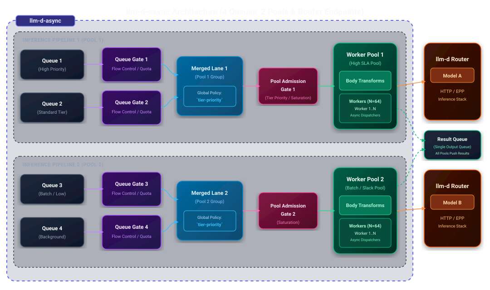

# Async Processor Architecture

The Async Processor is a lightweight dispatch agent that pulls inference requests from message queues and forwards them to the llm-d Router. It uses dispatch gates, isolated worker pools, request body transforms, and merge policies to regulate dispatch rates and process background workloads efficiently without overflowing inference servers.

<p align="center">
  <picture>
    <source media="(prefers-color-scheme: dark)">
    
  </picture>
</p>

### Internal Pipeline Architecture

<p align="center">
  <picture>
    <source media="(prefers-color-scheme: dark)">
    
  </picture>
</p>

## How It Works

1. **Queue Gate & Poll** — Before pulling messages from queues, requests pass through queue-level **Dispatch Gates** to regulate message flow and ingestion based on system metrics and capacity.
2. **Merge** — Polled messages from multiple input queues or topic subscriptions are grouped by target worker pool and combined into per-pool merged channels according to the globally configured **Request Merge Policy**.
3. **Worker Pool Admission Gate** — Merged requests pass through a **Worker Pool Admission Gate** (e.g., local max concurrency, pool-level saturation or budget gates) that verifies whether the worker pool has capacity and budget to accept new work.
4. **Transform** — Admitted requests pass through **Request Body Transforms** to normalize payload schemas or inject routing headers and parameters.
5. **Dispatch** — Concurrent workers in the designated **Worker Pool** dispatch HTTP requests to the llm-d Router with deadline propagation.
6. **Result** — On success, results are written back to a result queue. On retryable failure (rate limiting, transient errors), the request is re-queued with exponential backoff.

## Dispatch Gates

Dispatch gates regulate the flow of requests by controlling message ingestion rates when polling requests from message queues, as well as worker pool admission and downstream dispatch rates. By evaluating metrics before messages are pulled and admitted into worker pipelines, gates prevent overload on downstream inference servers and maintain system stability.

Gates can be configured at two distinct levels:
- **Queue / Subscription Level**: Controls flow and ingestion before messages are polled and merged.
- **Worker Pool Admission Level**: Controls entry into the worker pool execution pipeline. Multiple gates can be combined for a pool using a **composite gate**.

| Gate type | Behavior |
|-----------|----------|
| `constant` | Always open — no throttling. |
| `redis` | Reads budget values from Redis keys, allowing external orchestrators to dynamically adjust rate limits per queue or pool. |
| `prometheus-saturation` | Queries Prometheus for model server saturation metrics (e.g., KV cache pressure, queue depth). Allows ingestion and admission when saturation is below a configurable threshold. |
| `prometheus-budget` | Computes available downstream capacity directly from metrics. |
| `local-max-concurrency` | Restricts local concurrency within a worker pool to cap in-flight requests. |

## Worker Pools & Request Merge Policies

### Worker Pools

The Async Processor uses a multi-tenant pipeline model based on **Worker Pools**. 

> [!NOTE]
> An `llm-d-async` worker pool is **not** an inference pool (such as a downstream model server pool). It is an internal dispatch pipeline construct within `llm-d-async` that configures the **pool name**, **number of workers**, and **admission gate**. The worker pool configuration is fully user-configurable.

- **Configurable Pipeline**: Defines the pool name, number of concurrent workers, and admission gate settings.
- **Composite Gates**: Multiple gates (e.g., local max concurrency combined with Prometheus saturation) can be configured for a single pool using a **composite gate**.
- **Backend Isolation**: It is recommended to use different worker pools for different `llm-d-router` endpoints so that saturation or backpressure on one backend model server does not block processing for other endpoints.
- **Isolation**: Saturated or blocked worker pools do not affect the processing or throughput of other worker pools.
- **Queue-to-Pool Mapping**: Multiple queue configurations can route requests to the same worker pool, but a single queue configuration can only route to a single worker pool.

### Request Merge Policies

A single **Request Merge Policy** is configured globally at the pipeline level for the entire `llm-d-async` instance (not per pool). Rather than configuring different policy types on individual pools, `llm-d-async` groups input queue channels by their assigned `worker_pool_id` and executes the global merge policy independently across each pool's merging lanes.

The two supported global merge policies are:

| Policy | Description |
|--------|-------------|
| `random-robin` | Default policy. Randomly picks messages from all queues configured for a each pool. |
| `tier-priority` | Buckets requests into 6 strict priority lanes using routing tags (`(classification, tier)`). Within each bucket, it round-robins across different client channels and stamps the chosen priority header (`x-gateway-priority` by default). |

Because merging lanes are grouped and evaluated independently per worker pool, backpressure from one pool's merged channel only impacts its associated worker pool, maintaining multi-tenant isolation.

## Request Body Transforms

Request body-transform plugins handle rewriting the outgoing body and `Content-Type` based on per-message metadata. The default JSON path is preserved byte-for-byte when no plugin applies.

## Request and Result Messages

The Async Processor defines standardized JSON schemas for requests published to input queues and results returned to result queues/topics. All worker pools push completed inference results to a single, unified **Result Message Queue** (or topic) configured for the `llm-d-async` processor instance.

### Request Message Schema

| Field | Type | Description |
|-------|------|-------------|
| `id` | `string` | Unique identifier for result mapping (required). |
| `created` | `int64` | Created timestamp in Unix seconds. |
| `deadline` | `int64` | Deadline in Unix seconds (required, must be positive). |
| `payload` | `object` | Inference request payload. |
| `metadata` | `map[string]string` | Optional caller-supplied pass-through data (e.g., tracing IDs, user labels). |
| `endpoint` | `string` | Optional per-request dispatch path; overrides the queue-level default when set. |

**Example Request Message:**

```json
{
  "id": "19933123533434",
  "created": 1764044000,
  "deadline": 1764045130,
  "payload": {
    "model": "food-review",
    "prompt": "hi",
    "max_tokens": 10,
    "temperature": 0
  },
  "metadata": {
    "user": "batch-job-42"
  }
}
```

### Result Message Schema

| Field | Type | Description |
|-------|------|-------------|
| `id` | `string` | Unique identifier mapped to the corresponding request. |
| `payload` | `bytes` / `object` | Inference result payload returned from downstream model server. |
| `status_code` | `int` | HTTP response status code (non-zero value indicates an HTTP response was received). |
| `error_code` | `string` | Error classification code (e.g., `DEADLINE_EXCEEDED`, `GATE_DROPPED`, `GATE_ERROR`, `INFERENCE_ERROR`, `INVALID_REQUEST`). |
| `error_message` | `string` | Human-readable explanation of the error. |

**Example Result Messages:**

*Success Result:*
```json
{
  "id": "19933123533434",
  "payload": {
    "choices": [
      {
        "text": "Great food!"
      }
    ]
  },
  "status_code": 200
}
```

*Error Result:*
```json
{
  "id": "19933123533434",
  "error_code": "GATE_DROPPED",
  "error_message": "Pool gating dropped request"
}
```

## Message Queue Integrations

Queue configurations define the input message queue source parameters (such as Redis keys or Pub/Sub subscription IDs) and specify the target **`llm-d-router` endpoint information** (such as URL path and target model endpoint) for dispatched requests.

| Implementation | Characteristics |
|---------------|-----------------|
| Redis Sorted Set | Persisted, priority-ordered by deadline. Supports per-queue gate configurations. |
| Redis Pub/Sub | Ephemeral, fan-out delivery. |
| GCP Pub/Sub | Cloud-native, scalable. Supports per-subscription gating. |

## Configuration

The Async Processor is configured via high-level schema definitions for message queue sources and worker pools.

### Message Queue Configurations

Queue configurations specify input message queue parameters, target `llm-d Router` endpoints, routing tags, and optional queue-level dispatch gates.

| Field | Type | Required | Description | Example Value |
|-------|------|----------|-------------|---------------|
| `queue_name` / `subscriber_id` | String | Yes | Name of the input queue or Pub/Sub subscriber ID. | `"batch_queue"` |
| `worker_pool_id` | String | Yes | Target worker pool ID to route messages polled from this queue. | `"worker_pool_1"` |
| `igw_base_url` | String | Yes | Base URL of the target `llm-d Router` endpoint. | `"http://localhost:80/"` |
| `request_path_url` | String | Yes | Request endpoint path on the target router. | `"/v1/completions"` |
| `inference_objective` | String | Optional | Routing tag for inference classification. | `"batch-task"` |
| `labels` | Object | Optional | Key-value pairs for message metadata and routing tags. | `{"tier": "standard"}` |
| `gate_type` | String | Optional | Type of queue-level dispatch gate (e.g., `redis`, `constant`). | `"redis"` |
| `gate_params` | Object | Optional | Key-value parameters configuring the queue dispatch gate. | `{"address": "localhost:6379", "budget_key": "my-budget-key"}` |

**Example Queue Configuration:**

```json
{
  "queue_name": "batch_queue",
  "inference_objective": "batch-task",
  "request_path_url": "/v1/completions",
  "igw_base_url": "http://localhost:80/",
  "worker_pool_id": "worker_pool_1",
  "gate_type": "redis",
  "gate_params": {
    "address": "localhost:6379",
    "budget_key": "my-budget-key"
  }
}
```

### Worker Pools Configuration

Worker pool configurations define dedicated worker concurrency limits and pool admission gates for isolated execution pipelines.

| Field | Type | Required | Description | Example Value |
|-------|------|----------|-------------|---------------|
| `id` | String | Yes | Unique pool identifier referenced by queue/topic configurations (`worker_pool_id`). | `"worker-pool_1"` |
| `workers` | Integer | Yes | Number of concurrent workers dedicated to this pool. Must be positive. | `32` |
| `gate_type` | String | Optional | The type of dispatch gate to apply to the pool (e.g., `local-max-concurrency`, `prometheus-saturation`). | `"prometheus-saturation"` |
| `gate_params` | Object | Optional | Key-value parameters configuring the pool admission gate. | `{"pool": "inference_pool_1", "threshold": "0.8"}` |

**Example Worker Pool Configuration:**

```json
[
  {
    "id": "worker-pool_1",
    "workers": 32,
    "gate_type": "prometheus-saturation",
    "gate_params": {
      "pool": "inference_pool_1",
      "threshold": "0.8"
    }
  }
]
```

For more detailed configuration options, see the [llm-d-async README](https://github.com/llm-d/llm-d-async/blob/main/README.md).

## Concurrency and Retries

- **Configurable Parallelism**: Worker pools define independent concurrency limits (default 64 per pool) for parallel processing.
- **Deadline Enforcement**: Each request carries a deadline from the queue message. Workers abandon requests that cannot complete before their deadline.
- **Exponential Backoff**: Retryable failures are re-queued with backoff (base 2s, max 60s, with jitter). Fatal errors (bad payload, unrecoverable failures) are not retried.

## Observability

Prometheus metrics include request totals, success/failure counts, retry counts, deadline-exceeded counts, shedded request counts, gate decisions, dispatch budgets, and request latency histograms.

## Related

- [Async Processor Well-Lit Path](../../../well-lit-paths/workloads/batch-serving/asynchronous-processing.md) — a guide for deploying the Async Processor.
- [Async Processor Repository](https://github.com/llm-d/llm-d-async) — source code and Helm chart.
- [Batch Gateway](batch-gateway.md) — composes with the Async Processor for batch job management.
