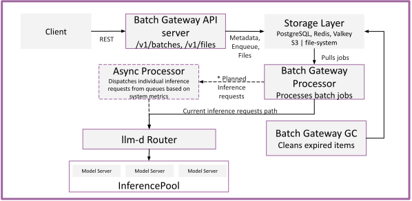

# Batch Gateway Architecture

Batch Gateway adds OpenAI-compatible batch inference processing to the llm-d stack. It sits between batch API clients and the llm-d Router, managing the lifecycle of batch jobs — from job creation through request dispatching to result collection.

  <picture>
    <source media="(prefers-color-scheme: dark)">
    
  </picture>

## API Server

The API server exposes OpenAI-compatible REST endpoints:

- `POST /v1/files` — Upload batch input files (JSONL format).
- `GET /v1/files` — List files.
- `GET /v1/files/{id}` — Retrieve file metadata.
- `GET /v1/files/{id}/content` — Download file content (input or output files).
- `DELETE /v1/files/{id}` — Delete a file.
- `POST /v1/batches` — Create a batch job referencing an uploaded input file.
- `GET /v1/batches/{id}` — Get job status, progress counts, and output file IDs.
- `POST /v1/batches/{id}/cancel` — Cancel a running job.
- `GET /v1/batches` — List batch jobs.

The API server validates input files format constraints, stores metadata in a database (typically PostgreSQL), enqueues jobs into a priority queue (typically in Redis), and stores files in S3 or a filesystem.

## Batch Processor

The processor is the core execution engine. It:

1. **Polls** the priority queue for the next job.
2. **Ingests** the input file — parses model IDs and system prompts, groups requests by model, and builds per-model execution plans.
3. **Executes** plans concurrently — launches per-model goroutines, sends individual inference requests to the llm-d Router with concurrency limits, and writes results to an output file.
4. **Updates** the job status during processing, and listens to job events, such as cancellation.
5. **Finalizes** — uploads the output file and updates the job status.

### Concurrency Control

The processor uses two-level concurrency control to prevent overloading the llm-d Router:

- **Global concurrency** — caps total in-flight requests across all models.
- **Per-model concurrency** — caps in-flight requests to a single model.

### Crash Recovery

On startup, the processor scans for jobs that were `in_progress` when a previous instance crashed. If a partial output file exists, the processor uploads it and marks the job as failed. Otherwise, the job is re-enqueued for a full retry. Recovery concurrency is capped to avoid overwhelming the system during restart storms.

## Storage Layer

All Batch Gateway components share a pluggable storage layer:

| Function | Options | Notes |
|----------|---------|-------|
| Jobs and files metadata | PostgreSQL, Redis, Valkey | PostgreSQL for production; Redis and Valkey for development/test only |
| Priority queue | Redis, Valkey | Sorted set with SLO-based priority |
| Event channels | Redis, Valkey | Pub/Sub for job cancellation and future supported events |
| Status updates | Redis, Valkey | Job processing progress tracking |
| File storage | S3, Filesystem | S3 for multi-replica deployments; filesystem (PVC) for single-node |

## Garbage Collector

The GC runs on a configurable interval and removes:

- Expired batch jobs (past their `completion_window`).
- Expired files (past their configured expiration).

It limits concurrent deletions to avoid database pressure.

## Authentication and Multi-Tenancy

Batch Gateway delegates authentication and authorization to the upstream gateway infrastructure:

- The API server extracts a tenant identifier from an HTTP header (configurable).
- All data queries are filtered by tenant ID. Cross-tenant access is rejected.
- The processor forwards configurable pass-through headers with each inference request, so the llm-d Router can authenticate and authorize the end user per-request.
- File paths are hashed by tenant ID to prevent enumeration.

The batch route authenticates (verifying identity), while the inference route authorizes (verifying model access). This separation ensures that batch job creation doesn't require per-model permissions — authorization is enforced at inference time.

## Observability

- **Prometheus metrics**: request counts, job processing times, queue wait duration, worker utilization, per-model concurrency, and token counts.
- **OpenTelemetry tracing**: distributed traces across API server, processor, database, and llm-d Router calls.
- **Grafana dashboards**: pre-built dashboards for API server and processor metrics, included in the Helm chart.
- **Prometheus alerting rules**: configurable alerts for high queue wait time, job failure rate, expired jobs, and worker saturation.

## Related

- [Batch Gateway Deployment Guide](../../../../guides/batch-gateway) — deployment instructions, configuration options, and usage.
- [Batch Gateway Repository](https://github.com/llm-d/llm-d-batch-gateway) — source code, Helm chart, deployment and usage guides.
- [Batch Gateway Design Documents](https://github.com/llm-d/llm-d-batch-gateway/tree/main/docs/design) — detailed design documents.
- [Async Processor](async-processor.md) — composes with Batch Gateway for gated request dispatching.
