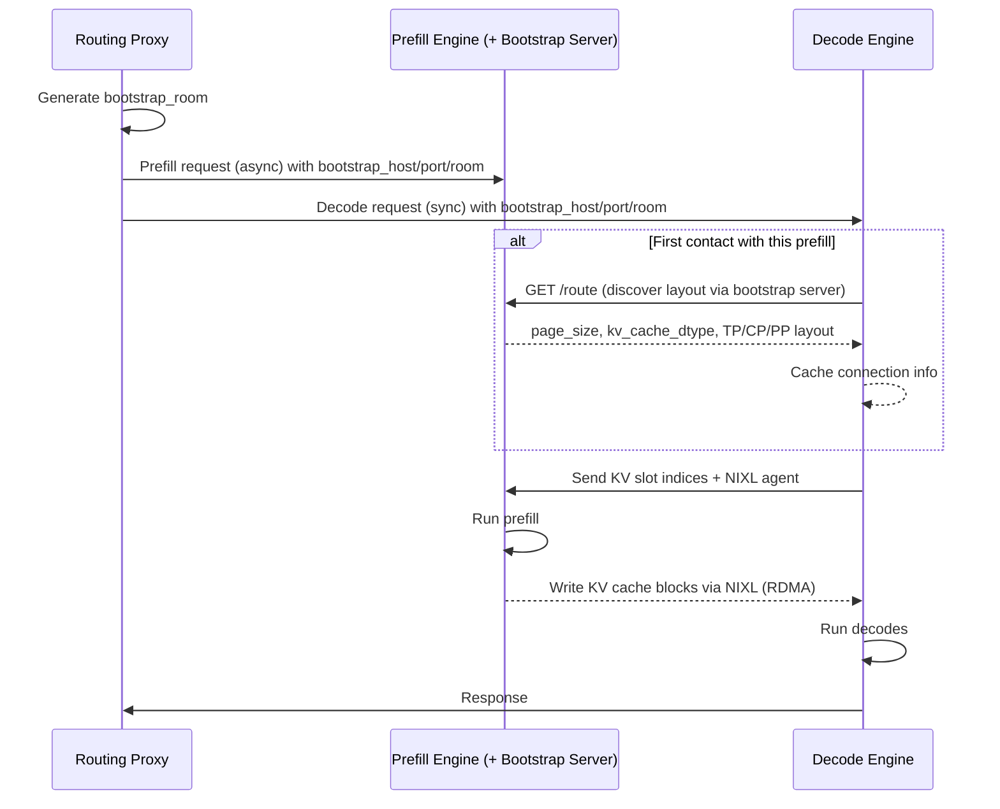
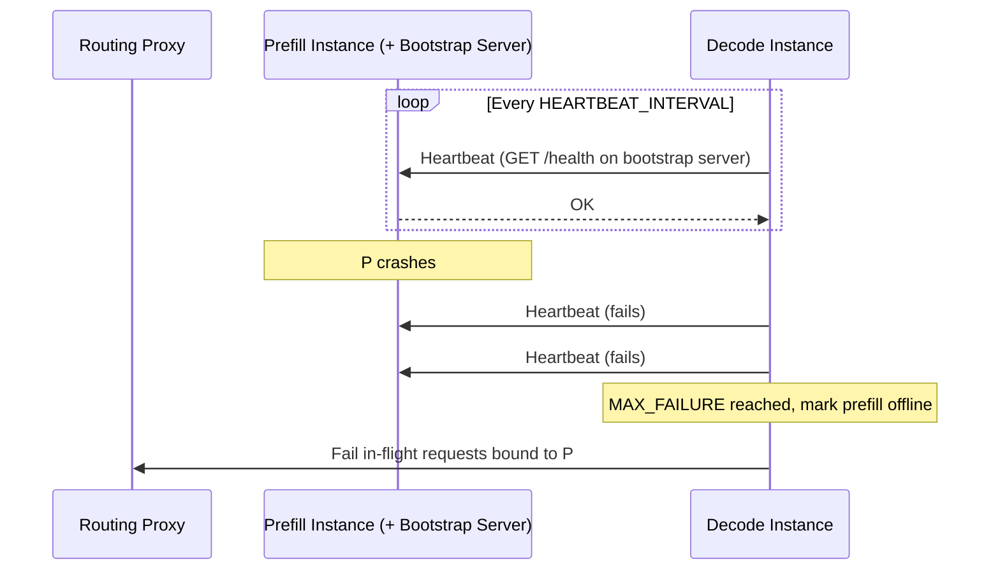
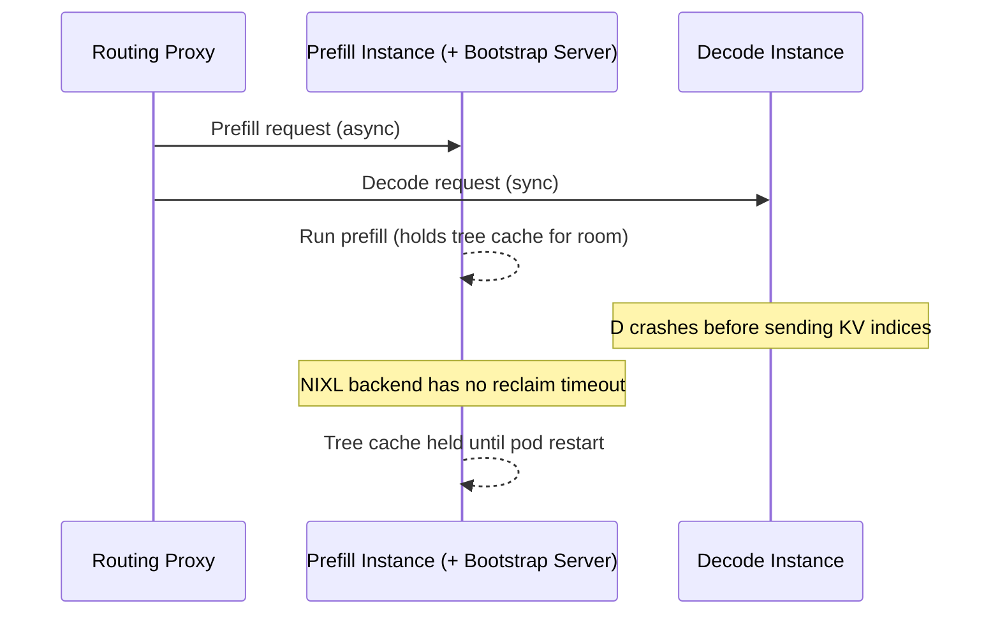

# Disaggregated Serving: Operations (SGLang)

While disaggregated serving can offer superior performance, it introduces additional operational complexity, including:

- [Dynamic Connections](#dynamic-connections) - how to add or remove P and D instances on the fly when instances require point-to-point RDMA connections
- [Request Cancellation](#request-cancellation) - how to free KV caches from the instances when requests stop in a distributed setting
- [Fault Tolerance](#fault-tolerance) - how to ensure crashes do not create cascading failures and that resources are cleaned up
- [Rollouts](#rollouts) - how to roll out changes to the service, such as the version of the SGLang image

This page documents architectural considerations that impact these common operations flows for SGLang model servers. For the vLLM counterpart see [operations-vllm.md](operations-vllm.md), and for an overview of how the EPP and Routing Proxy Sidecar coordinate P/D requests see the [Disaggregated Serving](README.md) page.

Both engines establish a NIXL (RDMA) connection for each P/D pair and differ mainly in how a pair finds each other and which side moves the data: vLLM negotiates the connection peer-to-peer with no central coordinator and has the decode pull the KVs, while SGLang routes peer discovery through a bootstrap server that runs alongside each prefill instance and has the prefill push the KVs to the decode.

## Dynamic Connections

In production environments, it is common for model server replicas to be created and destroyed during the running of the service. In a disaggregated configuration, the ability to dynamically add/remove replicas from the deployment is complicated by the need to establish/destroy connections between P and D workers on the fly.

SGLang coordinates this through a bootstrap server that is started on each prefill instance (default port `8998`). For each request the Routing Proxy Sidecar pairs a P and a D and gives both the same rendezvous tokens; the two then use that bootstrap server to find each other and run the KV transfer directly between the pods, off the sidecar's request path.

### Scale-Up

New P and D replicas connect lazily, with no pre-warming step: the first request routed across a given P/D pair triggers a one-time connection setup, and subsequent requests reuse it, so a newly added replica starts serving without restarts.

For each request, the Routing Proxy Sidecar (configured with `--kv-connector=sglang`) generates a unique `bootstrap_room` ID, injects `bootstrap_host`, `bootstrap_port`, and `bootstrap_room` into both the prefill and decode request bodies, and fires the prefill request asynchronously (in a background goroutine) while sending the decode request synchronously. As a result, the decode worker does not wait for prefill to complete before beginning coordination.

On the engine side:

- Prefill instances run a bootstrap server that exposes a `/route` endpoint, and register their parallelism layout (TP/CP/PP ranks, `page_size`, `kv_cache_dtype`) into it on startup.
- Decode instances, on first contact with a given prefill bootstrap address, fetch that prefill's parallel info from the bootstrap `/route` endpoint over HTTP and cache it. Subsequent requests to the same prefill reuse the cached connection, so there is no centralized global-state coordinator beyond the per-prefill bootstrap server.

The request flow looks like this:

#### Discovery

Since model server instances are added to an `InferencePool` via standard Kubernetes selectors and labels, new prefill and decode instances are discovered automatically when their pod status becomes `status: Running`. The same `llm-d.ai/role` label values (`prefill`, `decode`, `prefill-decode`) are used to filter P and D workers. See [operations-vllm.md#discovery](operations-vllm.md#discovery) for details.

As a result, new replicas can be added to a running disaggregated deployment without restarts and without coordinating within any specialized service discovery plane.

### Scale-Down

SGLang instances follow the same Kubernetes [pod termination process](https://kubernetes.io/docs/concepts/workloads/pods/pod-lifecycle/#pod-termination) as vLLM (Terminating state, removal from the `InferencePool`, optional preStop hook, `SIGTERM`, grace period, then `SIGKILL`). For **new requests**, terminating pods are automatically removed from the `InferencePool` so no new traffic is routed to them.

For **in-flight requests**, note that SGLang does not expose a vLLM-style `--shutdown-timeout` graceful-drain flag, so operators should not rely on in-flight requests draining during termination. How any KV cache held for those requests is reclaimed depends on the transfer backend, as described below.

#### Scaling Down Decode Replicas

When a decode replica is removed, any in-flight rooms it was assigned are abandoned before their KV transfer completes. From the prefill's perspective this is indistinguishable from a decode crash, and how the held tree cache is reclaimed depends on the transfer backend (see [Decode Instance Failure](#decode-instance-failure)).

#### Scaling Down Prefill Replicas

When a prefill replica is removed, decode instances detect it through the heartbeat mechanism (see [Prefill Instance Failure](#prefill-instance-failure)). In-flight requests bound to that prefill are marked failed, and new requests are no longer routed to it once it leaves the `InferencePool`.

## Request Cancellation

Given the compute intensity and duration of inference requests, model servers support "Request Cancellation", where currently in-progress requests are freed when the client disconnects.

In a disaggregation setup this is more complicated, because the resources associated with a request are spread across the prefill and decode instances. With SGLang, the Routing Proxy Sidecar holds the decode request open for the client while the prefill request runs asynchronously in the background. When the client disconnects:

- The decode instance aborts the in-flight request and releases its tree cache.
- The prefill instance frees the room's tree cache once its KV transfer reaches a terminal state. On the NIXL transfer backend used by this guide, a prefill whose decode disconnected *before* initiating the transfer has no timeout that reclaims it (see the note below). The periodic `SGLANG_DISAGGREGATION_BOOTSTRAP_ENTRY_CLEANUP_INTERVAL` (default `120s`) only evicts stale bookkeeping entries from the bootstrap server, not GPU KV cache.

> [!NOTE]
> This differs from vLLM, which sends an explicit `NIXL.send_notif` to free the prefill-side KV cache on abort. With the NIXL transfer backend, SGLang has no equivalent prefill-side abort signal: if a request is cancelled after the decode has been paired but before it initiates the transfer, the prefill can hold that room's KV cache until the prefill pod is restarted.
> This is analogous to vLLM's `VLLM_NIXL_ABORT_REQUEST_TIMEOUT` stranding window, except that vLLM bounds it with a timeout (default `480s`) whereas NIXL-backed SGLang does not. The `SGLANG_DISAGGREGATION_BOOTSTRAP_TIMEOUT` that bounds prefill-side reclaim is implemented for the Mooncake and Mori transfer backends, not NIXL.

## Fault Tolerance

In llm-d's disaggregated serving design, all D instances can connect to all P instances. This creates a critical operational risk - crashes in workers have the potential for cascading failures if the system is not tolerant of failures.

### Prefill Instance Failure

Unlike vLLM, which performs no liveness check and only discovers a dead prefill when a per-request NIXL `READ` fails, SGLang decode instances actively health-check the prefill bootstrap servers via heartbeat:

- `SGLANG_DISAGGREGATION_HEARTBEAT_INTERVAL`: interval between health checks to prefill bootstrap servers (default `5s`, clamped to a minimum of `2s`).
- `SGLANG_DISAGGREGATION_HEARTBEAT_MAX_FAILURE`: consecutive heartbeat failures before a prefill server is marked offline (default `2`, minimum `1`).

When a prefill server that was previously healthy stops responding, the decode instance marks it offline and fails any in-flight requests bound to it (`KVPoll.Failed`) rather than hanging. Failed Prefill Worker pods are also moved to `status: Terminated` as part of the standard Pod lifecycle, and since llm-d leverages the Kubernetes API Server for service discovery, no additional traffic is routed to the failed worker until it returns to `status: Running`. In this way, `llm-d` isolates Prefill instance failure.

### Decode Instance Failure

While a decode failure is unlikely to crash a prefill instance, there is a risk of KV cache memory being stranded on the prefill, since the prefill holds the tree cache for a room until it has written the KVs to the decode and the transfer completes.

A decode that is still alive but waiting on a failed or slow transfer protects itself with `SGLANG_DISAGGREGATION_WAITING_TIMEOUT` (default `300s`): if it never receives the KV-transfer-done signal after bootstrapping, it aborts the request and releases its own tree cache. The prefill side frees a room once its transfer reaches a terminal state - a failed NIXL transfer marks the room `KVPoll.Failed`, and the prefill aborts and releases the tree cache. If the decode dies *before* it initiates the transfer, however, the prefill room never reaches a terminal state on the NIXL backend.

> [!WARNING]
> On the NIXL transfer backend used by this guide, a prefill room whose decode died before initiating the transfer is not reclaimed automatically; it holds its tree cache until the prefill pod is restarted. The `SGLANG_DISAGGREGATION_BOOTSTRAP_TIMEOUT` (default `300s`) that bounds this stranding is implemented for the Mooncake and Mori transfer backends, not NIXL. This is comparable to the decode-failure stranding documented for vLLM, which bounds it with `VLLM_NIXL_ABORT_REQUEST_TIMEOUT` (default `480s`).

## Rollouts

In disaggregated serving, rolling out a new version of the model server (e.g. a new SGLang image or a new configuration) requires care, because NIXL moves KV cache directly between the prefill and decode GPU memory. The KV cache layout must therefore match between any P and D pair that gets scheduled together.

SGLang validates layout compatibility at connection time. When a decode instance fetches a prefill's info from the bootstrap `/route` endpoint, it checks:

- **`page_size`**: a mismatch raises a `RuntimeError` (`Both servers must use the same --page-size value`).
- **`kv_cache_dtype`**: a mismatch raises a `RuntimeError` (`Both servers must use the same --kv-cache-dtype value`).

Mismatched tensor-parallel sizes between P and D are supported (the decode resolves a TP/CP/PP rank mapping), but for non-MLA models SGLang warns that performance is not guaranteed.

> [!IMPORTANT]
> As with vLLM, the llm-d EPP currently assumes all P and D instances within an `InferencePool` are compatible and will schedule requests to any arbitrary pair. Because incompatible `page_size` / `kv_cache_dtype` combinations fail at connection time, it is recommended to roll out model-server upgrades by creating a new `InferencePool` rather than mixing versions in one pool. When deploying with a `Gateway`, traffic can be gradually shifted to the new `InferencePool` by modifying the `HTTPRoute`. See [operations-vllm.md#rollouts](operations-vllm.md#rollouts).

## Tuning Reference

The values below are set as environment variables on the model server pods (the bootstrap port is read by the routing sidecar).

| Variable | Default | Side | Controls |
| --- | --- | --- | --- |
| `SGLANG_BOOTSTRAP_PORT` (sidecar) | `8998` | sidecar / prefill | Port of the prefill bootstrap server the sidecar points decode workers at. Must match the engine's `--disaggregation-bootstrap-port`. |
| `SGLANG_DISAGGREGATION_HEARTBEAT_INTERVAL` | `5s` | decode | How often decode workers health-check prefill bootstrap servers (minimum `2s`). Lower it to detect dead prefills faster. |
| `SGLANG_DISAGGREGATION_HEARTBEAT_MAX_FAILURE` | `2` | decode | Consecutive heartbeat failures before a prefill is marked offline (minimum `1`). |
| `SGLANG_DISAGGREGATION_WAITING_TIMEOUT` | `300s` | decode | How long a decode waits for the KV-transfer-done signal before aborting and releasing its tree cache. Enforced on the NIXL backend. |
| `SGLANG_DISAGGREGATION_BOOTSTRAP_TIMEOUT` | `300s` | prefill | How long a prefill waits for the decode's KV indices before aborting and releasing its tree cache. Implemented for the Mooncake and Mori backends only - **not** NIXL. |
| `SGLANG_DISAGGREGATION_BOOTSTRAP_ENTRY_CLEANUP_INTERVAL` | `120s` | prefill | How often the bootstrap server evicts stale routing bookkeeping entries. Does not free GPU KV cache. |
