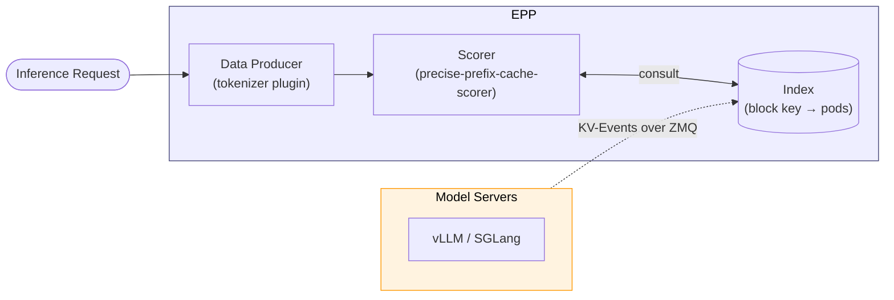

# KV-Cache Indexer

The **KV-Cache Indexer** is a component of the **llm-d Router** (residing within the **EPP**) that enables precise prefix-cache-aware routing functionality.

> [!NOTE]
> This page assumes familiarity with the EPP's design. See [EPP architecture](../../core/router/epp) for more details.

## Functionality

The kv-cache indexer subscribes to `KVEvents` emitted from model servers to maintain a near-realtime view of the KV cache state. The `precise-prefix-cache-scorer` uses this information during the EPP filter → score → pick flow.

The precise view offers improved precision for harder-to-approximate scenarios:

- **Multi-Modal Models** — Multi-modal content hashes (images, audio) are folded into block keys, so two prompts with the same text but different images produce different keys and are routed to the pod with matching multimodal KV-cache.
- **Hybrid-Attention Models** — In hybrid models, KV cache usage per layer groups (full, sliding-window, linear) scales non-linearly making byte-based trees imprecise.
- **Advanced KV-Cache Orchestration** — As model-server KV-cache management policies grow beyond simple LRU, approximate views become increasingly unreliable and complex to create; the event-driven view tracks the actual state.

> [!NOTE]
> Hybrid-attention-aware scoring is a work in progress.

## Architecture

At the top level there are two components: the **Model Servers** and the **EPP**. Model servers publish KV-Events whenever their cache state changes; the EPP watches those events, stores them in an index, and consults the index during scheduling.

Zooming into the EPP, three cooperating components do the work:

- **Index** — stores the event-driven view of which blocks are resident on which pods.
- **Data Producer** — tokenizes prompts and extracts multimodal features, so downstream components can derive block keys without re-tokenizing.
- **Scorer** — consults the Index to score each candidate pod by how much of the request's prefix it already holds.



Each component has its own configuration surface; the rest of this page describes them in turn.

### Index

The Index holds a `block key → pods` mapping built up from KV-Events published by the model servers. Model servers (vLLM and SGLang today) publish three event types over ZMQ whenever their KV-cache state changes:

- **`BlockStored`** — blocks with the given content hashes have been created on a specific device tier. Payload includes the chained parent hash, the token chunk, any LoRA ID/name, and any multimodal extra keys.
- **`BlockRemoved`** — blocks with the given hashes have been evicted from a specific device tier and/or attention group.
- **`AllBlocksCleared`** — the pod dropped its entire cache (a reset). This can occur in RL weights rollouts and other scenarios. The indexer drops all entries associated with the pod.

#### Event Delivery Modes

Two shapes are supported for getting events from the model servers to the EPP:

- **Centralized** — every model-server pod connects (`zmq.PUB`) to a single endpoint hosted by the EPP (`zmq.SUB`). Works naturally with a single EPP replica.

```
  Model Server A ──► ZMQ ──┐
  Model Server B ──► ZMQ ──┼──► EPP (binds tcp://*:5557)
  Model Server C ──► ZMQ ──┘
```

- **Pod discovery** — each model-server pod binds its own ZMQ socket. The EPP discovers pods via Kubernetes label selectors and creates per-pod subscribers. This is the mode to use for active-active multi-EPP: every EPP replica independently subscribes to every pod and sees the full event stream.

```
  EPP Replica 1 ──ZMQ──┐
                       ├──► Model Server A (binds :5557)
  EPP Replica 2 ──ZMQ──┤
                       ├──► Model Server B (binds :5557)
  EPP Replica 1 ──ZMQ──┤
                       └──► Model Server C (binds :5557)
  EPP Replica 2 ──ZMQ──┘
```

#### Backends

The Index is the hot data structure of the system: every scoring call queries it, every KV-event updates it. Multiple backends are available depending on desired memory and replication model:

| Backend                 | Storage                                                                         | When to use                                                                                                                                                                | Tradeoff                                                                                                                                                       |
|:------------------------|:--------------------------------------------------------------------------------|:---------------------------------------------------------------------------------------------------------------------------------------------------------------------------|:---------------------------------------------------------------------------------------------------------------------------------------------------------------|
| **In-Memory (default)** | Two-level LRU: outer cache keyed by block hash, inner cache of pods per block   | Default choice for most deployments                                                                                                                                        | Lowest latency; fixed entry count (default 100M keys × 10 pod entries) makes sizing predictable                                                                |
| **Cost-Aware Memory**   | Ristretto cache with admission control and cost-based eviction                  | Workloads where per-entry size varies a lot (multimodal, variable-length LoRA metadata)                                                                                    | Budget specified in bytes (e.g. `2GiB`) rather than entry count; probabilistic admission can reject entries under pressure                                     |
| **Redis / Valkey**      | External server (TCP; Valkey is Redis-wire-compatible, BSD-licensed)            | Need for persistent or very-long lived index (uncommon)                                                                                                                    | Adds a network hop per lookup and ties EPP availability to the external store; shared state gives strong consistency across replicas but is rarely necessary   |

> [!IMPORTANT]
> In-memory is typically the best option, offering low-latency, simple operations, and high availability via multi-replica deployment (each EPP replica in pod-discovery mode subscribes to every model-server's events independently and converges to the same index).

**Sizing.** In-memory backends size independently per replica; plan for roughly `keys × pod_entries` with overhead for the two-level LRU. The cost-aware backend is easier to bound because you specify a byte ceiling; it is the safer choice when per-entry size is hard to predict. For Redis / Valkey, the key space is proportional to unique blocks across the fleet, not to request volume.

### Data Producer

The Data Producer runs early in the scheduling cycle: it renders chat templates and tokenizes the prompt once per request (and extracts any multimodal features), writing the result onto the request so downstream components — the Scorer included — read from it rather than re-tokenizing.

Today this role is implemented by the `tokenizer` plugin (being renamed `token-producer` to align with plugin naming conventions).

Tokenizers can be sourced three ways:

1. **UDS sidecar** (recommended for production) — a tokenizer sidecar container serves tokenization requests over a Unix domain socket. The sidecar resolves the model identifier as a local path if the path exists on disk, and otherwise downloads and caches from HuggingFace (or ModelScope) on first use.
2. **In-process local files** — the indexer's embedded tokenizer scans a directory (default `/mnt/models`) for `tokenizer.json`.
3. **In-process HuggingFace Hub** — the indexer's embedded tokenizer downloads on demand. Convenient for development; adds startup latency.

### Scorer

The Scorer's goal is to find, for each candidate pod, the length of the **longest consecutive prefix** of the request's block sequence that the pod has cached.

KV-cache blocks form a chain where block `i` depends on all blocks `0..i-1`. Due to the causal nature of attention, a server can reuse a cached block only if it holds the unbroken prefix leading up to it.

For example, consider a prompt with block keys `[B0, B1, B2, B3, B4]` and three candidate pods:

```
Block keys:   B0    B1    B2    B3    B4

Pod A:        yes   yes   yes   yes   no    → score = 4 blocks
Pod B:        yes   yes   no    -     -     → score = 2 blocks (chain breaks at B2)
Pod C:        no    -     -     -     -     → score = 0 blocks (no prefix)
```

Even if Pod C happened to hold `B3` and `B4`, those entries are unusable without the preceding chain, and the score is zero.

When blocks are stored across memory tiers, each matching block's contribution is weighted by tier. For a block cached on multiple tiers at once, the scorer takes the maximum weight. Defaults are `gpu = 1.0`, `cpu = 0.8`.

Raw scores are then normalized to `[0.0, 1.0]` before being returned to the EPP, where they are combined with other scorers (queue depth, KV-cache utilization, etc.) through the standard Filter-Score-Pick pipeline.

#### Speculative Indexing

Confirmed KV-events arrive after a request has been routed. Back-to-back requests with the same prefix can be scheduled before `KVEvents` have propagated, breaking affinity.

With `speculativeIndexing: true` (recommended for production), the Scorer inserts short-lived predicted entries in the Index for the selected pod (and, under P/D disaggregation, the selected prefill pod) right after the routing decision. Subsequent requests match against those entries until a confirming `BlockStored` arrives or a TTL (default `2s`) expires.

The default 2-second TTL is tuned to comfortably exceed the typical routing-to-event latency without outliving a genuinely failed speculation.

#### Multimodal, LoRA, and Hybrid Attention

Many deployment patterns cache KV blocks based on more than text. The indexer supports these by folding additional features into block keys:

- **Multimodal** — Multimodal content hashes (images, audio) are folded into the block-key chain. vLLM emits an `extra_keys` field on `BlockStored` events, which the indexer parses and re-computes on the read side by walking the multimodal placeholders in the tokenized prompt. Two prompts identical in text but differing in image content hash differently and route independently.
- **LoRA** — On `BlockStored`, if a `LoraName` is present, it is used in place of the base model name when deriving block keys. Different adapters produce different key chains for the same token sequence, and cache hits are correctly scoped to the adapter.
- **Hybrid attention** (*target design — work in progress*) — Hybrid models partition the KV-cache into layer groups (full, sliding-window, linear/state-space) that evict independently. For a single token range, full-attention blocks can still be resident while sliding-window blocks have rolled out of the attention window — the same "prefix" is cached in one group but not in another. Scoring for hybrid models therefore needs to classify each prefix match as **full**, **partial**, or **miss**, using the model's window sizes to decide whether a partial hit is still routable.

## Further Reading

- [**llm-d-kv-cache**](https://github.com/llm-d/llm-d-kv-cache) — the indexer library. See [architecture.md](https://github.com/llm-d/llm-d-kv-cache/blob/main/docs/architecture.md) for the in-depth technical architecture (block-key hashing, dual-key design, event adapters, module breakdown) and [configuration.md](https://github.com/llm-d/llm-d-kv-cache/blob/main/docs/configuration.md) for the full configuration reference.
- [**llm-d Router**](https://github.com/llm-d/llm-d-router) — source for the `precise-prefix-cache-scorer` and `tokenizer` plugins. Plugin lifecycle, EPP extension-point wiring, and request scheduling profile examples.
