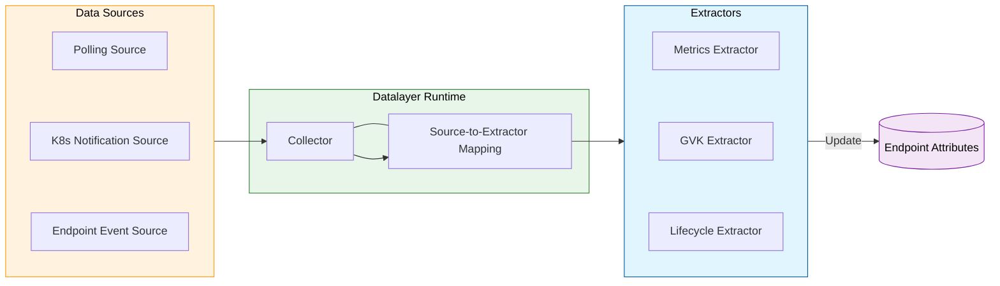

# Data Layer

The Data Layer is a pluggable and extensible component within the EPP responsible for gathering, processing, and storing real-time state for model server endpoints. It provides the foundational data—such as queue depths, KV cache utilization, and LoRA adapter states—that [request scheduling](scheduling.md) and [flow control](flow-control.md) plugins use to make informed decisions.

## Architecture Overview

The Data Layer operates as a reactive and polling-based system that enriches `Endpoint` objects with metadata and dynamic attributes. It follows a **Source -> Extract -> Attribute** lifecycle.

### Core Concepts

* **Endpoint Attributes**: A thread-safe, type-safe map stored on each `Endpoint`. Attributes are the primary way information is shared between the Data Layer and other EPP components.
* **Data Source**: A plugin that retrieves raw data from external systems (e.g., Prometheus metrics, Kubernetes API, or local events).
* **Extractor**: A plugin that transforms raw data from a source into structured attributes and stores them on an endpoint.
* **Runtime**: The logic that manages the lifecycle of sources and extractors, orchestrates polling intervals, and handles Kubernetes event bindings.

---

## Extension Points

The Data Layer is built around three primary source types, each paired with a corresponding extractor interface:

### 1. Polling Data Sources

Used for periodic retrieval of data from model servers, primarily metrics.

* **Source Interface**: `PollingDataSource` (e.g., `metrics-data-source`)
* **Extractor Interface**: `Extractor` (e.g., `core-metrics-extractor`)
* **Workflow**: The runtime starts a `Collector` for every new endpoint. The collector polls the source at a configured interval and passes the result to associated extractors. Metrics pulling is the primary motivation for this type of data source.

### 2. Notification Sources

Used for reacting to changes in Kubernetes resources.

* **Source Interface**: `NotificationSource` (e.g., `k8s-notification-source`)
* **Extractor Interface**: `NotificationExtractor`
* **Workflow**: The runtime binds these sources to the Kubernetes controller-runtime manager. When a resource (e.g., a Pod or Service) changes, the source dispatches an event to its extractors.

### 3. Endpoint Event Sources

Used for reacting to endpoint lifecycle events (Add, Update, Delete) within the EPP itself.

* **Source Interface**: `EndpointSource` (e.g., `endpoint-notification-source`)
* **Extractor Interface**: `EndpointExtractor`
* **Workflow**: When the EPP's endpoint pool changes, these sources notify extractors to perform setup or cleanup (e.g., initializing caches or purging stale metrics).

---

## Concrete Plugins

### Sources

* **[`metrics-data-source`](https://github.com/llm-d/llm-d-router/tree/main/pkg/epp/framework/plugins/datalayer/source/metrics)** - polls a Prometheus-compatible metrics endpoint of a model server and parses the response into a structured format for extraction.
* **[`k8s-notification-source`](https://github.com/llm-d/llm-d-router/tree/main/pkg/epp/framework/plugins/datalayer/source/notifications)** — can be configured to watch a single Kubernetes GVK (either a CRD or a k8s core API) and
  dispatches `NotificationEvent`s to registered `NotificationExtractor`s when objects are created, updated, or deleted. Multiple extractors can
  be notified of GVK changes by a single source. There are currently no upstream extractors that require this source.
* **[`endpoint-notification-source`](https://github.com/llm-d/llm-d-router/tree/main/pkg/epp/framework/plugins/datalayer/source/notifications)** — delivers endpoint (aka model server engine) lifecycle events (add, update, delete) to registered `EndpointExtractor`s
  whenever an endpoint is added to or removed from the datastore.

### Extractors

* **[`core-metrics-extractor`](https://github.com/llm-d/llm-d-router/tree/main/pkg/epp/framework/plugins/datalayer/extractor/metrics)** - responsible for extracting a set of model server metrics sourced from `metrics-data-source` and storing them as endpoint attributes (such as `KVCacheUsagePercent` and `WaitingQueueSize`), which scorers like `kv-cache-utilization-scorer` consume. It supports multiple inference engines and can be configured to map engine-specific metric names to a standard set of internal keys.
