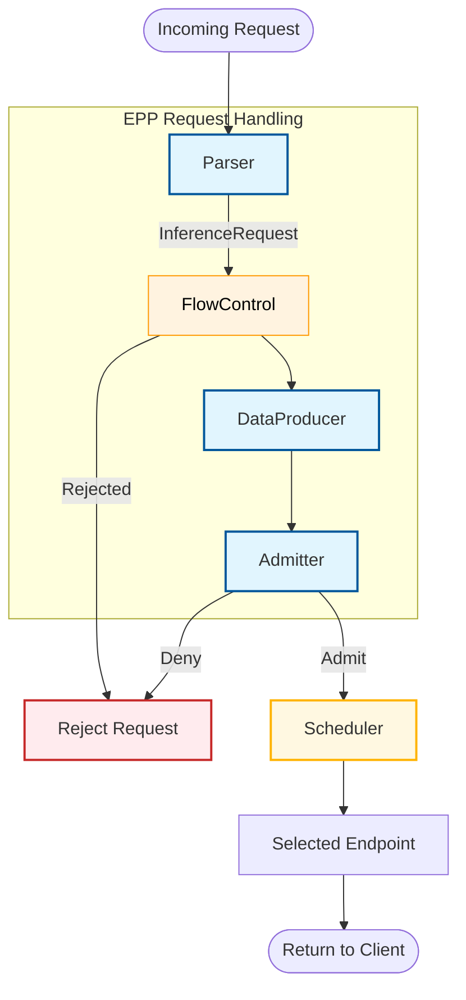

# Request Handler

## Functionality

The Request Handler manages the lifecycle of an inference request before and after the request scheduling phase within the EPP. It handles parsing the request payload, preparing and managing state for the [Request Scheduler](scheduling.md), interacting with [Flow Control](flow-control.md) and processing the response from the model server.

## Design

### Architecture Overview

#### Core Components

* **Parser**: Responsible for parsing the incoming request to a structured internal representation consumable by the request scheduler, and parsing the response to extract usage data if reported by the model server.
* **DataProducer**: A pluggable extension that allows customizing request pre-processing and producing per-request state needed for scheduling, such as tokenization, prefix-cache matches, predicted processing latency etc.
* **Admitter**: Decides whether to admit a request based on criteria like latency SLOs. Runs after dataProducer but before request scheduling. Requests failing admission are rejected, while admitted requests proceed to the request scheduling phase.

#### Advanced Hooks

The framework also supports advanced, auto-resolved hooks in the request control layer. If a plugin implements these interfaces, it is automatically wired into the execution flow:

* **`PreRequest`**: Executes before the request is processed (e.g., for incrementing in-flight counts).
* **`ResponseHeaderProcessor`**: Executes when response headers are received from the backend.
* **`ResponseBodyProcessor`**: Executes during response streaming (e.g., for usage tracking on completion).

 > [!NOTE]
 > In practice, these interfaces are often implemented by Data Producers to maintain state or track metrics across the request lifecycle. For example, the `predicted-latency-producer` implements these hooks to track request latency.

---

### Concrete Plugins

#### Parsers

Parser plugins understand the payloads of requests and responses. This is key for features like prefix-cache aware scheduling and response usage tracking.

* **[`openai-parser`](https://github.com/llm-d/llm-d-router/tree/main/pkg/epp/framework/plugins/requesthandling/parsers/openai)**: The default parser supporting the OpenAI API. Supported endpoints: `/conversations`, `/responses`, `/chat/completions`, `/completions`, `/embeddings`.
* **[`vllmgrpc-parser`](https://github.com/llm-d/llm-d-router/tree/main/pkg/epp/framework/plugins/requesthandling/parsers/vllmgrpc)**: Handles requests for the vLLM gRPC API. Supported methods: `Generate`, `Embed`.
* **[`passthrough-parser`](https://github.com/llm-d/llm-d-router/tree/main/pkg/epp/framework/plugins/requesthandling/parsers/passthrough)**: Model-agnostic parser that passes content through without interpretation. Note that payload-related scheduling (e.g., `prefix-cache-scorer`) is not supported with this parser.

#### Admitter Plugins

* **[`latency-slo-admitter`](https://github.com/llm-d/llm-d-router/tree/main/pkg/epp/framework/plugins/requestcontrol/admitter/latencyslo/README.md)**: Rejects sheddable requests (priority < 0) when no endpoint can meet latency SLO constraints.

#### Data Producers

* **[`predicted-latency-producer`](https://github.com/llm-d/llm-d-router/tree/main/pkg/epp/framework/plugins/requestcontrol/dataproducer/predictedlatency/README.md)**: Trains XGBoost models via a sidecar and generates per-endpoint TTFT/TPOT predictions. It calculates SLO headroom, collects training data, and tracks per-endpoint running request queues.
* **[`inflight-load-producer`](https://github.com/llm-d/llm-d-router/tree/main/pkg/epp/framework/plugins/requestcontrol/dataproducer/inflightload)**: Tracks the number of in-flight requests and estimated tokens for each endpoint. It increments counts in `PreRequest` and decrements them in `ResponseBodyProcessor` on end-of-stream.
* **[`approx-prefix-cache-producer`](https://github.com/llm-d/llm-d-router/tree/main/pkg/epp/framework/plugins/requestcontrol/dataproducer/approximateprefix)**: Prepares data for approximate prefix cache aware scheduling by hashing prompts in blocks and matching them against an indexer of cached prefixes on servers.

---

## Metrics & Observability

The Request Handling subsystem exposes metrics tracking request volume, success, latency, and token usage. Unless otherwise noted, these metrics carry the labels `model_name` and `target_model_name`.

#### Request Volume & Success

| Metric | Type | Description | Labels |
|--------|------|-------------|--------|
| `inference_objective_request_total` | Counter | Total request count per model | `model_name`, `target_model_name`, `priority` |
| `inference_objective_request_error_total` | Counter | Total error count per model | `model_name`, `target_model_name`, `error_code` |
| `inference_objective_running_requests` | Gauge | Currently active requests per model | `model_name` |

#### Latency & SLOs

| Metric | Type | Description | Labels |
|--------|------|-------------|--------|
| `inference_objective_request_duration_seconds` | Distribution | End-to-end response latency | `model_name`, `target_model_name` |
| `inference_objective_normalized_time_per_output_token_seconds` | Distribution | Normalized Time Per Output Token (NTPOT) | `model_name`, `target_model_name` |
| `inference_objective_request_ttft_seconds` | Distribution | Time to first token (TTFT) | `model_name`, `target_model_name` |
| `inference_objective_request_predicted_ttft_seconds` | Distribution | Predicted TTFT | `model_name`, `target_model_name` |
| `inference_objective_request_ttft_prediction_duration_seconds` | Distribution | Time spent predicting TTFT | `model_name`, `target_model_name` |
| `inference_objective_request_predicted_tpot_seconds` | Distribution | Predicted TPOT | `model_name`, `target_model_name` |
| `inference_objective_request_tpot_prediction_duration_seconds` | Distribution | Time spent predicting TPOT | `model_name`, `target_model_name` |
| `inference_objective_request_slo_violation_total` | Counter | Total count of requests violating SLO | `model_name`, `target_model_name`, `type` |

| Metric | Type | Description | Labels |
|--------|------|-------------|--------|
| `inference_objective_request_sizes` | Distribution | Request size in bytes | `model_name`, `target_model_name` |
| `inference_objective_response_sizes` | Distribution | Response size in bytes | `model_name`, `target_model_name` |
| `inference_objective_input_tokens` | Distribution | Input token count per request | `model_name`, `target_model_name` |
| `inference_objective_output_tokens` | Distribution | Output token count per request | `model_name`, `target_model_name` |
| `inference_objective_prompt_cached_tokens` | Distribution | Number of prompt cached tokens | `model_name`, `target_model_name` |

> **Note:** Response-level metrics (response sizes, output tokens, NTPOT) require Envoy body mode to be set to `Buffered` or `Streamed`. For vLLM streaming responses with usage data, include `stream_options: {"include_usage": true}` in the request.

| Metric | Type | Description | Labels |
|--------|------|-------------|--------|
| `inference_objective_inference_request_metric` | Gauge | Consolidated gauge for request metrics | `model_name`, `target_model_name`, `type` |
| `llm_d_epp_model_rewrite_decisions_total` | Counter | Total number of model rewrite decisions | `model_rewrite_name`, `model_name`, `target_model` |
