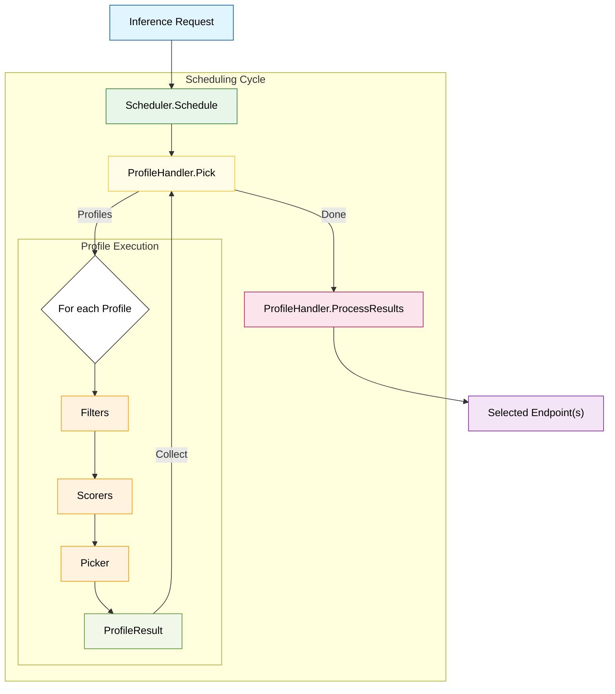
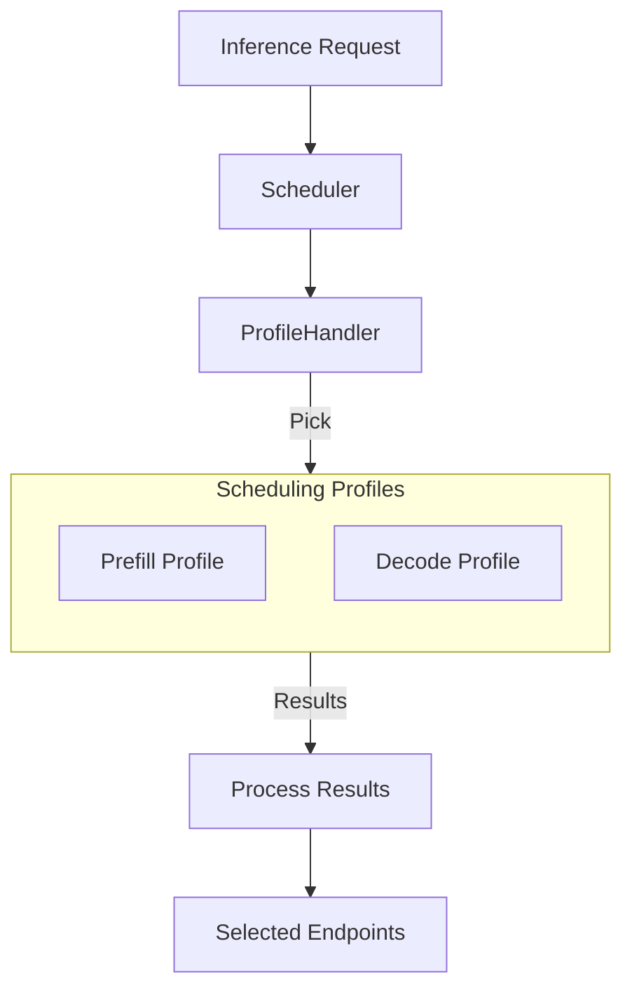

# Request Scheduler

The Request Scheduler is a highly modular and extensible component within the EPP designed to select the optimal model server (endpoint) for an inference request. It leverages a plugin-based architecture, allowing for sophisticated endpoint picking strategies based on real-time metrics, prefix cache tracking, and model-specific requirements like LoRA adapters.

## Architecture Overview

At its core, the scheduler follows a **Filter -> Score -> Pick** lifecycle for every request. It orchestrates multiple **SchedulerProfiles**, each defining a specific set of plugins for filtering and scoring candidate endpoints.

### Core Components

* **Scheduler**: The main orchestrator that manages the scheduling cycle. It invokes the configured `ProfileHandler` to pick profiles and then runs the selected profiles to obtain target endpoints.
* **InferenceRequest**: A structured internal representation of the incoming request produced by the [`Parser`](request-handling.md), including the target model, parsed body (Completions, ChatCompletions, etc.), headers, and objectives.
* **Endpoint**: Represents a candidate serving engine, with its metadata (e.g., Pod name, namespace and port) and state (e.g., active models, queue depth and KV-cache). Note that a Pod may run one or more endpoints each on a different port, this is the case in [the data parallel deployment mode](https://docs.vllm.ai/en/latest/serving/data_parallel_deployment/).

### Extension Points

The scheduler's logic is distributed across several extension points, implemented via plugin interfaces:

1. **ProfilePicker**: (Implemented by `ProfileHandler`) Selects which `SchedulerProfile`s to run based on the request and previous cycle results.
2. **Filter**: Narrows down the list of candidate endpoints (e.g., based on health, SLO headroom, or cache affinity).
3. **Scorer**: Assigns a score between `0.0` and `1.0` to each filtered endpoint. Multiple scorers can be weighted and combined.
4. **Picker**: Selects the final endpoint(s) from the scored list (e.g., highest score, weighted random).
5. **ProcessResults**: (Implemented by `ProfileHandler`) Aggregates the results from all executed profiles to produce the final `SchedulingResult`.

### Scheduling Profile

A `SchedulingProfile` is a configured pipeline consisting of:

* **Filters**: A list of `Filter` plugins run sequentially.
* **Scorers**: A list of `WeightedScorer` objects, where each contains a `Scorer` plugin and its relative weight.
* **Picker**: A single `Picker` plugin that makes the final selection.

When a profile runs, it first filters the candidate endpoints. If any remain, it calculates a weighted aggregate score for each and then passes the scored list to the picker. The final score for an endpoint is calculated by multiplying the score returned by each scorer (which is bounded between 0.0 and 1.0) by its configured weight, and summing these weighted scores together. For example, if Scorer A (weight 2.0) returns 0.8 and Scorer B (weight 1.0) returns 0.5, the endpoint's final score is `(0.8 * 2.0) + (0.5 * 1.0) = 2.1`.

---

## Concrete Plugins

> [!IMPORTANT]
> Not all of the plugins listed below are configured by default. Only a curated subset is enabled in the [default configuration](#).

### Filters

* **[`prefix-cache-affinity-filter`](https://github.com/llm-d/llm-d-router/tree/main/pkg/epp/framework/plugins/scheduling/filter/prefixcacheaffinity/README.md)**: A probabilistic filter that narrows candidates to "sticky" endpoints (those with high prefix cache scores). It includes a "TTFT load gate" to break stickiness if sticky endpoints are significantly slower than non-sticky ones.
* **[`slo-headroom-tier-filter`](https://github.com/llm-d/llm-d-router/tree/main/pkg/epp/framework/plugins/scheduling/filter/sloheadroomtier/README.md)**: Filters endpoints based on SLO headroom tiers to ensure quality of service.
* **[`label-selector-filter`](https://github.com/llm-d/llm-d-router/tree/main/pkg/epp/framework/plugins/scheduling/filter/bylabel)**: Keeps endpoints that matches a configured label selector.
* **[`prefill-endpoints-filter`](https://github.com/llm-d/llm-d-router/tree/main/pkg/epp/framework/plugins/scheduling/filter/bylabel)**: A special instance of `label-selector-filter` that retains only endpoints with a prefill label.
* **[`decode-endpoints-filter`](https://github.com/llm-d/llm-d-router/tree/main/pkg/epp/framework/plugins/scheduling/filter/bylabel)**: A special instance of `label-selector-filter` that retains only endpoints with a decode label.

### Scorers

*For details on exactly how each scorer calculates its score (0.0 to 1.0), please refer to the specific plugin's documentation.*

* **[`kv-cache-utilization-scorer`](https://github.com/llm-d/llm-d-router/tree/main/pkg/epp/framework/plugins/scheduling/scorer/kvcacheutilization/README.md)**: Prefers endpoints with lower KV cache utilization to avoid fragmentation.
* **[`latency-scorer`](https://github.com/llm-d/llm-d-router/tree/main/pkg/epp/framework/plugins/scheduling/scorer/latency/README.md)**: Scores endpoints based on predicted latency headroom, defined as the gap between the predicted request latency and the user's SLO if set.
* **[`lora-affinity-scorer`](https://github.com/llm-d/llm-d-router/tree/main/pkg/epp/framework/plugins/scheduling/scorer/loraaffinity/README.md)**: Prefers endpoints that already have the requested LoRA adapter active or have capacity to load it.
* **[`prefix-scorer`](https://github.com/llm-d/llm-d-router/tree/main/pkg/epp/framework/plugins/scheduling/scorer/prefix/README.md)**: Scores based on the length of the prefix cache match.
* **[`queue-depth-scorer`](https://github.com/llm-d/llm-d-router/tree/main/pkg/epp/framework/plugins/scheduling/scorer/queuedepth/README.md)**: Prefers endpoints with shorter request queues.
* **[`running-requests-size-scorer`](https://github.com/llm-d/llm-d-router/tree/main/pkg/epp/framework/plugins/scheduling/scorer/runningrequests/README.md)**: Scores based on the number of currently active requests.
* **[`token-load-scorer`](https://github.com/llm-d/llm-d-router/tree/main/pkg/epp/framework/plugins/scheduling/scorer/tokenload/README.md)**: Scores based on the total token load (input + output) handled by the endpoint.
* **[`precise-prefix-cache-scorer`](https://github.com/llm-d/llm-d-router/tree/main/pkg/epp/framework/plugins/scheduling/scorer/preciseprefixcache)**: Scores requests based on real-time KV-cache locality. While the `prefix-scorer` relies on historical scheduling estimates, this version tracks actual cache states via model server events to ensure higher precision.

  > [!NOTE]
  > If you configure this plugin but do not explicitly configure its required data producer (`approx-prefix-cache-producer`), the loader will automatically instantiate it with the same parameters. This was done for historical reasons to simplify configuration when data producers were introduced.

* **[`session-affinity-scorer`](https://github.com/llm-d/llm-d-router/tree/main/pkg/epp/framework/plugins/scheduling/scorer/sessionaffinity)**: Assigns a maximum score to the specific endpoint that handled previous requests for the same session, while all other endpoints receive the minimum score.
* **[`no-hit-lru-scorer`](https://github.com/llm-d/llm-d-router/tree/main/pkg/epp/framework/plugins/scheduling/scorer/nohitlru)**: For cold requests (zero cache hits), the scorer prioritizes endpoints that have never handled one, followed by those used least recently. This ensures an even distribution of the intensive "prefill" workload across the cluster. If a request has existing cache hits, the scorer assigns equal scores to all endpoints (scorer has no impact).

### Pickers

* **[`max-score-picker`](https://github.com/llm-d/llm-d-router/tree/main/pkg/epp/framework/plugins/scheduling/picker/maxscore/README.md)**: Selects the endpoint with the absolute highest score.
* **[`random-picker`](https://github.com/llm-d/llm-d-router/tree/main/pkg/epp/framework/plugins/scheduling/picker/random/README.md)**: Selects an endpoint randomly from the candidates.
* **[`weighted-random-picker`](https://github.com/llm-d/llm-d-router/tree/main/pkg/epp/framework/plugins/scheduling/picker/weightedrandom/README.md)**: Selects an endpoint randomly, using the scores as relative probabilities (lottery scheduling).

### Profile Handlers

* **[`single-profile-handler`](https://github.com/llm-d/llm-d-router/tree/main/pkg/epp/framework/plugins/scheduling/profile)**: Runs a single configured primary profile.
* **[`disagg-profile-handler`](https://github.com/llm-d/llm-d-router/tree/main/pkg/epp/framework/plugins/scheduling/profilehandler/disagg)**: Runs two scheduling profiles, one for prefill and one for decode. The **decode endpoint** is set as the primary destination for the proxy to forward the original request, while the **prefill endpoint** is injected into the request as a specialized header.

---

## Advanced Use Cases: Prefill/Decode Disaggregation

The scheduler natively supports advanced scheduling paradigms, such as **Prefill/Decode Disaggregation (P/D Disagg)**. This is a serving technique where the initial prompt processing (prefill) and the subsequent token generation (decode) are handled by separate, specialized model servers.

In a P/D Disagg setup, the `ProfileHandler` orchestrates two separate `SchedulerProfiles`:

1. **Prefill Profile**: Evaluates and scores endpoints specialized for compute-heavy prompt processing. It may use filters and scorers focused on prefix cache affinity, queue depth, or token load.
2. **Decode Profile**: Evaluates and scores endpoints specialized for memory-bandwidth-bound token generation.

The `ProfileHandler` uses the `Pick` extension point to determine which profiles need to run for a given request (e.g., if a request needs both prefill and decode, or just decode if the KV cache is already transferred). If both are needed, the prefill and decode endpoints are picked at the same time. The `ProfileHandler` then uses the `ProcessResults` extension point to merge the results from both profiles. This merging ensures that the **decode endpoint** is returned as the primary destination for the proxy to forward the original request. Simultaneously, the **prefill endpoint** is injected into the request as a specialized header. When the request reaches the decode worker, the **sidecar** running alongside the decoder intercepts it, extracts the prefill endpoint from the header, and coordinates a remote prefill from the selected prefill worker before the decoding process begins.

See [Disaggregated Serving](../../../advanced/disaggregation/README.md) for more details on the design and request flow.

---

## Metrics & Observability

The EPP Scheduler exposes detailed metrics to track pool health and scheduling decisions.

### Pool & Scheduling Metrics

The following metrics provide visibility into the InferencePool health and scheduling decisions.

#### Pool Health Metrics

| Metric | Type | Labels | Description |
|--------|------|--------|-------------|
| `inference_pool_ready_pods` | Gauge | `name` | Number of ready pods in the pool |
| `inference_pool_average_kv_cache_utilization` | Gauge | `name` | Average KV cache utilization across the pool |
| `inference_pool_average_queue_size` | Gauge | `name` | Average number of pending requests across the pool |
| `inference_pool_per_pod_queue_size` | Gauge | `model_server_pod`, `name` | Queue size for each individual pod |
| `inference_pool_average_running_requests` | Gauge | `name` | Average number of running requests across the pool |

#### Scheduler Performance Metrics

| Metric | Type | Labels | Description |
|--------|------|--------|-------------|
| `inference_extension_scheduler_attempts_total` | Counter | `status`, `target_model_name`, `pod_name`, `namespace`, `port` | Number of scheduling attempts and their outcomes |
| `inference_extension_scheduler_e2e_duration_seconds` | Distribution | *None* | End-to-end scheduling latency |
| `inference_extension_plugin_duration_seconds` | Distribution | `extension_point`, `plugin_type`, `plugin_name` | Processing latency for each plugin |

#### Prefix Cache Metrics

| Metric | Type | Labels | Description |
|--------|------|--------|-------------|
| `inference_extension_prefix_indexer_size` | Gauge | *None* | Size of the prefix indexer |
| `inference_extension_prefix_indexer_hit_ratio` | Distribution | *None* | Hit ratio for prefix matches |
| `inference_extension_prefix_indexer_hit_bytes` | Distribution | *None* | Bytes matched in prefix cache lookup |

#### System Info

| Metric | Type | Labels | Description |
|--------|------|--------|-------------|
| `inference_extension_info` | Gauge | `commit`, `build_ref` | EPP build information |
