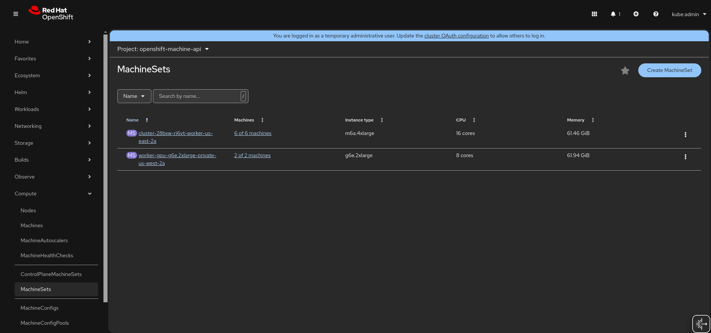
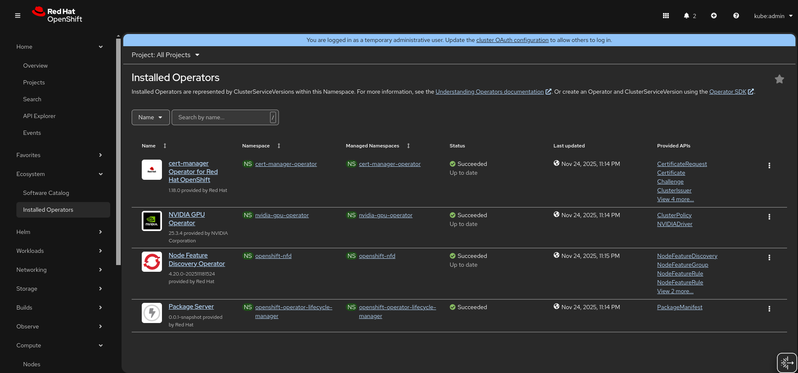
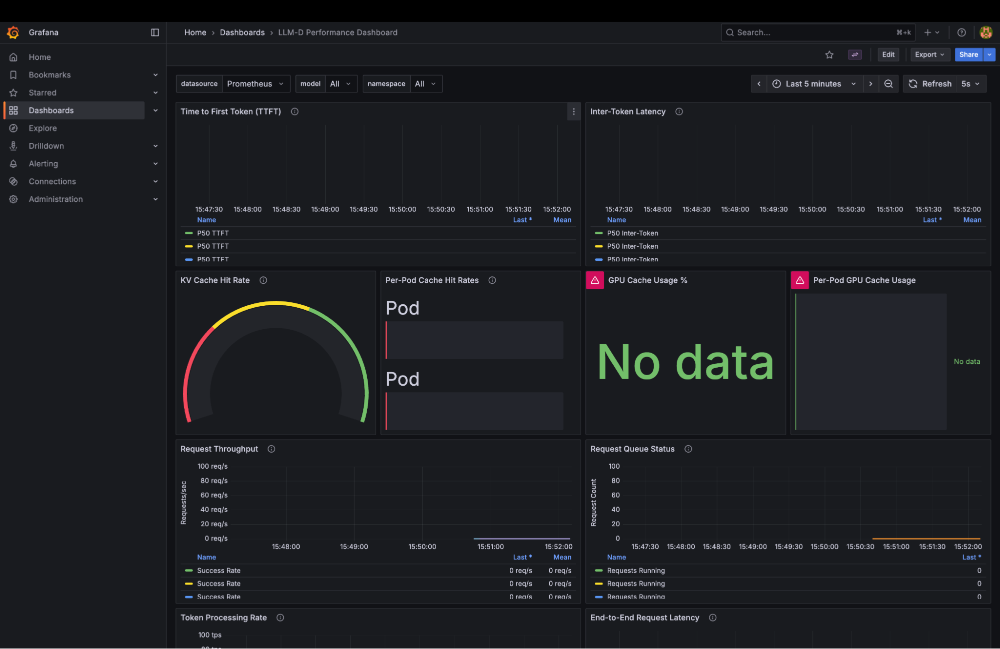
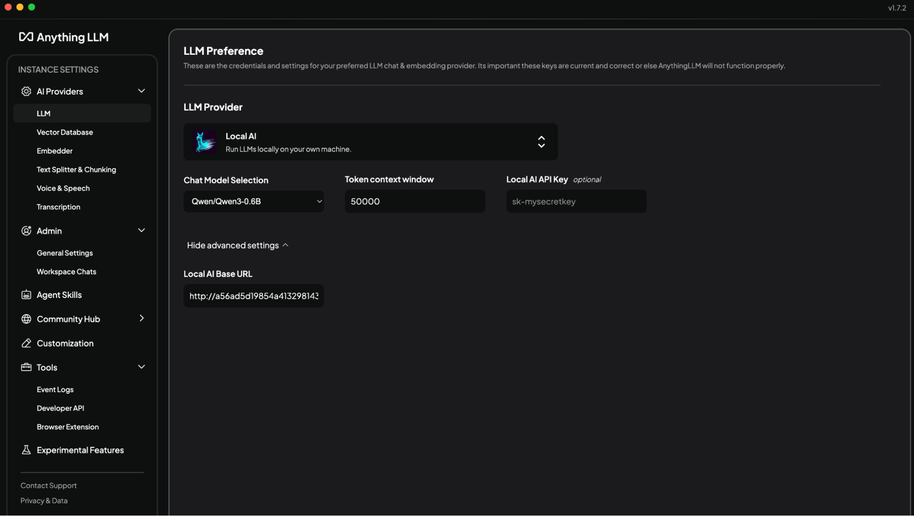
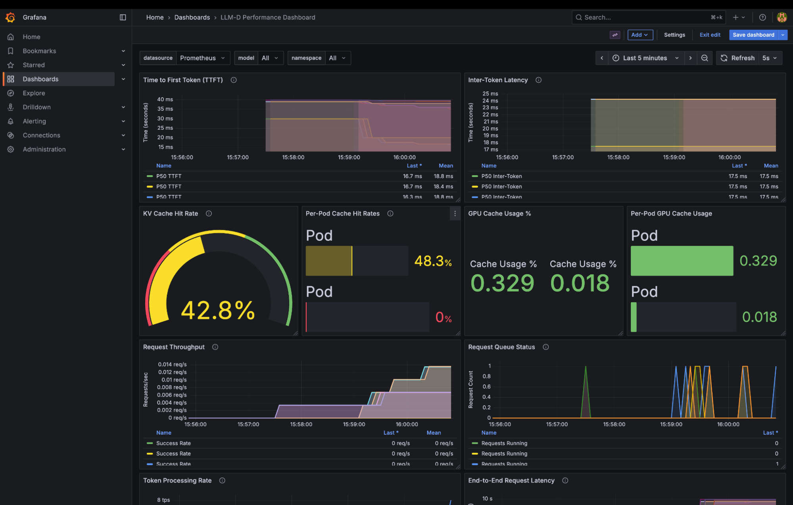

# llm-d on OpenShift

This document will guide you through deploying llm-d on an OpenShift cluster.

Note: Comparable Openshift infrastructure and/or older OCP versions may work but have not been tested.

## Prerequisites

### Infrastructure Setup

- AWS - An [ec2](https://aws.amazon.com/ec2/instance-types/m6a/) instance of m6a.4xlarge was used for the Openshift control plane nodes. Later in the instructions this is scaled up to 3 nodes in total. If your a Red Hat associate, partner, or customer you can provision through the demo redhat system. 

### Platform Setup

At a high level the following conditions are assumed.

- OpenShift - This guide was tested on OpenShift 4.17, 4.19, and 4.20. 
- Ensure no Service Mesh or Istio installations exist on the cluster as the included CRDs may conflict with the llm-d gateway component.
- If installing everything from scratch, Cluster administrator privileges are required to install the llm-d cluster scoped resources. Otherwise you only need namespace scoped permissions.
- NVIDIA GPU Operator and NFD Operator - The original installation instructions can be found [here](https://docs.nvidia.com/datacenter/cloud-native/openshift/latest/steps-overview.html). However below are convenient steps for setting up via configuration given by RedHat AI Business Unit.


### GPU, Operator, and Additional Configuration Steps

Make sure you first clone the following repo and work from its directory for the prereq setup.
```
git clone https://github.com/rh-aiservices-bu/ocp-gpu-setup.git
cd ocp-gpu-setup
```

#### Prepare GPUs
1. Configure the gpu machinesets by invoking the guided script.
    ```
    ./machine-set/gpu-machineset.sh
    ```
1. For this setup the following settings were selected when prompted by the script:
    * Select option `12` for `L40S Single GPU`
    * Select option `p` for `private`
    * Enter AWS region (e.g. `us-east-2`)
    * Enter Availability zone (e.g. `1`)
    * Answer `n` for spot instances
1. Check if you have the default machineset available (in the web console, see Compute -> MahineSets). If not, then run the above command twice. 
1. Once the first gpu machine set is provisioned, set the MachineSet count to 2.
1. Configure the default MachineSet count (or extra one provisioned above) to 6.
1. After the machines have provisioned the configuration should look similiar to the following:


#### Deploy the Supporting Operators

1. Deploy the NFD Operator
    ```
    oc apply -f ./nfd
    ```
1. Deploy the NVIDIA GPU Operator
    ```
    oc apply -f ./gpu-operator
    ```
1. Wait for the Node Feature Discovery and NVIDIA GPU Operator to be installed



#### Deploy the Supporting CRs

```sh
oc apply -f ./crs
```

## llm-d Installation

### Clone this repository
```sh
git clone https://github.com/llm-d/llm-d.git
cd llm-d
```

### Install Dependencies 
Go to the `guides/prereq` directory and run `client-setup/install-deps.sh`. 
This script detects your OS and uses its package management to install required utilities like `yq`, `helm`, etc.

```sh
cd guides/prereq
./client-setup/install-deps.sh
```

### Deploy the gateway and infrastructure
Switch to the `gateway-providers` directory and run the `install-gateway-provider-dependencies.sh` script located in `guides/prereqs/gateway-provider`
```sh
cd gateway-provider     
./install-gateway-provider-dependencies.sh
helmfile apply -f istio.helmfile.yaml
```

### Deploy the example `precise prefix cache aware`

Go to the `guides/precise-prefix-cache-aware` example directory.
```sh
cd ../../precise-prefix-cache-aware
```

Create a namespace for your deployment.
```sh
export NAMESPACE=llm-d
oc new-project ${NAMESPACE}
```

Set Hugging Face credentials. See https://huggingface.co/settings/tokens
```sh
export HF_TOKEN=<token from hugginface>
export HF_TOKEN_NAME=${HF_TOKEN_NAME:-llm-d-hf-token}
```

Create a Kubernetes secret for the Hugging Face token:
```sh
oc create secret generic ${HF_TOKEN_NAME} \
  --from-literal="HF_TOKEN=${HF_TOKEN}" \
  --namespace "${NAMESPACE}" \
  --dry-run=client -o yaml | oc apply -f -
```

Apply Helmfile in the namespace.
```sh
helmfile apply -n ${NAMESPACE}
```

### Handle GPU node taints. 

At this point, the ms-kv-events-llm-d-modelservice-decode pods might be stuck in a Pending state. 
This typically happens when GPU nodes have taints applied; for example, for NVIDIA-L40S-PRIVATE (the GPUs we're using in this example).

```
Handle GPU Node taints

0/9 nodes are available: 2 node(s) had untolerated taint {nvidia.com/gpu: NVIDIA-L40S-PRIVATE}, 7 Insufficient nvidia.com/gpu. preemption: 0/9 nodes are available: 2 Preemption is not helpful for scheduling, 7 No preemption victims found for incoming pod.
```

To allow scheduling, add the proper tolerations:
```sh
oc patch deployment ms-kv-events-llm-d-modelservice-decode \
  -p '{"spec":{"template":{"spec":{"tolerations":[{"key":"nvidia.com/gpu","operator":"Equal","value":"NVIDIA-L40S-PRIVATE","effect":"NoSchedule"}]}}}}'
```

### Create the HTTPRoute

In the same directory, run
```sh
oc apply -f httproute.yaml -n ${NAMESPACE}
```

### Verify pods are running

After a few minutes, your pods should be running. Confirm with:
```sh
oc get pods -n ${NAMESPACE}
```
Example output:
```
NAME                                                      READY   STATUS    RESTARTS   AGE
gaie-kv-events-epp-588f77495f-8fn7q                       1/1     Running   0          24m
infra-kv-events-inference-gateway-istio-799c7b8f-nwvwl    1/1     Running   0          24m
ms-kv-events-llm-d-modelservice-decode-5888b4ff9f-dw6hk   2/2     Running   0          24m
ms-kv-events-llm-d-modelservice-decode-5888b4ff9f-vtb2b   2/2     Running   0          18m
```

### Test deployment

#### Setup port forwarding

```sh
oc port-forward -n ${NAMESPACE} service/infra-kv-events-inference-gateway-istio 8000:80
```
#### Test KV cache-aware routing

```
curl localhost:8000/v1/models | jq
```

Output:
```
{
  "data": [
    {
      "created": 1764013724,
      "id": "Qwen/Qwen3-0.6B",
      "max_model_len": 40960,
      "object": "model",
      "owned_by": "vllm",
      "parent": null,
      "permission": [
        {
          "allow_create_engine": false,
          "allow_fine_tuning": false,
          "allow_logprobs": true,
          "allow_sampling": true,
          "allow_search_indices": false,
          "allow_view": true,
          "created": 1764013724,
          "group": null,
          "id": "modelperm-806876f87f384832a29200d2e93d1295",
          "is_blocking": false,
          "object": "model_permission",
          "organization": "*"
        }
      ],
      "root": "Qwen/Qwen3-0.6B"
    }
  ],
  "object": "list"
}
```

#### Send prompts through inference gateway
```sh
curl -X POST  localhost:8000/v1/completions     -H "Content-Type: application/json"     -d '{
      "model": "Qwen/Qwen3-0.6B",
      "prompt": "Hello, how are you?",
      "max_tokens": 50
    }'
```

Output:
```
{"choices":[{"finish_reason":"length","index":0,"logprobs":null,"prompt_logprobs":null,"prompt_token_ids":null,"stop_reason":null,"text":" I'm sorry to hear about the incident. I'm sorry to hear about the incident, and I'm sorry to hear about the incident again. I'm sorry to hear about the incident, and I'm sorry to hear about the incident again. I","token_ids":null}],"created":1764013750,"id":"cmpl-29ce2940-8500-4c81-95e7-acc26f81fb2c","kv_transfer_params":null,"model":"Qwen/Qwen3-0.6B","object":"text_completion","service_tier":null,"system_fingerprint":null,"usage":{"completion_tokens":50,"prompt_tokens":6,"prompt_tokens_details":null,"total_tokens":56}}
```

## Promethus and Grafana

Clone the monitoring repo from:  https://github.com/deewhyweb/hello-chris-llm-d.git

```
git clone https://github.com/deewhyweb/hello-chris-llm-d.git
cd hello-chris-llm-d
```

### Deploy prometheus and grafana

```sh
oc create namespace llm-d-monitoring || true

oc apply -f monitoring/grafana.yaml

oc apply -f monitoring/grafana-service.yaml

oc apply -f monitoring/prometheus.yaml

oc apply -f monitoring/grafana-datasources.yaml

oc apply -f monitoring/grafana-dashboards-config.yaml

oc apply -f monitoring/grafana-config.yaml

oc apply -f monitoring/prometheus-config.yaml

oc create configmap grafana-dashboard-llm-performance --from-file=monitoring/grafana-dashboard-llm-performance.json -n  llm-d-monitoring --dry-run=client -o yaml | oc apply -f -
```

### Add Prometheus annotations to model service pods for metrics discovery

```
for pod in $(oc get pods -n llm-d -l llm-d.ai/inferenceServing=true -o name); do
  oc annotate $pod prometheus.io/scrape=true prometheus.io/port=8000 prometheus.io/path=/metrics -n llm-d
done
```

### Login and configure dashboard

Open the Grafana route from Networking -> Routes. 

Login with admin/admin and set the password. 

Open up the LLM-D Performance Dashboard.



## Configure AnythingLLM

If you have not yet installed AnythingLLM, follow the steps here: https://anythingllm.com/desktop

In AnythingLLM, configure Settings -> AI Providers -> LLMProvider to `LocalAI`.

Copy the service ingress:

Use this for the AnythingLLM local base url in this format: `http://localhost:8000/v1`

Choose the Qwen3-0.6B model.




You are now ready to test llm-d.  Start some conversations with AnythingLLM and watch the Grafana dashboard light up.


