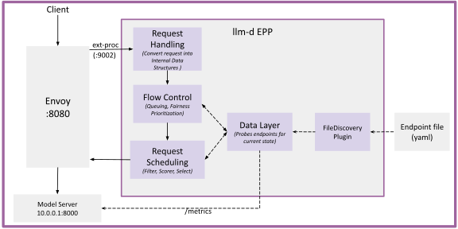

# No-Kubernetes Deployment

llm-d's reference deployment runs on Kubernetes — workers are managed by Kubernetes `Deployments`, the EPP discovers them through an `InferencePool`, and the platform handles networking and lifecycle. Many environments don't have a Kubernetes control plane, though: HPC schedulers like Slurm or LSF launch workers dynamically, Ray-based stacks run workers as actors, bare-metal inference farms operate without K8s, and a single workstation with a couple of GPUs is often enough for development.

The No-Kubernetes path runs the same routing stack — the llm-d EPP, Envoy, and one or more model servers — directly as host processes or containers. The EPP gets its endpoint inventory from a YAML file on disk via the [file-discovery plugin][filediscovery-plugin] instead of watching an `InferencePool` over the Kubernetes API; everything else (EPP plugin set, scoring, Envoy ext_proc, vLLM arguments) is unchanged.

> [!IMPORTANT]
> Without Kubernetes, some pieces of the llm-d stack are
> out of scope: `InferenceObjective`-driven FlowControl, the
> `InferenceModelRewrite` model-name rewriter, and `PodMonitor`-based
> Prometheus discovery. Scoring, prefix-cache affinity, saturation-based
> admission, and Prometheus metrics on `--metrics-port` all work; see
> the [parity caveats][blog-parity] for the full list.

## Deploy

See the [no-Kubernetes deployment guide](../../guides/no-kubernetes-deployment) for manifests and step-by-step deployment.

## Architecture

<p align="center">
  <picture>
    <source media="(prefers-color-scheme: dark)">
    
  </picture>
</p>

Traffic flows the same way as the optimized-baseline path:

```
client -> Envoy listener :8081
       -> ext_proc gRPC :9002 (EPP picks endpoint, sets header)
       -> ORIGINAL_DST cluster
       -> reads x-gateway-destination-endpoint from EPP response
       -> <address>:<port> of the vLLM worker chosen by the EPP
```

The EPP's datastore is populated entirely from `endpoints.yaml`. With `watchFile: true` the file is hot-reloaded on every atomic rewrite — adding, removing, or relabelling a worker takes effect without restarting the EPP. The plugin set, weights, and scheduling profile match the [Optimized Baseline](../well-lit-paths/capabilities/optimized-baseline.md), so routing behaviour is identical to the Kubernetes-based deployment.

## Further Reading

- [`file-discovery` plugin source][filediscovery-plugin]
- ["No Kubernetes? No Problem"][blog] — full background on the design

[filediscovery-plugin]: https://github.com/llm-d/llm-d-router/blob/main/pkg/epp/framework/plugins/datalayer/discovery/file/plugin.go
[blog]: https://llm-d.ai/blog/running-llm-d-without-kubernetes
[blog-parity]: https://llm-d.ai/blog/running-llm-d-without-kubernetes#parity-with-the-kubernetes-native-llm-d-deployment
