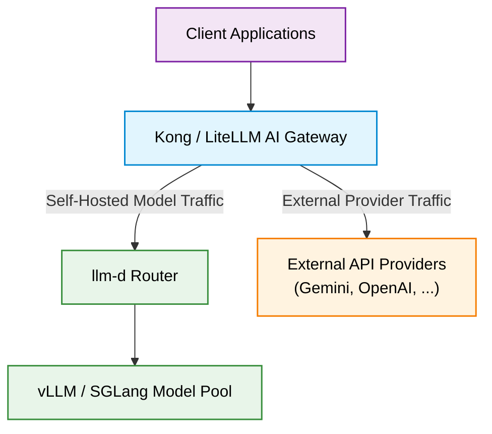

# Serve External APIs

This section covers how to deploy an API gateway or proxy layer on top of **llm-d** to manage traffic across both self-hosted LLM workloads and third-party external model APIs (such as Google Gemini, OpenAI, or Anthropic).

By deploying a unified proxy front-ending your LLM infrastructure, you can:

- **Centralize API Key & Secret Management**: Store external provider keys securely in Kubernetes Secrets rather than distributing them to client applications.
- **Provide a Unified OpenAI-Compatible Interface**: Allow client applications to switch seamlessly between self-hosted llm-d model endpoints and external SaaS LLM providers.
- **Enforce Security & Rate Limiting**: Apply enterprise governance, authentication, token budgeting, and logging at a single entry point.

---

## Architecture Overview

In both configurations, the proxy acts as the single external or in-cluster entry point. Requests targeting self-hosted models are routed directly into the **llm-d Optimized Baseline** infrastructure, while requests targeting external models are authenticated and forwarded to cloud API providers.

### Integration Modes with llm-d

Both guides support connecting the external API proxy to **llm-d** via either:

1. **Gateway Mode (Default & Recommended)**: Connects to the Kubernetes Gateway IP or endpoint, leveraging llm-d's full Gateway API Inference Extension (GAIE) capabilities and route management.
2. **Standalone Mode (Optional)**: Connects directly to the `optimized-baseline-epp` Service endpoint (`http://optimized-baseline-epp...svc.cluster.local:80/v1`), bypassing the Kubernetes Gateway for direct in-cluster routing.

---

## Deployment Guides

Select a guide to proceed with deployment:

- **[LiteLLM Proxy Guide](./litellm.md)**: Deploy LiteLLM with PostgreSQL for virtual API key management, user spend tracking, budget caps, and multi-provider routing.
- **[Kong AI Gateway Guide](./kong.md)**: Deploy Kong in DB-less mode using Kubernetes Gateway API and custom resources (`KongPlugin`, `HTTPRoute`) for high-performance routing.
