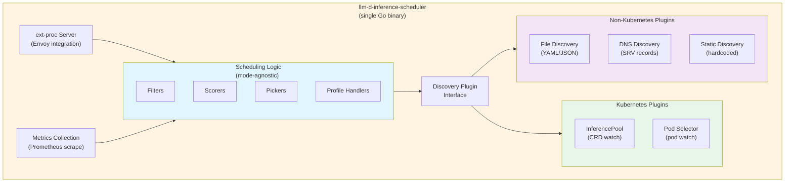
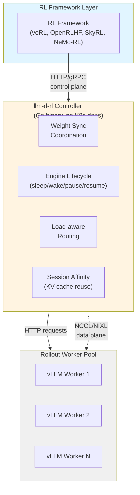
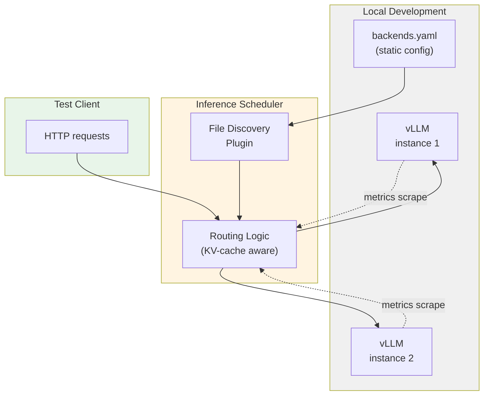

# Non-Kubernetes deployment mode

**Authors**: llm-d maintainers

## Summary

llm-d's Kubernetes-native architecture has driven rapid cloud adoption, but
creates barriers in three critical environments: RL training infrastructure, AI
research labs running Slurm, and benchmark platforms. This proposal enables
llm-d core components (inference scheduler, RL rollout controller) to run
without Kubernetes dependencies while maintaining full feature parity with
Kubernetes deployments.

The technical approach uses plugin-based discovery abstractions, configuration-driven
mode selection, and a single binary supporting both Kubernetes and non-Kubernetes
environments. This expands the llm-d community to include RL practitioners and AI
research labs, providing reusable rollout infrastructure so teams can focus on RL
algorithms rather than reimplementing inference orchestration.

Related repositories:
- [llm-d-inference-scheduler no-kube branch](https://github.com/ezrasilvera/llm-d-inference-scheduler/tree/no-kube)
- [llm-d-rl](https://github.com/llm-d-incubation/llm-d-rl)
- [py-inference-scheduler](https://github.com/llm-d-incubation/py-inference-scheduler)
- [weight-propagation-interface](https://github.com/llm-d-incubation/weight-propagation-interface)

## Motivation

### RL training infrastructure

Modern RL frameworks for LLM post-training (veRL, OpenRLHF, SkyRL, Slime,
NeMo-RL) run on dedicated GPU clusters where Kubernetes is either absent or
undesirable. These environments use various orchestration layers including Ray,
Slurm, or bare-metal coordination, depending on the research lab and
infrastructure.

Current llm-d deployment requires standing up a full Kubernetes cluster just to
gain access to intelligent inference routing during RL rollout phases. This
creates a bifurcated infrastructure requirement: one orchestration system for
training, Kubernetes for inference, with operational complexity at the handoff
boundary.

Every RL framework reimplements the same rollout primitives: weight
synchronization, engine lifecycle management, load-aware routing, async
generation, and partial rollout control. llm-d can provide these as reusable
infrastructure, but only if it works in non-Kubernetes environments.

### AI research labs and Slurm environments

AI research labs building RL systems typically run on Slurm-managed GPU
clusters. These environments prioritize rapid experimentation, shared GPU pools
for training and inference, and established Slurm expertise. Kubernetes
introduces operational overhead without clear benefits when existing Slurm
infrastructure already handles job scheduling, resource accounting, and fault
tolerance.

National labs and supercomputing centers (ORNL, NERSC, ALCF) similarly
standardize on Slurm due to security policies, privileged container
restrictions, and tight integration with HPC storage systems like Lustre and
GPFS.

The current llm-d value proposition (intelligent routing, KV-cache-aware
scheduling, P/D disaggregation) is inaccessible to these environments without
incurring Kubernetes adoption costs.

### Benchmark and development environments

Performance evaluation and development workflows are hindered by Kubernetes
infrastructure requirements. Benchmark reproducibility suffers when Kubernetes
introduces variability (kube-proxy, CNI plugins, control plane interference).
Comparing llm-d on Kubernetes versus native vLLM confounds llm-d routing
intelligence with Kubernetes overhead.

Developer iteration speed is constrained by local development requiring
minikube/kind cluster setup. Testing routing logic changes requires pod
restarts, image builds, and manifest updates. Inner-loop feedback is measured in
minutes, not seconds.

Benchmark platform requirements create additional friction. Some standardized 
benchmarking  for AI inference stacks requires clean integration without 
Kubernetes control plane. Clean performance evaluation requires 
infrastructure-neutral deployment to isolate routing intelligence from 
orchestration overhead.

### Goals

- Enable llm-d inference scheduler (EPP) to run without Kubernetes dependencies
  via plugin-based discovery abstraction
- Enable llm-d-rl rollout controller to work in Slurm, bare-metal, and various
  orchestration environments
- Maintain full feature parity for routing intelligence: KV-cache scoring,
  prefix-cache awareness, predicted latency, flow control, admission control
- Support configuration-driven mode selection with a single binary for both
  Kubernetes and non-Kubernetes deployments
- Provide deployment patterns and documentation for Slurm, Docker Compose, and
  bare-metal environments
- Enable benchmark participation (MLPerf, InferenceMax) for wider validation and
  adoption
- Expand llm-d community to include RL practitioners and AI research labs

### Non-Goals

- Replacing Kubernetes as the primary deployment target or reducing investment
  in Kubernetes-native features
- Building separate binaries or codebases for non-Kubernetes deployments
- Supporting Windows or macOS as primary deployment platforms (Linux-focused)
- Providing autoscaling capabilities in non-Kubernetes mode (external autoscaler
  must manage backends)
- Replacing existing RL framework orchestration layers (Ray, Slurm) with llm-d
  components

## Proposal

Enable llm-d core components to run without Kubernetes dependencies through
three complementary initiatives:

### 1. Inference scheduler non-Kubernetes mode

The llm-d-inference-scheduler (EPP) implements a BackendDiscovery plugin
interface enabling configuration-driven mode selection. A single binary supports:

- Kubernetes mode: InferencePool CRD watch and pod discovery
- File-based mode: shared filesystem with live reloading (Slurm)
- DNS mode: SRV record polling for dynamic service discovery
- Static mode: hardcoded backend list in config YAML

All scheduling plugins (KV-cache scoring, prefix-cache awareness, predicted
latency, flow control, admission control) work identically across modes. The
scheduling logic is mode-agnostic; only the discovery mechanism changes.

For Slurm deployments, vLLM job steps register themselves to a shared backends
file on startup, the EPP discovers backends via file watch, and Envoy calls EPP
via ext-proc for routing decisions based on KV-cache metrics.

### 2. RL rollout controller

The llm-d-rl project provides framework-agnostic RL rollout infrastructure with
no Kubernetes dependency. The controller runs as a standalone Go binary with
engine discovery via command-line flags for static URLs or file-based registry
for Slurm environments.

Key capabilities:
- Weight synchronization via NCCL/NIXL (data plane separate from HTTP control plane)
- Engine lifecycle management (sleep/wake/pause/resume)
- Load-aware routing and session affinity for KV-cache reuse
- HTTP/gRPC control plane consumable by any RL framework

The py-inference-scheduler provides Python integration for prefix-cache-aware
routing in RL sampling workloads. The weight-propagation-interface enables
efficient policy updates.

### 3. Simplified development and benchmarking

The no-kube branch enables file-based discovery for local development workflows.
Developers can run vLLM instances locally, create a static backend list in YAML,
and run EPP with file discovery to test routing logic changes in seconds rather
than minutes.

For benchmark integration, InferenceMax compatibility is achieved via drop-in
Slurm job scripts with file-based backend registration. MLPerf submissions can
use standalone binary plus static config to meet "no orchestrator" requirements.

CI/CD improvements allow integration tests to run against mock backends (no
vLLM, no GPU), scheduler logic tests use file discovery (no Kubernetes API
calls), and regression tests complete in seconds instead of minutes.

### User Stories

#### Story 1: RL researcher running veRL on Slurm cluster

An RL researcher is training a code-generation model using veRL on their lab's
Slurm cluster. They need intelligent routing during rollout to maximize
KV-cache hits for multi-turn coding trajectories. They deploy llm-d-rl
controller with file-based backend discovery, start vLLM workers as Slurm job
steps that register to a shared backends file, and integrate the Python client
library into their veRL training loop. The controller provides weight sync via
NCCL, session affinity for KV-cache reuse, and load-aware routing without
requiring Kubernetes.

#### Story 2: Benchmark engineer validating llm-d on Slurm environment

A benchmark engineer needs to compare llm-d routing intelligence against native
vLLM. They deploy the EPP with file-based
discovery on the Slurm-managed cluster, run the standardized benchmark suite,
and publish results showing llm-d's KV-cache-aware routing improvements. The
infrastructure-neutral deployment ensures the comparison isolates routing value
from orchestration overhead.

#### Story 3: Developer testing new scoring algorithm locally

A developer is implementing a new predicted-latency scoring algorithm for the
EPP. They start two vLLM instances locally on different ports, create a
backends.yaml file listing both endpoints, run the EPP with file discovery, and
send test requests to validate the scoring behavior. The inner-loop feedback
(code change to test result) completes in seconds without requiring minikube or
Docker builds.

## Design Details

### Architecture: Single binary, multiple modes

Core principle: mode selection is configuration-driven, not compile-time.

Mode selection happens via configuration file. For Kubernetes mode, the
discovery plugin is set to `kubernetes-inference-pool` with namespace and
InferencePool name. For file-based mode (Slurm), the plugin is set to
`file-backend-discovery` with path to backends file and watch settings. See the
[no-kube branch documentation](https://github.com/ezrasilvera/llm-d-inference-scheduler/blob/no-kube/README.nokube.md)
for configuration examples.

### RL rollout controller architecture

The llm-d-rl controller provides framework-agnostic RL rollout infrastructure:

The controller runs as a standalone binary with engine discovery via
command-line flags (`--engines` for static URLs) or file-based registry for
Slurm environments. Weight synchronization uses the weight-propagation-interface
for efficient policy updates via NCCL/NIXL, keeping the data plane separate from
the HTTP control plane.

### Component status

| Component | Kubernetes mode | Non-Kubernetes mode | Status |
|-----------|-----------------|---------------------|--------|
| Inference scheduler (EPP) | InferencePool CRD | File/DNS/Static | ✅ Implemented (no-kube branch) |
| KV-cache indexer | Pod watch (ZMQ events) | Direct ZMQ subscription | ⚠️ Needs validation |
| RL rollout controller | Optional K8s discovery | Static URLs, file registry | ✅ Implemented (llm-d-rl) |
| Weight propagation (WPI) | K8s operator + DaemonSet | Raw NCCL/NIXL primitives | ⚠️ Needs non-K8s orchestration |
| Workload variant autoscaler | K8s HPA/VPA integration | External autoscaler API | 🔴 Future work |

Deployment tools:
- Kubernetes: Helm charts, Kustomize recipes (existing)
- Slurm: Job submission scripts, shared filesystem coordination (in progress)
- Docker Compose: Static file discovery (reference implementation)

### Feature parity guarantee

Routing intelligence maintained across modes:
- KV-cache utilization scoring (via metrics scrape)
- Prefix-cache awareness (ZMQ events, direct subscription)
- Predicted latency (XGBoost model, mode-agnostic)
- Queue depth balancing (metrics scrape)
- Disaggregated P/D routing (coordinator logic unchanged)
- Flow control and admission control (built into ext-proc)

Missing in non-Kubernetes mode:
- Dynamic CRD-based configuration (replaced by static YAML)
- Automatic pod discovery (replaced by file/DNS/static discovery)
- Native Kubernetes autoscaling (external autoscaler must manage backends)

### Local development workflow

The no-kube branch enables fast local development:

Developers run vLLM instances locally, create a static backend list in YAML, and
run EPP with file discovery. Testing routing logic changes completes in seconds
rather than minutes.

### Strategic impact

#### Community expansion

Current addressable community (Kubernetes-only):
- Cloud-native AI platforms (AWS SageMaker, GCP Vertex AI, Azure ML)
- Managed Kubernetes inference (CoreWeave, Lambda, Modal)
- Enterprise private cloud (OpenShift, Rancher)

Expanded addressable community (with non-Kubernetes mode):
- RL training infrastructure: 5+ major frameworks, thousands of researchers
- AI research labs: academic and industry research clusters running Slurm
- Benchmark ecosystems: SemiAnalysis, MLPerf, vendor performance testing
- Edge deployments: low-latency applications, hardware appliances
- Developer evaluation: try-before-you-deploy adoption funnel

This expands the llm-d community to include RL practitioners and AI research
labs, providing reusable rollout infrastructure so teams can focus on RL
algorithms rather than reimplementing inference orchestration. It also enables
benchmark participation (SemiAnalysis InferenceMax, MLPerf) for wider validation
and adoption.

#### CNCF Sandbox context

llm-d joined CNCF Sandbox in March 2026 as a cloud-native inference
orchestration project. Many CNCF projects (Envoy, Prometheus, containerd)
support both Kubernetes and non-Kubernetes deployment. llm-d's non-Kubernetes
mode follows this pattern: Kubernetes remains the primary deployment target with
full Gateway API integration, while non-Kubernetes mode extends cloud-native
patterns (declarative config, plugin abstractions) to research and development
environments.

### Risks and mitigations

#### Risk: Fragmentation of development effort

Concern: maintaining two deployment modes doubles testing surface and diverges
codebases.

Mitigation:
- Single binary approach: mode selection via configuration, not separate codebases
- Shared scheduling logic: all filters/scorers/pickers are mode-agnostic
- Plugin abstraction: discovery plugins encapsulate mode-specific logic cleanly
- CI/CD coverage: test suite runs against both Kubernetes and file-based discovery

#### Risk: Reduced Kubernetes-native innovation

Concern: supporting non-Kubernetes limits use of advanced Kubernetes features
(custom schedulers, topology hints, device plugins).

Mitigation:
- Kubernetes mode is primary: advanced features (InferencePool CRD, operator
  patterns) remain Kubernetes-exclusive
- Non-Kubernetes mode is subset: file/DNS discovery is deliberately simple;
  power users use Kubernetes
- Clear messaging: documentation positions Kubernetes as production tier,
  non-Kubernetes as development/research/RL tier

### Next steps

#### Upstream EPP non-Kubernetes branch
- Merge no-kube branch from ezrasilvera fork into main llm-d-inference-scheduler repo
- Add file-based discovery plugin to release builds
- Document Slurm deployment pattern with reference scripts
- CI tests for file-based and DNS discovery modes

#### RL ecosystem integration
- Graduate llm-d-rl from incubation to core
- Python client library for framework adapters (veRL, OpenRLHF, SkyRL)
- Validation on Slurm jobs and various orchestration environments
- Blog post: "llm-d for RL: Framework-agnostic rollout infrastructure"

#### Benchmark platform validation
- InferenceMax integration and published results
- MLPerf submission preparation (if applicable)
- Academic paper: "Deployment-agnostic inference routing for LLMs"

#### Production hardening
- Non-Kubernetes production reference architectures (Slurm, bare-metal)
- SIG Installation guides for research environments
- Security review for file-based discovery (shared filesystem permissions)

## Alternatives

### Status quo: Kubernetes-only deployment

Platform teams and RL researchers continue to require Kubernetes for llm-d
adoption. RL practitioners either stand up Kubernetes alongside their existing
Ray/Slurm infrastructure (bifurcated operations) or forgo llm-d's routing
intelligence entirely and reimplement rollout primitives for each RL framework.

This was ruled out because it leaves the RL and research communities
underserved. Every RL framework reimplementing weight sync, engine lifecycle,
and load-aware routing represents duplicated effort that llm-d could consolidate
as shared infrastructure, but only if Kubernetes is not a barrier to entry.

### Separate binaries for Kubernetes and non-Kubernetes

Build two distinct binaries: `llm-d-epp` (Kubernetes) and `llm-d-epp-nokube`
(non-Kubernetes). Each binary imports only the dependencies needed for its
deployment mode, resulting in smaller images and clearer separation.

This was ruled out because it creates code duplication and divergent
codebases. The scheduling logic (filters, scorers, pickers, profile handlers)
would need to be maintained in both binaries. Bug fixes and feature additions
would require changes in two places. The plugin-based approach achieves the same
deployment flexibility with a single codebase and zero duplication.

### Build non-Kubernetes support into vLLM directly

Instead of llm-d providing orchestration, extend vLLM to include KV-cache-aware
routing, session affinity, and disaggregated serving coordination as built-in
features. This would eliminate the need for an external scheduler in
non-Kubernetes environments.

This was ruled out because vLLM's scope is inference engine implementation, not
orchestration. Adding routing logic, discovery mechanisms, and multi-worker
coordination to vLLM would blur the separation of concerns that makes both
projects composable. llm-d's value proposition is providing intelligent routing
as an orchestration layer above engines (vLLM, SGLang, TensorRT-LLM), not
replacing engine functionality.

### Require Ray for all non-Kubernetes deployments

Standardize on Ray as the orchestration layer for non-Kubernetes deployments.
Deploy llm-d components as Ray actors, use Ray serve for discovery, and leverage
Ray's placement groups for gang scheduling.

This was ruled out because it trades one orchestration dependency (Kubernetes)
for another (Ray). Many Slurm-based research clusters do not run Ray. Benchmark
platforms prefer minimal dependencies. Local development would require running
Ray clusters. The file-based and DNS discovery approaches work across any
environment without requiring specific orchestration infrastructure.
