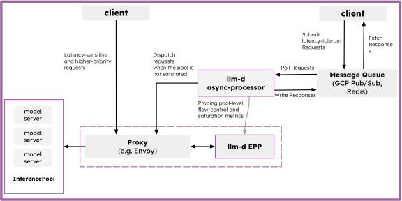

# Asynchronous Processing

The Asynchronous Processing path enables queue-based inference for latency-insensitive workloads or for filling "slack" capacity in your inference pool. It decouples request submission from execution, allowing clients to submit large volumes of work without maintaining a long-lived HTTP connection.

## Deploy

See the [asynchronous processing guide](../../guides/asynchronous-processing) for deployment instructions using Helm and supported queue implementations (Redis or GCP Pub/Sub).

## Architecture

The **Async Processor** is a lightweight dispatch agent that pulls requests from a message queue and forwards them to the llm-d Router.

### Dispatch Gating

To prevent background tasks from impacting real-time traffic, the Async Processor uses **Dispatch Gates**. These gates regulate the flow of requests based on system metrics:

* **Prometheus Gating**: Queries model server saturation (e.g., KV cache pressure, queue depth) and only dispatches when the system has available "slack" capacity.
* **Budget Gating**: Uses a pre-calculated budget to control throughput.
* **Priority & Deadlines**: Requests can be prioritized, and the processor enforces deadlines to ensure stale work is abandoned.

  <picture>
    <source media="(prefers-color-scheme: dark)">
    
  </picture>

### Resilience

* **Retries**: Transient failures (like rate limits or network issues) are automatically re-queued with exponential backoff.
* **Concurrency Control**: Configurable worker pools allow you to tune the degree of parallelism for background processing.

## Use Cases

* **Batch Inference**: Processing large datasets where completion time is measured in minutes or hours rather than milliseconds.
* **Slack Capacity Filling**: Using idle GPU cycles between real-time request spikes to perform background tasks like document summarization or embedding generation.
* **Offline Evaluation**: Running model evaluation pipelines without competing for production resources.

## Further Reading

See the [Async Processor Architecture](../architecture/advanced/batch/async-processor.md) for more details on the internal mechanics.
