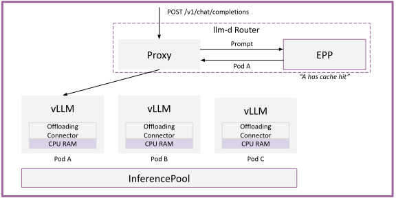
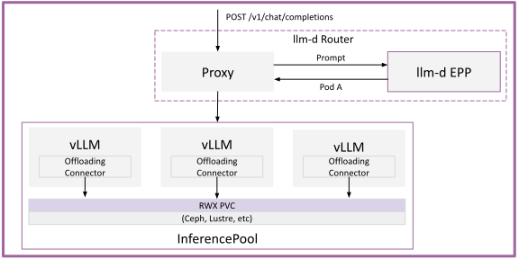

# Tiered Prefix Cache

Given the multi-turn nature of agentic workloads, prefix-cache re-use is a critical factor for high performance inference.

Model servers hold KV-caches in GPU RAM with an LRU eviction scheme. Once space runs out from other requests consuming the resources, the KV caches are evicted. Follow on requests then must recompute the prefill. However, rather than evicting KV caches from GPU memory, we can instead leverage other system resources such as CPU RAM, local NVMe drives, and network storage systems to hold the evicted KVs - pulling them back into GPU RAM on demand.

This increases the **KV-working set size**, growing the **receptive-field** (the amount of time KV caches are retained in the system).

- Without KV offloading:

```
   ┌───────┐           ┌─────────┐            ┌───────────┐
   │user A │           │ user A  │            │  user A   │
   │  req  │           │   KV    │            │ follow-on │
   │       │           │ evicted │            │    req    │
   └───┬───┘           └────┬────┘            └─────┬─────┘
       │                    │                       │
───────●────────────────────●───────────────────────●───────▶ time
       │                    │                       │
       t                   t+a                     t+b
       │                    │                       │
       │◄───── KV live ────►│ ✗                     │
                                                    ▼
                                              ┌────────────┐
                                              │ RECOMPUTE  │
                                              │  PREFILL   │
                                              └────────────┘
```

- With KV offloading:

```
   ┌───────┐           ┌─────────┐            ┌───────────┐
   │user A │           │ user A  │            │  user A   │
   │  req  │           │   KV    │            │ follow-on │
   │       │           │ offload │            │    req    │
   └───┬───┘           └────┬────┘            └─────┬─────┘
       │                    │                       │
───────●────────────────────●───────────────────────●───────▶ time
       │                    │                       │
       t                   t+a                     t+b
       │                    │                       │
       │◄─────────────── KV live ──────────────────►│ ✓
                                                    ▼
                                              ┌────────────┐
                                              │ PULL FROM  │
                                              │  CPU RAM   │
                                              └────────────┘
```

> [!IMPORTANT]
> CPU KV Cache offloading is low overhead and introduces ~no additional complexity. It can be enabled in almost all deployments. Storage offloading requires additional consideration.

## Storage Tiers

Offloaded KV caches can live on several tiers, ordered by read/write latency: frequently accessed caches stay closest to the accelerator, while larger or colder caches move to slower, higher-capacity tiers. We recommend always enabling the HBM and CPU RAM tiers, and adding a filesystem tier when the working set grows beyond HBM + CPU RAM.

- **CPU RAM** — Low operational overhead and typically far larger than accelerator HBM, making it the default offload target. Loading from CPU RAM is faster than recomputing prefill in most cases, and asynchronous offload adds little overhead.
- **Local disk** — Increases capacity further, but is slower than CPU RAM. Suitable when the workload tolerates the added latency and local capacity is sufficient.
- **Shared (remote) storage** — Provides capacity independent of deployment size, KV-cache sharing across replicas, fast scale-up (new replicas reuse existing cache), and persistence across restarts and failures. Latency and throughput depend on the underlying system, so evaluate that the transfer cost does not outweigh the savings. Mature enterprise systems (for example CephFS, GCP Lustre, IBM Storage Scale, AWS EFS) integrate through standard POSIX file access.
- **P2P sharing** — Inference replicas can share caches in HBM or CPU memory over a peer-to-peer network, extending sharing without additional storage resources. This adds operational overhead and potential contention with model-parallelism traffic; more guidance will follow in future releases.

## Deploy

See the [Tiered Prefix Cache guide](../../../guides/tiered-prefix-cache) for manifests and step-by-step deployment.

## Architecture

llm-d leverages the following architectures for offloading.

### CPU KV Cache Offloading

Each model server offloads to host CPU memory through its own native mechanism: vLLM uses the `OffloadingConnector`, and SGLang uses HiCache. Pods are configured with the connector enabled and increased CPU memory requests (e.g., 400 GB). Evicted KV-cache blocks move to host CPU memory instead of being discarded, extending the effective cache size with negligible overhead. The EPP maintains a global index of which blocks exist on which pods and tiers, adding a second `prefix-cache-scorer` plugin for CPU-tier blocks.

<p align="center">
  <picture>
    <source media="(prefers-color-scheme: dark)">
    
  </picture>
</p>

### Tiered Offloading to Filesystem

vLLM's `OffloadingConnector` natively supports a multi-tier hierarchy: HBM → CPU RAM → filesystem. Configured with `TieringOffloadingSpec` and a `secondary_tiers` entry of `type: fs`, evicted blocks spill from CPU RAM to a ReadWriteMany PVC mounted at `/mnt/files-storage` (backed by Lustre, CephFS, IBM Storage Scale, AWS EFS, or similar). I/O is asynchronous and uses GPU DMA, parallelized across read/write threads. Because the tier is shared, newly scaled pods read existing cache immediately and the cache persists across pod restarts; capacity is bounded only by the storage system.

The connector does not evict data from the shared tier -- capacity is managed by the storage system or by an external controller (a reference PVC evictor is available in the [llm-d-kv-cache repository](https://github.com/llm-d/llm-d-kv-cache)).

<p align="center">
  <picture>
    <source media="(prefers-color-scheme: dark)">
    
  </picture>
</p>

## Further Reading

- [Tiered Prefix Cache guide](../../../guides/tiered-prefix-cache) — manifests and step-by-step deployment.
- [vLLM KV offloading connector](https://vllm-project.github.io/2026/01/08/kv-offloading-connector.html) — design of the native `OffloadingConnector` and its tiering.
- [Multi-tier KV offloading RFC](https://github.com/vllm-project/vllm/issues/38260) — the upstream tiering design.
- [LMCache](https://lmcache.ai) and [SGLang HiCache](https://github.com/sgl-project/sglang) — alternative offloading implementations supported by this path.
