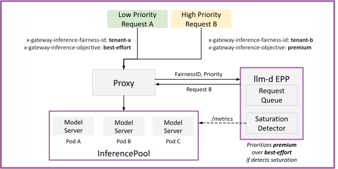

# Flow Control

Flow Control feature enables intelligent request queuing. Request queuing is useful for multiple reasons:

#### Multi-Tenant Deployments

In comparison to a single workload deployment, operators of multi-tenant workloads have additional considerations:

* Certain tenants are **higher-priority** than others (e.g. paid vs unpaid)
* Certain requests have **different-SLOs** than others (e.g. batch vs online)
* Certain tenants are more active than others - we want **fairness** between them

Flow control introduces intelligent queuing to the EPP, allowing operators to factor traffic dynamics into scheduling decisions. This capability addresses noisy-neighbor problems when mixing high- and low-priority traffic; furthermore, it ensures fairness among equal-priority tenants, preventing any single user from starving others of shared pool resources.

```
SINGLE TENANT                    MULTI-TENANT
  ─────────────                    ────────────

  [A] ──▶ [ GPUs ]               [A] ╲
                                 [B] ──▶ [ GPUs ]
  [B] ──▶ [ GPUs ]               [C] ╱

  [C] ──▶ [ GPUs ]

  One deployment per customer    One deployment, many customers
```

#### Single Workload "No-Regret" Scheduling

In addition to inter-tenant prioritization and fairness, flow control also enables "no-regret" scheduling by holding requests during peak saturation. By delaying the dispatch until load subsides—rather than committing a request to a specific server's queue where it becomes stuck—the EPP ensures requests land on the best available resource.

```
   ┌───┐  req  ┌──────────────────────────┐         ┌─────────────┐
   │ A │──────▶│   ┌──────────────────┐   │--------▶│ Server 1    │
   └───┘       │   │  Request Queue   │   │         │ [█████] FULL│
               │   │ ░░░░░░░░░░░░░░░  │   │         └─────────────┘
   ┌───┐       │   │  [R][R][R][R][R] │   │         ┌─────────────┐
   │ B │──────▶│   └──────────────────┘   │--------▶│ Server 2    │
   └───┘       │   ─ checks load          │         │ [█████] FULL│
               │   ─ queues reqs if       │         └─────────────┘
   ┌───┐       │     detects saturation   │         ┌─────────────┐
   │ C │──────▶│   ─ releases reqs when   │────────▶│ Server 3    │
   └───┘       │     capacity opens       │         │ [███░░] 60% │
               └──────────────────────────┘         └─────────────┘
```

## Deploy

For detailed step-by-step instructions on how to deploy and configure Flow Control, see the [Flow Control Architecture](../architecture/core/router/epp/flow-control.md).

## Architecture

<p align="center">
  <picture>
    <source media="(prefers-color-scheme: dark)">
    
  </picture>
</p>

Requests arrive to the proxy with headers expressing their tenant ID and traffic priority. EPP leverages these headers to assign a `FlowKey` (tuple of `FairnessID` and `Priority`) to each request and maintains separate in-memory queues for each `FlowKey`. Each `FlowKey` is assigned to a `PriorityBand` (for cases when multiple tenants have the same priority).

Then, in each scheduling cycle, the EPP traverses the queues in 3 tiers:

* Priority - the system always services highest `PriorityBand` first
* Fairness - within a `PriorityBand`, the **Fairness Policy** determines which flow (i.e. tenant) is dispatched next
* Ordering - within a flow (i.e. tenant), the **Ordering Policy** determines which request to serve (e.g. FCFC or SLO-aware)

In the background EPP monitors the model servers for saturation. If it detects saturation, requests are queued until saturation subsides.

> [!WARNING]
> **Trust Boundary**: In a production system, allowing end-users to self-assert their tenant ID or traffic priority (`premium-traffic`) is an abuse vector. In production, these headers should be stripped from external requests and injected by an upstream trusted API gateway, identity provider, or Envoy AuthZ filter based on the API key.

## Further Reading

See [Flow Control architecture](../architecture/core/router/epp/flow-control.md) for full details of the design.
