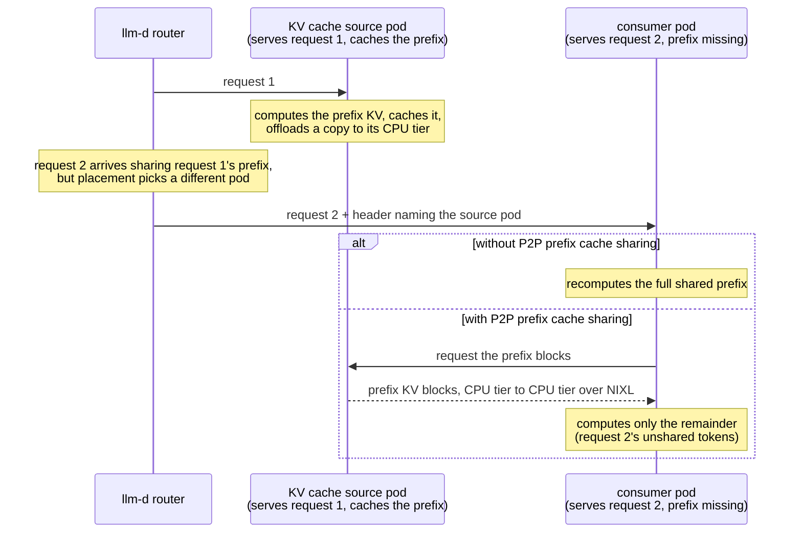

# Enable P2P Prefix Cache Sharing

Prefix caches are per-pod, but their content is often fleet-wide: shared
system prompts, common documents, session histories. Prefix-aware routing
sends each request to the pod that caches its prefix, but routing cannot
always follow the cache: a hot prefix's owner saturates, a working set
outgrows any single pod, a session is rebalanced. Those requests recompute
KV tensors that already exist on a peer.

P2P prefix cache sharing closes that gap: a model server pulls cached prefix KV blocks
from a peer's CPU offload tier instead of recomputing them. The transfer
is CPU-to-CPU over NIXL. The source pod's GPU is never touched, so serving
a pull costs the source no prefill capacity.

The pull fires when a request shares a prefix with an earlier one but is
scheduled to a different pod. Two requests share a prefix whenever they
begin with the same tokens: the next turn of a conversation, another
question against the same document, another session on a shared system
prompt. The first request's pod is the **KV cache source**: it computed
the prefix and holds a copy in its CPU tier. When the router schedules a
prefix-sharing request to a different pod, it names the source on the
request, and the scheduled pod - the **consumer** - pulls the prefix
instead of recomputing it:

> [!IMPORTANT]
> P2P prefix cache sharing builds on the [Tiered Prefix Cache](tiered-prefix-cache.md)
> path: peers serve pulls from their CPU offload tier. The tier must be
> enabled and sized larger than the per-pod GPU KV cache, block hashes
> must agree across pods (identical `--block-size` and `PYTHONHASHSEED`
> fleet-wide), and peers that serve each other must run matched tensor
> parallelism. The
> [guide's Best Practices](../../../guides/p2p-kv-cache-sharing/README.md#best-practices)
> covers each requirement, its sizing rule, and its failure mode.

## When It Pays

Recompute cost grows with prefix length; the pull is a near-flat
CPU-to-CPU copy. The two cross at a measurable prefix length. On
`openai/gpt-oss-120b` (H200) the pull wins at every measured length from
2K to 48K tokens; on Llama-3.1-8B the lines cross near 2K. The router
requests a pull only when a peer holds at least `minCachedTokenDelta`
more prefix tokens than the scheduled pod - set it from the measured
crossover.

Whether the pull helps also depends on the placement policy in front of
it:

- **Ownership is stable and uncontended**: prefix-aware routing alone is
  optimal. A local hit is free, and the pull stays quiet.
- **A hot prefix saturates its owner, or the working set outgrows the
  caches**: load-aware placement plus the pull serves the same content
  from the whole fleet. On the document Q&A benchmark this wins 1.5x
  better p99 TTFT and +35% throughput over prefix-affinity routing.
- **GPU KV capacity itself is the bottleneck**: cache co-location wins
  structurally. Concurrent same-prefix requests on one pod share one
  copy of the blocks; spreading pays a per-pod copy whether the prefix
  is pulled or recomputed.

The guide ships prefix affinity plus the pull as the general-purpose
default. Reach for load-aware placement plus the pull when many
concurrent sessions contend on their owner pods. Both regimes are
measured in the
[benchmark report](../../../guides/p2p-kv-cache-sharing/benchmark-results/gpt-oss-120b-h200.md).

## Deploy

See the [P2P KV Cache Sharing guide](../../../guides/p2p-kv-cache-sharing)
for manifests, verification gates, and step-by-step deployment.

## Architecture

1. **Model server pods publish KV-cache events** and run vLLM's
   `OffloadingConnector` with a CPU tier plus a P2P secondary tier: every
   pod both offloads computed KV to CPU and serves it to peers.
2. **The router builds the precise prefix index** from the KV events
   (the [Precise Prefix Cache Routing](precise-prefix-cache-routing.md)
   mechanism), so it knows which pods hold which prefix blocks.
3. **The `p2p-source-producer` compares** the best-cached peer against
   the pod scheduling picked; when the peer leads by at least
   `minCachedTokenDelta` tokens it sets the KV cache source header.
4. **The routing sidecar injects `kv_transfer_params.remote_kv_source`**
   from the header, and the engine pulls the prefix blocks from the
   peer's CPU tier over NIXL. Hits load as normal cache hits; ordinary
   misses recompute, so a request whose peer does not have the blocks
   degrades to baseline behavior instead of failing. Exception: a block
   left in `HIT_PENDING` has no deadline on current engines, so a
   request waiting on one can stay deferred until the client times out.

Under P/D disaggregation the pull applies to the prefill leg only: the
prefill worker computes the prompt KV and streams it to the decoder, so
that is the leg where recomputing a cached prefix is wasted work. The
decode leg already receives the full KV over NIXL and has nothing to
pull.

## Further Reading

- [P2P KV Cache Sharing guide](../../../guides/p2p-kv-cache-sharing) - manifests, verification gates, benchmarking.
- [Benchmark report: gpt-oss-120b on H200](../../../guides/p2p-kv-cache-sharing/benchmark-results/gpt-oss-120b-h200.md) - crossover, shared-prefix pools, document Q&A.
- [Tiered Prefix Cache](tiered-prefix-cache.md) - the offload tiers P2P serves from.
- [Precise Prefix Cache Routing](precise-prefix-cache-routing.md) - the index that selects the pull source.
