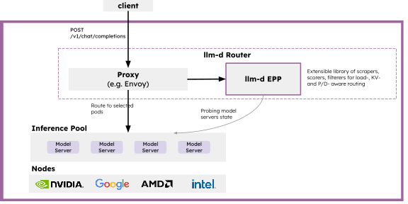

# Architecture

High-level guide to llm-d architecture. Start here, then dive into specific guides.

## Core

At it core, llm-d contains the following key layers:

- **Proxy** - Accepts requests from the users. It can be deployed as a Standalone Envoy Proxy or via Kuberentes Gateway API. The Proxy consults an EndPoint Picker (EPP) via the ext-proc protocol to determine which Model Server is optimal for a request.

- **EndPoint Picker (EPP)** - Selects which endpoint in an `InferencePool` is optimal for an specific request. The EPP is the "brains" of the scheduling decision that considers prefix-cache affinity, load signals, prioritziation, and (optionally) disaggregated serving.

- **InferencePool** - The InferencePool API defines a group of Model Server Pods dedicated to serving AI models. An InferencePool is conceptually similar to a Kuberentes Service. Each InferencePool has an associated EPP which selects the optimal pod for a request.

- **Model Server** - The Model Server (like vLLM or SGLang) executes the model on hardware accelerators. The Model Servers can be deployed through any deployment process, joining an `InferencePool` via Kuberentes labels and selectors.

For more details on the core components, see:
- [Proxy](core/proxy.md)
- [EPP](core/epp/README.md)
- [InferencePool](core/epp/inferencepool.md)
- [Model Server](core/epp/model-servers.md)

## Advanced Patterns

llm-d's core design can be extended with optional advanced patterns, which can be classified in the following types:

### Disaggregation

In disaggregated serving, a single inference request is split into multiple steps (e.g. Prefill phase and Decode phase). llm-d's EPP supports the concept of disaggregation and leverages the protocols of the Model Servers (vLLM and SGLang) to execute the multi-step inference process.

See [Disaggregation](advanced/disaggregation.md) for complete details on the disaggregated serving design.

### EPP "Consultants"

By default, the llm-d EPP leverages scorers that are used to selecting the optimal pod, leveraging:
- The Model Server's exported Prometheus metrics
- In-memory data structures (most notably, a prefix-cache tree that approximates the KV cache state of each pod)

In addition, the EPP can also query "consultant" components which can execute arbitrary scoring logic, enabling more sophisticated patterns. For more details on example "Consultants", see:
- [Latency Predictor](advanced/latency-predictor.md), which trains an XGBoost model online (using measured latency of previous requests) for scheduling decisions
- [KV-Cache Indexer](advanced/kv-indexer.md), which maintains a globally consistent view of each Model Server's KV cache state (which can outperform the EPP's approximated view for multi-modal and hybrid models) that can be used as a scorer (in place of the approximated one built into the EPP)

### Autoscaling

- TO BE UPDATED
