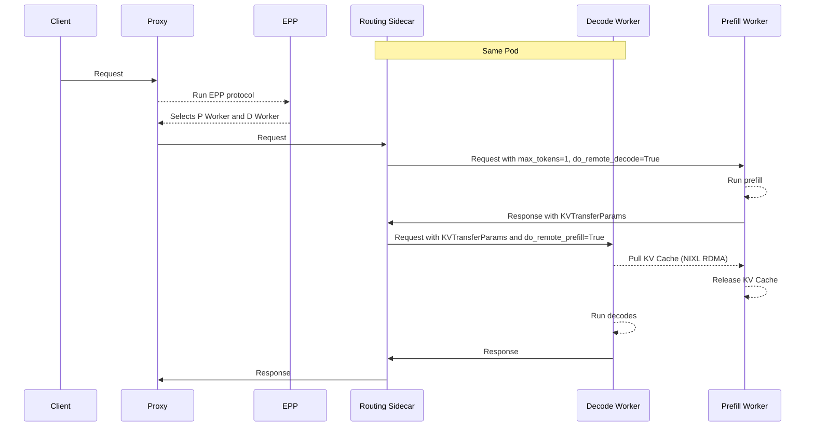
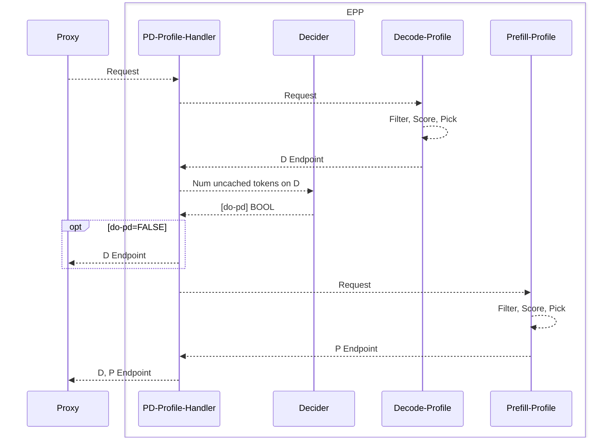

# Disaggregated Serving

## Functionality

Disaggregated serving separates the **prefill** and **decode** stages of LLM inference onto different model server instances, enabling:
* **Specialization of P and D** - LLM inference is composed of two distinct phases of inference - prefill (FLOPs-bound) and decode (memory bandwidth-bound). Disaggregation enables specialization, e.g. using a larger TP for the memory-bound decoding phase while a smaller TP for the computation-bound prefill phase.
* **Avoidance of Request Interference** - For long context requests, prefills can slow down processing of existing requests in the decode phase. Separating the prefill phase of these long requests into dedicated prefill instances allows the ongoing decoding requests to be efficiently processed without being blocked by these long prefills, improving quality-of-service.
* **Compatibility with DP/EP** - For DP/EP deployments of Mixture of Experts models, disaggregated serving is essential to avoid pipeline bubbles and leveraging the specialized "MaskedGEMM" format for decode.

An implementation of disaggregated serving requires two key components:
* **Request Flow Orchestration** - select and route the requests to the correct prefill and decode pods
* **Efficient KV Transfer** - transfer the KV cache from the P instance to the D instance, typically over RDMA

> [!NOTE]
> Disaggregated Serving requires high performance (RDMA) interconnects between nodes for efficient KV transfer. Without RDMA, NIXL falls back to TCP for transfer which is not efficient and should only be used for testing and development.

## Request Flow Orchestration

llm-d's EPP supports the concept of P/D disaggregation by selecting a prefill and decode worker pair, with the following request flow:



Next we will discuss the design of the EPP and Routing Sidecar for disaggregated serving.

### EPP

The llm-d EPP supports disaggregation via the `pd-profile-handler`.

> [!NOTE]
> Rather than hardcoding a single scheduling algorithm, the EPP delegates execution to one or more `Profile Handlers`, each of which represents a complete scheduling strategy. They can be thought of as "the dispatcher", which maps each incoming inference request to the right scheduling strategy before the scorers and pickers do their work of selecting the actual endpoint. By default, llm-d uses the `single-profile-handler` for simple aggregated serving.

When configured with `pd-profile-handler`, the EPP processes requests in the following steps:
- `proxy` forwards request metadata to the EPP.
- `pd-profile-handler` runs the `decode-profile`, which executes the `filter`, `score`, `pick` scheduler profile to select D endpoint.
- `pd-profile-handler` consults the `decider` — given how much of the prompt is cached on D, should this request run disagg?
- If `no`: `pd-profile-handler` returns only the D endpoint to the `proxy`
- If `yes` (large uncached suffix), `pd-profile-handler` also runs the `prefill-profile`, which executes the `filter`, `score`, `pick` scheduler profile to select the P endpoint and returns both the P and D endpoints to the proxy.


The flow looks like this:



In this way, disaggregated serving functionality composes with the existing set of scheduling functionality, enabling use of the existing set of scorers for prefix and load aware routing in the disaggregated setting.

Note that both the prefill and decode endpoints are part of one `InferencePool`. The `decode-profile` and `prefill-profile` are responsible for selecting only D workers or P workers in the `filter` step. llm-d uses the label `llm-d.ai/role` with the following values to filter:
* `prefill` → prefill-only pods
* `decode` → decode-capable pods
* `prefill-decode` → pods capable of both prefill and decode 

> [!NOTE]
> It is possible to override the default labels by configuring the `EndpointPickerConfig` to use the generic by-label filter plugin instead of the `prefill-filter` / `decode-filter`. TODO: provide an example of this.

### Routing Proxy Sidecar

The Routing Proxy is deployed as a sidecar in each decode pod, with a two-fold role:
- Facilitate the multi-step inference request
- Mutate the requests to follow each model server's KV transfer protocol

#### Request Flow

When a request arrives, the sidecar inspects a routing header set by the proxy:

| Header | Purpose |
|---|---|
| `x-prefiller-host-port` | One or more prefill pod addresses (comma-separated or multi-value) |

Based on which headers are present, the sidecar selects one of two execution paths:

1. **Prefiller → Decoder (P/D)** — The standard disaggregated path. The request is sent to a remote prefiller, KV transfer metadata is collected, and the enriched request is forwarded to the local decoder.
2. **Decoder-only** — No routing headers present; the request is proxied directly to the local model server instance.

All non-completion routes (`GET /health`, and any other path) pass through to the decoder unchanged.

#### KV Transfer Protocol

vLLM and SGLang use slightly different protocols for KV Transfer between the P and D instance, inserting additional parameters in the body of the requests to facilitate the transfer:
- **vLLM** (`nixlv2`, default) — A two-phase sequential protocol. The sidecar sends a prefill request with `kv_transfer_params` containing remote-decode metadata, and `max_tokens=1` to suppress output. It captures the KV transfer parameters from the prefiller's response and injects them into the decode request before forwarding it to the local decoder. If the prefiller returns a server error, the sidecar falls back to decoder-only mode (client errors are not retried).
- **SGLang** (`sglang`) — Uses a concurrent prefill/decode model. Instead of waiting for prefill to complete, the sidecar injects bootstrap coordination parameters (`bootstrap_host`, `bootstrap_port`, `bootstrap_room`) into both requests, fires the prefill asynchronously in a goroutine (with `context.WithoutCancel` to prevent premature cancellation), and immediately sends the decode request synchronously. The decoder and prefiller coordinate KV transfer out-of-band via the bootstrap room.

## Efficient KV Transfer 

In addition to the **Request Flow Orchestation** which coordinates the metadata and RPC calls to each instance, efficient **KV Transfer** (which moves the KVs from the P instance to the D instance) is critical to a high performance disaggregated deployment.

vLLM and SGLang both support multiple KV transfer engines - in llm-d we currently focus on NIXL.

### NIXL Integration

[NVIDIA Inference Transfer Library (NIXL)](https://github.com/ai-dynamo/nixl) accelerates point to point communications in AI inference frameworks.

NIXL provides a standardized API for transfering memory between remote instances offering multiple backends (e.g. UCX, UCCL, libfabric) each of which support multiple underlying transports (NVLink, RoCE, IB, EFA, etc).

|             | IB | RoCE | TCP-X | EFA |
|-------------|:--:|:----:|:-----:|:---:|
| **UCX**     | ✓  |  ✓   |       |     |
| **UCCL**    | ✓  |  ✓   |   ✓   |  ✓  |
| **libfabric**|   |      |       |  ✓  |

> [!NOTE]
> UCX also supports transfer via TCP and NVLINK. TCP is extremely slow and is targeted for local development. NVLINK transfer is used for local development and cannot be used in Kuberentes deployments as it cannot cross pod boundaries.

### Direct KV Cache Transfer

vLLM and SGLang both reserve RAM ahead of time for KV cache memory. NIXL directly registers this KV cache memory and transfers the data directly between the KV caches. This avoids the need for additional buffers and memory management. With GPUDirect RDMA enabled (GPU memory registered with NIC), the transfers bypass the CPU, enabling high throughput, low latency transfers.

```
┌─────────────────────────────┐              ┌─────────────────────────────┐
│          NODE 1             │              │          NODE 2             │
│                             │              │                             │
│  ┌───────────────────────┐  │              │  ┌───────────────────────┐  │
│  │     Prefill Pod       │  │              │  │     Decode Pod        │  │
│  │                       │  │              │  │                       │  │
│  │  ┌─────────────────┐  │  │              │  │  ┌─────────────────┐  │  │
│  │  │ KV Cache (VRAM) │  │  │              │  │  │ KV Cache (VRAM) │  │  │
│  │  └────────┬────────┘  │  │              │  │  └────────┬────────┘  │  │
│  │           │           │  │              │  │           │           │  │
│  └───────────┼───────────┘  │              │  └───────────┼───────────┘  │
│              │              │              │              │              │
│              ▼              │              │              ▼              │
│  ┌───────────────────────┐  │   Network    │  ┌───────────────────────┐  │
│  │         NIC           │  │              │  │         NIC           │  │
│  │  InfiniBand / RoCE    │──┼──────────────┼──│  InfiniBand / RoCE    │  │
│  └───────────────────────┘  │              │  └───────────────────────┘  │
│                             │              │                             │
└─────────────────────────────┘              └─────────────────────────────┘
```
