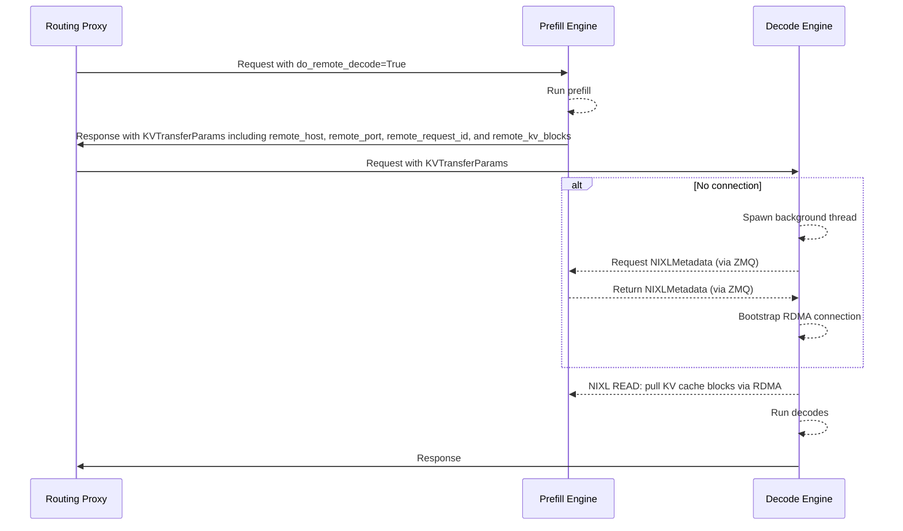
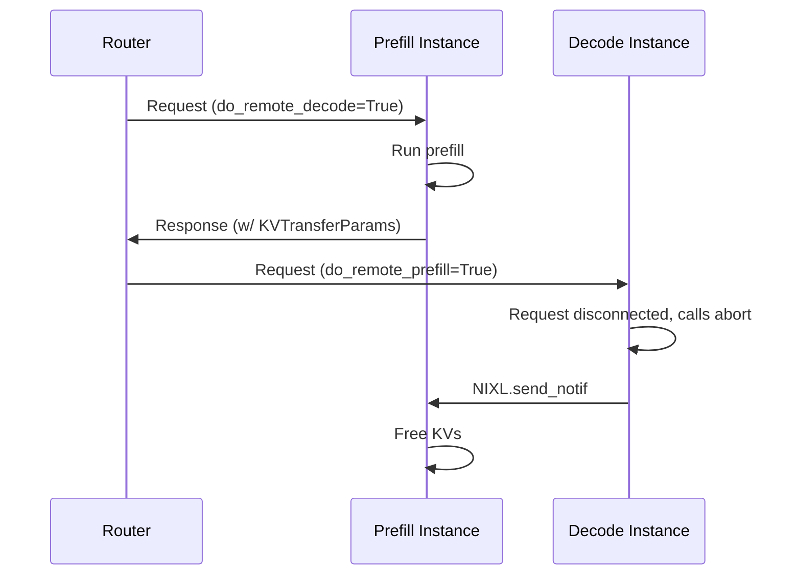
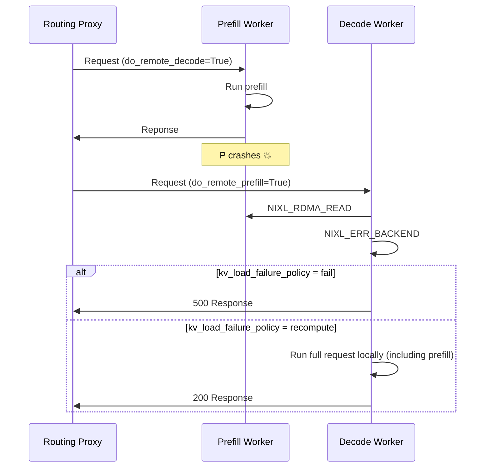
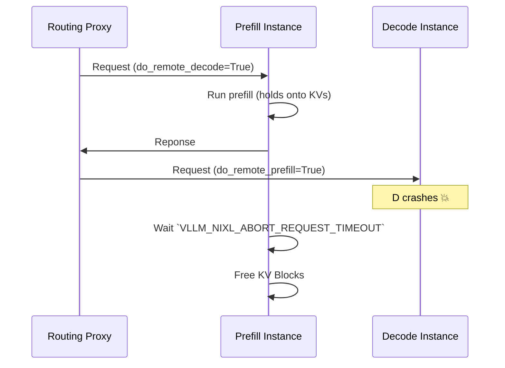

# Disaggregated Serving: Operations (vLLM)

While disaggregated serving can offer superior performance, it introduces additional operational complexity, including:
- [Dynamic Connections](#dynamic-connections) - how to add or remove P and D instances on the fly when instances require point-to-point RDMA connections
- [Request Cancellation](#request-cancellation) - how to free KV caches from the instances when requests stop in a distributed setting
- [Fault Tolerance](#fault-tolerance) - how to ensure crashes do not create cascading failures and that resources are cleaned up 
- [Rollouts](#rollouts) - how to roll out changes to the service, such as the version of the vLLM image

This page documents architectural considerations that impact these common operations flows.

## Dynamic Connections

In production enviornments, it is common for model server replicas to be created and destroyed during the running of the service. In a disaggregated configuration, the ability to dynamically add/remove replicas from the deployment is complicated by the need to establish/destroy connections between P and D workers on the fly.

vLLM supports this functionality via NIXL's APIs, which enable dynamically adding and removing connections.

### Scale-Up

To create new connections, vLLM executes a "NIXL Handshake" between the D and P instances to setup the RDMA connection. This is a relatively expensive operation (~5s) that is done once per pair, with all subsequent requests leveraging the existing connection. llm-d uses a "dynamic lazy" roll-out strategy, avoiding the need for a centralized bootstrap server maintaining global state.

It works like this:



- Prefill instances run a background server thread to handle requests for `NIXLMetadata`. When the P instances finishes processing, it constructs the `KVTransferParams`, which includes (among other things) `remote_host=VLLM_SIDE_CHANNEL_HOST` (the pod IP) and `remote_port=VLLM_SIDE_CHANNEL_PORT` in the response body.
- Decode instances receive the request with the `KVTransferParams`; if there is not yet a connection to the remote P worker, it runs a background thread to fetch the `NIXLMetadata` and create the RDMA connection. This action does not block core engine execution, enabling other requests to proceed as usually.

#### Discovery

Since model server instances are added to an `InferencePool` via standard Kuberentes selectors and labels, new prefill and decode instances discovered automatically when their pods status becomes `status: Running`.

As a result, new replicas can be added to a running disaggregated deployment without restarts and without need to coordinate within any specialized service discovery plane.

### Scale-Down

In Kuberentes, there is a well-defined [pod termination process](https://kubernetes.io/docs/concepts/workloads/pods/pod-lifecycle/#pod-termination):
* **Termination Triggered**: The pod's state is changed to **Terminating**.
* **`InferencePool` Update**: The pod is removed from the list of endpoints for associated the `InferencePool`, preventing new traffic from being routed to it. (note: for standard Kuberentes objects, this is equiavlent to removal from a Service)
* **PreStop Hook**: If defined, the preStop hook executes.
* **SIGTERM Signal**: Kubernetes sends a SIGTERM signal to the main process in each container.
* **Termination Grace Period**: The pod is given a set amount of time (default is 30 seconds) to shut down gracefully. If it does not terminate by the end of this period, a SIGKILL is sent to force termination.

For **new requests**, instances are automatically removed from the `InferencePool` so no new traffic is routed to terminating pods.

For **running requests**, we can configure how vLLM handles the `SIGTERM`:
* By default, vLLM immediately `aborts` exising requests and terminates. This fails the running requests with an error status code.
* vLLM can be configured with a `--shutdown-timeout N`. When this is set, vLLM catches the `SIGTERM` and drains the currently running requests for `N` seconds. After this timeout, it `aborts` any running requests still in flight, returning an error code.

#### Scaling Down Decode Replicas

Since prefill instances hold the KVs until the decode instances pull them, it is important to ensure that KVs are released on the prefill instance when decode instances are scaled down.

In vLLM, regardless of whether `--shutdown-timeout` is set, requests are `aborted` during the shutdown process. As part of the `abort` process, decode instances with not-yet-started KV transfers send a NIXL notification to the remote prefill instances to free the blocks. Thus, scaling down decode replicas always free requests on the P instance.

#### Scaling Down Prefill Replicas

When scaling down prefill replicas, decode instances may attempt to pull KV blocks from terminated remote prefill instances.

> [!WARNING]
> At current, regardless of `--shutdown-timeout`, there is no way to delay shutdown of a prefill instance until after all blocks have been retrieved. This functionality is work in progress in vLLM.

As a result, prefill scale down will cause KV load failure for in-progress requests on decode instances. To avoid error codes for failed KV transfers, the decode instances can be configured with `kv_load_failure_policy=recompute` to recompute the prefill on the decode instance.

## Request Cancellation

Given the compute intensity and duration of inference requests, model servers like vLLM support "Request Cancellation", where currently in-progress requests are freed when the client disconnects.

In a disaggregation setup, this feature is more complicated, because the resources associated with an inference request are spread across multiple servers (as the P instances holds onto the KV caches until they have been retrieved by the D instance). As a result, if the request is canceled while it is still "in-flight" on the D instance but before the KV transfer occurs, we need to ensure that the resources on the P instance are properly cleaned up.

llm-d accomplishes this functionality by building on top of vLLM's existing request cancellation infrastructure. When requests are disconnected in vLLM, it triggers the `abort` codepath, which cleans up running resources. When request with `do_remote_prefill=True` are aborted, vLLM sends a NIXL notify message, instructing the remote prefill instance to free the KV cache for the cancelled request.



> [!WARNING]
> There is a small window in which request cancellation will not trigger KV freeing on the P instance. If the request is disconnected after it is completed on the P worker but before it reaches the D worker's scheduler (for example, if it disconnects while the request is inside Routing Proxy), the D instance never knows about the request and therefore is unable to free the remote blocks on the P worker. As a result, the KV blocks are stranded on the P instance until the timeout `VLLM_NIXL_ABORT_REQUEST_TIMEOUT`, which defaults to 480s. We are currently working on a lease-extension strategy that will dramatically shorten the timeout window.

## Fault Tolerance

In llm-d's disaggregated serving design, all D instances are connected to all P instances. This creates a critical operational risk - crashes in workers have the potential for cascading failures if the system is not tolerant of failures.

### Prefill Instance Failure

Prefill instance crashes are a critical failure mode, since D instances will attempt to pull KVs from no longer running P instances without performing any liveness checks. Since every D worker is connected to every P worker, it is critical to handle such an error on the D worker.

vLLM handles Prefill instance failure by building on top of NIXL's error handling functionality. When a READ is attempted and fails, NIXL returns an error code such as `NIXL_ERR_BACKEND`. vLLM catches this error and handles it according to the [`kv_load_failure_policy`](https://docs.vllm.ai/en/stable/features/nixl_connector_usage/?h=nixl#kv-load-failure-policy):
- **fail (default, recommended)**: Immediately fail the request with an error when KV load fails. This prevents performance degradation by avoiding recomputation of prefill work on the decode instance.
- **recompute**: Recompute failed blocks locally on the decode instance. This may cause performance jitter on decode instances as the scheduled prefill will delay and interfere with other decodes. Furthermore, decode instances configured with low-latency optimizations (such as DeepEP LL for Wide EP deployments) may suffer significant slowdowns.



Failed Prefill Worker pods are automatically moved to `status: Terminated` state as part of the standard Pod lifecycle. Since llm-d leverages the Kubernetes API Server for service discovery, no additional traffic will be routed to the failed worker until the pod has been restarted and returns to the `status: Running` state.

In this way, `llm-d` isolates Prefill instance failure.

### Decode Instance Failure

While D instance failures are unlikely to result in P instance crashes (since P instance never initiates RDMA operations), there is a challenge around ensuring that KV cache memory on the P instance is not stranded (since the P instance holds onto the KV cache until it has been explicitly pulled from the D instance).

vLLM avoids permanent KV cache stranding by introducing a timeout on the P instance side `VLLM_NIXL_ABORT_REQUEST_TIMEOUT` (default `480s`). After `VLLM_NIXL_ABORT_REQUEST_TIMEOUT` elapses, the P instance will free the KV caches from any requests that have not been READ yet, eventually cleaning up the resources.




> [!WARNING]
> Robustness against Decode instance failure is currently a weakness of the design, since the `VLLM_NIXL_ABORT_REQUEST_TIMEOUT` defaults to a long timeout (`480s` to avoid early-free when D instancess are backed up). We recommend that production users consider reducing this timeout, especially if they can ensure Decode instances do not have significant request queuing. We are currently implementing a "lease-extension" system, which will dramatically reduce the timeout with no tradeoff.

## Rollouts

In disaggregated serving, rolling out a new version of the model server (e.g. a new version of vLLM or a new configuration) requires care, since prefill-decode instance pairs communicate with eachother to execute the KV transfer operation. As a motivating example, vLLM has multiple attention kernel implementations, each of which can have slightly different KV cache layouts - since NIXL pulls the KVs directly from the GPU KV cache memory of the remote instance, we need to ensure these are matching.

By default, vLLM checks for [compatibility between instances](https://github.com/vllm-project/vllm/pull/29503) during the NIXL handshake, failing the request if scheduled to incompatible pods. There is an escape hatch to disable compatibility checking:

```bash
--kv-transfer-config '{"kv_connector_extra_config": {"enforce_handshake_compat": false}}'
```

> [!IMPORTANT]
> The llm-d EPP currently assumes all P and D instances within an `InferencePool` are compatible and will therefore schedule requests to any arbitrary pair of P and D instances. As a result, it is currently recommended to create a new `InferencePool` for upgrading model servers. When deploying with a `Gateway`, traffic can be gradually shifted to the new `InferencePool` by modifying the `HTTPRoute`.
