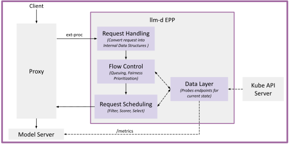

# Endpoint Picker (EPP)

## Functionality

The EPP is the "brains" of an llm-d deployment. It is focused on two key objectives:

- **Intelligent scheduling** - selecting which **model server pod** within an InferencePool should process each inference request, using the internal state of model server pods (KV-cache utilization, prefix cache locality, request queue depth, and active request counts)

- **Fairness and priortiziaton** - selecting which **inference requests** should run at any given time, enabling consolidation of multiple workloads with varying priorities onto a single set of Model Servers

The EPP is an extensible component that integrates with the proxy layer via Envoy's [External Processing (ext-proc)](https://www.envoyproxy.io/docs/envoy/latest/configuration/http/http_filters/ext_proc_filter) protocol.

When a request arrives at the proxy, the proxy calls the EPP to select a backend endpoint, and the EPP returns the optimal pod address according to the [Endpoint Picking Protocol](https://github.com/kubernetes-sigs/gateway-api-inference-extension/tree/main/docs/proposals/004-endpoint-picker-protocol).

## Design

### Request Flow

The following diagram shows the end-to-end lifecycle of a request as it flows through the EPP plugin pipeline:

The steps are:

1. **Request arrival** -- An inference request arrives at the proxy (Gateway).
2. **External processing** -- The proxy invokes the EPP via the ext-proc protocol, passing the request headers and body to the EPP.
3. **Request handling** -- Parses the request (from e.g. OpenAI format, vllm gRPC) into the internal request data structure.
3. **Flow control** -- If enabled, queues requests and prioritizes and ensures fairness across different tenants within a priority, and holding requests when the pool is "saturated".
4. **Scheduling** -- Selecting the optimal endpoint from the available InferencePool, which involves evaluating each request against a configured set of scheduling plugins, such as filters and scorers.
7. **Request Proxying** -- The EPP returns the address of the selected endpoint to the proxy, which then forwards the request to the corresponding model server endpoint.

Asynchronously, the **Data layer** watches the Kubernetes API server for updates to relevant objects like InferencePools and Pods for endpoint discovery. It is also responsible for model servers metrics probing, and maintaining an internal state—such as a prefix cache tree—to inform the request processing components, Flow Control and Scheduling.

### Layers

The EPP is modular and pluggible, consisting of the following layers:

#### Ext-Proc Server

The Ext-Proc Server protocol is very well defined & specific, deviation could cause the EPP to become unusable or unstable. Extension is ill-advised. The Ext-Proc is simply the standard interface by which the Proxy talks to the EPP.

#### Data Layer (Extensible)

The **Data Layer** operates asynchronously, consuming and storing data from a variety of sources:
- Kube API Server about which pods are active in the InferencePool
- Model Servers about the current internal state (running requests, kv cache utilization)
- In-memory data structures, such as prefix cache trees for prefix-aware routing
- "Consultant" sidecars like the latency predictor, the kv-indexer or tokenizer for advanced scheduling

Other modules in the EPP consult the **Data Layer** during request processing.

#### Request Handler (Extensible)

The **Request Handler** is the first step of the request flow in the EPP. The key responsibility is to convert the user's request into the internal EPP data structure via the Parser plugin. The EPP provides out-of-the-box Parsers for common formats like the [OpenAI HTTP](https://developers.openai.com/api/reference/overview) and [vLLM gRPC](https://docs.vllm.ai/en/latest/api/vllm/entrypoints/grpc_server/).

In addition, users can write a custom Parser for their own protocol. The rest of the functionality in EPP is agnostic to the original request protocol, enabling easy adaptation of the EPP to new request formats.

See [Request Handling](request-handling.md) for more details on the design.

#### Flow Control (Extensible)

Flow control's primary purpose is to manage the admission, queuing, and dispatching of requests to prevent overloading backend model servers while ensuring fairness and priority. Specifically:

- Admission Control & Throttling: Rather than allowing the inference pool to be overwhelmed, it intercepts incoming requests and holds them in an in-memory queue if saturation is reached. This is configurable via `SaturationDetector` plugins (such as the Concurrency plugin, which is based on active in-flight requests accounting per endpoint) 

- Priority-Based Queuing: It categorizes traffic into "Priority Bands." Real-time, latency-sensitive tasks (like chat) are prioritized over batch background tasks (like summarization). 

- Resource Fairness: It prevents "noisy neighbor" scenarios by isolating traffic streams, ensuring a single flow (e.g., a user or application) cannot monopolize all available inference slots. Fairness is configurable via two pluggable policies: FairnessPolicy governs the distribution of dispatch opportunities among competing Flows within the same priority band (e.g., Round Robin), and OrderingPolicy plugins customizes ordering of requests within a flow (e.g., FIFO, SLO-based).

- Dynamic Dispatching: It monitors saturation to send requests to model servers only when they are ready to process them.

See [Flow Control](flow-control.md) for more details on the design.

#### Scheduler (Extensible)

The scheduler acts as the core decision-making engine for intelligent request scheduling. It operates through a modular Filter → Score → Pick plugins pipeline orchestrated by a ProfileHandler plugin, allowing it to evaluate and select the most suitable model server endpoints for each incoming request. 

By leveraging custom plugins at each stage—filtering out unavailable endpoints, scoring them based on metrics like "least-loaded" or "affinity," and picking final candidates—the scheduler ensures high performance and efficient resource distribution across inference pools.

See [Scheduling](scheduling.md) for more details on the design.
