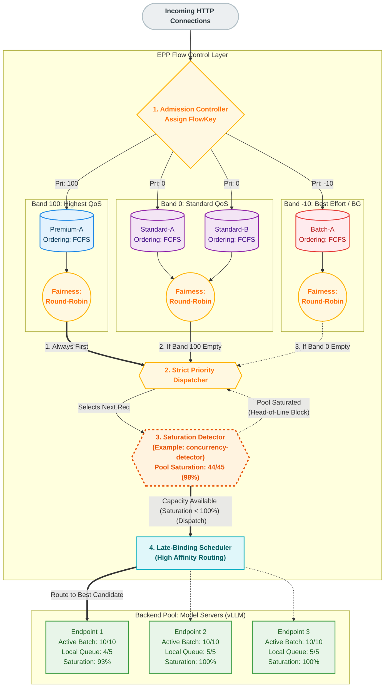
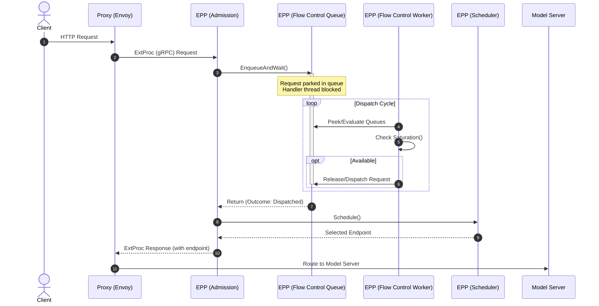
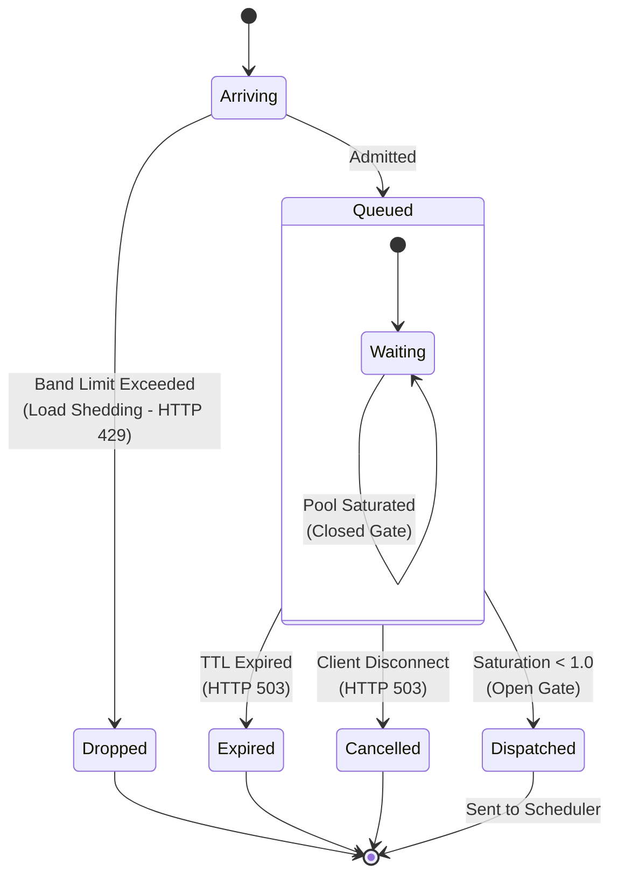
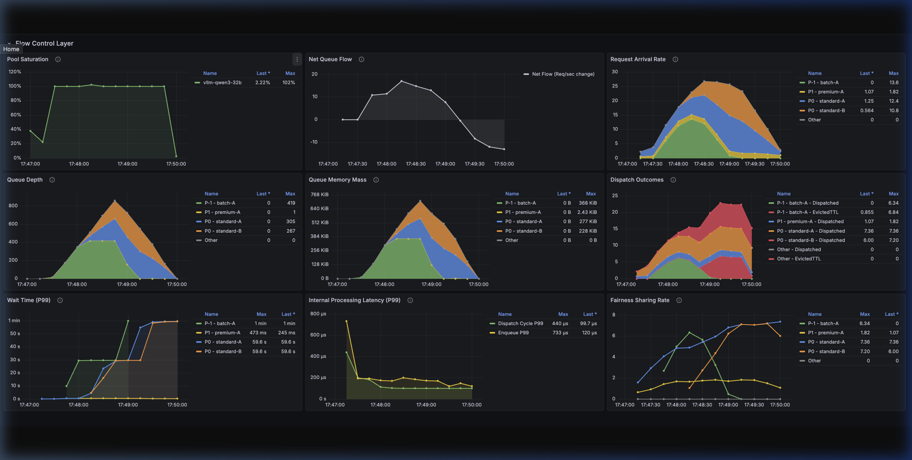

# EPP Flow Control

The Flow Control layer within the Endpoint Picker (EPP) is a critical mechanism for pool defense and multi-tenancy. It protects the pool of model servers from overload by shifting intelligent queuing to the gateway, enforcing strict priority and tenant-aware fairness.

> [!IMPORTANT]
> EPP Flow Control is currently behind the `flowControl` feature gate. You must explicitly enable it in your [EndpointPickerConfig](configuration.md) to use these capabilities.

### The LLM Queuing Problem

Traditional API gateways rate-limit by Requests Per Second (RPS), assuming every request consumes roughly the same resources. In LLM serving, this approach is ill-suited. Resource consumption is driven by long input contexts and the unpredictable **autoregressive decode loop** (output tokens). A single request can consume orders of magnitude more compute and memory than another, making serving capacity highly variable per request. Static RPS limits either starve the pool by being too conservative or cause overload by being too aggressive.

Without Flow Control, the following issues arise:

*   **The Noisy Neighbor**: A single tenant sending massive prompts can monopolize an endpoint's KV cache and queue, starving others.
*   **Scheduling Regret**: Once a request is dispatched to a model server's local queue, the EPP cannot move it. Premature routing locks requests into suboptimal candidates, preventing them from utilizing a better endpoint that may free up soon.
*   **Priority Inversion**: Model servers batch based on arrival or sequence length, not business priority. Critical real-time requests can get stuck behind large offline batches.
*   **Resource Asymmetry**: A single request with a massive context can consume more resources than hundreds of short requests.

By shifting queuing to the EPP, we can govern physical capacity (KV cache, queue saturation) rather than just raw request rates or connection counts.

### Architecture Overview

The Flow Control layer intercepts requests at the EPP and holds them in centralized, policy-aware queues when the backend pool is saturated. This prevents requests from piling up in isolated endpoint queues where they cannot be dynamically re-routed or prioritized.

#### Queuing Topology & The 3-Tier Dispatch

To understand how policy plugins act, it helps to visualize the queuing topology as a grid defined by two dimensions: **Priority** and **Flow (Fairness ID)**.

1.  **Flow Identification**: Every request is assigned a `FlowKey` — a tuple of `(FairnessID, Priority)`.
    *   `FairnessID` is extracted from the `x-gateway-inference-fairness-id` header (e.g., tenant ID).
    *   `Priority` is derived from the `InferenceObjective`.
2.  **Separate Queues**: Each unique `FlowKey` maps to its own in-memory queue.

A **Priority Band** is a logical grouping of all queues (flows) that share the same external priority value. The system services bands in strict order, but cycles through the queues *within* a band according to the Fairness Policy.

The system selects the next request to dispatch by traversing these queues in three strict tiers:

*   **Tier 1: Priority (Band Selection)**: The system always services the highest-priority band first. This is hardcoded and not pluggable. It yields all queues belonging to that priority level.
*   **Tier 2: Fairness (Flow Selection)**: Within that priority band, the **Fairness Policy** plugin determines which specific flow (tenant) gets the next turn.
*   **Tier 3: Ordering (Item Selection)**: Finally, within that selected flow's queue, the **Ordering Policy** plugin determines which individual request to serve.

#### Client Integration: Tagging Traffic

To place requests into the correct queues, clients must attach specific headers to the incoming HTTP request.

Here is an example of how to target a specific `InferenceObjective` and ensure fair resource sharing among tenants:

```bash
curl -X POST http://${IP}:${PORT}/v1/completions \
  -H 'Content-Type: application/json' \
  -H 'x-gateway-inference-fairness-id: tenant-a' \
  -H 'x-gateway-inference-objective: premium-traffic' \
  -d '{
    "model": "default-model",
    "prompt": "Say hello"
  }'
```

> [!WARNING]
> **Trust Boundary**: In a production system, allowing end-users to self-assert their tenant ID or traffic priority (`premium-traffic`) is an abuse vector. In production, these headers should be stripped from external requests and injected by an upstream trusted API gateway, identity provider, or Envoy AuthZ filter based on the API key.

> [!TIP]
> **Fallbacks**:
> * If the **Fairness ID** header is missing, the request falls back to a single global bucket for that priority level.
> * If the **Inference Objective** header is missing, or references an objective without a priority set, the request defaults to **Priority `0`**.


#### Two Levels of Priority

The system distinguishes between two levels of priority:

1.  **External Priority (Traffic Classes)**: Coarse-grained prioritization across tenants and workloads (e.g., Premium vs. Best-Effort). This is governed by `InferenceObjective` and acts at **Tier 1**. Negative values are allowed and designate requests as "sheddable". Unlike legacy admission mode (which immediately drops negative priority requests upon saturation), Flow Control admits them into queues but subjects them to operator-configured band capacity limits, enabling controlled load shedding by strictly bounding lower-priority queues.
2.  **Internal Priority (Request Ordering)**: Fine-grained prioritization of requests *within a single flow* (e.g., Earliest Deadline First). This is governed by the `OrderingPolicy` and acts at **Tier 3**.

To visualize how these priority tiers and flows interact, the following diagram represents the centralized queuing topology in the EPP:

---



### Example Configuration

To ground the diagram above, here are the example manifests that would produce this behavior.

#### 1. InferenceObjectives (Traffic Classes)

These resources define the priority of the traffic. Note the use of a negative priority for best-effort workloads.

```yaml
apiVersion: inference.networking.x-k8s.io/v1alpha2
kind: InferenceObjective
metadata:
  name: premium-traffic
spec:
  priority: 100
  poolRef:
    name: default-pool
---
apiVersion: inference.networking.x-k8s.io/v1alpha2
kind: InferenceObjective
metadata:
  name: standard-traffic
spec:
  priority: 0
  poolRef:
    name: default-pool
---
apiVersion: inference.networking.x-k8s.io/v1alpha2
kind: InferenceObjective
metadata:
  name: best-effort-traffic
spec:
  priority: -10
  poolRef:
    name: default-pool
```

#### 2. EPP Configuration

This snippet from the `EndpointPickerConfig` shows how the Flow Control layer is configured to handle these bands.

```yaml
apiVersion: inference.networking.x-k8s.io/v1alpha1
kind: EndpointPickerConfig
metadata:
  name: default-config
featureGates:
- flowControl
plugins:
- type: round-robin-fairness-policy
- type: fcfs-ordering-policy
- type: concurrency-detector
  parameters:
    maxConcurrency: 15
    concurrencyMode: requests
    headroom: 0.0
# ... other plugins ...

saturationDetector:
  pluginRef: concurrency-detector

flowControl:
  maxBytes: "10Gi"
  maxRequests: "1k"
  defaultRequestTTL: "60s"
  priorityBands:
  - priority: 100
    maxRequests: "500"
    fairnessPolicyRef: round-robin-fairness-policy
    orderingPolicyRef: fcfs-ordering-policy
  - priority: 0
    maxRequests: "200"
    fairnessPolicyRef: round-robin-fairness-policy
    orderingPolicyRef: fcfs-ordering-policy
  - priority: -10
    maxRequests: "50"
    fairnessPolicyRef: round-robin-fairness-policy
    orderingPolicyRef: fcfs-ordering-policy

# ... other sections (schedulingProfiles, dataLayer, etc.) ...
```

Understanding the execution of this configuration requires examining the core components that implement the logic and enforce resource guardrails.

### Core Components

*   **Flow Controller**: The main orchestrator managing the dispatch loop and queue evaluation.
*   **Saturation Detector**: Queries the aggregate health of the pool (e.g., KV cache utilization, queue depth) to determine if the gate should be open or closed.
*   **Queues**: The in-memory storage structures organized by `FlowKey` (implemented as lists or heaps depending on the Ordering Policy).

### Resource Guardrails & Memory Isolation

To prevent the EPP itself from resource exhaustion when queues grow, Flow Control enforces configurable capacity limits. See the [Global Fields section in the Configuration Guide](configuration.md#global-fields) for details on setting `maxBytes` and `maxRequests`:

*   **Global Limits**: Configured via `maxBytes` (payload size) and `maxRequests` (count) across all priority bands. These limits support both plain integers and Kubernetes Quantity format (e.g., `10Gi`, `1k`). If a new request would exceed these limits, it is immediately rejected with an HTTP 429 (Too Many Requests).
*   **Per-Band Limits**: Each priority band can have its own `maxBytes` and `maxRequests` limits. This provides **memory isolation** between bands; heavy traffic in a lower-priority band cannot fill the queue space reserved for higher-priority bands.

> [!NOTE]
> **Proxy vs. GPU Protection**: It is important to distinguish between these flow control limits and the Saturation Detector. The `maxBytes` and `maxRequests` limits protect the **Gateway's** memory footprint and prevent proxy-level Resource Exhaustion. The Saturation Detector (described below) protects the **GPU's** physical compute and KV-cache capacity.


### The Dispatch Lifecycle

While the Scheduler operates on a per-request synchronous lifecycle, the Flow Control layer maintains an asynchronous, continuous **Ingress & Buffer → Policy Evaluation → Gated Dispatch** loop:



1. **Ingress & Buffer**: Incoming requests are classified by `FlowKey` (Priority + Fairness ID) and placed into the appropriate queue. Requests are subject to a configurable TTL (Time-To-Live); if a request remains in the queue past its TTL, it is expired and rejected, preventing the system from processing stale work.
2. **Policy Evaluation**: Flow Control workers continuously evaluate the queues. They select the highest-priority band with work, apply the **Fairness Policy** to pick a flow, and use the **Ordering Policy** to select the candidate request.
3. **Gated Dispatch**: Before releasing the request, the **Saturation Detector** is queried. If the pool has capacity, the request is dispatched to the Scheduler. If saturated, the dispatch cycle halts (Head-of-Line blocking), holding the request safely until capacity frees up.

### System Capabilities & Limits

Understanding the guaranteed capabilities and inherent boundaries of the Flow Control layer is essential for effective capacity planning.

#### What It Solves (Capabilities & Guarantees)

*   **Multi-Tenant Fairness**: Provides a centralized point to enforce business policies (priority, fairness, and starvation prevention).
*   **Dynamic Late Binding**: Delays routing decisions until the last possible moment to match requests to the most optimal candidate (e.g., one with high prefix cache affinity).
*   **Work-Conserving Nature**: Acts as a **work-conserving** system (meaning it never artificially throttles traffic if GPUs have spare capacity); if backend capacity exists, it dispatches.
*   **TPOT Protection**: By preventing context-thrashing on the GPU (managing **arithmetic intensity**), it ensures predictable generation times (**Time-Per-Output-Token**) once dispatched. (Note: While this can also be managed at the model server level via settings like `max_num_seq` in vLLM, doing so lacks global awareness. This protection is primarily beneficial for **chat streaming** use cases where maintaining human reading pace is critical.)

#### What It Does Not Solve (Limits & Trade-offs)

*   **Absolute Capacity Shortages**: Flow Control only handles *when* and *in what order* requests are dispatched. It cannot make the pool faster or create capacity that doesn't exist.
*   **TTFT Shifts (Not Elimination)**: Flow Control cannot remove wait time when the system is over capacity. By enabling it, you make the **explicit choice to protect TPOT at the expense of queue time**. Its core function is simply controlling **where** and **for whom** TTFT (Time-To-First-Token) is accrued (accruing it safely in the EPP rather than letting it context-thrash the GPU).
*   **Non-Persistence**: Queues are stored purely in-memory. If the EPP process restarts or fails, queued requests are lost. During a graceful shutdown, the EPP will attempt to evict queued requests with an internal error (HTTP 500), whereas abrupt crashes will result in hard connection drops for the client.

### Failure Modes & Error Mapping

Operators should also be familiar with the system's failure modes and how internal states map to client-facing errors. The following table maps the internal `QueueOutcome` to the public error contract returned to Envoy and the client.



| Queue Outcome | Internal Error Code | HTTP Status | Description |
|---|---|---|---|
| `QueueOutcomeRejectedCapacity` | `ResourceExhausted` | 429 (Too Many Requests) | Rejection because queue capacity limits were met (Global or Per-Band). |
| `QueueOutcomeEvictedTTL` | `ServiceUnavailable` | 503 (Service Unavailable) | Eviction from queue because the request's TTL expired. |
| `QueueOutcomeEvictedContextCancelled` | `ServiceUnavailable` | 503 (Service Unavailable) | Eviction from queue because the client disconnected. |
| `QueueOutcomeRejectedOther` / `EvictedOther` | `Internal` | 500 (Internal Server Error) | Internal flow control error or controller shutdown. |

### Extension Points

The Flow Control layer behavior is customizable via several extension points implemented as plugins. For details on how to register and reference these plugins in your config, see the [Flow Control section in the Configuration Guide](configuration.md#flowcontrol):

1.  **Fairness Policy**: Determines how to share dispatch opportunities between different flows within the exact same Priority level.
2.  **Ordering Policy**: Determines the order in which requests are served within a specific flow.
3.  **Saturation Detector**: Evaluates whether the pool has capacity for more dispatches.

### Concrete Plugins

#### Fairness Policies
*   **[`global-strict-fairness-policy`](placeholder)**: Ignores flow isolation and serves all requests in a single global order based on the Ordering Policy. Ideal when strict global ordering must be enforced across all requests within the band and fairness is not a concern.
*   **[`round-robin-fairness-policy`](placeholder)**: Guarantees fair sharing by cycling through active flows one by one. Prevents a single high-volume flow from starving others (solving the "Noisy Neighbor" problem).

#### Ordering Policies
*   **[`fcfs-ordering-policy`](placeholder)**: First-Come, First-Served based on arrival time. (Default)
*   **[`edf-ordering-policy`](placeholder)**: Earliest Deadline First, prioritizing requests with the closest expiration time.
*   **[`slo-deadline-ordering-policy`](placeholder)**: Orders requests by an SLO-based deadline computed from arrival time. Uses the `x-slo-ttft-ms` header. Requests without this header are placed behind all SLO requests, risking starvation.

#### Saturation Detectors

The behavior of the saturation detector depends on whether flow control is enabled:

- **Flow Control enabled**: When the pool is saturated, request dispatch is paused and incoming requests are buffered in the flow control memory queues (respecting priority and fairness policies) until backend capacity frees up. The Saturation Detector acts as the gatekeeper for these centralized queues; see the [Dispatch Lifecycle section](#the-dispatch-lifecycle) for details.
- **Flow Control disabled** (default): When the pool is saturated, "sheddable" requests (those with negative priority) are immediately rejected with HTTP 429 (Too Many Requests). All other requests pass directly to the model servers.

Available plugins:

*   **[`utilization-detector`](placeholder)**: Closed-loop detector reacting to real-time telemetry (queue depth, KV cache). Highly accurate but subject to telemetry lag ("thundering herd"). In heterogeneous pools, it treats all endpoints equally (unweighted average), meaning a small saturated endpoint can trigger global backpressure. (Default)
*   **[`concurrency-detector`](placeholder)**: Open-loop detector based on active in-flight request accounting. Instantaneous reaction but blind to actual hardware memory pressure (KV cache filling). In heterogeneous pools, it biases toward the state of larger endpoints (aggregate capacity model).

> [!NOTE]
> #### The "Healthy Buffer" Principle
> Regardless of which detector you use, the core goal of tuning saturation detection is to maintain a small, **"healthy buffer"** of requests queued locally on the model servers themselves.
>
> This buffer should be just large enough to ensure continuous batching engines never starve for work, but small enough that the vast majority of queuing happens centrally in the EPP where priority and fairness can be enforced.
>
> **Tuning the Buffer:**
>
> Tuning this buffer involves adjusting the specific parameters of the configured Saturation Detector. For instance:
>
> *   In the `utilization-detector`, this is typically controlled via the `queueDepthThreshold` parameter.
> *   In the `concurrency-detector`, it is controlled by setting `maxConcurrency` just above your model server's effective batch size.
>
> See the linked READMEs for each detector above for full details on their available knobs.

### Advanced Use Cases: Autoscaling

#### True Demand Autoscaling
Traditional metrics like GPU utilization fail to quantify unfulfilled demand because LLM compute is highly non-linear. Shifting the queue to the EPP provides a definitive "True Demand" metric (Queue Depth). External scalers like KEDA can use this metric to scale out replicas based on the exact volume of traffic waiting to be served. See [Autoscaling](../../advanced/autoscaling/autoscaling.md) for more details.

### Metrics & Observability

The Flow Control layer exposes detailed metrics to track queuing dynamics and system health.

| Metric Name | Metric Type | Description | Labels |
|:---|:---|:---|:---|
| `inference_extension_flow_control_request_queue_duration_seconds` | Distribution | Time requests spend in the Flow Control layer. | `fairness_id`, `priority`, `outcome`, `inference_pool`, `model_name`, `target_model_name` |
| `inference_extension_flow_control_queue_size` | Gauge | Current number of requests in Flow Control. | `fairness_id`, `priority`, `inference_pool`, `model_name`, `target_model_name` |
| `inference_extension_flow_control_queue_bytes` | Gauge | Current size in bytes of requests in Flow Control. | `fairness_id`, `priority`, `inference_pool`, `model_name`, `target_model_name` |
| `inference_extension_flow_control_dispatch_cycle_duration_seconds` | Distribution | Time taken for each dispatch cycle. | None |
| `inference_extension_flow_control_request_enqueue_duration_seconds` | Distribution | Time taken to enqueue requests. | `fairness_id`, `priority`, `outcome` |
| `inference_extension_flow_control_pool_saturation` | Gauge | Current saturation level of the pool. | `inference_pool` |

#### Grafana Dashboard
A pre-configured Grafana dashboard is available to visualize these metrics, making it easy to monitor queue depths, dispatch latency, and saturation state transitions.


