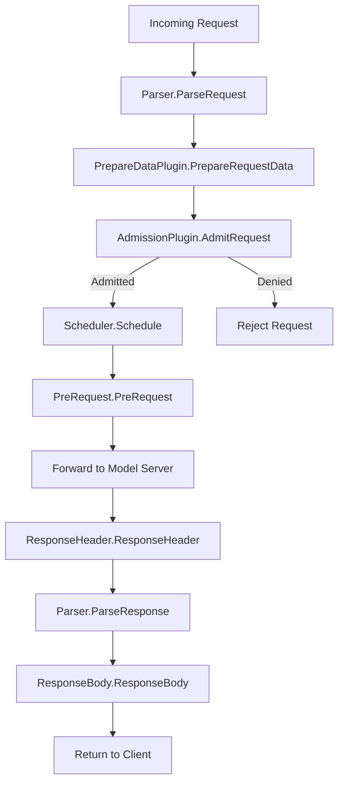

# EPP Request Handling and Control

The EPP Request Handling and Control component manages the lifecycle of an LLM request before and after the scheduling phase. It handles parsing the request payload, producing data for scheduling decisions, admission control, and processing the response from the model server.

### Architecture Overview

The request handling flow follows a structured sequence of extension points:

#### Core Components

*   **Parser**: Responsible for parsing the request and response payloads. This allows EPP to understand the request details (like model name, prompts) and extract usage information (e.g., token usage) from the response.
*   **PrepareDataPlugin**: Produces data needed for scheduling, such as latency predictions or cache state, before the scheduling decision is made.
*   **AdmissionPlugin**: Decides whether to admit a request based on criteria like latency SLOs.
*   **PreRequest**: Hook called after scheduling but before the request is forwarded to the selected endpoint.
*   **ResponseHeader**: Hook called by the director after response headers are successfully received, indicating the beginning of response handling by the model server.
*   **ResponseBody**: The primary hook for processing response data. It is called for every data chunk in a streaming response, or exactly once for non-streaming responses.

### Extension Points

Implemented via plugin interfaces in `pkg/epp/framework/interface`:

1.  **`Parser`**: Parses requests and responses. It extracts usage data from the response (e.g., for reporting or analysis). Supported by plugins in `pkg/epp/framework/plugins/requesthandling/parsers`.
2.  **`PrepareDataPlugin`**: Produces data for scheduling.
3.  **`AdmissionPlugin`**: Controls admission of requests.
4.  **`PreRequest`**: Runs before forwarding.
5.  **`ResponseHeader`**: Runs on receiving headers.
6.  **`ResponseBody`**: Runs on receiving body chunks.

---

### Concrete Plugins

#### Parsers
Located in `pkg/epp/framework/plugins/requesthandling/parsers`.
*   **[`openai-parser`](placeholder-link)**: The default parser supporting the OpenAI API. It parses request payloads to extract model name and prompts, and response payloads to extract usage data (tokens).
*   **[`vllmgrpc-parser`](placeholder-link)**: A parser designed to handle requests specifically for the vLLM gRPC API.
*   **[`passthrough-parser`](placeholder-link)**: A model-agnostic parser that supports any request format by passing the request body through without interpretation. *Drawback: Prevents payload-aware scheduling scorers.*

#### Request Control Plugins
Located in `pkg/epp/framework/plugins/requestcontrol`.

##### Admission Plugins
*   **[`latency-slo-admitter`](placeholder-link)**: Rejects sheddable requests (priority < 0) when no endpoint can meet latency SLO constraints. It admits if at least one endpoint has valid predictions meeting SLOs, is idle, or is "cold" (<2% KV cache). Non-sheddable requests always bypass admission.

##### Data Producers
*   **[`predicted-latency-producer`](placeholder-link)**: Trains XGBoost models via a sidecar and generates per-endpoint TTFT/TPOT predictions. It calculates SLO headroom, collects training data, and tracks per-endpoint running request queues.
*   **[`inflight-load-producer`](placeholder-link)**: Tracks the number of in-flight requests and estimated tokens for each endpoint. It increments counts in `PreRequest` and decrements them in `ResponseBody` on end-of-stream.
*   **[`approx-prefix-cache-producer`](placeholder-link)**: Prepares data for approximate prefix cache aware scheduling by hashing prompts in blocks and matching them against an indexer of cached prefixes on servers.

##### Reporters
*   **[`request-attribute-reporter`](placeholder-link)**: Reports calculated values (e.g., token usage extracted from response) back to the downstream proxy via `ext_proc` dynamic metadata, using CEL expressions for calculations.

