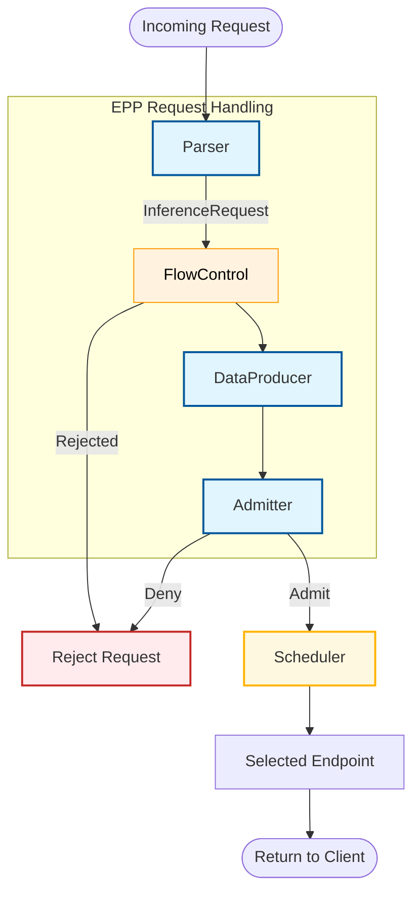

# EPP Request Handling

## Functionality

The EPP Request Handling component manages the lifecycle of an inference request before and after the scheduling phase. It handles parsing the request payload, preparing and managing state for the [Scheduler](scheduling.md), interacting with [Flow Control](flow-control.md), and processing the response from the model server. It is responsible for managing the state of the request throughout its full lifecycle.

## Design

### Architecture Overview

#### Core Components

*   **Parser**: Responsible for parsing the incoming request to structured internal representation consumable by the scheduler, and parsing the response to extract usage data if reported by the model server.
*   **DataProducer**: A pluggable extension that allows customizing request pre-processing and producing per-request state needed for scheduling, such as tokenization, prefix-cache matches, predicted processing latency etc..
*   **Admitter**: Decides whether to admit a request based on criteria like latency SLOs. Runs after dataProducer but before scheduling. Requests failing admission are rejected, while admitted requests proceed to the scheduling phase.

---

### Concrete Plugins

#### Parsers
*   **[`openai-parser`](placeholder-link)**: The default parser supporting the OpenAI API. It parses request payloads to extract model name and prompts, and response payloads to extract usage data (tokens). It supports the following endpoints:
    *   `/conversations`
    *   `/responses`
    *   `/chat/completions`
    *   `/completions`
    *   `/embeddings`
*   **[`vllmgrpc-parser`](placeholder-link)**: A parser designed to handle requests specifically for the vLLM gRPC API. It supports:
    *   `Generate`
    *   `Embed`
*   **[`passthrough-parser`](placeholder-link)**: A model-agnostic parser that supports any request format by passing the request body through without interpretation.

#### Admitter Plugins
*   **[`latency-slo-admitter`](placeholder-link)**: Rejects sheddable requests (priority < 0) when no endpoint can meet latency SLO constraints.

#### Data Producers
*   **[`predicted-latency-producer`](placeholder-link)**: Trains XGBoost models via a sidecar and generates per-endpoint TTFT/TPOT predictions. It calculates SLO headroom, collects training data, and tracks per-endpoint running request queues.
*   **[`inflight-load-producer`](placeholder-link)**: Tracks the number of in-flight requests and estimated tokens for each endpoint. It increments counts in `PreRequest` and decrements them in `ResponseBodyProcessor` on end-of-stream.
*   **[`approx-prefix-cache-producer`](placeholder-link)**: Prepares data for approximate prefix cache aware scheduling by hashing prompts in blocks and matching them against an indexer of cached prefixes on servers.

