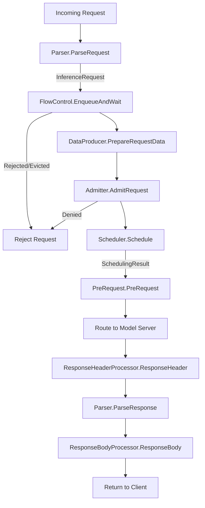

# EPP Request Handling and Control

The EPP Request Handling and Control component manages the lifecycle of an inference request before and after the scheduling phase. It handles parsing the request payload, producing data for scheduling decisions, admission control, and processing the response from the model server.

### Architecture Overview

The request handling flow follows a structured sequence of extension points:

#### Core Components

*   **Parser**: Responsible for parsing the request and response payloads to InferenceRequest, a structured internal representation of the incoming request.
*   **FlowControl**: The main gatekeeper that calls `EnqueueAndWait` to queue requests and wait for capacity, enforcing priority and fairness.
*   **DataProducer**: Produces data needed for scheduling decision.
*   **Admitter**: Decides whether to admit a request based on criteria like latency SLOs. Runs after data production but before scheduling.
*   **Scheduler**: Assigns the request to target endpoints.
*   **PreRequest**: Hook called after `SchedulingResult` is generated but before routing to the model server.
*   **ResponseHeaderProcessor**: Hook called after response headers are successfully received.
*   **ResponseBodyProcessor**: The primary hook for processing response data. It handles both streaming and non-streaming responses: for streaming responses, it is called for each data chunk, with `EndOfStream` (EOS) set to true on the final chunk; for non-streaming responses, it is called exactly once with `EndOfStream` set to true.

### Extension Points

The EPP framework provides extension points grouped into different packages under `pkg/epp/framework/interface`:

#### Request Handling (`requesthandling`)

*   **`Parser`**: Responsible for interpreting request and response payloads. Plugins implement this to support different API protocols (e.g., OpenAI, vLLM gRPC).

#### Flow Control Layer

The Flow Control layer (orchestrated by `FlowControl.EnqueueAndWait`) is a core mechanism that manages request queuing and dispatching. While not a plugin interface itself, it is highly configurable and uses pluggable policies.

*   **Responsibilities**: Protects model servers from overload, enforces strict priority and tenant fairness, and enables late-binding scheduling by holding requests centrally until backends have capacity.
*   **Pluggable Policies**: Supports pluggable **Fairness Policies** (e.g., Round Robin), **Ordering Policies** (e.g., FCFS), and **Saturation Detectors**.
*   **More Details**: See the [Flow Control Guide](placeholder-link) for a complete overview.

#### Request Control (`requestcontrol`)

These plugins allow customizing the request lifecycle and scheduling decisions:

*   **`DataProducer`**: Executes before scheduling to gather or predict data (e.g., latency, cache state) needed by the scheduler.
*   **`Admitter`**: Makes admission decisions based on current pool state and request metadata (e.g., rejecting sheddable requests under load).
*   **`PreRequest`**: Runs after a scheduling decision is made but before the request is forwarded to the selected endpoint.
*   **`ResponseHeaderProcessor`**: Invoked when response headers are received from the model server.
*   **`ResponseBodyProcessor`**: Invoked for each chunk of the response body (or once for non-streaming), allowing processing and extraction of usage metrics.

---

### Concrete Plugins

#### Parsers
Located in `pkg/epp/framework/plugins/requesthandling/parsers`.
*   **[`openai-parser`](placeholder-link)**: The default parser supporting the OpenAI API. It parses request payloads to extract model name and prompts, and response payloads to extract usage data (tokens).
*   **[`vllmgrpc-parser`](placeholder-link)**: A parser designed to handle requests specifically for the vLLM gRPC API.
*   **[`passthrough-parser`](placeholder-link)**: A model-agnostic parser that supports any request format by passing the request body through without interpretation. *Drawback: Prevents payload-aware scheduling scorers.*

#### Request Control Plugins
Located in `pkg/epp/framework/plugins/requestcontrol`.

##### Admitter Plugins
*   **[`latency-slo-admitter`](placeholder-link)**: Rejects sheddable requests (priority < 0) when no endpoint can meet latency SLO constraints.

##### Data Producers
*   **[`predicted-latency-producer`](placeholder-link)**: Trains XGBoost models via a sidecar and generates per-endpoint TTFT/TPOT predictions. It calculates SLO headroom, collects training data, and tracks per-endpoint running request queues.
*   **[`inflight-load-producer`](placeholder-link)**: Tracks the number of in-flight requests and estimated tokens for each endpoint. It increments counts in `PreRequest` and decrements them in `ResponseBodyProcessor` on end-of-stream.
*   **[`approx-prefix-cache-producer`](placeholder-link)**: Prepares data for approximate prefix cache aware scheduling by hashing prompts in blocks and matching them against an indexer of cached prefixes on servers.

