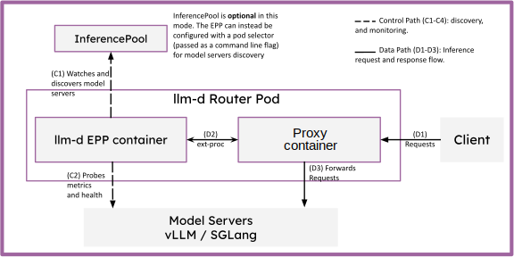
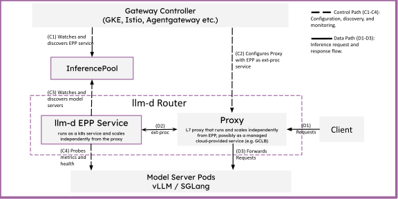

# Proxy

The proxy is the entry point for inference requests in llm-d, receiving client traffic and routing it to the optimal model server via the EPP.

## Functionality

llm-d leverages Envoy's [External Processing](https://www.envoyproxy.io/docs/envoy/latest/configuration/http/http_filters/ext_proc_filter) to extend production-grade proxies with the "LLM inference-aware" request scheduling implemented in the llm-d EPP. In this way, llm-d re-uses the rich existing ecosystem of high-performance, production-quality proxy technologies in the Kubernetes ecosystem.

The proxy's job is to:

- **Accept incoming inference requests** from clients (OpenAI-compatible API)
- **Consult the EPP** via ext-proc to determine the optimal backend endpoint
- **Route the request** to the selected model server pod
- **Stream responses** back to the client

## Design

llm-d provides two deployment patterns for the proxy:
- Standalone - where an Envoy proxy container is deployed alongside the [EPP](epp) container in the same Pod
- via Gateway API - where the proxy is managed by the Kuberentes Gateway API machinery

> [!NOTE]
> Standalone deployments are intended for workloads where the machinery of Gateway API creates too much operational overhead - such as clusters using Ingress, basic testing and evaluations, batch inference, and RL post-training. Gateway API enables a clean integration with modern, L7 production-grade cloud networking solutions such as Istio, GKE Gateway and Agentgateway.

### Request Flow (Both Modes)

Regardless of the deployment pattern, the request flow is the same:

1. Client sends an inference request to the proxy
2. The proxy's ext-proc filter calls the EPP
3. The EPP evaluates endpoints using its plugin pipeline (handlers, filters, scorers, picker)
4. The EPP returns the selected endpoint address
5. The proxy forwards the request to that model server pod
6. The model server sends the response back to the proxy (which streams the result through the EPP for post-processing)


### Standalone Deployment

The standalone mode deploys an Envoy proxy as a sidecar to the EPP, offering a lightweight, flexible deployment pattern without requiring Gateway API infrastructure.

In standalone mode:

- Envoy runs alongside the EPP in the same pod
- ext-proc communication happens over localhost
- No Gateway, HTTPRoute, or gateway controller is needed
- Traffic is sent directly to the EPP pod's externally exposed port




### Gateway API Deployment

> [!NOTE]
> Gateway API is an advanced Kubernetes Networking API, targeted at production deployments. It is recommended to understand the concept of a Gateway in the [official documentation](https://gateway-api.sigs.k8s.io/).

Gateway API is an official Kubernetes project focused on L4 and L7 networking in Kubernetes, representing the next generation of Kubernetes Ingress, Load Balancing, and Service Mesh APIs.

The [Gateway API Inference Extension (GAIE)](https://gateway-api-inference-extension.sigs.k8s.io/) extends Gateway API by leveraging Envoy's External Processing to inject LLM-aware load balancing into production grade networking provided by popular Gateways like Istio, kgateway, and GKE Gateway. This integration makes it easy to expose and control access to your endpoints to other workloads on or off cluster, or to integrate your self-hosted models alongside model-as-a-service providers in a higher level AI Gateways like LiteLLM, Gloo AI Gateway, or Apigee.

The architecture looks like this:



#### Integration

An [HTTPRoute](https://gateway-api.sigs.k8s.io/api-types/httproute/) is a Gateway API type for specifying routing behavior of HTTP requests from a Gateway listener to a backend service (e.g., `Service` or `InferencePool`). `HTTPRoutes` are attached to `Gateways` to configure how traffic is routed to various services in the cluster. 

To leverage the LLM-aware scheduling logic of `llm-d`, we simply configure the `HTTPRoute` to reference an `InferencePool` rather than a `Service`.

For example, the Cluster Operator deploys a Gateway like so:

```yaml
apiVersion: gateway.networking.k8s.io/v1
kind: Gateway
metadata:
  name: my-gateway
spec:
  gatewayClassName: istio # for example, requires istio to be installed
  listeners:
    - name: http
      protocol: HTTP
      port: 80
```

Then, the Application Owner deploys the `HTTPRoute` (with a `backendRef` to an existing or to-be-created `InferencePool`):

```yaml
apiVersion: gateway.networking.k8s.io/v1
kind: HTTPRoute
metadata:
  name: my-http-route
spec:
  parentRefs:
    - group: gateway.networking.k8s.io
      kind: Gateway
      name: my-gateway
  rules:
    - backendRefs:
        - group: inference.networking.k8s.io
          kind: InferencePool
          name: my-infpool
          port: 8000
      matches:
        - path:
            type: PathPrefix
            value: /
```

The Inference Platform owner deploys an InferencePool, EPP, and model servers. When traffic hits the Gateway, it first consults the EPP for a scheduling decision, and then routes to a model server in the InferencePool.

#### Configuration Guides

Gateway API-based deployments require the Gateway implementation to support Gateway API Inference Extension (GAIE). A full list of Gateways supporting GAIE can be found [here](https://gateway-api-inference-extension.sigs.k8s.io/implementations/gateways/).

llm-d provides configuration guides and regularly tests integrations with the following Gateways:
- [Istio](../guides/gateways/istio.md)
- [GKE Gateway](../guides/gateways/gke.md)
- [agentgateway](../guides/gateways/agentgateway.md)

> [!NOTE]
> We welcome contribution of guides for other Gateways!
