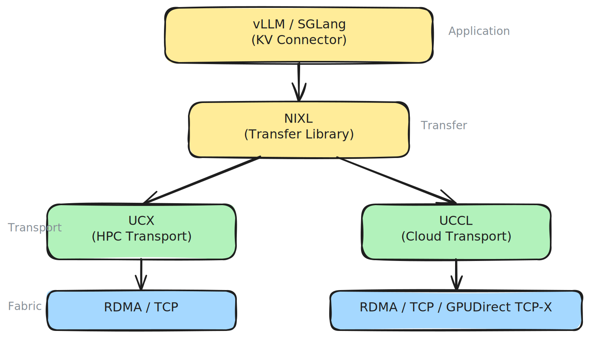

# RDMA and Networking Configuration

## Why Networking Matters

In prefill/decode disaggregation, the KV Cache must transfer from prefill to decode workers before the first token can be generated. This transfer time lands directly on TTFT — and the cost grows with context length and model size.

For wide expert-parallelism (DeepEP), all-to-all GPU communication across nodes is on the critical path for every token generated.

Networking is a first-order concern for distributed inference latency.

## The Networking Stack

llm-d uses a layered networking stack for KV Cache transfers and inter-node communication:



### NIXL

[NIXL](https://github.com/ai-dynamo/nixl) (NVIDIA Inference Xfer Library) is the transfer library used by vLLM to move KV Cache between GPUs. It abstracts the underlying transport behind a unified API, so vLLM can initiate transfers without knowledge of the network fabric.

NIXL operates in a **pull-based model**: the decode pod fetches KV Cache blocks directly from the prefill pod's GPU memory using one-sided RDMA reads, without requiring active participation from the prefill pod. This reduces synchronization overhead.

Key capabilities:
- Works across InfiniBand, RoCE, EFA, and TCP
- Supports GPU VRAM, CPU DRAM, and storage backends
- Plugin architecture for adding new transport backends
- Supports TP heterogeneity (prefill and decode can use different tensor-parallel sizes)

### UCX

[UCX](https://openucx.org/) (Unified Communication X) is the default transport backend for NIXL. It is a mature, open-source communication framework with broad adoption across HPC clusters. UCX abstracts RDMA transports (InfiniBand, RoCE), shared memory, and TCP behind a single API.

UCX is a good default: it is battle-tested, widely supported, and works across most hardware. However, it was designed for HPC workloads and carries complexity that can make it harder to tune for AI inference traffic patterns.

### UCCL

[UCCL](https://github.com/ai-dynamo/uccl) (Unified Cloud Communication Library) is a newer transport backend integrated into NIXL as of llm-d v0.5. It implements a host-resident software transport stack — managing transport logic on the CPU rather than relying solely on hardware offload. This enables fine-grained flow splitting and adaptive congestion control.

UCCL currently supports:
- Native RDMA (IB/RoCE)
- GPUDirect TCP-X (Google Cloud)
- TCP

UCCL automatically discovers NICs based on PCIe proximity during memory registration, removing the need for manual NIC-to-GPU mapping in most cases.

### libfabric

On AWS, NIXL uses [libfabric](https://ofiwg.github.io/libfabric/) as the transport backend. EFA (Elastic Fabric Adapter) requires OpenFabrics Interfaces — neither UCX nor UCCL support EFA natively. The libfabric plugin provides multi-rail RDMA with topology-aware GPU-to-EFA mapping via hwloc.

### Choosing a Transport Backend

| Environment | Backend | Rationale |
|---|---|---|
| On-premise InfiniBand / RoCE | UCX | Mature, battle-tested on HPC fabrics with dedicated, uncongested paths |
| Cloud with RoCE (GKE, Azure, etc.) | UCCL | Software packet spraying avoids single-path congestion on shared fabric |
| GKE with GPUDirect TCP-X | UCCL | Native support for Google's GPU-initiated TCP transport |
| AWS with EFA | libfabric | EFA requires OFI/libfabric; UCX and UCCL don't support EFA |
| TCP-only (XPU, HPU, CPU) | UCX | Simplest configuration for non-RDMA environments |

The core tradeoff:

- **UCX** offloads transport to hardware — works best when the network fabric has dedicated, uncongested paths, typical in on-premise HPC clusters with InfiniBand.
- **UCCL** manages transport in software on the CPU — it splits traffic across up to 256 network paths with adaptive congestion control. This matters in cloud environments where network paths are shared and individual paths may be congested.
- **libfabric** is the only option for AWS EFA. It is not interchangeable with UCX or UCCL on EFA hardware.

NIXL selects the backend based on what is available and the memory types involved. You control which backends are loaded at agent creation time.

## Configuration

### vLLM KV Transfer

Enable NIXL-based KV Cache transfer via the `--kv-transfer-config` flag:

```bash
vllm serve <model> \
  --kv-transfer-config '{"kv_connector":"NixlConnector","kv_role":"kv_both"}'
```

The `kv_role` is `kv_both` for both prefill and decode pods — each pod can both send and receive KV Cache.

For XPU and HPU devices where KV transfer happens via CPU memory, add:

```bash
--kv-transfer-config '{"kv_connector":"NixlConnector","kv_role":"kv_both","kv_buffer_device":"cpu"}'
```

### NIXL Side Channel

NIXL uses a side channel for metadata exchange between pods. Configure with:

| Variable | Description | Default |
|---|---|---|
| `VLLM_NIXL_SIDE_CHANNEL_HOST` | Pod IP (use `status.podIP` fieldRef) | Required |
| `VLLM_NIXL_SIDE_CHANNEL_PORT` | Metadata exchange port | `5557` |

### UCX Transport Selection

UCX transport is configured via environment variables:

| Variable | Description | Example |
|---|---|---|
| `UCX_TLS` | Transport layers to use | `sm,cuda_ipc,cuda_copy,tcp` |
| `UCX_SOCKADDR_TLS_PRIORITY` | Priority for socket-based transports | `tcp` |

For RDMA-capable clusters, UCX will automatically use RDMA verbs when available. For TCP-only clusters (XPU, HPU), set `UCX_TLS=tcp`.

### RDMA Resources and Capabilities

RDMA requires device resources and elevated capabilities in the pod spec:

```yaml
resources:
  limits:
    rdma/roce_gdr: "2"
  requests:
    rdma/roce_gdr: "2"
```

```yaml
securityContext:
  capabilities:
    add:
      - IPC_LOCK
      - SYS_RAWIO
      - NET_ADMIN
      - NET_RAW
```

### NIC Selection

Use `NCCL_EXCLUDE_IB_HCA` to exclude specific HCAs from NCCL traffic (e.g., management NICs):

```yaml
- name: NCCL_EXCLUDE_IB_HCA
  value: "mlx5_0,mlx5_2,mlx5_4,mlx5_8"
```

For wide-EP (DeepEP), map GPUs to specific HCAs for optimal topology:

```yaml
- name: DEEP_EP_DEVICE_TO_HCA_MAPPING
  value: "0:mlx5_0:1,1:mlx5_1:1,2:mlx5_2:1,3:mlx5_3:1,4:mlx5_4:1,5:mlx5_5:1,6:mlx5_6:1,7:mlx5_7:1"
```

### Platform-Specific Notes

#### GKE

- Use GKE multi-NIC annotations for RDMA interfaces:
  ```yaml
  annotations:
    networking.gke.io/default-interface: eth0
    networking.gke.io/interfaces: '[{"interfaceName":"eth0","network":"default"}, ...]'
  ```
- Source `set_nccl_env.sh` from `/usr/local/gib/scripts/` at container startup
- Set `NVSHMEM_DISABLED_GDRCOPY=true` (GKE recommendation)
- Use pod affinity on `cloud.google.com/gce-topology-block` for topology-aware placement
- GPU-initiated RDMA requires `privileged: true` in the security context

#### OpenShift / OCP

- Use Multus CNI for secondary RDMA networks:
  ```yaml
  annotations:
    k8s.v1.cni.cncf.io/networks: "multi-nic-compute"
  ```
- Request `rdma/roce_gdr` device resources as shown above

#### AWS (EFA)

- EFA support is built into the llm-d CUDA image when `ENABLE_EFA=true`
- NIXL uses the `libfabric` backend (not UCX or UCCL) — see [Choosing a Transport Backend](#choosing-a-transport-backend)
- Requires libfabric v1.21.0+ (or latest AWS EFA installer)
- The libfabric plugin auto-discovers GPU-to-EFA topology via hwloc for optimal multi-rail placement

## Verifying Network Performance

After deploying model servers, verify two things:

### 1. GPU Topology

Confirm GPUs within each pod are optimally connected:

```bash
# NVIDIA
nvidia-smi topo -m          # Look for NVLink, not SYS or PHB
nvidia-smi nvlink --status  # Verify NVLink is active

# AMD
rocm-smi --showtopo         # Confirm Infinity Fabric connectivity
```

GPUs showing `SYS` or `PHB` topology are communicating over PCIe across NUMA nodes — this adds latency, especially for collective operations.

### 2. Inter-Pod Network

Verify RDMA connectivity and bandwidth between pods:

```bash
# Check RDMA devices are available
ibv_devinfo

# Run NIXL benchmark between prefill and decode pods
nixlbench --transport rdma --size 1G
```

If throughput is significantly below the expected line rate for your fabric, check NIC affinity, MTU settings, and whether traffic is falling back to TCP.

If vLLM is already running, GPU memory may be insufficient for in-pod benchmarks. Add a pre-start script that runs tests before vLLM launches and blocks until a condition is met (e.g., removal of a sentinel file).

## Further Reading

- [NIXL repository](https://github.com/ai-dynamo/nixl)
- [UCCL repository](https://github.com/ai-dynamo/uccl)
- [P/D Disaggregation Well-Lit Path](../../well-lit-paths/introduction.md) — deployment patterns using NIXL
- [Wide Expert-Parallelism Well-Lit Path](../../well-lit-paths/introduction.md) — multi-node deployment with DeepEP networking
- [Model Servers](../../architecture/core/model-servers.md) — vLLM/SGLang configuration including KV transfer flags
