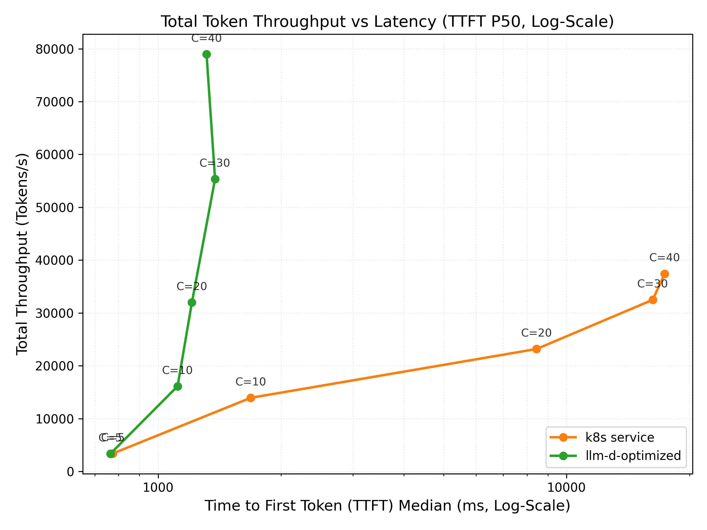
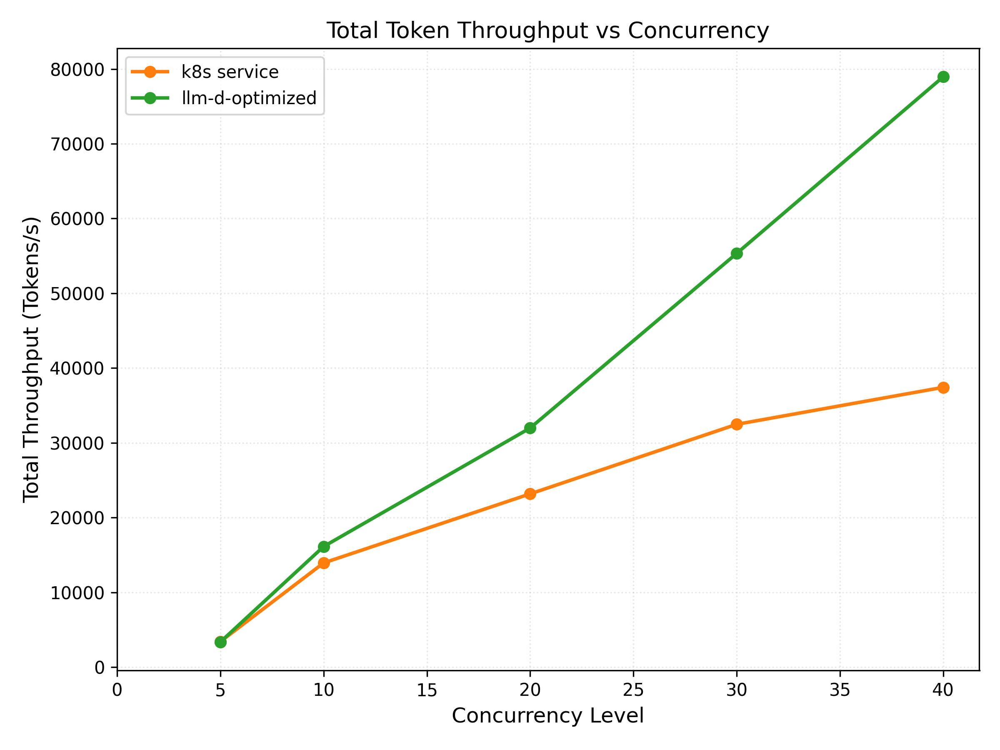
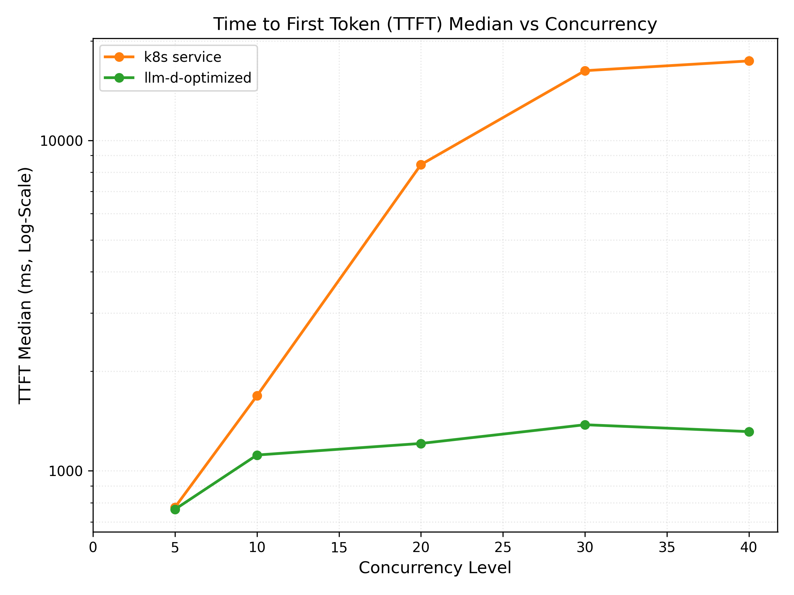

# Agentic Code Generation Guide

## Overview

This guide deploys the optimal llm-d configuration for agentic code-generation workload. The configuration includes multiple llm-d optimizations in terms of routing and KV cache management:
- **Prefix-aware routing** to optimize prefix cache reuse
- **KV cache offloading** to CPU DRAM to handle multi-turn conversations with long contexts (via KV offloading connector)
- **Load balancing** to increase cluster-wide accelerator utilization and prevent hot-spotting from bursty request patterns

## Default Configuration

| Parameter          | Value                                                                                      |
| ------------------ | ------------------------------------------------------------------------------------------ |
| Model              | [Qwen/Qwen3-Coder-480B-A35B-Instruct-FP8](https://huggingface.co/Qwen/Qwen3-Coder-480B-A35B-Instruct-FP8) |
| Replicas           | 8                                                                                          |
| Accelerator        | Google TPU v7 (tpu7x)                                                                      |
| Topology           | 2x2x1                                                                                      |
| TP size / EP size  | TP=8, EP enabled                                                                           |

### Supported Hardware Backends

| Backend             | Directory                      | Notes                       |
| ------------------- | ------------------------------ | --------------------------- |
| Google TPU (vLLM)   | `modelserver/tpu/vllm/`        | TPU v7 / tpu7x 2x2x1 (nightly) |

## Prerequisites

- Installed proper client tools (kubectl, helm).
- Set the following environment variables:
  ```bash
  export GAIE_VERSION=v1.5.0
  export GUIDE_NAME="agentic-serving"
  export NAMESPACE=llm-d-agentic-serving
  export REPO_ROOT=$(realpath $(git rev-parse --show-toplevel))
  ```

- Create a target namespace for the installation:

  ```bash
  kubectl create namespace ${NAMESPACE} --dry-run=client -o yaml | kubectl apply -f -
  ```

- [Create the `llm-d-hf-token` secret in your target namespace with the key `HF_TOKEN` matching a valid HuggingFace token](../../helpers/hf-token.md) to pull models.
<!-- llm-d-cicd:skip start -->
  ```bash
  export HF_TOKEN=<your HuggingFace token>
  kubectl create secret generic llm-d-hf-token \
    --from-literal="HF_TOKEN=${HF_TOKEN}" \
    --namespace "${NAMESPACE}" \
    --dry-run=client -o yaml | kubectl apply -f -
  ```
<!-- llm-d-cicd:skip end -->

## Installation Instructions

### 1. Deploy the llm-d Router

```bash
helm install ${GUIDE_NAME} \
    oci://registry.k8s.io/gateway-api-inference-extension/charts/standalone \
    -f ${REPO_ROOT}/guides/recipes/router/base.values.yaml \
    -f ${REPO_ROOT}/guides/${GUIDE_NAME}/router/${GUIDE_NAME}.values.yaml \
    -n ${NAMESPACE} --version ${GAIE_VERSION}
```

### 2. Deploy the Model Server (TPUs)

Apply the Kustomize overlays for TPU:

```bash
kubectl apply -n ${NAMESPACE} -k ${REPO_ROOT}/guides/${GUIDE_NAME}/modelserver/tpu/vllm/
```

## Verification

### 1. Get the IP of the Proxy

```bash
export IP=$(kubectl get service ${GUIDE_NAME}-epp -n ${NAMESPACE} -o jsonpath='{.spec.clusterIP}')
```

### 2. Send Test Requests

Open a temporary interactive shell inside the cluster:

```bash
kubectl run curl-debug --rm -it \
    --image=cfmanteiga/alpine-bash-curl-jq \
    --env="IP=$IP" \
    --env="NAMESPACE=$NAMESPACE" \
    -- /bin/bash
```

Send a completion request:

```bash
curl -X POST http://${IP}/v1/completions \
    -H 'Content-Type: application/json' \
    -d '{
        "model": "Qwen/Qwen3-Coder-480B-A35B-Instruct-FP8",
        "prompt": "Explain how a simple agent loop works in 3 sentences."
    }' | jq
```

## Benchmarking

This guide comes with an `inference-perf` benchmark preset (defined in [guide.yaml](benchmark-templates/guide.yaml)) designed for agentic code-generation workloads with multi-turn interactions and tool usage. The configuration parameters include:

| Workload Characteristic | Metric / Distribution Type | Min | Max | Mean / Constant | Std Dev | Description |
| :--- | :--- | :--- | :--- | :--- | :--- | :--- |
| **Shared System Prompt** | Constant | - | - | 3,000 tokens | - | Common base instructions, libraries, and API schemas shared across all agent instances. Highly cacheable. |
| **Dynamic System Prompt** | Lognormal | 10,000 | 990,000 | 160,000 tokens | 233,600 | Repository context, file indexes, and user-specific code context. Extremely large and variable context. |
| **Turns per Conversation** | Lognormal | 1 | 3,000 | 540 turns | 48,600 | The depth of the agentic reasoning/conversational loop. Multi-turn interactions require sustaining long-lived sessions. |
| **Input Tokens per Turn** | Lognormal | 100 | 10,000 | 1,500 tokens | 1,200 | Ongoing prompt extensions (e.g., test logs, user follow-ups, modified code blocks) during conversation. |
| **Output Tokens per Turn** | Lognormal | 50 | 10,000 | 425 tokens | 825 | Model generations per turn, which are generally smaller than inputs but can spike when generating large files. |
| **Tool Call Latency** | Lognormal | 1s | 100s | 15 seconds | 55 | Time spent executing tools (compilation, unit tests, web search). Causes idle/delayed turns on the client side. |

### 1. Prepare the Benchmarking Suite

- Download the benchmark script:

  ```bash
  curl -L -O https://raw.githubusercontent.com/llm-d/llm-d-benchmark/main/existing_stack/run_only.sh
  chmod u+x run_only.sh
  ```

- Prepare HuggingFace token secret `llm-d-hf-token` in the namespace.

### 2. Download the Workload Template

```bash
curl -LJO "https://raw.githubusercontent.com/llm-d/llm-d/main/guides/${GUIDE_NAME}/benchmark-templates/guide.yaml"
```

### 3. Execute Benchmark

```bash
export IP=$(kubectl get service ${GUIDE_NAME}-epp -n ${NAMESPACE} -o jsonpath='{.spec.clusterIP}')
envsubst < guide.yaml > config.yaml
./run_only.sh -c config.yaml -o ./results
```

## Benchmark Results

The results below are with 8 replicas of TPU v7x (2x2x1) on the benchmark workload described above.

### Summary with 40 concurrent coding sessions:
| Metric | k8s Service | llm-d-optimized | Δ Improvement |
| :--- | :--- | :--- | :--- |
| **TTFT P50 (ms)** | 17391 | 1314 | ⬇️ 92.4% |
| **Input tokens / sec** | 36987 | 78065 | ⬆️ 111.1% |
| **Output tokens / sec** | 436.8 | 888.5 | ⬆️ 103.4% |

### Latency Profiles:

<p float="left">
  
  
  
</p>

**Note**: As of June 2026 we are actively working on improving the following for TPU deployments:
- Long context performance
- P/D disaggregation
- KV Cache offloading support

This guide and performance numbers will be updated as further optimizations become available.

## Cleanup

To clean up resources:

```bash
helm uninstall ${GUIDE_NAME} -n ${NAMESPACE}
kubectl delete -n ${NAMESPACE} -k ${REPO_ROOT}/guides/${GUIDE_NAME}/modelserver/tpu/vllm/
kubectl delete namespace ${NAMESPACE}
```
