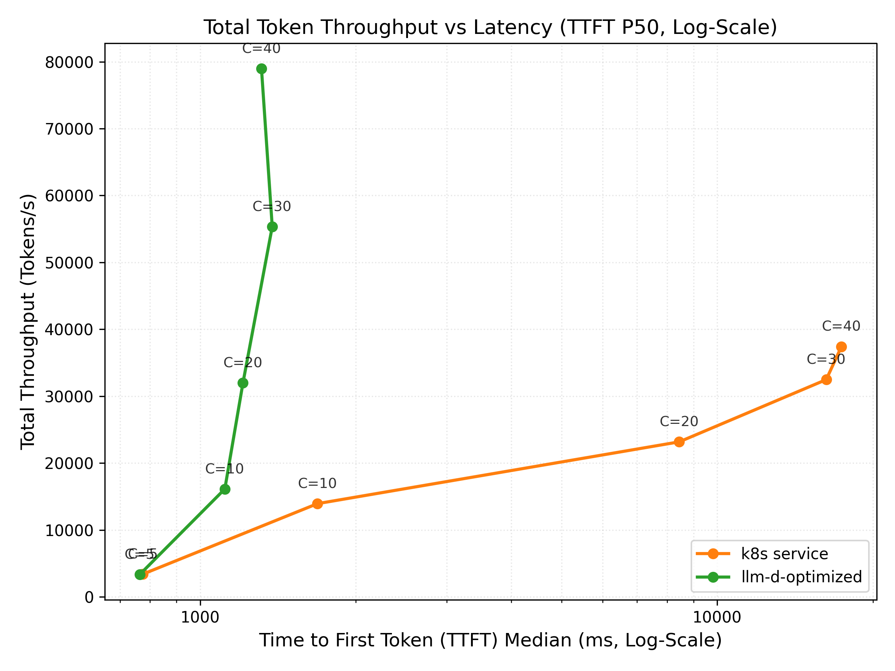
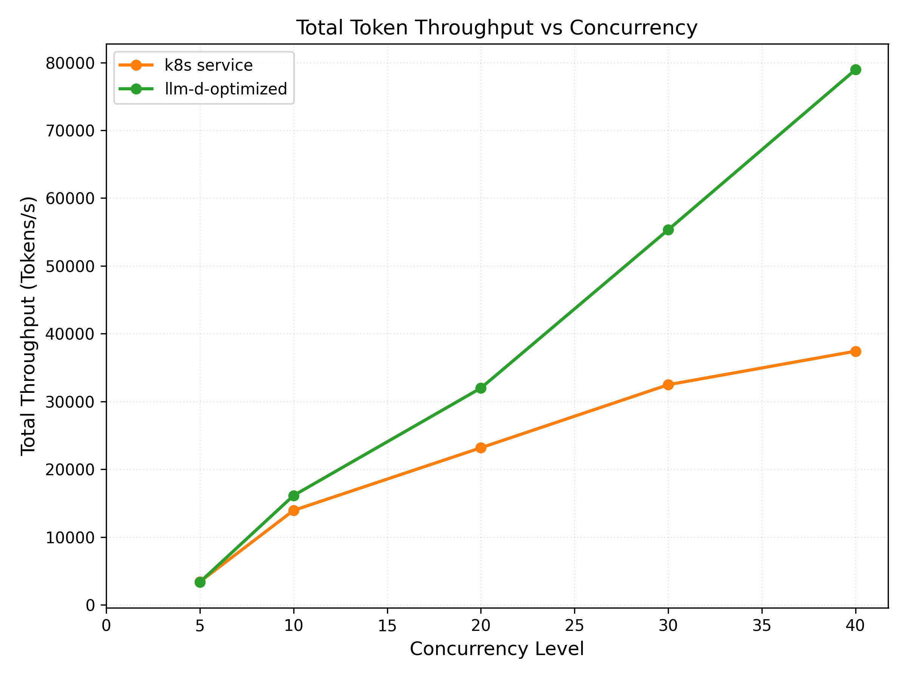
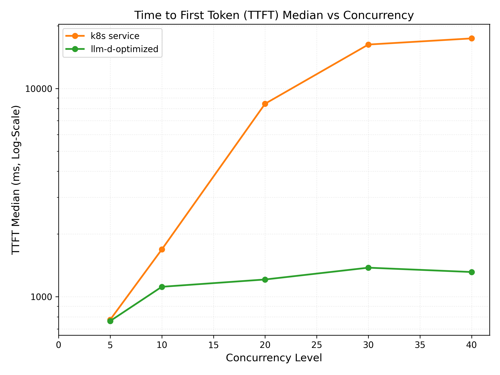

# Agentic Code Generation — Qwen3-Coder-480B on TPU 7x

This is one of the accelerator-specific deployments of the agentic code-generation workload; see the
[agentic-serving README](README.md#deployments) for the workload framing and the alternatives:
[NVIDIA-Nemotron-3-Ultra-550B on H200](nemotron-3-ultra-550b-h200.md),
[GLM-5.2-FP8 on H200](glm-5-2-h200.md).

## Overview

This guide deploys the optimal llm-d configuration for agentic code-generation workload. The configuration includes multiple llm-d optimizations in terms of routing and KV cache management:

- **Prefix-aware routing** to optimize prefix cache reuse
- **KV cache offloading** to CPU DRAM to handle multi-turn conversations with long contexts (via KV offloading connector)
- **Load balancing** to increase cluster-wide accelerator utilization and prevent hot-spotting from bursty request patterns

## Default Configuration

| Parameter          | Value                                                                                      |
| ------------------ | ------------------------------------------------------------------------------------------ |
| Model              | [Qwen/Qwen3-Coder-480B-A35B-Instruct-FP8](https://huggingface.co/Qwen/Qwen3-Coder-480B-A35B-Instruct-FP8) |
| Replicas           | 8                                                                                          |
| Accelerator        | Google TPU 7x (tpu7x)                                                                      |
| Topology           | 2x2x1                                                                                      |
| TP size / EP size  | TP=8, EP enabled                                                                           |

### Supported Hardware Backends

| Backend             | Directory                      | Notes                       |
| ------------------- | ------------------------------ | --------------------------- |
| Google TPU (vLLM)   | `modelserver/tpu/vllm/`        | TPU 7x / tpu7x 2x2x1 (nightly) |

## Prerequisites

- Installed proper client tools (kubectl, helm).
- Set the following environment variables:

  ```bash
  export REPO_ROOT=$(realpath $(git rev-parse --show-toplevel))
  source ${REPO_ROOT}/guides/env.sh
  export GUIDE_NAME="agentic-serving"
  export NAMESPACE=llm-d-agentic-serving
  ```

- Install the Gateway API Inference Extension CRDs:

  ```bash
  kubectl apply -f https://github.com/kubernetes-sigs/gateway-api-inference-extension/releases/download/${GAIE_VERSION}/v1-manifests.yaml
  ```

- Create a target namespace for the installation:

  ```bash
  kubectl create namespace ${NAMESPACE} --dry-run=client -o yaml | kubectl apply -f -
  ```

- [Create the `llm-d-hf-token` secret in your target namespace with the key `HF_TOKEN` matching a valid HuggingFace token](../../helpers/hf-token.md) to pull models.
<!-- llm-d-cicd:skip start -->
  ```bash
  export HF_TOKEN=<your HuggingFace token>
  kubectl create secret generic llm-d-hf-token \
    --from-literal="HF_TOKEN=${HF_TOKEN}" \
    --namespace "${NAMESPACE}" \
    --dry-run=client -o yaml | kubectl apply -f -
  ```
<!-- llm-d-cicd:skip end -->

## Installation Instructions

### 1. Deploy the llm-d Router

For the default unified serving configuration, deploy the router using:

```bash
helm install ${GUIDE_NAME} \
    ${ROUTER_STANDALONE_CHART} \
    -f ${REPO_ROOT}/guides/recipes/router/base.values.yaml \
    -f ${REPO_ROOT}/guides/${GUIDE_NAME}/router/${GUIDE_NAME}.values.yaml \
    -n ${NAMESPACE} --version ${ROUTER_CHART_VERSION}
```

*(Note: If you are deploying the experimental P/D disaggregated configuration instead, use `router/agentic-serving-tpu-disagg.values.yaml` in place of `router/${GUIDE_NAME}.values.yaml` above).*

> **Note — `peakPrefillThroughput` is hardware/model-specific.** The router values set
> `peakPrefillThroughput: 16444`, calibrated for Qwen3-Coder-480B-FP8 on TPU 7x. If you
> deploy a different model or hardware, measure your own value and update
> `router/agentic-serving.values.yaml`. See the shared
> [router calibration tool](../recipes/router/calibration/README.md).

### 2. Deploy the Model Server (TPUs)

For the default unified serving configuration (with CPU KV offloading), apply the Kustomize overlays:

```bash
kubectl apply -n ${NAMESPACE} -k ${REPO_ROOT}/guides/${GUIDE_NAME}/modelserver/tpu/vllm/
```

Wait for the deployment to become ready:

```bash
kubectl rollout status deployment/agentic-serving-tpu-vllm-decode -n ${NAMESPACE}
```

<details>
<summary><b><i>Click</i></b> here for the experimental Prefill/Decode (P/D) disaggregated deployment instructions</summary>

If you want to evaluate the experimental P/D disaggregated configuration, apply the disaggregated overlays instead:

```bash
kubectl apply -n ${NAMESPACE} -k ${REPO_ROOT}/guides/${GUIDE_NAME}/modelserver/tpu/vllm-disaggregated/
```

Wait for both the prefill and decode deployments to become ready:

```bash
kubectl rollout status deployment/agentic-serving-tpu-vllm-prefill -n ${NAMESPACE}
kubectl rollout status deployment/agentic-serving-tpu-vllm-decode -n ${NAMESPACE}
```

</details>

## Verification

### 1. Get the IP of the Proxy

```bash
export IP=$(kubectl get service ${GUIDE_NAME}-epp -n ${NAMESPACE} -o jsonpath='{.spec.clusterIP}')
```

### 2. Send Test Requests

Open a temporary interactive shell inside the cluster:

```bash
kubectl run curl-debug --rm -it \
    --image=cfmanteiga/alpine-bash-curl-jq \
    --env="IP=$IP" \
    --env="NAMESPACE=$NAMESPACE" \
    -- /bin/bash
```

Send a completion request:

```bash
curl -X POST http://${IP}/v1/completions \
    -H 'Content-Type: application/json' \
    -d '{
        "model": "Qwen/Qwen3-Coder-480B-A35B-Instruct-FP8",
        "prompt": "Explain how a simple agent loop works in 3 sentences."
    }' | jq
```

## Benchmarking

This guide comes with an `inference-perf` benchmark preset (defined in [guide.yaml](benchmark-templates/guide.yaml)) designed for agentic code-generation workloads with multi-turn interactions and tool usage. The configuration parameters include:

| Workload Characteristic | Metric / Distribution Type | Min | Max | Mean / Constant | Std Dev | Description |
| :--- | :--- | :--- | :--- | :--- | :--- | :--- |
| **Shared System Prompt** | Constant | - | - | 3,000 tokens | - | Common base instructions, libraries, and API schemas shared across all agent instances. Highly cacheable. |
| **Dynamic System Prompt** | Lognormal | 10,000 | 990,000 | 160,000 tokens | 233,600 | Repository context, file indexes, and user-specific code context. Extremely large and variable context. |
| **Turns per Conversation** | Lognormal | 1 | 3,000 | 540 turns | 48,600 | The depth of the agentic reasoning/conversational loop. Multi-turn interactions require sustaining long-lived sessions. |
| **Input Tokens per Turn** | Lognormal | 100 | 10,000 | 1,500 tokens | 1,200 | Ongoing prompt extensions (e.g., test logs, user follow-ups, modified code blocks) during conversation. |
| **Output Tokens per Turn** | Lognormal | 50 | 10,000 | 425 tokens | 825 | Model generations per turn, which are generally smaller than inputs but can spike when generating large files. |
| **Tool Call Latency** | Lognormal | 1s | 100s | 15 seconds | 55 | Time spent executing tools (compilation, unit tests, web search). Causes idle/delayed turns on the client side. |

### 1. Prepare the Benchmarking Suite

- Download the benchmark script:

  ```bash
  curl -L -O https://raw.githubusercontent.com/llm-d/llm-d-benchmark/main/existing_stack/run_only.sh
  chmod u+x run_only.sh
  ```

- Prepare HuggingFace token secret `llm-d-hf-token` in the namespace.

### 2. Download the Workload Template

```bash
curl -LJO "https://raw.githubusercontent.com/llm-d/llm-d/main/guides/${GUIDE_NAME}/benchmark-templates/guide.yaml"
```

### 3. Execute Benchmark

```bash
# Benchmark parameters. CONCURRENCY_LEVEL is the number of concurrent coding sessions
# to drive; NUM_REQUESTS is fixed at 20 per session; SEED is varied per concurrency level
# so prompts don't overlap across runs (matches the published results below).
export CONCURRENCY_LEVEL=40
export NUM_REQUESTS=$((20 * CONCURRENCY_LEVEL))
export SEED=$((7 + CONCURRENCY_LEVEL))

export IP=$(kubectl get service ${GUIDE_NAME}-epp -n ${NAMESPACE} -o jsonpath='{.spec.clusterIP}')

# Render the configuration using the appropriate template:
envsubst < guide.yaml > config.yaml

./run_only.sh -c config.yaml -o ./results
```

> [!TIP]
> **Tuning Prefill-to-Decode Ratios:**
> The default `vllm-disaggregated` overlay deploys the optimal 2:6 ratio (2 prefillers, 6 decoders). If you want to evaluate different ratios from the benchmarking report (such as 5:3 or 6:2), you can scale the active deployments directly:
>
> ```bash
> kubectl scale deployment/agentic-serving-tpu-vllm-prefill --replicas=5 -n ${NAMESPACE}
> kubectl scale deployment/agentic-serving-tpu-vllm-decode --replicas=3 -n ${NAMESPACE}
> ```

## Benchmark Results

The results below are with 8 replicas of TPU 7x (2x2x1) on the benchmark workload described above.

Scaling concurrency up to 80 sessions, the optimized configuration sustains a peak total throughput of **~120K tokens/s**, versus **~40K tokens/s** for the k8s Service baseline — roughly **3× higher**.

### Summary with 40 concurrent coding sessions

| Metric | k8s Service | llm-d-optimized | Δ Improvement |
| :--- | :--- | :--- | :--- |
| **TTFT P50 (ms)** | 17391 | 2474 | ⬇️ 85.8% |
| **Total tokens / sec** | 37424 | 93353 | ⬆️ 149.5% |
| **Input tokens / sec** | 36987 | 92705 | ⬆️ 150.6% |
| **Output tokens / sec** | 436.8 | 647.5 | ⬆️ 48.2% |

### Latency Profiles

<p float="left">
  
  
  
</p>

### Prefill/Decode Disaggregated Results

We also evaluated the P/D disaggregated configuration on TPU 7x with different prefill-to-decode ratios under the same agentic workload framework (average prompt size **~128K tokens**, output **~1.1K tokens**).

At this scale, the KV cache size is extremely large (~20GB per request), shifting the bottleneck from prefill compute to **decoder HBM capacity**. Under a concurrency of 40, allocating more TPU nodes to the decode phase (**2:6** ratio) yields the best performance by providing sufficient aggregate HBM to avoid severe queueing and swapping:

| Metric | 2:6 (2 Prefill, 6 Decode) | 5:3 (5 Prefill, 3 Decode) | 6:2 (6 Prefill, 2 Decode) |
| :--- | :---: | :---: | :---: |
| **TTFT Median (s)** | **7.3** | 158.3 | 329.5 |
| **TTFT Mean (s)** | **31.2** | 159.2 | 317.9 |
| **TTFT P90 (s)** | **112.6** | 258.1 | 473.6 |
| **TPOT Median (ms)** | **260.2** | 1,610.0 | 1,652.5 |
| **Input Throughput (tok/s)** | **33,515.2** | 14,821.9 | 9,751.2 |
| **Output Throughput (tok/s)** | **295.1** | 128.8 | 84.2 |
| **Error Rate** | 2.8% | **2.6%** | 2.9% |

**Key Takeaways:**

1. **Decoder HBM Capacity is the Bottleneck:** With ~128K context, the KV cache size (~20GB) quickly saturates the decoder HBM. Having only 2 decoders (6:2) restricts the active request capacity, leading to severe queueing (TTFT Median of 329.5s).
2. **Optimal Ratio Shift:** Expanding decode capacity to 6 nodes (2:6) increases the aggregate HBM, reducing the TTFT Median by **45x** (7.3s) and increasing output throughput by **3.5x** (295.1 tok/s).
3. **Prefill Capacity:** Even with only 2 prefillers (2:6), they are able to sustain the required prefill throughput without becoming the primary bottleneck.
4. **Current Limitations:** Without CPU offloading optimizations, this disaggregated TPU configuration currently performs below the unified `llm-d-optimized` baseline. Integrating these optimizations into TPU disaggregated deployments is an active area of development.

**Note**: As of June 2026 we are actively working on improving the following for TPU deployments:

- Long context performance
- P/D disaggregation
- KV Cache offloading support

This guide and performance numbers will be updated as further optimizations become available.

## Cleanup

To clean up resources:

```bash
helm uninstall ${GUIDE_NAME} -n ${NAMESPACE}

# Delete the model server (for the default unified configuration):
kubectl delete -n ${NAMESPACE} -k ${REPO_ROOT}/guides/${GUIDE_NAME}/modelserver/tpu/vllm/

# Or if you deployed the experimental disaggregated configuration:
# kubectl delete -n ${NAMESPACE} -k ${REPO_ROOT}/guides/${GUIDE_NAME}/modelserver/tpu/vllm-disaggregated/

```

<!-- llm-d-cicd:skip start -->
```bash
kubectl delete namespace ${NAMESPACE}
```
<!-- llm-d-cicd:skip end -->
