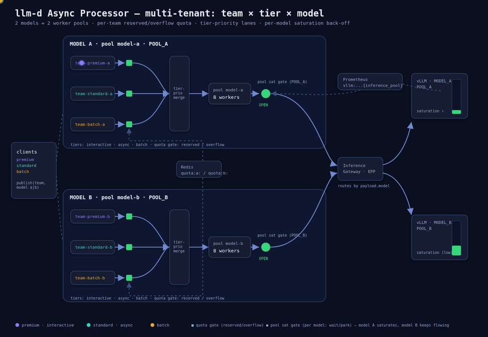

# Multi-Tenant Async Processing — Quota, Priority & Saturation

An advanced [Async Processor](https://github.com/llm-d/llm-d-async) scenario built on the
[asynchronous-processing](../README.md) guide, across three dimensions — **team × tier × model**. Each
**team** gets a per-team quota (reserved vs. overflow) and a priority **tier**; each **model** gets its
own worker pool with independent **saturation-aware back-off**, observed through self-hosted
Prometheus + Grafana (or GCP Cloud Monitoring on the Pub/Sub backend).

The scenario is the point; the **message queue is a pluggable backend** — it runs unchanged on **Redis
SortedSet** (the default here) or **GCP Pub/Sub**. The gate configuration, worker pools, and scenario
walkthroughs are identical across both; only the queue wiring and how you publish differ.



> [!NOTE]
> Source + regeneration for the diagram: [`diagram/`](diagram/) (`architecture.html` is the editable
> animated SVG).

## Overview

The demo simulates **two model pipelines** (`model-a`, `model-b`) behind llm-d Router. Each model
pipeline gets its **own worker pool** in `llm-d-async` — isolating worker concurrency, queue draining, and saturation
back-off per model — and within each pool three teams contend by **tier** and **quota**. That's **6 queues**
(3 teams × 2 models) → **2 worker pools**:

| Model Pipeline → Worker Pool | Team | Queue (Redis) | Tier | Reserved quota | Quota prefix |
| :-- | :-- | :-- | :-- | :-- | :-- |
| **`model-a`** | premium | `team-premium-a` | `interactive` | concurrency **2** | `quota:a:` |
| | standard | `team-standard-a` | `async` | concurrency **2** | `quota:a:` |
| | batch | `team-batch-a` | `batch` | concurrency **1** | `quota:a:` |
| **`model-b`** | premium | `team-premium-b` | `interactive` | concurrency **2** | `quota:b:` |
| | standard | `team-standard-b` | `async` | concurrency **2** | `quota:b:` |
| | batch | `team-batch-b` | `batch` | concurrency **1** | `quota:b:` |

> [!NOTE]
> **Single-Router Demo vs. Multi-Model Production:** In a full multi-model production environment, each model is typically served by its own `InferencePool` behind a gateway (e.g. using Gateway API HTTPRoutes with dedicated llm-d Routers). To keep this demo lightweight and runnable on a single GPU (or CPU test cluster), the walkthrough deploys a **single llm-d Router instance** and a single vLLM model server (`Qwen/Qwen3-8B`), with both logical model pipelines (`model-a` and `model-b`) pointing to that shared llm-d Router pool (`POOL_A=llm-d-router`, `POOL_B=llm-d-router`). If your cluster already has multiple `InferencePool`s deployed, you can point `POOL_A` and `POOL_B` to distinct pools for full physical backend isolation.

The three dimensions:

- **Model → worker pool isolation.** Each model track gets its own `llm-d-async` worker pool (`model-a`, `model-b`), independent concurrency limits, and dedicated saturation gates. In production with multiple `InferencePool`s, saturating one model pool parks only that model's workers without affecting the other. In this single-pool demo environment, both worker pools dispatch through the shared llm-d Router instance while demonstrating the independent queue, quota, and worker isolation mechanisms.
- **Queue as the serving dimension (tier × model).** A queue represents a **serving tier** for a target model
  (e.g., interactive latency-sensitive, standard async, or batch throughput), **not a rigid single-tenant silo**.
  In production, multiple distinct teams can publish into the **same queue** concurrently. The request payload
  identifies the team via `metadata.team`.
- **Team → reservation classification.** The per-team **`redis-quota`** gate runs in **`classifying`**
  mode (keyed dynamically on `metadata.team`, with a **per-model prefix** such as `quota:a:team:<team>`):
  each team maintains its own independent concurrency counter in Redis. When multiple teams share a serving queue,
  one team exceeding its quota does not exhaust another team's budget: within quota → `reserved` (org-guaranteed),
  over quota → `overflow` (admitted and deprioritized, **not** nacked).
- **Tier → priority.** A per-queue `tier` label: `interactive` (premium tier) > `async` (standard tier) > `batch`.

The [**tier-priority merge policy**](https://github.com/llm-d/llm-d-async/pull/294) runs
**per pool independently**: within each model it buckets requests into **6 strict lanes** by
`(classification, tier)`, dispatches them in order, and stamps **`x-llm-d-inference-objective`** via `lane_objectives`.

By defining matching [`InferenceObjective`](#1-apply-inferenceobjectives-and-deploy-flow-control-router)
resources in the cluster, `llm-d-async` and llm-d Router Flow Control speak the exact same language.
Requests carry the authoritative objective and tenant identity (`x-llm-d-inference-fairness-id`), allowing
llm-d Router to enforce multi-tenant fairness and priority band admission:

| Lane | Objective (`lane_objectives`) | Header `x-llm-d-inference-objective` | Router Band Priority | Who (within one model) |
| :-- | :-- | :-- | :-- | :-- |
| reserved + interactive | `reserved-interactive` | `reserved-interactive` | 100 | premium within quota |
| reserved + async | `reserved-async` | `reserved-async` | 60 | standard within quota |
| reserved + batch | `reserved-batch` | `reserved-batch` | 30 | batch within quota |
| overflow + interactive | `overflow-interactive` | `overflow-interactive` | 10 | premium over quota |
| overflow + async | `overflow-async` | `overflow-async` | 0 | standard over quota |
| overflow + batch | `overflow-batch` | `overflow-batch` | -10 | batch over quota |

So within each model **all reserved traffic drains before any overflow** (org priority), tier-ordered
within each class; and the two models are fully independent. On Redis SortedSet, within a lane dispatch
is earliest-deadline-first (the deadline is the sorted-set score).

### Priority Values: Flow Control ON vs. Flow Control OFF

Downstream priority is propagated via lane objective stamping (**`x-llm-d-inference-objective`**), which maps each request to a Kubernetes [`InferenceObjective`](#1-apply-inferenceobjectives-and-deploy-flow-control-router) resource where **higher numerical values represent higher scheduling priority** (100 down to -10).

#### With Flow Control ON (llm-d Router)
When llm-d Router is deployed with Flow Control enabled (`featureGates: [flowControl]` in `flow-control.yaml`):
- **Centralized Priority Bands:** When model server capacity saturates (detected in real time via `concurrency-detector` or `utilization-detector`), requests are held in memory across priority bands matching the `InferenceObjective` priority (100, 60, 30, 10, 0, -10).
- **Strict Band Dispatch:** llm-d router drains highest-priority bands first: all `reserved` bands (100, 60, 30) dispatch before any `overflow` band (10, 0, -10) is admitted.
- **Band Capacity & Drops on Full Bands:** Each priority band enforces isolated buffer limits via `maxRequests` and `maxBytes`. When a priority band reaches capacity, new incoming requests for that band are **dropped immediately (HTTP 429) regardless of that band's priority**. A high priority level does not grant unbounded buffer capacity; an overloaded priority 100 band drops its own incoming traffic rather than evicting queued requests from other bands.
- **Retries with Backoff in `llm-d-async`:** Requests dropped or rejected by router flow control (e.g., when a priority band is full or during in-flight eviction, returning HTTP 429) are caught by `llm-d-async` and **retried with exponential backoff and jitter** provided the request's deadline has not expired.
- **Multi-Tenant Fairness:** Within any single priority band, the router enforces tenant fairness (`round-robin-fairness-policy` over `x-llm-d-inference-fairness-id`, which is stamped from `metadata.team`). No single tenant can monopolize a priority tier.
- **Order Preservation:** Within each tenant's individual flow, requests dispatch in arrival order (`fcfs-ordering-policy`).
- **In-Flight Eviction (`enableEviction: true`):** When eviction is enabled for Flow Control, only **negative-priority in-flight requests** (`priority < 0`, such as `overflow-batch` at priority `-10`) can be canceled and evicted after already being sent to the model server. While standard gated dispatch only holds back newly arriving work, in-flight eviction actively reclaims occupied GPU compute and KV cache from sheddable background requests when higher-priority traffic is blocked by pool saturation.
- For detailed architecture, lifecycle, and policy plugins, see the [Flow Control Documentation](https://llm-d.ai/docs/architecture/core/router/epp/flow-control).

#### With Flow Control OFF (Baseline Router with Saturation Detection)
When llm-d Router operates in standard baseline mode (without the `flowControl` feature gate):
- **Pass-Through Scheduling:** The router does not maintain priority band queues or tenant fairness buffers.
- **Immediate Rejection of Sheddable Requests:** When the pool is saturated, **"sheddable" requests (those with negative priority, `priority < 0`) are immediately rejected with HTTP 429 (Too Many Requests)**. All other requests pass directly to the model servers and are scheduled via baseline routing plugins (such as `prefix-cache-scorer` and `queue-scorer`).
- **Retries with Backoff in `llm-d-async`:** Requests dropped or rejected are caught by `llm-d-async` and **retried with exponential backoff and jitter** provided the request's deadline has not expired.
- **Saturation Telemetry:** The router still exposes real-time pool saturation metrics (`inference_extension_flow_control_pool_saturation` or vLLM metrics).
- **Upstream Priority & Backpressure in `llm-d-async`:** Priority enforcement shifts entirely **upstream to the Async Processor**:
  - The `tier-priority` merge policy ensures that all `reserved` requests are dequeued and dispatched before `overflow` traffic, and higher tiers dispatch before lower tiers.
  - When downstream saturation is detected via Prometheus, the worker pool gate (`wait-on-refuse` or `tier-priority-admission`) intervenes directly in `llm-d-async` by parking workers in-memory (`ActionWait`), refusing messages (`ActionRefuse`), or dropping them (`ActionDrop`).
  - As a result, model servers remain protected against overload even without router-side priority queuing.

#### With Flow Control OFF (Baseline Router without Saturation Detection)
When saturation detection is disabled (no saturation detector configured in llm-d Router) every request is immediately dispatched to available model servers regardless of its assigned priority value.

> [!NOTE]
> **Over-quota is deprioritized, not dropped.** In `classifying` mode, requests beyond a team's
> reserved quota become `overflow` and are dispatched after all `reserved` traffic, rather than
> nacked/redelivered. To hard-throttle instead, set `gate_params.gating_mode: blocking` (over-quota
> returns to the queue; backlog grows).

## Prerequisites

This guide layers on the base [asynchronous-processing](../README.md) guide — complete its
[Prerequisites](../README.md#prerequisites) first (client tools, cluster, GAIE CRDs,
[`guides/env.sh`](../../../env.sh), the HF-token secret), then add the following.

- **llm-d router with Flow Control.** This guide uses llm-d Router configured with **Flow Control**
  enabled rather than the standard baseline router. Flow Control assigns incoming requests to priority bands
  based on the `InferenceObjective` CRD referenced by each request.

- **InferenceObjective CRD and Resources.** Requests dispatched by `llm-d-async` carry the
  `x-llm-d-inference-objective` header matching the request's priority lane. You must install the
  `InferenceObjective` CRD and define the objective resources in your cluster matching your `InferencePool`.

- **Model Serving Stack & Router.** The walkthrough deploys a single llm-d Router instance (which creates
  the llm-d Router InferencePool) and a single vLLM model server serving `Qwen/Qwen3-8B`. In a multi-model
  environment, you can point `POOL_A` and `POOL_B` to separate `InferencePool`s for physical pool isolation.

- **Environment.** In addition to the base guide's variables:

  ```bash
  export REPO_ROOT=$(realpath $(git rev-parse --show-toplevel))
  source ${REPO_ROOT}/guides/env.sh
  export MT=${REPO_ROOT}/guides/batch-serving/asynchronous-processing/multitenant

  export NAMESPACE=llm-d-async
  export ASYNC_VERSION=v0.9.1          # llm-d-async release (supports lane_objectives & tier-priority)

  # InferencePool names (saturation-gate scope) and served model names (go in payload.model).
  # In this single-router demo, both logical model pools point to the deployed llm-d-router instance:
  export POOL_A=llm-d-router POOL_B=llm-d-router       # InferencePool names (saturation-gate scope)
  export POOL_NAME=llm-d-router                       # Shared pool name for InferenceObjectives
  export MODEL_A=Qwen/Qwen3-8B MODEL_B=Qwen/Qwen3-8B   # served model names (go in payload.model)

  # Scenario C only: the base URL the saturation gates read PromQL from. The default
  # matches the monitoring setup; override it if your Prometheus lives somewhere else:
  export PROM_URL=http://llmd-kube-prometheus-stack-prometheus.llm-d-monitoring.svc.cluster.local:9090

  # Scenario C only: concurrent requests per model at which that model's pool counts as
  # saturated. Must be BELOW the pool's worker count (8 in the overlays) — see Scenario C:
  export SAT_CAP=4
  ```

## Configuration and Deployment

The value overlays live in [`values/`](values/) with literal placeholders (`NAMESPACE`, `IGW_HOST`,
`POOL_A`, `POOL_B`, `POOL_NAME`, `SAT_CAP` in the saturation overlays, and `PROM_URL`). Render one for your
environment before installing:

```bash
render() {   # render <overlay-path> -> stdout
  sed -e "s/NAMESPACE/${NAMESPACE}/g" -e "s#IGW_HOST#${IP}#g" \
      -e "s/POOL_A/${POOL_A}/g" -e "s/POOL_B/${POOL_B}/g" \
      -e "s/POOL_NAME/${POOL_NAME:-${POOL_A}}/g" \
      -e "s/SAT_CAP/${SAT_CAP:-4}/g" \
      -e "s#PROM_URL#${PROM_URL:-http://llmd-kube-prometheus-stack-prometheus.llm-d-monitoring.svc.cluster.local:9090}#g" "$1"
}
```

`MODEL_A` / `MODEL_B` are **not** overlay placeholders — they never appear in a value, only in
comments. The served model names reach the system through `payload.model`, which the `publish()`
helper below fills in from `${MODEL_A}` / `${MODEL_B}`.

### 1. Install CRDs and Deploy the Backend Model Server

Install the `InferenceObjective` CRD and deploy the vLLM model server:

```bash
kubectl create namespace ${NAMESPACE} --dry-run=client -o yaml | kubectl apply -f -

# 1. Install InferenceObjective CRD (ROUTER_RELEASE_URL exported from guides/env.sh)
kubectl apply -f https://github.com/llm-d/llm-d-router/${ROUTER_RELEASE_URL}/manifests.yaml

# 2. Deploy vLLM backend (copy secret & deploy manifest)
kubectl apply -n ${NAMESPACE} -f ${MT}/manifests/vllm.yaml
```

> [!TIP]
> **Prometheus and Grafana:** If you do not already have Prometheus running, deploy the standard stack using the central [Observability Setup Guide](../../../docs/operations/observability/setup.md) (`${REPO_ROOT}/guides/recipes/observability/install-prometheus-grafana.sh`). On GKE, you can also leverage [Google Managed Prometheus (GMP)](#observability).

### 2. Configure llm-d-router and Apply InferenceObjectives

Deploy llm-d Router configured with Flow Control and apply the 6 lane `InferenceObjective`s:

```bash
# 1. Apply InferenceObjectives for the 6 tier-priority lanes
render ${MT}/manifests/inferenceobjectives.yaml | kubectl apply -f -

# 2. Deploy llm-d-router with Flow Control priority bands
helm upgrade --install llm-d-router \
    ${ROUTER_STANDALONE_CHART} \
    -f ${REPO_ROOT}/guides/recipes/router/base.values.yaml \
    -f ${MT}/values/router/flow-control.yaml \
    -n ${NAMESPACE} --version ${ROUTER_CHART_VERSION}

# Get router ClusterIP
export IP=$(kubectl get service llm-d-router-epp -n ${NAMESPACE} -o jsonpath='{.spec.clusterIP}')
```

> [!NOTE]
> **Single Router & InferencePool in Demo:** Deploying llm-d Router creates a single `InferencePool` named `llm-d-router`. Both `model-a` and `model-b` worker pools dispatch through this shared llm-d Router, so `render` maps `POOL_NAME` to `${POOL_NAME:-${POOL_A}}` (`llm-d-router`), binding all 6 `InferenceObjective`s to this shared pool.
>
> **Multi-Pool Isolation Architecture:** An `InferenceObjective` resource binds to a single `poolRef.name`, and Kubernetes resource names are unique per namespace. In a production multi-tenant architecture with separate Inference Pools (`POOL_A != POOL_B`), the recommended pattern isolates each pool and router in its own namespace (e.g., `ns-pool-a` and `ns-pool-b`). In that case, apply `manifests/inferenceobjectives.yaml` in each namespace with `POOL_NAME` set to that namespace's respective pool name.

### 3. Deploy Redis and llm-d-async

The bundled Redis backs both the per-team request queues and the quota counters.

```bash
kubectl apply -n ${NAMESPACE} -f ${MT}/manifests/redis.yaml

render ${MT}/values/redis/quota-only.yaml > /tmp/mt-redis.yaml
helm install llm-d-async \
    oci://ghcr.io/llm-d/charts/llm-d-async \
    -f /tmp/mt-redis.yaml \
    -n ${NAMESPACE} --version ${ASYNC_VERSION}

kubectl -n ${NAMESPACE} get deploy llm-d-async -o yaml | grep transport
# -> --transport=redis-sortedset
```

Queues are just sorted-set keys — no per-team resource creation needed; they appear on first publish.

<details>
<summary><b>GCP Pub/Sub backend</b></summary>

Requires a GCP project with the Pub/Sub API enabled and `gcloud` authenticated. `gcp-setup.sh` creates
the per-`(team, model)` topics + subscriptions, the results topic, and the service account + IAM.

<!-- llm-d-cicd:skip start -->
```bash
export PROJECT_ID=your-project
${MT}/scripts/gcp-setup.sh                       # topics, subscriptions, results topic, SA + IAM
kubectl create namespace ${NAMESPACE}
kubectl apply -n ${NAMESPACE} -f ${MT}/manifests/redis.yaml   # still needed for the quota counters

sed -e "s/NAMESPACE/${NAMESPACE}/g" -e "s#IGW_HOST#${IP}#g" -e "s/PROJECT_ID/${PROJECT_ID}/g" \
    ${MT}/values/pubsub/quota-only.yaml > /tmp/mt-pubsub.yaml
helm install llm-d-async \
    oci://ghcr.io/llm-d/charts/llm-d-async \
    -f /tmp/mt-pubsub.yaml \
    -n ${NAMESPACE} --create-namespace --version ${ASYNC_VERSION}
```
<!-- llm-d-cicd:skip end -->

`gcp-setup.sh` binds the `async-processor` service account to `pubsub.subscriber` + `pubsub.publisher`

- `pubsub.viewer` (the readiness probe's `GetSubscription`) + `monitoring.viewer` (broker backlog). With
Workload Identity, follow the printed binding to map the GSA onto the chart's `llm-d-async` KSA.

</details>

> [!NOTE]
> **Configuration Updates & Dynamic Reloading:**
> - **Hot-Reloadable Redis Queue Transport:** When running `llm-d-async` with `--transport redis-sortedset`, `--transport-config-file`, and `--transport-config-watch-interval`, changes to the `queues` array (such as adding, updating, or removing queues and quota parameters) are watched and dynamically reloaded at runtime without dropping in-flight requests or requiring pod restarts.
> - **Static Helm Configurations:** When using inline Helm values without watch intervals, or when altering immutable transport settings (such as Redis URL, worker pool concurrency, merge policy, or on the GCP Pub/Sub backend), configuration is read once at pod startup. Apply changes with:
>   ```bash
>   kubectl rollout restart deploy/llm-d-async -n ${NAMESPACE}
>   ```

## Publishing requests

A request is a JSON body — `id`, `created`, `deadline`, a `payload` (the inference request that is dispatched to llm-d Router), and `metadata.team` (the tenant identifier that the quota gate evaluates).

### Queues as Serving Dimensions vs. Team Identity
- **The Queue is a Serving Dimension:** A queue corresponds to an service tier and model pair (e.g., `interactive` tier for `model-a`), not an isolated single-tenant partition although it is used as such in this demo because each team uses a separate queue. 
- **Multiple Teams in One Queue:** Requests from different teams can be published into the **exact same queue**. The team identity is carried per-request inside `metadata.team` (e.g., `team: "marketing"` vs. `team: "engineering"`).
- **Per-Team Quota Accounting:** The `redis-quota` gate dynamically reads `metadata.team` on each request and increments/decrements that specific team's counter (`quota:<model>:team:<team>`). If Team A saturates its reserved limit, Team A's excess traffic is deprioritized to `overflow`, while Team B publishing to that same queue continues to receive `reserved` capacity.
- **Fairness ID:** At dispatch, `llm-d-async` stamps `metadata.team` into the `x-llm-d-inference-fairness-id` header so that llm-d Router's Flow Control fairness policy treats tenants equitably during queue contention.

In this demo walkthrough, queues are labeled with team names (e.g. `team-premium-a`) for clear attribution, but you can pass any team name into `publish <team> <a|b> [count]`:

```bash
publish() {                                   # publish <team> <a|b> [count]
  local team=$1 model=$2 n=${3:-1} ttl=${PUBLISH_TTL:-300} now dl run name i pairs=()
  [ "$model" = a ] && name="$MODEL_A" || name="$MODEL_B"
  now=$(date +%s); dl=$((now+ttl)); run="${now}-${RANDOM}"
  # The whole batch goes in one exec — ZADD takes any number of score/member pairs. One exec
  # per request trickled `publish batch a 100` in over minutes, and the workers drained it as
  # fast as it arrived: no backlog to classify as overflow. The batch shares a score, so
  # ZPopMin breaks ties on the member string — the zero-padded index makes that publish order.
  for i in $(seq 1 "$n"); do
    pairs+=("$dl" "$(printf '{"internal":{},"request_kind":"plain","data":{"id":"%s-%s-%s-%04d","created":%s,"deadline":%s,"payload":{"model":"%s","prompt":"summarize this","max_tokens":64},"metadata":{"team":"%s"}}}' \
      "$team" "$model" "$run" "$i" "$now" "$dl" "$name" "$team")")
  done
  kubectl -n ${NAMESPACE} exec -i deploy/redis -- redis-cli ZADD "team-${team}-${model}" "${pairs[@]}"
}
# e.g.  publish premium a 5    # premium team, model A; prints the number enqueued.
#   PUBLISH_TTL=900 publish batch a 400   # one deadline covers the batch — raise it if a
#                                         # saturated pool will not drain within 300s.
# Keep the count in the low thousands: every pair travels in the one exec's argv.
```

<details>
<summary><b>Publishing to GCP Pub/Sub</b></summary>

<!-- llm-d-cicd:skip start -->
```bash
publish() {                                   # publish <team> <a|b> [count]
  local team=$1 model=$2 n=${3:-1} ttl=${PUBLISH_TTL:-300} par=${PUBLISH_PAR:-8} now dl run name i
  [ "$model" = a ] && name="$MODEL_A" || name="$MODEL_B"
  now=$(date +%s); dl=$((now+ttl)); run="${now}-${RANDOM}"
  # gcloud publishes one message per invocation, so keep `par` of them in flight: serially,
  # `publish batch a 100` takes minutes and never builds the backlog the scenarios need.
  # Each invocation is a fresh Python process — lower PUBLISH_PAR if memory is tight.
  for i in $(seq 1 "$n"); do
    gcloud pubsub topics publish "team-${team}-${model}-requests" --project "$PROJECT_ID" \
      --attribute "team=${team}" \
      --message "$(printf '{"id":"%s-%s-%s-%04d","created":%s,"deadline":%s,"payload":{"model":"%s","prompt":"summarize this","max_tokens":64},"metadata":{"team":"%s"}}' \
        "$team" "$model" "$run" "$i" "$now" "$dl" "$name" "$team")" >/dev/null &
    (( i % par )) || wait
  done
  wait
}
```
<!-- llm-d-cicd:skip end -->
</details>

### Stress Testing Scripts

Two end-to-end stress testing scripts are provided in [`scripts/`](scripts/) to drive sustained multi-tenant traffic (team × tier × model) concurrently to test quota, priority lanes, and populate dashboard metrics:

- **GCP Pub/Sub:** [`scripts/stress-test-pubsub.py`](scripts/stress-test-pubsub.py)
  ```bash
  PROJECT_ID=${PROJECT_ID} ./scripts/stress-test-pubsub.py
  ```
- **Redis SortedSet:** [`scripts/stress-test-redis.py`](scripts/stress-test-redis.py)
  ```bash
  NAMESPACE=${NAMESPACE} ./scripts/stress-test-redis.py
  ```

## Scenarios A & B — reserved vs. overflow

**A. Steady state (one model)** — each team within its reserved quota on model A:

```bash
for t in premium standard batch; do publish "$t" a 1 & done; wait
```

Every request is within its team's quota, so all are `reserved` and dispatched in tier order
(premium→standard→batch), stamped with their respective lane objectives (`reserved-interactive`, `reserved-async`, `reserved-batch`). Read results from the per-model list:

```bash
kubectl -n ${NAMESPACE} exec deploy/redis -- redis-cli LRANGE results-a-list 0 -1   # model B -> results-b-list
```

> Each result is JSON with `id`, `payload` (the upstream response body), and `status_code` (the upstream
> HTTP status). Non-HTTP failures carry `status_code: 0` plus `error_code`/`error_message` (e.g.
> `GATE_DROPPED`, `DEADLINE_EXCEEDED`).

**B. Overflow deprioritization + model isolation** — flood `batch` on **model A** past its reserved
quota (1) while `premium` on model A and everything on model B run within quota:

```bash
publish batch   a 100 &   # far exceeds batch's reserved 1 on A -> excess is overflow (lane 5)
publish premium a 20  &   # premium reserved on A (lane 0) -> always jumps ahead
publish premium b 20  &   # model B, unaffected by A's overload
wait
```

- **Priority within model A:** batch's first concurrent request stays `reserved` (lane 2); the rest are
  `overflow` (lane 5), dispatched only after all reserved and higher-tier overflow. The
  per-`(team, model)` counter caps at the reserved limit; the excess flows as overflow (not nacked):

  ```bash
  kubectl -n ${NAMESPACE} exec deploy/redis -- redis-cli GET quota:a:team:batch     # <= 1 (model A, batch)
  kubectl -n ${NAMESPACE} exec deploy/redis -- redis-cli GET quota:b:team:premium   # model B counter, independent
  ```

- **Model isolation:** model B has its own pool and counters, so A's batch overload does not slow B —
  `results-b-list` keeps filling at model B's own rate.

## Scenario C — priority under saturation

Switch to the saturation overlay (adds the per-pool `wait-on-refuse(prometheus-query)` gates) after
bringing up [self-hosted Prometheus](#observability), then drive sustained load:

```bash
render ${MT}/values/redis/saturation-prometheus.yaml > /tmp/mt-redis-sat.yaml
grep prometheusURL /tmp/mt-redis-sat.yaml    # must be your Prometheus, not the literal PROM_URL
helm upgrade llm-d-async \
    oci://ghcr.io/llm-d/charts/llm-d-async \
    -f /tmp/mt-redis-sat.yaml -n ${NAMESPACE} --version ${ASYNC_VERSION}
```

**Confirm the gates can reach Prometheus before you read anything into the result.** The gates are
`wait-on-refuse(prometheus-query)` with `"fallback":"1"` — a budget of 1 is a wide-open gate, so an
unreachable Prometheus produces a run that looks perfect and demonstrates nothing.

```bash
# 1. The URL the gates use resolves and answers, from inside the cluster:
kubectl run --rm -i promcheck --image=curlimages/curl --restart=Never -n ${NAMESPACE} -- \
    curl -sS --max-time 5 "${PROM_URL}/api/v1/query?query=up" | head -c 120
# -> {"status":"success",...}   anything else means the gates are blind

# 2. vLLM is actually being scraped (the metric the gates read):
kubectl run --rm -i promcheck-vllm --image=curlimages/curl --restart=Never -n ${NAMESPACE} -- \
    curl -sS --max-time 5 --data-urlencode "query=sum(vllm:num_requests_running{inference_pool=\"${POOL_A}\"})" \
    "${PROM_URL}/api/v1/query" | head -c 200
# -> a result with a value; an empty "result":[] means the PodMonitor is not matching

# 3. The processor is not silently falling back:
kubectl logs -n ${NAMESPACE} deploy/llm-d-async --tail=200 | grep -i "using fallback value" \
    && echo ">>> gates are on the fallback budget (1 = wide open), not on live metrics"
```

Then drive sustained load:

```bash
publish premium a 200 & publish batch a 200 &   # heavy on model A; keep model B light
wait
```

As model A's `InferencePool` saturates, `model-a`'s budget → 0 and its workers **park in-memory
(`ActionWait`)** — so `model-a` stops pulling new work without churning the backlog, while **`model-b`
keeps dispatching at full rate** when `POOL_B` points to an independent, unsaturated pool. *(Note: In this
single-router demo where both `POOL_A` and `POOL_B` point to `llm-d-router`, both gates monitor the shared model
server; in a multi-pool setup where `POOL_A != POOL_B`, only model A parks.)* As capacity frees, the
merge policy drains the highest lanes first. Query each model's budget independently:

```bash
# Assumes the central Prometheus install from Observability below; point this at
# whatever ${PROM_URL} resolves to if your Prometheus lives elsewhere.
kubectl port-forward -n llm-d-monitoring svc/llmd-kube-prometheus-stack-prometheus 9090:9090 &
curl -s localhost:9090/api/v1/query --data-urlencode \
  "query=clamp(1 - sum(vllm:num_requests_running{inference_pool=\"${POOL_A}\"})/${SAT_CAP}, 0, 1)"  # model-a budget -> 0
curl -s localhost:9090/api/v1/query --data-urlencode \
  "query=clamp(1 - sum(vllm:num_requests_running{inference_pool=\"${POOL_B}\"})/${SAT_CAP}, 0, 1)"  # model-b budget (~1)

# Parked workers hold their message instead of dispatching, so model-a's in-flight count
# hovers near ${SAT_CAP} while model-b's climbs to its 8 workers:
curl -s localhost:9090/api/v1/query --data-urlencode \
  "query=sum by (pool_name) (llm_d_async_async_inflight_requests)"
```

**What "saturated" should look like:** under this load `model-a`'s budget reaches **exactly `0`** and
stays there in stretches, while `model-b` sits at `~1`. If `model-a` never reaches 0, the scenario is
not actually happening — nothing parks, and the run still completes and looks healthy. Check `SAT_CAP`
against the sizing rule below before concluding the gate worked.

> [!IMPORTANT]
> **`SAT_CAP` must be smaller than the pool's `workers`.** `prometheus-query` closes its gate at
> budget `<= 0`, and `clamp(..., 0, 1)` floors the budget at 0 — so the gate closes only once
> `SAT_CAP` requests are running on that model. Scenario C's load is entirely async, so the only
> thing driving that count is the pool's own workers (`8` per model in the overlays), and a worker
> evaluates the gate while holding a message it has not dispatched yet: at most `workers - 1` of the
> pool's requests are running at that moment. Set `SAT_CAP` at or above `workers` and the budget can
> never reach 0. The default `SAT_CAP=4` leaves margin on two counts: `vllm:num_requests_running`
> counts only requests the model server is actively running, not ones waiting in its queue, and the
> gate reads it through a 15s `PodMonitor` scrape plus `prometheusCacheTTL: 5s`, so the count it acts
> on is up to ~20s behind the pool.
>
> In production the divisor is a capacity number, not a demo knob: size it to the pool's real
> concurrent-request capacity (`ready pods × per-pod concurrency`) and give the pool enough workers
> to reach it. The gate is back-pressure against **all** traffic on the pool — including synchronous
> traffic that does not go through llm-d-async — so there the count is not bounded by this processor's workers.

## Scenario D — tier-priority-admission with prometheus-saturation

An advanced alternative to `wait-on-refuse(prometheus-query)` is the **`tier-priority-admission`** worker pool gate,
paired with **`prometheus-saturation`** as its inner saturation detector.

While `wait-on-refuse` applies a uniform park action to all requests when the pool is saturated, `tier-priority-admission`
issues a **three-way verdict** based on saturation × tier × classification:

| Pool Status | Request Classification & Tier | Gate Verdict | Behavior |
| :-- | :-- | :-- | :-- |
| **Unsaturated** | Any | `ActionContinue` | Dispatches immediately to llm-d router |
| **Saturated** | `reserved` (any tier) | `ActionWait` | Parks the worker in-memory until capacity frees |
| **Saturated** | `overflow` + `interactive` | `ActionDrop` | Drops immediately with an HTTP 429 payload |
| **Saturated** | `overflow` + `async` / `batch` | `ActionRefuse` | Refuses message and re-enqueues for later delivery |

The configurations are provided in:
- **Redis SortedSet:** [`values/redis/tier-priority-admission.yaml`](values/redis/tier-priority-admission.yaml)
- **GCP Pub/Sub:** [`values/pubsub/tier-priority-admission.yaml`](values/pubsub/tier-priority-admission.yaml)

To deploy on **Redis**:

```bash
render ${MT}/values/redis/tier-priority-admission.yaml > /tmp/mt-tier-priority-admission.yaml
helm upgrade llm-d-async \
    oci://ghcr.io/llm-d/charts/llm-d-async \
    -f /tmp/mt-tier-priority-admission.yaml -n ${NAMESPACE} --version ${ASYNC_VERSION}
```

<details>
<summary><b>GCP Pub/Sub deployment</b></summary>

```bash
sed -e "s/NAMESPACE/${NAMESPACE}/g" -e "s#IGW_HOST#${IP}#g" \
    -e "s/POOL_A/${POOL_A}/g" -e "s/POOL_B/${POOL_B}/g" \
    -e "s/PROJECT_ID/${PROJECT_ID}/g" \
    -e "s#PROM_URL#${PROM_URL:-http://llmd-kube-prometheus-stack-prometheus.llm-d-monitoring.svc.cluster.local:9090}#g" \
    ${MT}/values/pubsub/tier-priority-admission.yaml > /tmp/mt-pubsub-tier-priority.yaml

helm upgrade llm-d-async \
    oci://ghcr.io/llm-d/charts/llm-d-async \
    -f /tmp/mt-pubsub-tier-priority.yaml -n ${NAMESPACE} --version ${ASYNC_VERSION}
```
</details>

The inner `prometheus-saturation` gate queries the Prometheus server (`${PROM_URL}`) for the metric `inference_extension_flow_control_pool_saturation` exported by llm-d Router's EPP `/metrics` endpoint.

> [!IMPORTANT]
> **Router Metrics Scraping:** `values/router/flow-control.yaml` configures `router.monitoring.prometheus.enabled: true`, which automatically deploys `ServiceMonitor/llm-d-router-epp-monitor` when the router chart is installed. This ensures Prometheus actively scrapes `inference_extension_flow_control_pool_saturation` (and `llm_d_epp_flow_control_pool_saturation`). Without these metrics in Prometheus, the gate receives empty data and silently falls back to `fallback: 1.0` (budget 1.0, wide open), preventing the gate from ever closing under saturation.

Verify that the metric is being scraped and that the gate evaluates metrics live:

```bash
# 1. Verify Prometheus has scraped the saturation metric from llm-d-router:
curl -s localhost:9090/api/v1/query --data-urlencode \
    "query=inference_extension_flow_control_pool_saturation{inference_pool=\"${POOL_A}\"}"

# 2. Verify the gate initialized with the inner prometheus-saturation source:
kubectl logs -n ${NAMESPACE} deploy/llm-d-async | grep -i "tier-priority-admission"

# 3. Check gate evaluation and verify source availability (must report 1, not 0):
ASYNC_POD_IP=$(kubectl get pod -l app.kubernetes.io/name=llm-d-async -n ${NAMESPACE} -o jsonpath='{.items[0].status.podIP}')
kubectl run curl-prom --rm -i --restart=Never -n ${NAMESPACE} --image=curlimages/curl -- \
    curl -s "http://${ASYNC_POD_IP}:9090/metrics" | grep "async_gate_metric_source_available"
```

> [!NOTE]
> `async_gate_metric_source_available` must be `1`. If it reports `0`, the gate failed to query Prometheus or received no metric samples, causing it to fall back to an open budget (`fallback: 1.0`). A value of `1` confirms that the gate is receiving real live measurements from Prometheus.

## Observability

Self-hosted Prometheus + Grafana works on any cluster and the gates query it in **real time**; it is
the path for the Redis backend. You can leverage the centralized [Observability Setup Guide](../../../docs/operations/observability/setup.md)
to install the standard Prometheus and Grafana stack:

```bash
# 1. Install standard Prometheus + Grafana stack
${REPO_ROOT}/guides/recipes/observability/install-prometheus-grafana.sh

# 2. Scrape the vLLM model server (llm-d Router EPP is scraped automatically via its Helm chart ServiceMonitor)
kubectl apply -f ${MT}/manifests/prometheus-vllm-podmonitor.yaml
```

Open Grafana (`admin`/`admin` in the demo values) and run the Scenario-C load; the **Async Processor**
dashboard shows `async_dispatch_budget`, `async_inflight_requests`, `async_gate_decisions_total`, and
`async_broker_backlog{queue_name,pool_name}`. Break panels down by **`pool_name`** (`model-a` /
`model-b`) for the per-model view and by **`queue_name`** for the per-team-per-model view.
`async_dispatch_budget` is the **queue** gates' budget (the per-team quota gates), so it says nothing
about the per-pool saturation gates. Those report through `async_gate_metric_value` — the value the
gate last read, i.e. the `clamp(...)` result — against `async_gate_metric_threshold`, which the gate
closes at (`value <= threshold`, and `prometheus-query` pins the threshold to `0`). Both are labelled
by the owning `pool_name`:

```promql
llm_d_async_async_gate_metric_value{pool_name="model-a"}       # -> 0 while the pool is parked
llm_d_async_async_gate_metric_threshold{pool_name="model-a"}   # -> 0
```

Their absence is itself a signal: the gauges are only written on a **successful** read, so a missing
or frozen `async_gate_metric_value` means the gate is running on its fallback budget. Cross-check
against Prometheus directly as in [Scenario C](#scenario-c--priority-under-saturation).

<details>
<summary><b>GCP Cloud Monitoring (GKE)</b></summary>

<!-- llm-d-cicd:skip start -->
```bash
kubectl apply -n ${NAMESPACE} -f ${MT}/manifests/gmp-podmonitoring.yaml    # AP metrics -> Cloud Monitoring

# Deploy Cloud Monitoring dashboard (supports both Redis and Pub/Sub backends):
gcloud monitoring dashboards create --project ${PROJECT_ID} \
  --config-from-file=${MT}/dashboards/cloud-monitoring.json

# For the gates' in-cluster PromQL reads on Pub/Sub (option A), deploy the GMP query frontend and
# upgrade to the GMP saturation overlay:
kubectl apply -n ${NAMESPACE} -f ${MT}/manifests/gmp-frontend.yaml
sed -e "s/NAMESPACE/${NAMESPACE}/g" -e "s#IGW_HOST#${IP}#g" -e "s/POOL_A/${POOL_A}/g" \
    -e "s/POOL_B/${POOL_B}/g" -e "s/PROJECT_ID/${PROJECT_ID}/g" \
    ${MT}/values/pubsub/saturation-gmp.yaml > /tmp/mt-pubsub-sat.yaml
helm upgrade llm-d-async oci://ghcr.io/llm-d/charts/llm-d-async \
  -f /tmp/mt-pubsub-sat.yaml -n ${NAMESPACE} --version ${ASYNC_VERSION}
```
<!-- llm-d-cicd:skip end -->

The `PodMonitoring` ingests the AP metrics; the dashboards chart request/success rate, in-flight, p95
latency, broker backlog (`llm_d_async_async_broker_backlog`), in-process queue depth (`llm_d_async_async_queue_depth`),
exceeded deadlines, deadline proximity (`llm_d_async_async_deadline_proximity_millis`), and token throughput.
Note that deadline proximity only works when Redis Sorted Set queues are used (`--transport=redis-sortedset`).
The gate-metric panels need an image newer than v0.7.2. GMP / Monarch lags real time ~1–2 min, so gate control
is bang-bang on that timescale; the self-hosted Prometheus path reacts within one scrape.
</details>

## Notes & gotchas

- **Image / version.** The overlays no longer pin an image tag — the image tracks the chart's
  `appVersion`, selected by `--version ${ASYNC_VERSION}`. Use a release whose app image actually exists
  (v0.7.4+).
- **Reserved quota vs. pool size (per model).** Each team's quota is its *reserved* capacity (priority
  lane) in `classifying` mode, not a hard cap — over-quota flows as `overflow`. Within each model pool,
  keep the **sum** of that model's reserved quotas at or below the pool's worker count.
- **Per-model quota counters** are keyed `quota:<a|b>:team:<team>`, so a team's reserved capacity on
  model A is independent of its capacity on model B.
- **Saturation gate.** The Scenario C overlays use `prometheus-query` over `vllm:num_requests_running`. The
  `prometheus-saturation` gate (Scenario D) instead expects the EPP metric
  `inference_extension_flow_control_pool_saturation`.
- **Saturation divisor vs. pool size.** `SAT_CAP` is the concurrency at which a model counts as
  saturated, and the gate closes only when the budget hits 0 — i.e. only once `SAT_CAP` requests are
  running. Keep it **below** that pool's `workers`, or async load alone can never close the gate; see
  [Scenario C](#scenario-c--priority-under-saturation).
- **An unreachable Prometheus fails open, not closed.** The saturation gates set `"fallback":"1"`, and
  a budget of 1 is a fully open gate. If `PROM_URL` is wrong, or the vLLM `PodMonitor` matches nothing,
  Scenario C completes cleanly and demonstrates nothing — no error, no parked pool. Run the three
  checks in [Scenario C](#scenario-c--priority-under-saturation) before drawing conclusions from a run.
- **Deadline Proximity.** `llm_d_async_async_deadline_proximity_millis` is only supported when using Redis Sorted Set queues (`--transport=redis-sortedset`). Cloud Pub/Sub cannot expose per-item deadlines, so this metric is only emitted on Redis.

## Cleanup

```bash
helm uninstall llm-d-async -n ${NAMESPACE}
helm uninstall llm-d-router -n ${NAMESPACE}
render ${MT}/manifests/inferenceobjectives.yaml | kubectl delete -f -
kubectl delete -n ${NAMESPACE} -f ${MT}/manifests/vllm.yaml
kubectl delete -n ${NAMESPACE} -f ${MT}/manifests/redis.yaml
kubectl delete -f ${MT}/manifests/prometheus-vllm-podmonitor.yaml
```

<details>
<summary><b>GCP Pub/Sub cleanup</b></summary>

<!-- llm-d-cicd:skip start -->
```bash
kubectl delete -n ${NAMESPACE} -f ${MT}/manifests/gmp-frontend.yaml -f ${MT}/manifests/gmp-podmonitoring.yaml
gcloud monitoring dashboards list --project ${PROJECT_ID} --filter='displayName:"Async Processor"' \
  --format='value(name)' | xargs -r -n1 gcloud monitoring dashboards delete --project ${PROJECT_ID} --quiet
PROJECT_ID=${PROJECT_ID} DELETE_SA=1 ${MT}/scripts/gcp-teardown.sh
```
<!-- llm-d-cicd:skip end -->
</details>
