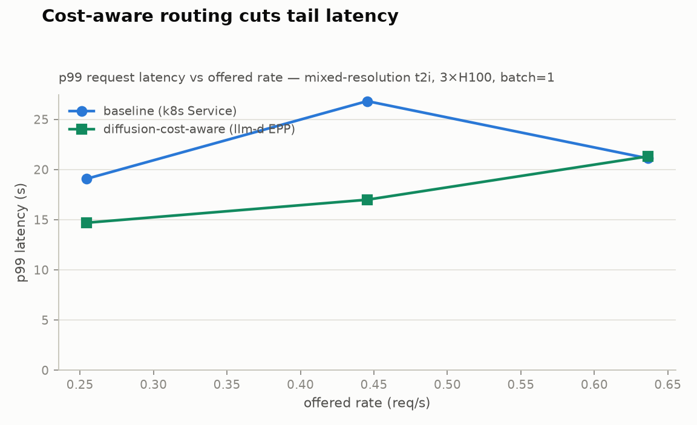
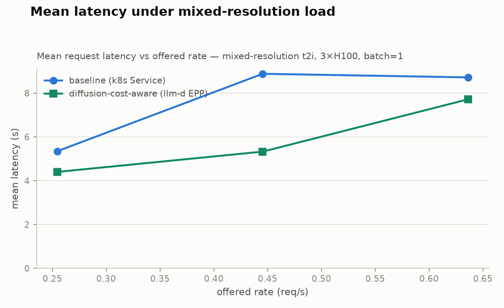
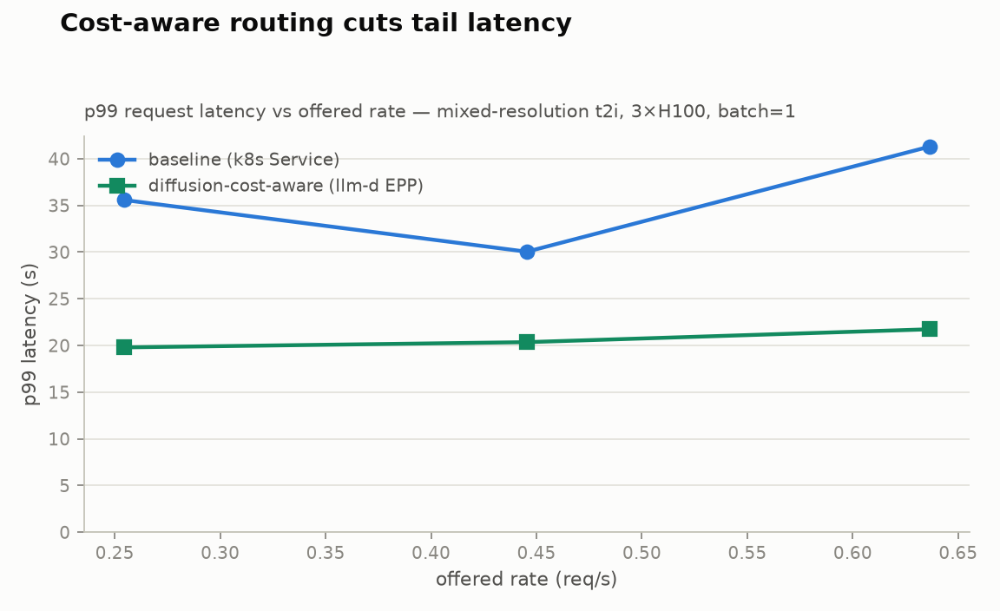
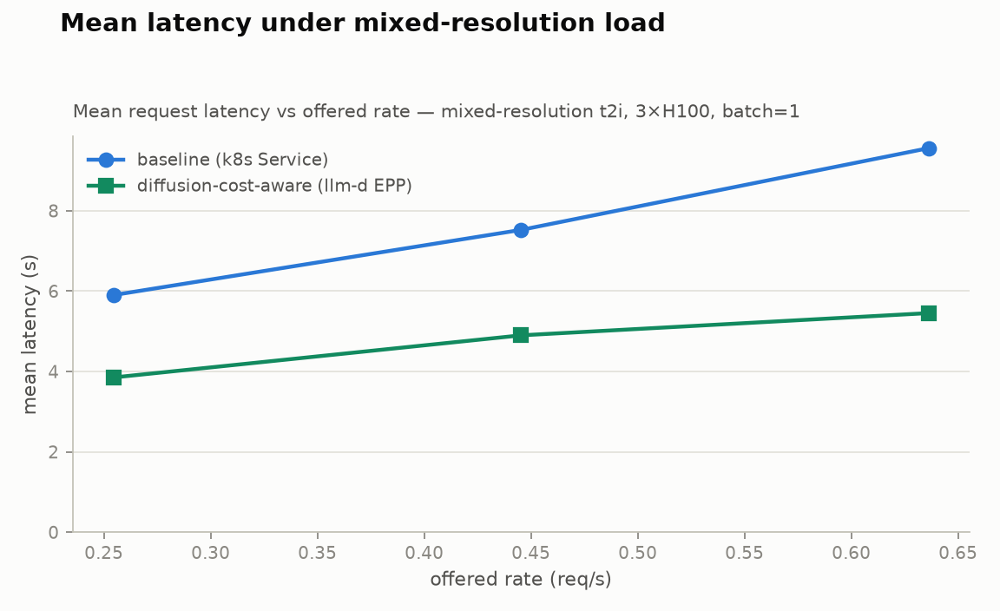

# [PUBLIC] Diffusion Micro-Benchmark Report: Cost-Aware Routing vs Random Routing

Author: bobzetian

## Set up

Model: [`Qwen/Qwen-Image`](https://huggingface.co/Qwen/Qwen-Image) (text-to-image diffusion) on [vLLM-Omni](https://github.com/vllm-project/vllm-omni) (`vllm serve Qwen/Qwen-Image --omni`, batch=1, no step-execution)

Hardware: GKE, 3x NVIDIA H100 80GB (spot pool), 1 GPU per pod, 3 replicas

Router: llm-d EPP built from branch [`feat/diffusion-declared-cost`](https://github.com/zetxqx/llm-d-inference-scheduler/tree/feat/diffusion-declared-cost) (PR [llm-d-router#2053](https://github.com/llm-d/llm-d-router/pull/2053), parser from [llm-d-router#1936](https://github.com/llm-d/llm-d-router/pull/1936)); plugin sources: [diffusion-load-producer](https://github.com/zetxqx/llm-d-inference-scheduler/tree/feat/diffusion-declared-cost/pkg/epp/framework/plugins/requestcontrol/dataproducer/diffusionload), [diffusion-cost-scorer](https://github.com/zetxqx/llm-d-inference-scheduler/tree/feat/diffusion-declared-cost/pkg/epp/framework/plugins/scheduling/scorer/diffusioncost)

EPP profile

```yaml
plugins:
- name: openaiParser
  type: openai-parser
- name: maxScore
  type: max-score-picker
- name: diffusionCost
  type: diffusion-cost-scorer
- type: diffusion-load-producer
schedulingProfiles:
- name: default
  plugins:
  - pluginRef: maxScore
  - pluginRef: diffusionCost
    weight: 5
```

This document analyzes the performance trade-off between **cost-aware routing** (route to the endpoint with the least outstanding declared cost) and **random routing** (plain Kubernetes Service, kube-proxy iptables mode picks a uniformly random ready pod per connection) under mixed-resolution image-generation traffic.

Diffusion requests are special: their compute cost is declared up front. The request body carries `size`, `num_inference_steps`, and `n`, which is enough to compute the request's cost before running it (`cost = steps x megapixels x n`). LLM routers have to estimate remaining work; a diffusion router can just read it. At batch=1 FIFO serving, the sum of declared costs queued on a pod is an almost exact predictor of how long a new request will wait there.

The two arms:

| arm | routing |
|---|---|
| baseline | plain k8s Service over the pool, no router, random pod per connection |
| diffusion-cost-aware | llm-d EPP: openai-parser + diffusion-load-producer + diffusion-cost-scorer |

The cost-aware numbers include the EPP/ext-proc hop that the baseline does not pay, so a measured cost-aware win is net of the router's own overhead.

## Benchmark workload

The workload was generated with vLLM-Omni's own benchmark client, [`benchmarks/diffusion/diffusion_benchmark_serving.py`](https://github.com/vllm-project/vllm-omni/blob/1b318d11d17804c54c6ffa482efdd7abcb03657c/benchmarks/diffusion/diffusion_benchmark_serving.py) (plus its sibling [`backends.py`](https://github.com/vllm-project/vllm-omni/blob/1b318d11d17804c54c6ffa482efdd7abcb03657c/benchmarks/diffusion/backends.py), pinned to the commit used in the runs), run as an in-cluster Job with Poisson arrivals. `run_bench.py` in the command below is a ~30-line wrapper whose only job is to seed Python's global RNG before handing off to the upstream script: the client's request mix already uses a fixed internal seed (42), but its Poisson arrival times come from the unseeded global RNG, so seeding it per repetition makes both arms replay the identical request sequence and the identical arrival timeline at every measurement point.

```bash
python run_bench.py --seed-arrivals ${REP} -- \
    --base-url ${BASE_URL} \
    --endpoint /v1/images/generations \
    --dataset random --task t2i \
    --model Qwen/Qwen-Image \
    --random-request-config "$(cat workload.json)" \
    --num-prompts 80 \
    --request-rate ${RATE} \
    --max-concurrency 64 \
    --warmup-requests 2 --warmup-num-inference-steps 20 \
    --output-file /results/out.json
```

Two workloads:

**Dataset C** — the official mixed-resolution mix from the [vLLM-Omni Qwen-Image performance dashboard](https://github.com/vllm-project/vllm-omni/blob/1b318d11d17804c54c6ffa482efdd7abcb03657c/benchmarks/diffusion/performance_dashboard/qwen_image_serving_performance.md):

| bucket | steps | weight | declared cost (units) |
|---|---|---|---|
| 512x512 | 20 | 15% | 5.0 |
| 768x768 | 20 | 25% | 11.25 |
| 1024x1024 | 25 | 45% | 25.0 |
| 1536x1536 | 35 | 15% | 78.75 |

Exact request-config passed to the bench client (`workloads/dataset_c.json`):

```json
[
  {"width": 512,  "height": 512,  "num_inference_steps": 20, "weight": 0.15},
  {"width": 768,  "height": 768,  "num_inference_steps": 20, "weight": 0.25},
  {"width": 1024, "height": 1024, "num_inference_steps": 25, "weight": 0.45},
  {"width": 1536, "height": 1536, "num_inference_steps": 35, "weight": 0.15}
]
```

**Bimodal** — 85% 512x512 @ 20 steps + 15% 1536x1536 @ 50 steps, the worst case for cost-blind routing: a 512^2 request takes ~1.7 s to serve, but one 1536^2 x 50-step whale ahead of it in the queue costs ~20 s of waiting. Exact request-config (`workloads/dataset_bimodal.json`):

```json
[
  {"width": 512,  "height": 512,  "num_inference_steps": 20, "weight": 0.85},
  {"width": 1536, "height": 1536, "num_inference_steps": 50, "weight": 0.15}
]
```

Calibration (single pod, measured service time per bucket): 512^2 = 1.72 s, 768^2 = 2.06 s, 1024^2 = 4.15 s, 1536^2 = 13.83 s. Dataset C mixed mean service time = 4.71 s, so 3-pod capacity is ~0.64 req/s. Offered rates below are 40% / 70% / 100% of that capacity.

## Result

The following data compares the two routing policies across increasing offered rate. 80 prompts per point, identical seeded request sequence and arrival timeline in both arms.

### Dataset C (mixed-resolution, headline)

| Metric | Routing | 0.25 req/s | 0.45 req/s | 0.64 req/s |
|---|---|---|---|---|
| Request Throughput (req/s) | Cost-aware | 0.272 | 0.460 | 0.614 |
| | Baseline | 0.266 | 0.425 | 0.604 |
| Mean Latency (s) | Cost-aware | 4.4 | 5.3 | 7.7 |
| | Baseline | 5.3 | 8.9 | 8.7 |
| P95 Latency (s) | Cost-aware | 14.0 | 14.2 | 17.9 |
| | Baseline | 15.0 | 24.1 | 20.2 |
| P99 Latency (s) | Cost-aware | 14.7 | 17.0 | 21.3 |
| | Baseline | 19.1 | 26.8 | 21.1 |





### Bimodal (thumbnails + whales, worst case for cost-blind routing)

| Metric | Routing | 0.25 req/s | 0.45 req/s | 0.64 req/s |
|---|---|---|---|---|
| Request Throughput (req/s) | Cost-aware | 0.267 | 0.438 | 0.601 |
| | Baseline | 0.254 | 0.414 | 0.517 |
| Mean Latency (s) | Cost-aware | 3.9 | 4.9 | 5.5 |
| | Baseline | 5.9 | 7.5 | 9.6 |
| P95 Latency (s) | Cost-aware | 19.7 | 19.7 | 20.1 |
| | Baseline | 19.8 | 21.7 | 25.7 |
| P99 Latency (s) | Cost-aware | 19.8 | 20.4 | 21.7 |
| | Baseline | 35.6 | 30.0 | 41.3 |





## Technical Conclusion

1. Tail latency (P99)

Observation: Cost-aware routing cuts P99 latency by 23-37% on Dataset C below capacity, and by 32-47% on the bimodal workload at every rate. The gap grows with the variance of per-request cost: the bimodal mix shows the largest separation, Dataset C a solid one. At exactly 100% of capacity on Dataset C the P99s converge (21.1 s vs 21.3 s) because at saturation every pod is always busy and there is no routing freedom left; the mean is still 11% better.

2. Mean latency

Observation: Mean latency improves 11-40% on Dataset C and 35-43% on bimodal. The mechanism is visible in the per-pod backlog timeseries recorded in the raw results (`.csv` per point): with random routing one pod occasionally stacks several large requests while another drains empty; the cost-aware scorer keeps the per-pod backlogs close together.

3. Throughput

Observation: As expected for a load-balancing change, peak throughput is roughly unchanged on Dataset C. On the bimodal workload cost-aware routing sustains 16% more goodput at the highest rate (0.601 vs 0.517 req/s), because random routing wastes capacity when whole pods idle behind a whale pileup.

Note: This is a micro-benchmark (quick preset, 80 prompts, 1 repetition per point) to keep the runs short. Points where the spot pod set changed mid-run are marked tainted and excluded; all points reported above are clean. The direction is consistent across both workloads and all rates.

### Why declared cost wins

Random routing treats a queued 512^2 thumbnail the same as a queued 1536^2 render, so short requests randomly get stuck behind long ones — the largest requests in Dataset C carry ~15x the cost of the smallest, and a single collision multiplies a short request's latency by ~10x. The cost-aware scorer reads the cost directly from the request body (`steps x megapixels x n`) and routes each request to the pod with the least outstanding declared work. There is no estimation involved: at batch=1 FIFO serving, outstanding declared cost is the queue wait time, up to the step-caching upper bound. This is a structural advantage diffusion serving has over LLM serving, where output length — the dominant cost term — is unknown at admission time.
## Appendix

This micro-benchmark validates the diffusion cost-aware routing plugins proposed in [llm-d-router#1935](https://github.com/llm-d/llm-d-router/issues/1935) and implemented in [llm-d-router#2053](https://github.com/llm-d/llm-d-router/pull/2053).

Traceability — everything used in the runs:

| artifact | source |
|---|---|
| Load generator | [diffusion_benchmark_serving.py @ 1b318d1](https://github.com/vllm-project/vllm-omni/blob/1b318d11d17804c54c6ffa482efdd7abcb03657c/benchmarks/diffusion/diffusion_benchmark_serving.py) + [backends.py](https://github.com/vllm-project/vllm-omni/blob/1b318d11d17804c54c6ffa482efdd7abcb03657c/benchmarks/diffusion/backends.py) |
| Dataset C definition | [Qwen-Image performance dashboard](https://github.com/vllm-project/vllm-omni/blob/1b318d11d17804c54c6ffa482efdd7abcb03657c/benchmarks/diffusion/performance_dashboard/qwen_image_serving_performance.md); exact JSON embedded above |
| Bimodal dataset | exact JSON embedded above (derived for this benchmark, not upstream) |
| EPP under test | branch [feat/diffusion-declared-cost](https://github.com/zetxqx/llm-d-inference-scheduler/tree/feat/diffusion-declared-cost): [diffusion-load-producer](https://github.com/zetxqx/llm-d-inference-scheduler/tree/feat/diffusion-declared-cost/pkg/epp/framework/plugins/requestcontrol/dataproducer/diffusionload), [diffusion-cost-scorer](https://github.com/zetxqx/llm-d-inference-scheduler/tree/feat/diffusion-declared-cost/pkg/epp/framework/plugins/scheduling/scorer/diffusioncost) |
| /v1/images/generations parser | merged upstream in [llm-d-router#1936](https://github.com/llm-d/llm-d-router/pull/1936) |
| Model | [Qwen/Qwen-Image on Hugging Face](https://huggingface.co/Qwen/Qwen-Image), served by [vLLM-Omni](https://github.com/vllm-project/vllm-omni) |
| Harness (manifests, sweep scripts, analysis) | [guides/diffusion-serving](https://github.com/zetxqx/llm-d/tree/guide/diffusion-serving/guides/diffusion-serving) (this folder); `scripts/run_all.sh full <workload>` reproduces a run end to end. Raw per-point JSON/CSV stay local under `results/quick-3rep-dataset-c/` and `results/bimodal-quick-1/` (results are gitignored) |
