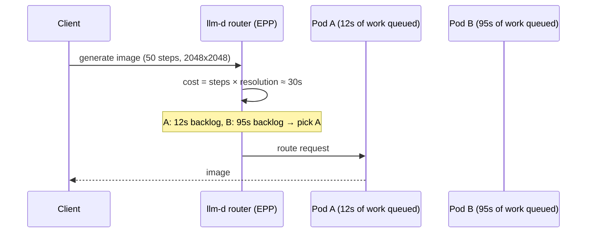
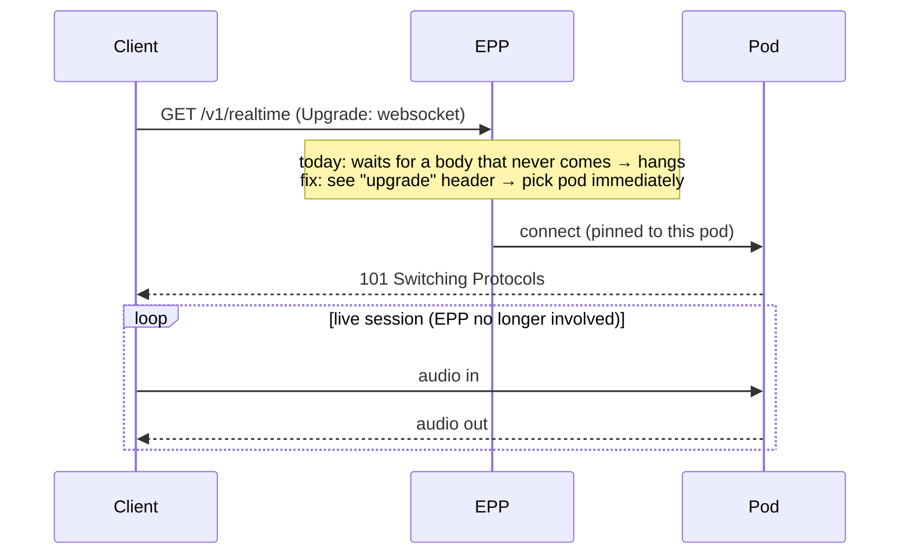
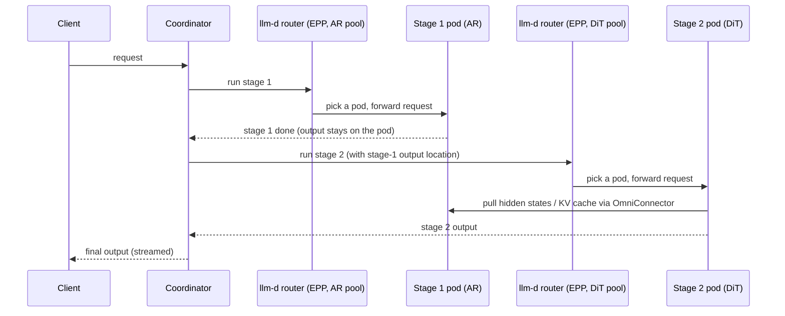

# Plan: llm-d support for vLLM-Omni

## Goal

This doc is the plan for llm-d (EPP / inference scheduler) to support
**vLLM-Omni** as a backend, so any-to-any models (image, video, audio) get
integrated with llm-d — not just today's LLM-only path.

## Background: vLLM-Omni

Every stage is one of three types (`vllm_omni/config/stage_config.py`). The
three types have very different compute characteristics, which is why they
need different routing treatment:

**`LLM_AR`** — autoregressive LLM stage (omni Thinker, TTS talker). The
process is vLLM-Omni, but the engine inside this stage is real vLLM code —
vLLM-Omni subclasses vLLM's scheduler (`OmniARScheduler`,
`vllm_omni/core/sched/omni_ar_scheduler.py`). So this stage still emits the
standard `vllm:*` metrics; vLLM-Omni adds its own `vllm_omni:*` metrics on
top for pipeline-level stats.

- Compute: token-by-token decode, memory-bound; batches many requests
  together; GPU memory is dominated by the KV cache.
- Cost: not fixed at admission — the model decides when to stop. For chat the
  output length is open-ended (hard to predict). For TTS the output is audio
  codec tokens at a fixed rate per second of speech, so it is roughly
  proportional to the input text length — the exact count still varies with
  pacing and pauses, but it can be estimated.
- Cache: KV cache **and prefix cache** — repeated prompts hit the cache, so
  cache-affinity routing pays off.

**`LLM_GENERATION`** — one-shot generation stage (Code2Wav vocoder). Uses
vLLM machinery but runs a single pass per request.

- Compute: one forward pass, short and fairly predictable.
- Cache: no cache reuse across requests.

**`DIFFUSION`** — DiT stage (Z-Image, FLUX, Wan…). Runs on vLLM-Omni's own
`DiffusionEngine`, not vLLM.

- Compute: compute-bound — N denoise steps, each a full forward pass over the
  latents; one request at a time (no cross-request batching); a single
  request saturates the GPU for seconds to minutes.
- Cost: **known up front** — `steps × resolution × n` is in the request body.
- Cache: **no KV cache and no prefix cache** — there are no tokens to cache,
  so none of the LLM cache-affinity scorers apply. (Step caches like TeaCache
  speed up a single request but are not a shraing with other requests.)

Summary — what this means for routing:

| Stage type | Engine | Metrics |
| --- | --- | --- |
| `LLM_AR` | vLLM engine inside vLLM-Omni | `vllm:*` + `vllm_omni:*` |
| `LLM_GENERATION` | vLLM machinery, vLLM-Omni one-shot scheduler | `vllm_omni:*` (no KV/prefix families) |
| `DIFFUSION` | vLLM-Omni's own `DiffusionEngine` | `vllm_omni:*` only |

---

## Phase 0 — API enablement (passthrough)

Goal: any vLLM-Omni request can flow through the EPP without a 400 error.

1. Make the **passthrough parser the default fallback**. Today an unknown
   endpoint like `/v1/images/generations` gets `HTTP 400: no parser
   registered`. With the fallback, it gets routed to some pod in the pool.
2. Passthrough always sets **`SkipResponseProcessing`** — responses can be
   binary (PNG, WAV, MP4) or streams, so the EPP must not touch them.

---

## Phase 1 — Single-stage diffusion models

These are mainly **text-to-image and text-to-video** models (Qwen-Image,
Z-Image-Turbo, FLUX, Wan2.2, …). Four work items:

1. **Parsers** — teach the EPP the diffusion endpoints. Each parser only
   needs to extract two things: **`model`** (to pick the pool) and the
   **cost fields** (they feed the cost-aware scorer, item 3); the rest of
   the body is left untouched.
   - `/v1/images/generations` (JSON): `model`, `size`,
     `num_inference_steps`, `n`
   - `/v1/images/edits` (multipart form): same fields, read from form parts
   - `/v1/videos` (multipart form, async job): `model`, `size`, `seconds`,
     `fps`, `num_inference_steps`
   - `/v1/chat/completions` (diffusion via chat): `model`, `modalities`,
     `extra_body.num_inference_steps`
2. **Metrics** — add a `vllm-omni` engine config to the EPP data layer
   (`core-metrics-extractor`), the same way vLLM and SGLang are supported
   today. Config-only change; a small PR makes it built-in.
3. **Cost-aware scorer** — a diffusion request declares its cost in the
   body, and the engine runs requests one at a time in FIFO order — so the
   EPP can route by backlog in GPU-seconds instead of request count.
4. **Benchmark** — with vLLM-Omni's own benchmark tool; the target metric
   is p99 / SLO attainment, not peak throughput.



Full model list, endpoint table, metric names, and GitHub code pointers:
[phase1-diffusion-details.md](phase1-diffusion-details.md).

---

## Phase 2 — TTS and omni serving (aggregated)

1. **Parser for the audio endpoints** — add parser support for
   `/v1/audio/speech` (+ `/stream`, `/batch`): extract `model`, `input` (the
   text to speak — output length is roughly proportional to it), `voice`,
   and `ref_audio` / `ref_text` (voice cloning). This gives the EPP the same
   body-aware routing for TTS that Phase 1 adds for images.
2. **Evaluate whether the default EPP config is enough, with a benchmark.**
   In principle it should mostly work: TTS models start with an `LLM_AR`
   stage (vLLM engine inside vLLM-Omni, emitting `vllm:*` metrics), so the
   queue and prefix-cache scorers already apply — the Qwen3-TTS talker even
   ships with `enable_prefix_caching: true` (`deploy/qwen3_tts.yaml`).
   Task: run a TTS benchmark (repeated voice / ref_audio workload) comparing
   the default EPP config against random routing, and confirm the scorers
   actually help before optimizing further.
   Caveat: Qwen3-Omni pipelines ship all stages with
   `enable_prefix_caching: false`; enabling it is blocked on
   [RFC #1184 — "Enable Prefix Caching with Hidden-State I/O"](https://github.com/vllm-project/vllm-omni/issues/1184)
   (the attention backend returns hidden states only for the uncached part
   of the sequence, which breaks the stage-to-stage handoff).
3. **(Optional) Realtime / WebSocket.** Confirmed: the EPP **can't route
   WebSocket upgrades today**. It waits for the end of the request body, but
   an upgrade request keeps the stream open — so the handshake hangs.
   - Fix: when the EPP sees `Connection: upgrade` in the **headers**, pick a
     pod right away from headers only — don't wait for a body.
   - Session affinity is required: once the socket is open, every message
     goes to that pod. There's no way to re-route mid-session.



---

## Phase 3 — Disaggregated serving (one pool per stage)

Where things stand today (verified in source; details and pointers in
[phase3-disagg-details.md](phase3-disagg-details.md)):

- **vLLM-Omni** can already run one stage per node: worker nodes join with
  `vllm serve --omni --stage-id N --omni-master-address …`, and the head
  node's orchestrator picks a replica per stage through a built-in balancer
  (random / round-robin / least-queue-length). The Encode / DiT / VAE split
  for diffusion is being designed in RFC
  [#4590](https://github.com/vllm-project/vllm-omni/issues/4590) (all
  checklist items still open). So stage *execution* exists; what's missing
  is the Kubernetes-native cluster layer above it.
- **llm-d** already disaggregates LLM serving: the EPP plans encode /
  prefill / decode picks for a request in one pass (one InferencePool, pods
  labeled by role), passes the picks as headers, and a sidecar on the
  terminal pod executes the hops (NIXL is its default connector). It also
  ships a seam for an external coordinator: conditional picks via
  `Prefer: if-available` + HTTP 412 "restart the pipeline".

Work items:

1. **Package each stage as its own pool** — k8s manifests for head/worker
   stage deployments; nothing like this exists upstream (Dynamo has none
   either).
2. **NIXL backend for OmniConnector** — the inter-stage tensor plane
   (hidden states, audio chunks) supports SharedMemory and Mooncake today;
   no NIXL backend exists (verified). This aligns vLLM-Omni's data plane
   with llm-d's default connector.
3. **Cluster routing layer** — two options, detailed in the design doc:
   - *Option A*: extend llm-d's existing pattern — one pool with role
     labels, one EPP planning all stage picks, an omni-aware sidecar
     executing hops.
   - *Option B (preferred)*: a standalone **coordination service** running
     vLLM-Omni's orchestrator logic, with one EPP per stage pool — each
     pool gets the right policy for its stage type (cost scorer for DiT,
     prefix-cache scorers for AR). This matches the "EPP in the request
     path + coordination service" option recommended in the llm-d disagg
     design doc (*not verified — the Google Doc needs corp auth*).

How data moves: stages don't ship tensors through the coordinator. A stage
keeps its output where it was produced and reports back only the **output's
location** (a few bytes of metadata); the next stage's pod uses that
location to pull the data directly from the producer over OmniConnector.
Transfers are keyed by request ID, so any replica of the next stage can
pull — the EPP is free to pick any pod per request — but chunked streams
must stay **sticky**: all chunks of one request go to the same consumer
pod.



Rules either option must follow (learned from Dynamo's attempt, which
routes stages round-robin and loses streaming):

- keep one request ID from front door to final stage — it keys every
  transfer;
- pass only output locations (a few bytes of metadata), never tensors,
  through the coordinator;
- pre-warm downstream stages at admission and forward each chunk's
  location **as chunks arrive**, not once per stage — that preserves
  vLLM-Omni's chunked
  streaming (first-audio 2790 ms → 655 ms), and beating Dynamo on that
  latency is the headline.

---

## Notes

- **The gap nobody fills**: Dynamo routes omni stages round-robin with no
  load/cost/cache awareness; SMG has no omni endpoints at all. Smart routing
  across omni stage pools is llm-d's P/D story, replayed for any-to-any
  models.
- **Experiment order** (cheap → expensive): baseline benchmark → modality
  steering demo → queue-scorer on `vllm_omni:*` metrics → cost-aware scorer
  benchmark → TTS prefix-affinity benchmark.

---

## Appendix — sample requests

Samples below are based on vLLM-Omni's `examples/online_serving/` scripts
and the API handlers in `entrypoints/openai/api_server.py`. Under each
sample: the fields the EPP parser reads.

### `POST /v1/images/generations` (JSON)

```bash
curl -X POST http://localhost:8091/v1/images/generations \
  -H "Content-Type: application/json" \
  -d '{
    "model": "Qwen/Qwen-Image",
    "prompt": "a dragon over the Green Mountains of Vermont",
    "size": "1024x1024",
    "num_inference_steps": 50,
    "n": 1,
    "seed": 42
  }'
# response: OpenAI Images shape — data[0].b64_json
```

EPP reads: `model`, `size`, `num_inference_steps`, `n`.

### `POST /v1/images/edits` (multipart form)

```bash
curl -X POST http://localhost:8092/v1/images/edits \
  -F "image=@input.png" \
  -F "prompt=make the sky purple" \
  -F "model=Qwen/Qwen-Image-Edit" \
  -F "size=1024x1024" \
  -F "num_inference_steps=50" \
  -F "n=1"
```

EPP reads: `model`, `size`, `num_inference_steps`, `n` — same fields as
generations, but they arrive as form parts, not JSON.

### `POST /v1/videos` (multipart form, async job)

```bash
# 1. submit — returns a job id immediately
curl -X POST http://localhost:8098/v1/videos \
  -F "prompt=two cats boxing on a spotlighted stage" \
  -F "model=Wan-AI/Wan2.2-T2V-A14B" \
  -F "seconds=2" \
  -F "size=832x480" \
  -F "fps=16" \
  -F "num_inference_steps=40"

# 2. poll until status is "completed"
curl http://localhost:8098/v1/videos/{id}

# 3. fetch the result
curl -L http://localhost:8098/v1/videos/{id}/content -o out.mp4
```

EPP reads: `model` (optional form field), `size`, `seconds`, `fps`,
`num_inference_steps` on submit. Poll and fetch have no body — they must
reach the pod that holds the job (sticky routing or shared job state).

### `POST /v1/chat/completions` (diffusion via chat)

Image editing also flows through chat: the input image is a data URL in
the message content, and the diffusion knobs sit in `extra_body`.

```bash
curl -X POST http://localhost:8092/v1/chat/completions \
  -H "Content-Type: application/json" \
  -d '{
    "model": "Qwen/Qwen-Image-Edit",
    "messages": [{
      "role": "user",
      "content": [
        {"type": "text", "text": "make the sky purple"},
        {"type": "image_url",
         "image_url": {"url": "data:image/png;base64,...."}}
      ]
    }],
    "extra_body": {"num_inference_steps": 50, "seed": 42}
  }'
```

EPP reads: `model`, `modalities` (when present),
`extra_body.num_inference_steps`.

### `POST /v1/audio/speech` (Phase 2, JSON)

```bash
curl -X POST http://localhost:8091/v1/audio/speech \
  -H "Content-Type: application/json" \
  -d '{
    "model": "Qwen/Qwen3-TTS",
    "input": "Hello, how are you today?",
    "voice": "vivian",
    "response_format": "wav",
    "task_type": "Base",
    "ref_audio": "data:audio/wav;base64,....",
    "ref_text": "transcript of the reference audio"
  }'
```

EPP reads: `model`, `input` (output length is roughly proportional to it),
`voice`, `ref_audio` / `ref_text` (voice cloning — the affinity key for
prefix-cache routing).
