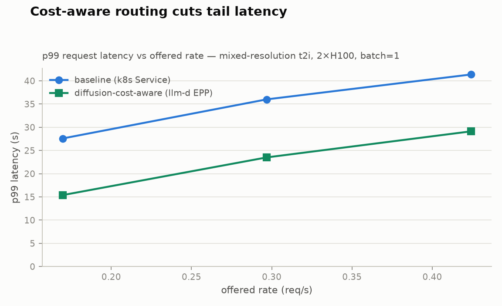
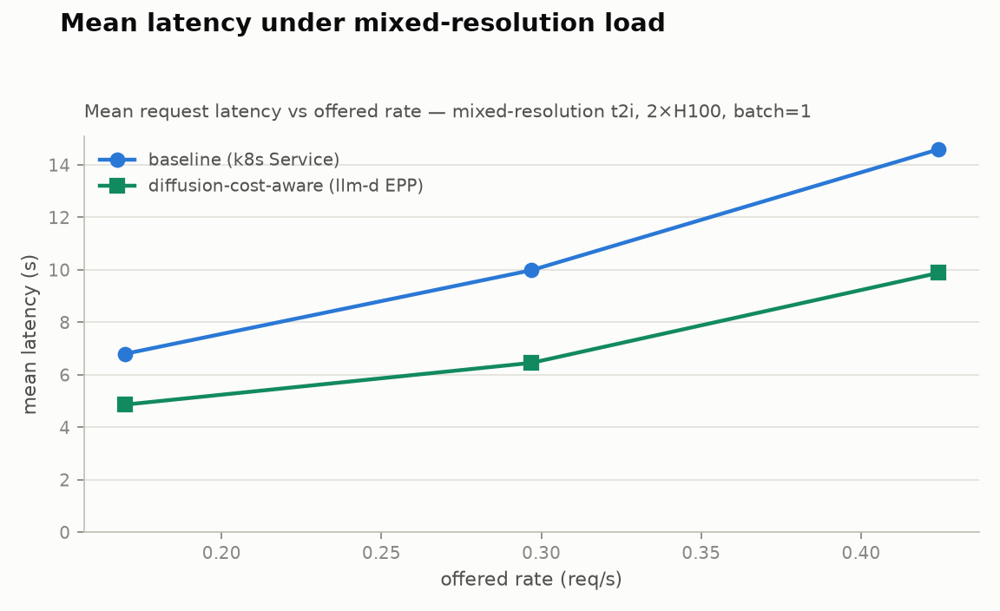

# Cost-aware routing benchmark — report

Generated 2026-07-16 19:20 UTC. Workload: **dataset_c.json** (mixed-resolution t2i, see `workloads/`). Pool: 2×H100 running `Qwen/Qwen-Image`, batch=1.

| arm | routing policy |
|---|---|
| baseline | baseline (k8s Service) |
| cost-aware | diffusion-cost-aware (llm-d EPP) |

## Calibration

| bucket | measured service time (s) |
|---|---|
| 512² | 1.72 |
| 768² | 2.06 |
| 1024² | 4.15 |
| 1536² | 13.83 |

Mixed mean service time S_mix = **4.71 s** → N-pod capacity ≈ **0.424 req/s**.

## Headline: latency at the same offered load

Median over repetitions; both arms replay the identical request
sequence and arrival timeline, so rows are directly comparable.

| offered rate (req/s) | p99 baseline → cost-aware (s) | p99 reduction | mean baseline → cost-aware (s) | mean reduction |
|---|---|---|---|---|
| 0.1697 | 27.6 → 15.4 | **44%** | 6.8 → 4.9 | 28% |
| 0.2969 | 36.0 → 23.5 | **35%** | 10.0 → 6.5 | 35% |
| 0.4242 | 41.4 → 29.1 | **30%** | 14.6 → 9.9 | 32% |

## baseline (k8s Service)

| offered rate (req/s) | reps | p99 latency s (median) | p95 latency s | mean latency s | throughput req/s | failed | tainted |
|---|---|---|---|---|---|---|---|
| 0.1697 | 1 | 27.6 | 15.7 | 6.8 | 0.181 |  |  |
| 0.2969 | 1 | 36.0 | 26.8 | 10.0 | 0.311 |  |  |
| 0.4242 | 1 | 41.4 | 35.9 | 14.6 | 0.392 |  |  |

## diffusion-cost-aware (llm-d EPP)

| offered rate (req/s) | reps | p99 latency s (median) | p95 latency s | mean latency s | throughput req/s | failed | tainted |
|---|---|---|---|---|---|---|---|
| 0.1697 | 1 | 15.4 | 14.0 | 4.9 | 0.184 |  |  |
| 0.2969 | 1 | 23.5 | 14.3 | 6.5 | 0.315 |  |  |
| 0.4242 | 1 | 29.1 | 24.0 | 9.9 | 0.414 |  |  |

## Notes

- Median over repetitions; points marked tainted (pod churn mid-run, spot preemption) are excluded from medians when clean reps exist.
- The request mix and Poisson arrival timelines are identical across arms (seeded), so rows at the same rate are directly comparable.
- Raw data: `<arm>/rate<r>_rep<n>.json` (bench aggregates), `.csv` (per-pod queue-depth timeseries), `.meta` (pod set, taint flag).
