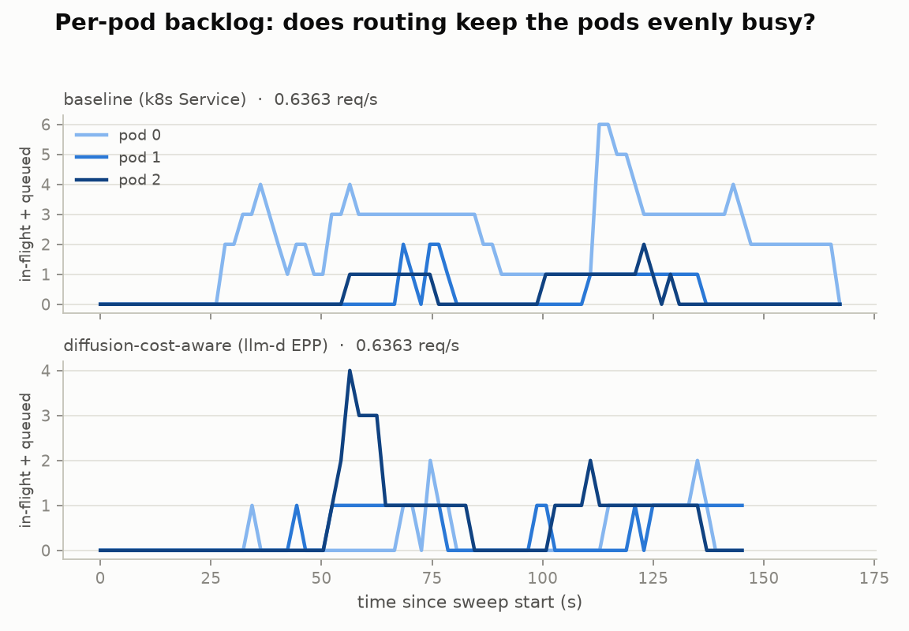

# Cost-aware routing benchmark — report

Generated 2026-07-16 19:02 UTC. Workload: **dataset_bimodal.json** (mixed-resolution t2i, see `workloads/`). Pool: 3×H100 running `Qwen/Qwen-Image`, batch=1. Run: `preset=quick workload=dataset_bimodal.json replicas=3 started=2026-07-15T00:20:45+00:00`.

| arm | routing policy |
|---|---|
| baseline | baseline (k8s Service) |
| cost-aware | diffusion-cost-aware (llm-d EPP) |

## Calibration

| bucket | measured service time (s) |
|---|---|
| 512² | 1.72 |
| 768² | 2.06 |
| 1024² | 4.15 |
| 1536² | 13.83 |

Mixed mean service time S_mix = **4.71 s** → 3-pod capacity ≈ **0.636 req/s**.

## Headline: latency at the same offered load

Median over repetitions; both arms replay the identical request
sequence and arrival timeline, so rows are directly comparable.

| offered rate (req/s) | p99 baseline → cost-aware (s) | p99 reduction | mean baseline → cost-aware (s) | mean reduction |
|---|---|---|---|---|
| 0.2545 | 35.6 → 19.8 | **44%** | 5.9 → 3.9 | 35% |
| 0.4454 | 30.0 → 20.4 | **32%** | 7.5 → 4.9 | 35% |
| 0.6363 | 41.3 → 21.7 | **47%** | 9.6 → 5.5 | 43% |

## baseline (k8s Service)

| offered rate (req/s) | reps | p99 latency s (median) | p95 latency s | mean latency s | throughput req/s | failed | tainted |
|---|---|---|---|---|---|---|---|
| 0.2545 | 1 | 35.6 | 19.8 | 5.9 | 0.254 |  |  |
| 0.4454 | 1 | 30.0 | 21.7 | 7.5 | 0.414 |  |  |
| 0.6363 | 1 | 41.3 | 25.7 | 9.6 | 0.517 |  |  |

## diffusion-cost-aware (llm-d EPP)

| offered rate (req/s) | reps | p99 latency s (median) | p95 latency s | mean latency s | throughput req/s | failed | tainted |
|---|---|---|---|---|---|---|---|
| 0.2545 | 1 | 19.8 | 19.7 | 3.9 | 0.267 |  |  |
| 0.4454 | 1 | 20.4 | 19.7 | 4.9 | 0.438 |  |  |
| 0.6363 | 1 | 21.7 | 20.1 | 5.5 | 0.601 |  |  |

## Notes

- Median over repetitions; points marked tainted (pod churn mid-run, spot preemption) are excluded from medians when clean reps exist.
- The request mix and Poisson arrival timelines are identical across arms (seeded), so rows at the same rate are directly comparable.
- Raw data: `<arm>/rate<r>_rep<n>.json` (bench aggregates), `.csv` (per-pod queue-depth timeseries), `.meta` (pod set, taint flag).
