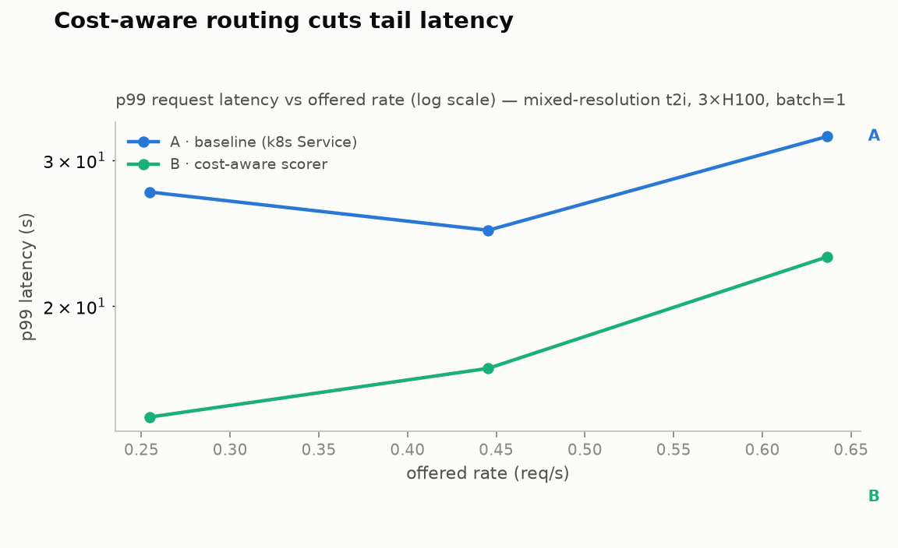
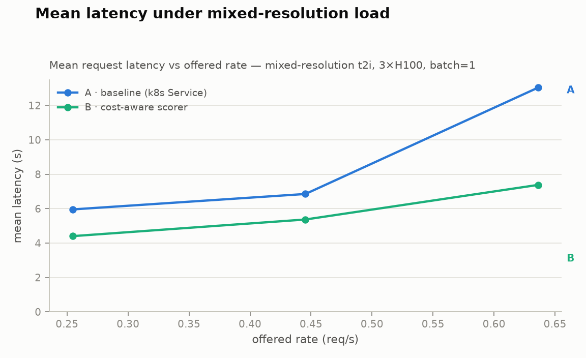
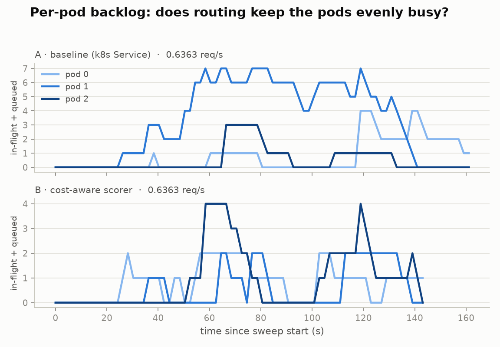

# Cost-aware routing benchmark — report

Generated 2026-07-15 00:00 UTC. Workload: **dataset_c.json** (mixed-resolution t2i, see `workloads/`). Pool: 3×H100 running `Qwen/Qwen-Image`, batch=1. Run: `preset=quick workload=dataset_c.json replicas=3 started=2026-07-14T23:37:48+00:00`.

| arm | routing policy |
|---|---|
| A | A · baseline (k8s Service) |
| B | B · cost-aware scorer |

## Calibration

| bucket | measured service time (s) |
|---|---|
| 512² | 1.72 |
| 768² | 2.06 |
| 1024² | 4.15 |
| 1536² | 13.83 |

Mixed mean service time S_mix = **4.71 s** → 3-pod capacity ≈ **0.636 req/s**.

## Headline: latency at the same offered load

Median over repetitions; both arms replay the identical request
sequence and arrival timeline, so rows are directly comparable.

| offered rate (req/s) | p99 A → B (s) | p99 reduction | mean A → B (s) | mean reduction |
|---|---|---|---|---|
| 0.2545 | 27.5 → 14.7 | **46%** | 6.0 → 4.4 | 26% |
| 0.4454 | 24.7 → 16.8 | **32%** | 6.9 → 5.4 | 22% |
| 0.6363 | 32.0 → 22.9 | **28%** | 13.0 → 7.4 | 43% |

## Arm A — A · baseline (k8s Service)

| offered rate (req/s) | reps | p99 latency s (median) | p95 latency s | mean latency s | throughput req/s | failed | tainted |
|---|---|---|---|---|---|---|---|
| 0.2545 | 1 | 27.5 | 17.9 | 6.0 | 0.272 |  |  |
| 0.4454 | 1 | 24.7 | 18.6 | 6.9 | 0.441 |  |  |
| 0.6363 | 1 | 32.0 | 25.1 | 13.0 | 0.543 |  |  |

## Arm B — B · cost-aware scorer

| offered rate (req/s) | reps | p99 latency s (median) | p95 latency s | mean latency s | throughput req/s | failed | tainted |
|---|---|---|---|---|---|---|---|
| 0.2545 | 1 | 14.7 | 14.0 | 4.4 | 0.272 |  |  |
| 0.4454 | 1 | 16.8 | 14.4 | 5.4 | 0.460 |  |  |
| 0.6363 | 1 | 22.9 | 17.9 | 7.4 | 0.614 |  |  |

## Notes

- Median over repetitions; points marked tainted (pod churn mid-run, spot preemption) are excluded from medians when clean reps exist.
- The request mix and Poisson arrival timelines are identical across arms (seeded), so rows at the same rate are directly comparable.
- Raw data: `<arm>/rate<r>_rep<n>.json` (bench aggregates), `.csv` (per-pod queue-depth timeseries), `.meta` (pod set, taint flag).
