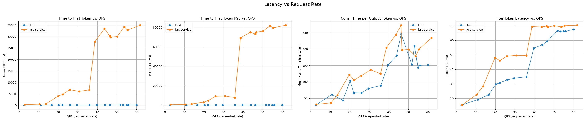
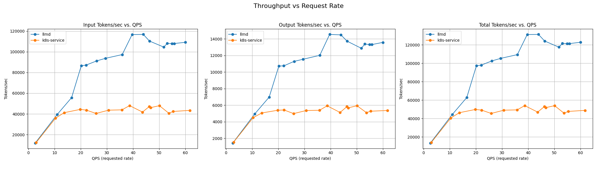

# Well-lit Path: Intelligent Inference Scheduling

## Overview

This guide deploys the recommended out of the box [scheduling configuration](https://github.com/llm-d/llm-d-inference-scheduler/blob/main/docs/architecture.md) for most vLLM deployments, reducing tail latency and increasing throughput through load-aware and prefix-cache aware balancing. This can be run on two GPUs that can load [Qwen/Qwen3-32B](https://huggingface.co/Qwen/Qwen3-32B).

This profile defaults to the approximate prefix cache aware scorer, which only observes request traffic to predict prefix cache locality. The [precise prefix cache aware routing feature](../precise-prefix-cache-aware) improves hit rate by introspecting the vLLM instances for cache entries and will become the default in a future release.

## Hardware Requirements

This example out of the box uses 16 GPUs (8 replicas x 2 GPUs each) of any supported kind:

- **NVIDIA GPUs**: Any NVIDIA GPU (support determined by the inferencing image used)
- **Intel XPU/GPUs**: Intel Data Center GPU Max 1550 or compatible Intel XPU device
- **TPUs**: Google Cloud TPUs (when using GKE TPU configuration)

**Using fewer accelerators**: Fewer accelerators can be used by modifying the `values.yaml` corresponding to your deployment. For example, to use only 2 GPUs with the default NVIDIA GPU deployment, update `replicas: 2` in [ms-inference-scheduling/values.yaml](./ms-inference-scheduling/values.yaml#L17-L22).

**Alternative CPU Deployment**: For CPU-only deployment (no GPUs required), see the [Hardware Backends](#hardware-backends) section for CPU-specific deployment instructions. CPU deployment requires Intel/AMD CPUs with 64 cores and 64GB RAM per replica.

## Prerequisites

- Have the [proper client tools installed on your local system](../prereq/client-setup/README.md) to use this guide.
- Ensure your cluster infrastructure is sufficient to [deploy high scale inference](../prereq/infrastructure)
- Have the [Monitoring stack](../../docs/monitoring/README.md) installed on your system.
- Create a namespace for installation.

  ```bash
  export NAMESPACE=llm-d-inference-scheduler # or any other namespace (shorter names recommended)
  kubectl create namespace ${NAMESPACE}
  ```

- [Create the `llm-d-hf-token` secret in your target namespace with the key `HF_TOKEN` matching a valid HuggingFace token](../prereq/client-setup/README.md#huggingface-token) to pull models.
- [Choose an llm-d version](../prereq/client-setup/README.md#llm-d-version)
- Configure and deploy your [Gateway control plane](../prereq/gateway-provider/README.md)

## Installation

Use the helmfile to compose and install the stack. The Namespace in which the stack will be deployed will be derived from the `${NAMESPACE}` environment variable. If you have not set this, it will default to `llm-d-inference-scheduler` in this example.

**_IMPORTANT:_** When using long namespace names (like `llm-d-inference-scheduler`), the generated pod hostnames may become too long and cause issues due to Linux hostname length limitations (typically 64 characters maximum). It's recommended to use shorter namespace names (like `llm-d`) and set `RELEASE_NAME_POSTFIX` to generate shorter hostnames and avoid potential networking or vLLM startup problems.

### Deploy

```bash
cd guides/inference-scheduling
```

<!-- TABS:START -->
<!-- TAB:GPU deployment  -->

#### GPU deployment

```bash
helmfile apply -n ${NAMESPACE}
```

<!-- TAB:CPU deployment  -->

#### CPU-only deployment

```bash
helmfile apply -e cpu -n ${NAMESPACE}
```

<!-- TABS:END -->

**_NOTE:_** You can set the `$RELEASE_NAME_POSTFIX` env variable to change the release names. This is how we support concurrent installs. Ex: `RELEASE_NAME_POSTFIX=inference-scheduling-2 helmfile apply -n ${NAMESPACE}`

### Gateway and Hardware Options

#### Gateway Options

**_NOTE:_** This uses Istio as the default gateway provider, see [Gateway Option](#gateway-option) for installing with a specific provider.

To specify your gateway choice you can use the `-e <gateway option>` flag, ex:

```bash
helmfile apply -e kgateway -n ${NAMESPACE}
```

For DigitalOcean Kubernetes Service (DOKS):

```bash
helmfile apply -e digitalocean -n ${NAMESPACE}
```

 **_NOTE:_** DigitalOcean deployment uses public Qwen/Qwen3-0.6B model (no HuggingFace token required) and is optimized for DOKS GPU nodes with automatic tolerations and node selectors. Gateway API v1 compatibility fixes are automatically included.

To see what gateway options are supported refer to our [gateway provider prereq doc](../prereq/gateway-provider/README.md#supported-providers). Gateway configurations per provider are tracked in the [gateway-configurations directory](../prereq/gateway-provider/common-configurations/).

You can also customize your gateway, for more information on how to do that see our [gateway customization docs](../../docs/customizing-your-gateway.md).

#### Hardware Backends

Currently in the `inference-scheduling` example we suppport configurations for `xpu`, `tpu`, `cpu`, and `cuda` GPUs. By default we use modelserver values supporting `cuda` GPUs, but to deploy on one of the other hardware backends you may use:

```bash
helmfile apply -e xpu  -n ${NAMESPACE} # targets istio as gateway provider with XPU hardware
# or
helmfile apply -e gke_tpu  -n ${NAMESPACE} # targets GKE externally managed as gateway provider with TPU hardware
# or
helmfile apply -e cpu  -n ${NAMESPACE} # targets istio as gateway provider with CPU hardware
```

##### Intel XPU Configuration

For Intel XPU deployments, the `values_xpu.yaml` uses Dynamic Resource Allocation (DRA). By default it targets Intel Data Center GPU Max 1550 (i915 driver). For Intel BMG GPUs (Battlemage G21), update the accelerator type in `ms-inference-scheduling/values_xpu.yaml`:

```yaml
# For Intel Data Center GPU Max 1550 (default):
accelerator:
  type: intel-i915
  dra: true

# For Intel BMG GPU (Battlemage G21):
accelerator:
  type: intel-xe
  dra: true
```

##### CPU Inferencing

This case expects using 4th Gen Intel Xeon processors (Sapphire Rapids) or later.

### Install HTTPRoute When Using Gateway option

Follow provider specific instructions for installing HTTPRoute.

#### Install for "kgateway" or "istio"

```bash
kubectl apply -f httproute.yaml -n ${NAMESPACE}
```

#### Install for "gke"

```bash
kubectl apply -f httproute.gke.yaml -n ${NAMESPACE}
```

#### Install for "digitalocean"

```bash
kubectl apply -f httproute.yaml -n ${NAMESPACE}
```

## Verify the Installation

- Firstly, you should be able to list all helm releases to view the 3 charts got installed into your chosen namespace:

```bash
helm list -n ${NAMESPACE}
NAME                        NAMESPACE                   REVISION  UPDATED                                 STATUS      CHART                       APP VERSION
gaie-inference-scheduling   llm-d-inference-scheduler   1         2026-01-26 15:11:26.506854 +0200 IST    deployed    inferencepool-v1.3.0        v1.3.0
infra-inference-scheduling  llm-d-inference-scheduler   1         2026-01-26 15:11:21.008163 +0200 IST    deployed    llm-d-infra-v1.3.6          v0.3.0
ms-inference-scheduling     llm-d-inference-scheduler   1         2026-01-26 15:11:39.385111 +0200 IST    deployed    llm-d-modelservice-v0.4.5   v0.4.0
```

- Out of the box with this example you should have the following resources:

```bash
kubectl get all -n ${NAMESPACE}
NAME                                                                  READY   STATUS    RESTARTS   AGE
pod/gaie-inference-scheduling-epp-59c5f64d7b-b5j2d                    1/1     Running   0          36m
pod/infra-inference-scheduling-inference-gateway-istio-55fd84cnjzfv   1/1     Running   0          36m
pod/llmdbench-harness-launcher                                        1/1     Running   0          2m43s
pod/ms-inference-scheduling-llm-d-modelservice-decode-866b7c8795szd   1/1     Running   0          35m
pod/ms-inference-scheduling-llm-d-modelservice-decode-866b7c87cdntk   1/1     Running   0          35m
pod/ms-inference-scheduling-llm-d-modelservice-decode-866b7c87cnxxq   1/1     Running   0          35m
pod/ms-inference-scheduling-llm-d-modelservice-decode-866b7c87fvtjf   1/1     Running   0          35m
pod/ms-inference-scheduling-llm-d-modelservice-decode-866b7c87jqt27   1/1     Running   0          35m
pod/ms-inference-scheduling-llm-d-modelservice-decode-866b7c87kwxc6   1/1     Running   0          35m
pod/ms-inference-scheduling-llm-d-modelservice-decode-866b7c87rld4t   1/1     Running   0          35m
pod/ms-inference-scheduling-llm-d-modelservice-decode-866b7c87xvbmp   1/1     Running   0          35m

NAME                                                         TYPE        CLUSTER-IP       EXTERNAL-IP   PORT(S)             AGE
service/gaie-inference-scheduling-epp                        ClusterIP   172.30.240.45    <none>        9002/TCP,9090/TCP   36m
service/gaie-inference-scheduling-ip-18c12339                ClusterIP   None             <none>        54321/TCP           36m
service/infra-inference-scheduling-inference-gateway-istio   ClusterIP   172.30.28.163    <none>        15021/TCP,80/TCP    36m

NAME                                                                 READY   UP-TO-DATE   AVAILABLE   AGE
deployment.apps/gaie-inference-scheduling-epp                        1/1     1            1           36m
deployment.apps/infra-inference-scheduling-inference-gateway-istio   1/1     1            1           36m
deployment.apps/ms-inference-scheduling-llm-d-modelservice-decode    8/8     8            8           35m

NAME                                                                            DESIRED   CURRENT   READY   AGE
replicaset.apps/gaie-inference-scheduling-epp-59c5f64d7b                        1         1         1       36m
replicaset.apps/infra-inference-scheduling-inference-gateway-istio-55fd84c7fd   1         1         1       36m
replicaset.apps/ms-inference-scheduling-llm-d-modelservice-decode-866b7c8768    8         8         8       35m
```

## Using the stack

For instructions on getting started making inference requests see [our docs](../../docs/getting-started-inferencing.md)

## Benchmarking

To run benchmarks against the installed llm-d stack, you need [run_only.sh](https://github.com/llm-d/llm-d-benchmark/blob/main/existing_stack/run_only.sh), a template file from [guides/benchmark](../benchmark/), and a Persistent Volume Claim (PVC) to store the results. Follow the instructions in the [benchmark doc](../benchmark/README.md).

### Example

This example uses [run_only.sh](https://github.com/llm-d/llm-d-benchmark/blob/main/existing_stack/run_only.sh) with the template [inference_scheduling_guide_template.yaml](../benchmark/inference_scheduling_guide_template.yaml).

The benchmark launches a pod (`llmdbench-harness-launcher`) that, in this case, uses `inference-perf` with a shared prefix synthetic workload named `shared_prefix_synthetic`. This workload runs several stages with different rates. The results will be stored on the provided PVC, accessible through the `llmdbench-harness-launcher` pod. Each experiment is saved under the `requests` folder, e.g.,/`requests/inference-perf_<experiment ID>_shared_prefix_synthetic_inference-scheduling_<model name>` folder.

Several results files will be created (see [Benchmark doc](../benchmark/README.md)), including a yaml file in a "standard" benchmark report format (see [Benchmark Report](https://github.com/llm-d/llm-d-benchmark/blob/main/docs/benchmark_report.md)).

  ```bash
  curl -L -O https://raw.githubusercontent.com/llm-d/llm-d-benchmark/main/existing_stack/run_only.sh
  chmod u+x run_only.sh
  select f in $(
      curl -s https://api.github.com/repos/llm-d/llm-d/contents/guides/benchmark?ref=main |
      sed -n '/[[:space:]]*"name":[[:space:]][[:space:]]*"\(inference_scheduling.*\_template\.yaml\)".*/ s//\1/p'
    ); do
    curl -LJO "https://raw.githubusercontent.com/llm-d/llm-d/main/guides/benchmark/$f"
    break
  done
  ```

Choose the `inference_scheduling_guide_template.yaml` template, then run:

  ```bash
  export NAMESPACE=llm-d-inference-scheduler     # replace with your namespace
  export BENCHMARK_PVC=workload-pvc   # replace with your PVC name
  export GATEWAY_SVC=infra-inference-scheduling-inference-gateway-istio  # replace with your exact service name
  envsubst < inference_scheduling_guide_template.yaml > config.yaml
  ```

Edit `config.yaml` if further customization is needed, and then run the command

  ```bash
  ./run_only.sh -c config.yaml
  ```

The output will show the progress of the `inference-perf` benchmark as it runs
<details>
<summary><b><i>Click</i></b> here to view the expected output</summary>

  ```text
  ...
  2026-01-14 12:58:15,472 - inference_perf.client.filestorage.local - INFO - Report files will be stored at: /requests/inference-perf_1768395442_shared_prefix_synthetic_inference-scheduling-Qwen3-0.6B
  2026-01-14 12:58:18,414 - inference_perf.loadgen.load_generator - INFO - Stage 0 - run started
  Stage 0 progress: 100%|██████████| 1.0/1.0 [00:52<00:00, 52.06s/it]
  2026-01-14 12:59:10,503 - inference_perf.loadgen.load_generator - INFO - Stage 0 - run completed
  2026-01-14 12:59:11,504 - inference_perf.loadgen.load_generator - INFO - Stage 1 - run started
  Stage 1 progress: 100%|██████████| 1.0/1.0 [00:52<00:00, 52.05s/it]
  2026-01-14 13:00:03,566 - inference_perf.loadgen.load_generator - INFO - Stage 1 - run completed
  2026-01-14 13:00:04,569 - inference_perf.loadgen.load_generator - INFO - Stage 2 - run started
  Stage 2 progress: 100%|██████████| 1.0/1.0 [00:52<00:00, 52.05s/it]
  2026-01-14 13:00:56,620 - inference_perf.loadgen.load_generator - INFO - Stage 2 - run completed
  Stage 3 progress:   0%|          | 0/1.0 [00:00<?, ?it/s]2026-01-14 13:00:57,621 - inference_perf.loadgen.load_generator - INFO - Stage 3 - run started
  Stage 3 progress: 100%|██████████| 1.0/1.0 [00:52<00:00, 52.14s/it]  2026-01-14 13:01:49,675 - inference_perf.loadgen.load_generator - INFO - Stage 3 - run completed
  Stage 3 progress: 100%|██████████| 1.0/1.0 [00:52<00:00, 52.05s/it]
  2026-01-14 13:01:50,677 - inference_perf.loadgen.load_generator - INFO - Stage 4 - run started
  Stage 4 progress:  98%|█████████▊| 0.975/1.0 [00:51<00:01, 53.81s/it]2026-01-14 13:02:42,726 - inference_perf.loadgen.load_generator - INFO - Stage 4 - run completed
  Stage 4 progress: 100%|██████████| 1.0/1.0 [00:52<00:00, 52.05s/it]
  2026-01-14 13:02:43,727 - inference_perf.loadgen.load_generator - INFO - Stage 5 - run started
  Stage 5 progress:  98%|█████████▊| 0.976/1.0 [00:51<00:01, 47.18s/it]             2026-01-14 13:03:35,770 - inference_perf.loadgen.load_generator - INFO - Stage 5 - run completed
  Stage 5 progress: 100%|██████████| 1.0/1.0 [00:52<00:00, 52.04s/it]
  2026-01-14 13:03:36,771 - inference_perf.loadgen.load_generator - INFO - Stage 6 - run started
  Stage 6 progress: 100%|██████████| 1.0/1.0 [00:52<00:00, 52.05s/it]
  2026-01-14 13:04:28,826 - inference_perf.loadgen.load_generator - INFO - Stage 6 - run completed
  2026-01-14 13:04:29,932 - inference_perf.reportgen.base - INFO - Generating Reports...
  ...
  ```

</details>

### Benchmarking Report

There is a report for each stage.
<details>
<summary><b><i>Click</i></b> here to view the report for `rate=60` from the above example</summary>

  ```yaml
  metrics:
    latency:
      inter_token_latency:
        max: 0.3976375609636307
        mean: 0.06765722222528071
        min: 1.3881013728678226e-05
        p0p1: 1.722399512073025e-05
        p1: 0.00027551683422643626
        p5: 0.02622559448063839
        p10: 0.033432915166486055
        p25: 0.04734217074292246
        p50: 0.07592084849602543
        p75: 0.08339276927290484
        p90: 0.0940622523019556
        p95: 0.09673563879623544
        p99: 0.13096482709748672
        p99p9: 0.18361429275909982
        units: s/token
      normalized_time_per_output_token:
        max: 24.031401686001725
        mean: 0.15119099450472326
        min: 0.029169302775326988
        p0p1: 0.030635711364870543
        p1: 0.03316916608329783
        p5: 0.03686109928604165
        p10: 0.0422473103951594
        p25: 0.06722495797558614
        p50: 0.07227312453111687
        p75: 0.0776502936300094
        p90: 0.08589849215923934
        p95: 0.15161141803650466
        p99: 2.2160512474802
        p99p9: 3.599132445602329
        units: s/token
      request_latency:
        max: 85.97330250998493
        mean: 67.864936218041
        min: 29.08179486700101
        p0p1: 30.597063626140066
        p1: 32.82888973700406
        p5: 36.53580686951754
        p10: 41.68587793367915
        p25: 66.56756829548976
        p50: 71.62742416901165
        p75: 75.53078864999407
        p90: 82.8551616292796
        p95: 85.17766979286971
        p99: 85.8529812369059
        p99p9: 85.96677305092867
        units: s
      time_per_output_token:
        max: 0.08567342651402578
        mean: 0.06765722222528071
        min: 0.028917132598988246
        p0p1: 0.030438513501739303
        p1: 0.03267320581834996
        p5: 0.03637065519659664
        p10: 0.04149165656909463
        p25: 0.06637948430397955
        p50: 0.07139790143899155
        p75: 0.07530937768449075
        p90: 0.08259890788880875
        p95: 0.08494466238816095
        p99: 0.0856393391511339
        p99p9: 0.08567179985522212
        units: s/token
      time_to_first_token:
        max: 0.2749739610007964
        mean: 0.1203408618576747
        min: 0.04670933203306049
        p0p1: 0.05085431289958069
        p1: 0.0542934795509791
        p5: 0.06336988278490026
        p10: 0.07046441090060399
        p25: 0.08575929325888865
        p50: 0.1132554289943073
        p75: 0.1517725815065205
        p90: 0.18095784459728748
        p95: 0.19695026772387791
        p99: 0.22566659807867837
        p99p9: 0.25035182150500235
        units: s
    requests:
      failures: 0
      input_length:
        max: 7668.0
        mean: 7576.364
        min: 7487.0
        p0p1: 7490.992
        p1: 7512.0
        p5: 7531.0
        p10: 7541.9
        p25: 7556.0
        p50: 7577.0
        p75: 7594.0
        p90: 7611.0
        p95: 7624.0
        p99: 7646.0
        p99p9: 7665.006
        units: count
      output_length:
        max: 1999.0
        mean: 941.86
        min: 3.0
        p0p1: 20.0
        p1: 32.99
        p5: 500.2
        p10: 949.9
        p25: 992.0
        p50: 997.0
        p75: 1000.0
        p90: 1000.0
        p95: 1000.0
        p99: 1000.0
        p99p9: 1500.495
        units: count
      total: 1500
    throughput:
      output_tokens_per_sec: 13574.368209884744
      requests_per_sec: 14.41229929064271
      total_tokens_per_sec: 122767.19371273571
    time:
      duration: 24.984177332022227
  scenario:
    load:
      args:
        api:
          headers: null
          streaming: true
          type: completion
        circuit_breakers: null
        data:
          input_distribution: null
          output_distribution: null
          path: null
          shared_prefix:
            enable_multi_turn_chat: false
            num_groups: 150
            num_prompts_per_group: 5
            output_len: 1000
            question_len: 1200
            system_prompt_len: 6000
          trace: null
          type: shared_prefix
        load:
          circuit_breakers: []
          interval: 1.0
          num_workers: 224
          request_timeout: null
          stages:
          - concurrency_level: null
            duration: 50
            num_requests: null
            rate: 15.0
          - concurrency_level: null
            duration: 20
            num_requests: null
            rate: 3.0
          - concurrency_level: null
            duration: 20
            num_requests: null
            rate: 10.0
          - concurrency_level: null
            duration: 20
            num_requests: null
            rate: 15.0
          - concurrency_level: null
            duration: 38
            num_requests: null
            rate: 20.0
          - concurrency_level: null
            duration: 34
            num_requests: null
            rate: 22.0
          - concurrency_level: null
            duration: 30
            num_requests: null
            rate: 25.0
          - concurrency_level: null
            duration: 25
            num_requests: null
            rate: 30.0
          - concurrency_level: null
            duration: 21
            num_requests: null
            rate: 35.0
          - concurrency_level: null
            duration: 38
            num_requests: null
            rate: 40.0
          - concurrency_level: null
            duration: 36
            num_requests: null
            rate: 43.0
          - concurrency_level: null
            duration: 33
            num_requests: null
            rate: 46.0
          - concurrency_level: null
            duration: 30
            num_requests: null
            rate: 49.0
          - concurrency_level: null
            duration: 29
            num_requests: null
            rate: 52.0
          - concurrency_level: null
            duration: 27
            num_requests: null
            rate: 55.0
          - concurrency_level: null
            duration: 26
            num_requests: null
            rate: 57.0
          - concurrency_level: null
            duration: 25
            num_requests: null
            rate: 60.0
          sweep: null
          trace: null
          type: poisson
          worker_max_concurrency: 100
          worker_max_tcp_connections: 2500
        metrics: null
        report:
          prometheus:
            per_stage: false
            summary: true
          request_lifecycle:
            per_request: true
            per_stage: true
            summary: true
        server:
          api_key: null
          base_url: http://infra-inference-scheduling-inference-gateway-istio.dpikus-intel-inf.svc.cluster.local:80
          ignore_eos: true
          model_name: Qwen/Qwen3-32B
          type: vllm
        storage:
          google_cloud_storage: null
          local_storage:
            path: /requests/inference-perf_1769435052_Shared_prefix_inf-scheduling-guide-Qwen3-32B
            report_file_prefix: null
          simple_storage_service: null
        tokenizer:
          pretrained_model_name_or_path: Qwen/Qwen3-32B
          token: null
          trust_remote_code: null
      metadata:
        stage: 2
      name: inference-perf
    model:
      name: unknown
  version: '0.1'
  ```

</details>

### Comparing LLM-d scheduling to a simple kubernetes service

The following graphs illustrate the relationship between latency, throughput, and QPS, as generated by the `inference-perf --analyze`. For benchmarking, we compared our results against a standard Kubernetes (k8s) service endpoint that routes traffic directly to vLLM pods.




The following data captures the performance of the last stage conducted at a fixed request rate of **60**. We also compare the result with k8s service.

- **Throughput**: Requests/sec **+151.5%**; Total tokens/sec **+151.7%**
- **Latency**: TTFT (mean) **-99.66%**; E2E request latency (mean) **-35.6%**
- **Per-token speed**: Time per output token (mean) **-3.9%**

| Metric | k8s (Mean) | llm-d (Mean) | Δ (llm-d - k8s) | Δ% vs k8s |
| :--- | :--- | :--- | :--- | :--- |
| Requests/sec | 5.7306 | 14.4123 | +8.6817 | +151.5% |
| Input tokens/sec | 43,417.86 | 109,192.83 | +65,774.97 | +151.5% |
| Output tokens/sec | 5,362.16 | 13,574.37 | +8,212.21 | +153.2% |
| Total tokens/sec | 48,780.02 | 122,767.19 | +73,987.17 | +151.7% |
| Request latency (s) | 105.4133 | 67.8649 | -37.5484 | -35.6% |
| TTFT (s) | 34.9145 | 0.1203 | -34.7942 | -99.66% |
| Time/output token (ms) | 70.42 | 67.66 | -2.76 | -3.9% |
| Inter-token latency (ms) | 70.42 | 67.66 | -2.76 | -3.9% |

## Cleanup

To remove the deployment:

```bash
# From examples/inference-scheduling
helmfile destroy -n ${NAMESPACE}

# Or uninstall manually
helm uninstall infra-inference-scheduling -n ${NAMESPACE} --ignore-not-found
helm uninstall gaie-inference-scheduling -n ${NAMESPACE}
helm uninstall ms-inference-scheduling -n ${NAMESPACE}
```

**_NOTE:_** If you set the `$RELEASE_NAME_POSTFIX` environment variable, your release names will be different from the command above: `infra-$RELEASE_NAME_POSTFIX`, `gaie-$RELEASE_NAME_POSTFIX` and `ms-$RELEASE_NAME_POSTFIX`.

### Cleanup HTTPRoute when using Gateway option

Follow provider specific instructions for deleting HTTPRoute.

#### Cleanup for "kgateway" or "istio"

```bash
kubectl delete -f httproute.yaml -n ${NAMESPACE}
```

#### Cleanup for "gke"

```bash
kubectl delete -f httproute.gke.yaml -n ${NAMESPACE}
```

#### Cleanup for "digitalocean"

```bash
kubectl delete -f httproute.yaml -n ${NAMESPACE}
```

## Customization

For information on customizing a guide and tips to build your own, see [our docs](../../docs/customizing-a-guide.md)
