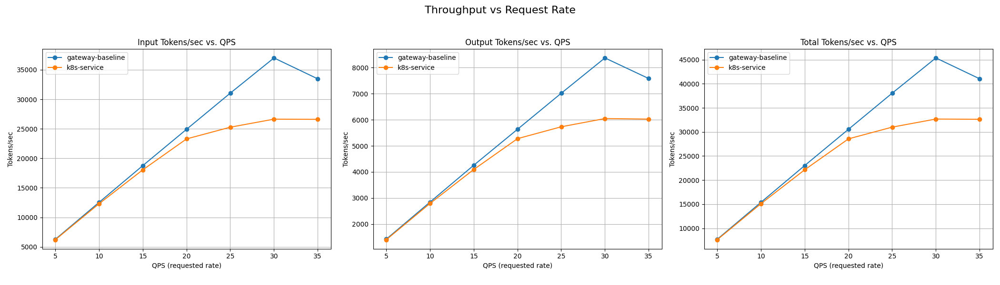
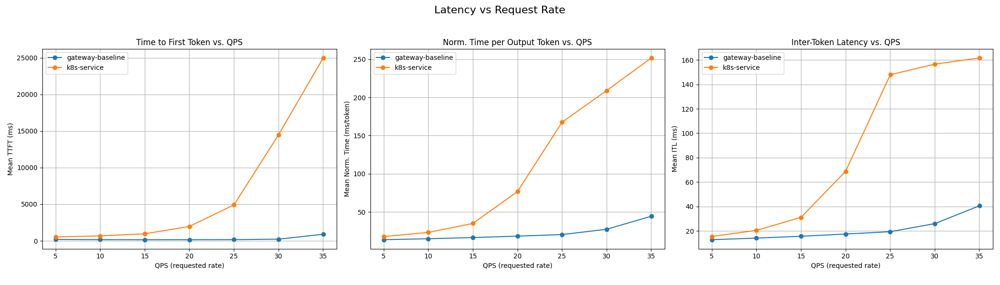
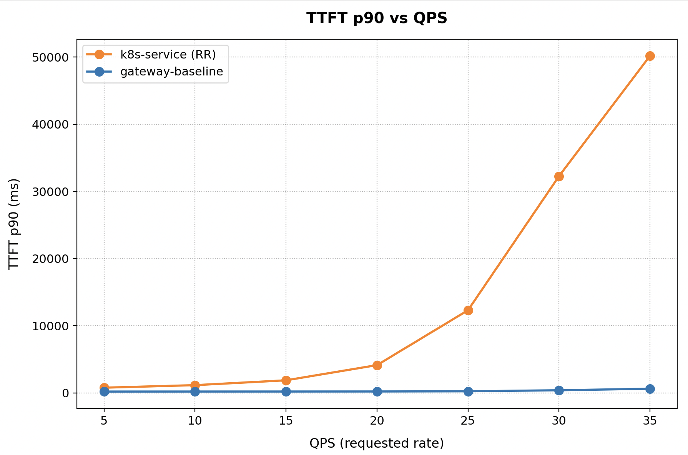

# Multimodal Optimized Baseline Guide

This guide deploys the recommended [configuration](https://github.com/llm-d/llm-d-router/blob/main/docs/architecture.md) for multimodal vLLM deployments, reducing tail latency and increasing throughput through load-aware and prefix-cache aware balancing.

The multimodal-optimized-baseline defaults to two main routing criteria:
* **Prefix-cache aware:** Scores candidate endpoints by estimating multimodal prompt prefix cache reuse (e.g., matching text + image hashes) on each model server.
* **Load-aware:** Scores candidate endpoints based on queue depth and kv-cache utilization to prevent server bottlenecks.

---

## Default Configuration

| Parameter          | Value                                                   |
| ------------------ | ------------------------------------------------------- |
| Default Model      | [Qwen/Qwen3-VL-32B-Instruct](https://huggingface.co/Qwen/Qwen3-VL-32B-Instruct) |
| Replicas           | 8                                                       |
| Tensor Parallelism | 2                                                       |
| GPUs per replica   | 2                                                       |
| Total GPUs         | 16                                                      |

### Supported Hardware Backends

This guide includes configurations for the following accelerators and inference backends:

| Backend            | Directory                  | Notes                                      |
| ------------------ | -------------------------- | ------------------------------------------ |
| NVIDIA GPU         | `modelserver/gpu/vllm/${INFRA_PROVIDER}/`    | Default configuration (`INFRA_PROVIDER` options: `base`, `gke`)                      |

---

## Prerequisites

1. Install the local client tooling using the [client setup guide](../../../helpers/client-setup/README.md).
2. Clone and check out the llm-d repository:
   ```bash
   export branch="main" # branch, tag, or commit hash
   git clone https://github.com/llm-d/llm-d.git && cd llm-d && git checkout ${branch}
   export REPO_ROOT=$(realpath $(git rev-parse --show-toplevel))
   ```
3. Set up environment variables:
   ```bash
   source ${REPO_ROOT}/guides/env.sh
   export GUIDE_NAME="aggregation"
   export NAMESPACE=llm-d-multimodal-aggregation
   ```
4. Install the Gateway API Inference Extension CRDs:
   ```bash
   kubectl apply -f https://github.com/kubernetes-sigs/gateway-api-inference-extension/releases/download/${GAIE_VERSION}/v1-manifests.yaml
   ```
5. Create the namespace:
   ```bash
   kubectl create namespace ${NAMESPACE}
   ```
6. [Create the `llm-d-hf-token` secret in your target namespace with the key `HF_TOKEN` matching a valid HuggingFace token](../../../helpers/hf-token.md) to pull models.
<!-- llm-d-cicd:skip start -->
   ```bash
   export HF_TOKEN=<your HuggingFace token>
   kubectl create secret generic llm-d-hf-token \
     --from-literal="HF_TOKEN=${HF_TOKEN}" \
     --namespace "${NAMESPACE}" \
     --dry-run=client -o yaml | kubectl apply -f -
   ```
<!-- llm-d-cicd:skip end -->

---

## Installation Instructions

### 1. Deploy the llm-d Router

#### Standalone Mode
Deploy the llm-d Router in **Standalone Mode** overlaying router custom configurations:
```bash
# Run from the root of the llm-d repo
helm install ${GUIDE_NAME} \
    ${ROUTER_STANDALONE_CHART} \
    -f ${REPO_ROOT}/guides/recipes/router/base.values.yaml \
    -f ${REPO_ROOT}/guides/multimodal-serving/${GUIDE_NAME}/router/${GUIDE_NAME}.values.yaml \
    -n ${NAMESPACE} --version ${ROUTER_CHART_VERSION}
```

<details>
<summary><h4>Gateway Mode</h4></summary>

To use a Kubernetes Gateway managed proxy rather than the standalone version, follow these steps:

1. _Deploy a Kubernetes Gateway_ named by following one of [the gateway guides](../../../docs/infrastructure/gateway).
2. _Deploy the llm-d router and an HTTPRoute_ that connects it to the Gateway as follows:

```bash
export PROVIDER_NAME=gke # options: none, gke, agentgateway, istio
helm install ${GUIDE_NAME} \
    ${ROUTER_GATEWAY_CHART}  \
    -f ${REPO_ROOT}/guides/recipes/router/base.values.yaml \
    -f ${REPO_ROOT}/guides/multimodal-serving/${GUIDE_NAME}/router/${GUIDE_NAME}.values.yaml \
    --set provider.name=${PROVIDER_NAME} \
    --set httpRoute.create=true \
    --set httpRoute.inferenceGatewayName=llm-d-inference-gateway \
    -n ${NAMESPACE} --version ${ROUTER_CHART_VERSION}
```

</details>

### 2. Deploy the Model Server

Apply the Kustomize overlays for your specific backend (defaulting to NVIDIA GPU / vLLM):

```bash
export INFRA_PROVIDER=gke # base | gke
kubectl apply -n ${NAMESPACE} -k ${REPO_ROOT}/guides/multimodal-serving/${GUIDE_NAME}/modelserver/gpu/vllm/${INFRA_PROVIDER}/
```

### 3. (Optional) Enable monitoring

- Install the [Monitoring stack](../../../docs/operations/observability).
- To enable Prometheus monitoring on the llm-d router, add `-f ${REPO_ROOT}/guides/recipes/router/features/monitoring.values.yaml` during the [router installation step](#1-deploy-the-llm-d-router).
- Deploy the monitoring resources for model servers:

```bash
kubectl apply -n ${NAMESPACE} -k ${REPO_ROOT}/guides/recipes/modelserver/components/monitoring
```

---

## Verification

### 1. Retrieve the Proxy Endpoint IP

**Standalone Mode:**
```bash
export IP=$(kubectl get service ${GUIDE_NAME}-epp -n ${NAMESPACE} -o jsonpath='{.spec.clusterIP}')
```

<details>
<summary><b>Gateway Mode:</b></summary>

```bash
export IP=$(kubectl get gateway llm-d-inference-gateway -n ${NAMESPACE} -o jsonpath='{.status.addresses[0].value}')
```

</details>

### 2. Send a Multimodal Test Request

Open a debug container within the cluster namespace:
```bash
kubectl run curl-debug --rm -it \
    --image=cfmanteiga/alpine-bash-curl-jq \
    --env="IP=$IP" \
    --env="NAMESPACE=$NAMESPACE" \
    -- /bin/bash
```

Send an OpenAI-compatible Chat Completion request containing a text prompt and a target image URL:
```bash
curl -X POST http://${IP}/v1/chat/completions \
    -H 'Content-Type: application/json' \
    -d '{
        "model": "Qwen/Qwen3-VL-32B-Instruct",
        "messages": [
            {
                "role": "user",
                "content": [
                    {
                        "type": "text",
                        "text": "What details are present in this photo?"
                    },
                    {
                        "type": "image_url",
                        "image_url": {
                            "url": "https://picsum.photos/640/360"
                        }
                    }
                ]
            }
        ]
    }' | jq
```

---

## Cleanup

To tear down and clean up all deployed resources:
```bash
helm uninstall ${GUIDE_NAME} -n ${NAMESPACE}
kubectl delete -n ${NAMESPACE} -k ${REPO_ROOT}/guides/multimodal-serving/${GUIDE_NAME}/modelserver/gpu/vllm/${INFRA_PROVIDER}/
kubectl delete namespace ${NAMESPACE}
```

## Benchmarking Report

The benchmark runs on 16 × H200 GPUs, distributed across 8 model servers (2 H200s per server with TP=2).

### Comparing llm-d Routing to a Simple Kubernetes Service

Graphs below compare optimized-baseline routing to a stock Kubernetes Service that round-robins requests across the same 8 vLLM pods (no EPP, no scoring).





<details>
<summary><b><i>Click</i></b> to view the per-rate breakdown across the full ladder</summary>

Output tokens/sec — higher is better; TTFT in seconds — lower is better.

| Rate | k8s Output | llm-d Output | k8s TTFT mean | llm-d TTFT mean | k8s TTFT p90 | llm-d TTFT p90 |
|-----:|-----------:| -----------: | ------------: | --------------: | -----------: | -------------: |
|    5 |  1,405.16  |   1,425.62   |     0.532     |      0.194      |   777.100    |    201.200     |
|   10 |  2,792.99  |   2,844.20   |     0.678     |      0.164      | 1,154.900    |    204.700     |
|   15 |  4,094.10  |   4,256.97   |     0.962     |      0.158      | 1,874.800    |    207.400     |
|   20 |  5,275.50  |   5,636.65   |     1.962     |      0.158      | 4,136.900    |    212.800     |
|   25 |  5,730.53  |   7,014.95   |     4.924     |      0.168      |12,305.800    |    239.500     |
|   30 |  6,045.01  |   8,367.86   |    14.448     |      0.229      |32,267.500    |    394.000     |
|   35 |  6,024.66  |   7,577.50   |    24.970     |      0.899      |50,178.200    |    618.900     |

</details>
