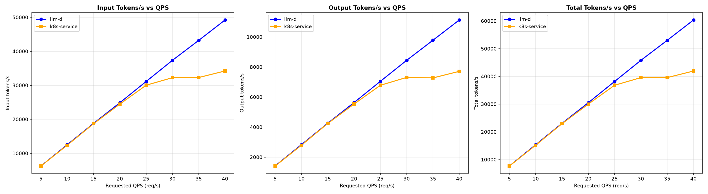
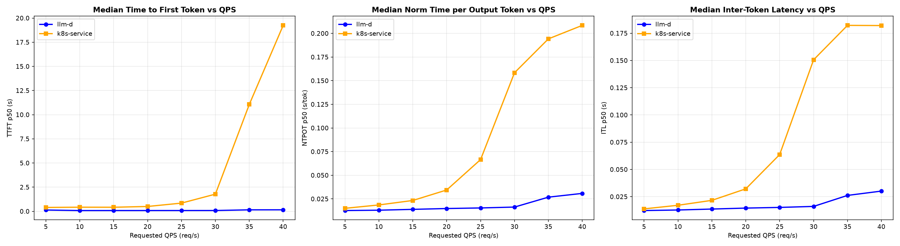
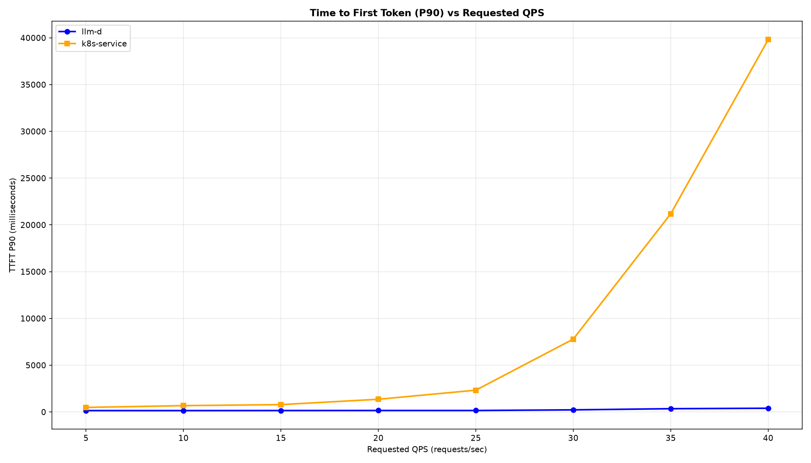

# Multimodal Optimized Baseline Guide

This guide deploys the recommended [configuration](https://github.com/llm-d/llm-d-router/blob/main/docs/architecture.md) for multimodal vLLM deployments, reducing tail latency and increasing throughput through load-aware and prefix-cache aware balancing.

The multimodal-optimized-baseline routes with the same token-based stack as the [optimized-baseline](../../optimized-baseline) reference:

* **Prefix-cache aware:** The `prefix-cache-affinity-filter` selects the endpoint set by estimating multimodal prompt prefix cache reuse (matching text + image content hashes) on each model server.
* **Token-load aware:** The `token-load-scorer` picks within the set on queued prefill token load. The multimodal `token-producer` feeds it per-request token counts, estimating each image's contribution from its resolution — image inputs have no text length to read.

---

## Default Configuration

| Parameter          | Value                                                   |
| ------------------ | ------------------------------------------------------- |
| Default Model      | [Qwen/Qwen3-VL-32B-Instruct](https://huggingface.co/Qwen/Qwen3-VL-32B-Instruct) |
| Replicas           | 8                                                       |
| Tensor Parallelism | 2                                                       |
| GPUs per replica   | 2                                                       |
| Total GPUs         | 16                                                      |

### Supported Hardware Backends

This guide includes configurations for the following accelerators and inference backends:

| Backend            | Directory                  | Model                        | Notes                                      |
| ------------------ | -------------------------- | ---------------------------- | ------------------------------------------ |
| NVIDIA GPU         | `modelserver/gpu/vllm/${INFRA_PROVIDER}/`    | `Qwen/Qwen3-VL-32B-Instruct` | Default configuration (`INFRA_PROVIDER` options: `base`, `gke`)                      |
| Intel XPU          | `modelserver/xpu/vllm/`    | `Qwen/Qwen3-VL-32B-Instruct` | Intel Arc Pro B60            |
| Google TPU v7      | `modelserver/tpu/v7/vllm/qwen3-vl/` | `Qwen/Qwen3-VL-32B-Instruct` | GKE `tpu7x`, `2x2x1` slice, TP=4, 4 chips per replica, 8 replicas |
| Google TPU v7      | `modelserver/tpu/v7/vllm/gemma4/`   | `google/gemma-4-31B-it`      | Same hardware; <br/>needs the Gemma 4 token estimate in the [router values](#1-deploy-the-llm-d-router) |

> [!NOTE]
> Review replica count, tensor parallelism, and the `2x2x1` topology against your own slice before
> deploying. The TPU resource count is not freely adjustable: GKE requires a pod to request every chip
> on the node for its topology, so a `2x2x1` `tpu7x` slice must request exactly 4.

---

## Prerequisites

1. Install the local client tooling using the [client setup guide](../../../helpers/client-setup/README.md).
2. Clone and check out the llm-d repository:

   ```bash
   export branch="main" # branch, tag, or commit hash
   git clone https://github.com/llm-d/llm-d.git && cd llm-d && git checkout ${branch}
   export REPO_ROOT=$(realpath $(git rev-parse --show-toplevel))
   ```

3. Set up environment variables:

   ```bash
   source ${REPO_ROOT}/guides/env.sh
   export GUIDE_NAME="aggregation"
   export NAMESPACE=llm-d-multimodal-aggregation
   ```

4. Install the Gateway API Inference Extension CRDs:

   ```bash
   kubectl apply -f https://github.com/kubernetes-sigs/gateway-api-inference-extension/releases/download/${GAIE_VERSION}/v1-manifests.yaml
   ```

5. Create the namespace:

   ```bash
   kubectl create namespace ${NAMESPACE}
   ```

6. [Create the `llm-d-hf-token` secret in your target namespace with the key `HF_TOKEN` matching a valid HuggingFace token](../../../helpers/hf-token.md) to pull models.
<!-- llm-d-cicd:skip start -->
   ```bash
   export HF_TOKEN=<your HuggingFace token>
   kubectl create secret generic llm-d-hf-token \
     --from-literal="HF_TOKEN=${HF_TOKEN}" \
     --namespace "${NAMESPACE}" \
     --dry-run=client -o yaml | kubectl apply -f -
   ```
<!-- llm-d-cicd:skip end -->

---

## Installation Instructions

### 1. Deploy the llm-d Router

#### Standalone Mode

Deploy the llm-d Router in **Standalone Mode** overlaying router custom configurations:

```bash
# Run from the root of the llm-d repo
helm install ${GUIDE_NAME} \
    ${ROUTER_STANDALONE_CHART} \
    -f ${REPO_ROOT}/guides/recipes/router/base.values.yaml \
    -f ${REPO_ROOT}/guides/multimodal-serving/${GUIDE_NAME}/router/${GUIDE_NAME}.values.yaml \
    -n ${NAMESPACE} --version ${ROUTER_CHART_VERSION}
```

> [!IMPORTANT]
> The `token-producer` estimate in the router values must match the model you deploy in step 2.
> The shipped default estimates image tokens from resolution, which is correct for Qwen3-VL. If you
> deploy `google/gemma-4-31B-it`, swap in the commented-out `estimate:` block in
> [`router/aggregation.values.yaml`](router/aggregation.values.yaml) — Gemma 4 allocates a fixed token
> budget per image, so the resolution-based estimator would mis-price every multimodal request and skew
> routing with no error to signal it.

<details>
<summary><h4>Gateway Mode</h4></summary>

To use a Kubernetes Gateway managed proxy rather than the standalone version, follow these steps:

1. _Deploy a Kubernetes Gateway_ named by following one of [the gateway guides](../../../docs/infrastructure/gateway).
2. _Deploy the llm-d router and an HTTPRoute_ that connects it to the Gateway as follows:

```bash
export PROVIDER_NAME=gke # options: none, gke, agentgateway, istio
helm install ${GUIDE_NAME} \
    ${ROUTER_GATEWAY_CHART}  \
    -f ${REPO_ROOT}/guides/recipes/router/base.values.yaml \
    -f ${REPO_ROOT}/guides/multimodal-serving/${GUIDE_NAME}/router/${GUIDE_NAME}.values.yaml \
    --set provider.name=${PROVIDER_NAME} \
    --set httpRoute.create=true \
    --set httpRoute.inferenceGatewayName=llm-d-inference-gateway \
    -n ${NAMESPACE} --version ${ROUTER_CHART_VERSION}
```

</details>

### 2. Deploy the Model Server

Apply the Kustomize overlays for your specific backend (defaulting to NVIDIA GPU / vLLM):

```bash
export INFRA_PROVIDER=gke # base | gke
kubectl apply -n ${NAMESPACE} -k ${REPO_ROOT}/guides/multimodal-serving/${GUIDE_NAME}/modelserver/gpu/vllm/${INFRA_PROVIDER}/
```

<details>
<summary><h4>Other Accelerators</h4></summary>

```bash
# Intel XPU
kubectl apply -n ${NAMESPACE} -k ${REPO_ROOT}/guides/multimodal-serving/${GUIDE_NAME}/modelserver/xpu/vllm/

# Google TPU v7 — Qwen3-VL-32B-Instruct
kubectl apply -n ${NAMESPACE} -k ${REPO_ROOT}/guides/multimodal-serving/${GUIDE_NAME}/modelserver/tpu/v7/vllm/qwen3-vl/

# Google TPU v7 — google/gemma-4-31B-it
kubectl apply -n ${NAMESPACE} -k ${REPO_ROOT}/guides/multimodal-serving/${GUIDE_NAME}/modelserver/tpu/v7/vllm/gemma4/
```

> [!NOTE]
> Intel XPU deployments use Kubernetes Dynamic Resource Allocation (DRA) with `resource.k8s.io/v1` `ResourceClaimTemplate` resources and per-container `resources.claims`. Ensure your cluster supports DRA, has the Intel device plugin/DRA components installed, and exposes the `gpu.intel.com` `DeviceClass` before applying this overlay.

> [!NOTE]
> The TPU overlays schedule onto a GKE node pool with `cloud.google.com/gke-tpu-accelerator: tpu7x` and
> `cloud.google.com/gke-tpu-topology: 2x2x1`, and request 4 `google.com/tpu` chips per replica. GKE Warden
> requires a pod to request **all** the chips on the node for its topology (`2x2x1` on `tpu7x` is 4 chips),
> so that count is fixed by the `nodeSelector` rather than freely tunable. `--tensor-parallel-size` matches
> it at 4 so every chip is used. Adjust the `nodeSelector`, the TPU resource count, and the tensor parallel
> size together if your slice differs.
>
> The TPU pods also set `priorityClassName: medium`. That `PriorityClass` is **not** created by this guide —
> it must already exist in the cluster, or the pods are rejected at admission. Drop the field if your
> cluster doesn't define it.

</details>

### 3. (Optional) Enable monitoring

* Install the [Monitoring stack](../../../docs/operations/observability).
* To enable Prometheus monitoring on the llm-d router, add `-f ${REPO_ROOT}/guides/recipes/router/features/monitoring.values.yaml` during the [router installation step](#1-deploy-the-llm-d-router).
* Deploy the monitoring resources for model servers:

```bash
kubectl apply -n ${NAMESPACE} -k ${REPO_ROOT}/guides/recipes/modelserver/components/monitoring
```

---

## Verification

### 1. Retrieve the Proxy Endpoint IP

**Standalone Mode:**

```bash
export IP=$(kubectl get service ${GUIDE_NAME}-epp -n ${NAMESPACE} -o jsonpath='{.spec.clusterIP}')
```

<details>
<summary><b>Gateway Mode:</b></summary>

```bash
export IP=$(kubectl get gateway llm-d-inference-gateway -n ${NAMESPACE} -o jsonpath='{.status.addresses[0].value}')
```

</details>

### 2. Send a Multimodal Test Request

Open a debug container within the cluster namespace:

```bash
kubectl run curl-debug --rm -it \
    --image=cfmanteiga/alpine-bash-curl-jq \
    --env="IP=$IP" \
    --env="NAMESPACE=$NAMESPACE" \
    -- /bin/bash
```

Send an OpenAI-compatible Chat Completion request containing a text prompt and a target image URL (set `model` to `google/gemma-4-31B-it` if you deployed the Gemma 4 overlay):

```bash
curl -X POST http://${IP}/v1/chat/completions \
    -H 'Content-Type: application/json' \
    -d '{
        "model": "Qwen/Qwen3-VL-32B-Instruct",
        "messages": [
            {
                "role": "user",
                "content": [
                    {
                        "type": "text",
                        "text": "What details are present in this photo?"
                    },
                    {
                        "type": "image_url",
                        "image_url": {
                            "url": "https://picsum.photos/640/360"
                        }
                    }
                ]
            }
        ]
    }' | jq
```

---

## Cleanup

To tear down and clean up all deployed resources:

```bash
helm uninstall ${GUIDE_NAME} -n ${NAMESPACE}
kubectl delete -n ${NAMESPACE} -k ${REPO_ROOT}/guides/multimodal-serving/${GUIDE_NAME}/modelserver/gpu/vllm/${INFRA_PROVIDER}/
# For Intel XPU:
# kubectl delete -n ${NAMESPACE} -k ${REPO_ROOT}/guides/multimodal-serving/${GUIDE_NAME}/modelserver/xpu/vllm/
# For Google TPU v7:
# kubectl delete -n ${NAMESPACE} -k ${REPO_ROOT}/guides/multimodal-serving/${GUIDE_NAME}/modelserver/tpu/v7/vllm/qwen3-vl/
# kubectl delete -n ${NAMESPACE} -k ${REPO_ROOT}/guides/multimodal-serving/${GUIDE_NAME}/modelserver/tpu/v7/vllm/gemma4/
```

<!-- llm-d-cicd:skip start -->
```bash
kubectl delete namespace ${NAMESPACE}
```
<!-- llm-d-cicd:skip end -->

## Benchmarking Report

The benchmark runs on 16 × H200 GPUs, distributed across 8 model servers (2 H200s per server with TP=2), driven by the shared-prefix multimodal workload (3 × 720p images + ~1.3K text tokens per request, 300-token completions, 600 prefix groups of 5 prompts, constant-rate ladder 5 → 40 req/s, `llm-d-benchmark` harness v0.7.0). Numbers below were measured with the token-based routing stack this guide now ships; both configurations ran back-to-back on the identical fleet.

### Comparing llm-d Routing to a Simple Kubernetes Service

Graphs below compare multimodal-optimized-baseline routing to a stock Kubernetes Service that round-robins requests across the same 8 vLLM pods (no EPP, no scoring).





llm-d holds **sub-second TTFT p90 across the entire ladder** (0.15–0.40 s) while the plain Service climbs into unbounded queueing from ~25 req/s (p90 2.3 s → 39.8 s). The affinity filter pins each prefix group's text+image blocks to the pod that already holds them, so repeat traffic prefills almost nothing: throughput keeps scaling with offered load to **11,128 tok/s at rate 40 (+44% over the Service's 7,712)**, median TTFT stays ≤155 ms at every rate (**~125× lower** at the top of the ladder), and the whole run completed with **2 failed requests versus 27**.

> [!IMPORTANT]
> Two `prefix-cache-affinity-filter` parameters are tuned for multimodal traffic, with the rationale in the
> values file (the `token-producer` image `factor: 1024` is count-correct for Qwen3-VL — one visual token per
> 32×32-pixel region, measured against the served model):
>
> * `affinityThreshold: 0.6` — a multimodal request's _cacheable_ fraction is structurally lower than text:
>   the unique question is never a cache hit, so this workload's best possible prefix match is ~70% of the
>   prompt — below the plugin's 0.8 default, which would leave affinity permanently disengaged. Set the
>   threshold below your traffic's maximum cacheable fraction.
> * `maxTTFTPenaltyMs: 36000` (2× default) — token counts price an image token like a text token, but
>   vision-encoder time makes image-heavy prefill slower per token than the text-calibrated
>   `peakPrefillThroughput` implies, so the filter's predicted-TTFT runs light of wall-clock; doubling the
>   gate restores the intended pinning depth. Reduce toward the default for text-dominant traffic.

<details>
<summary><b><i>Click</i></b> to view the per-rate breakdown across the full ladder</summary>

Output tokens/sec — higher is better; TTFT in seconds — lower is better.

| Rate | k8s Output | llm-d Output | k8s TTFT p50 | llm-d TTFT p50 | k8s TTFT p90 | llm-d TTFT p90 |
|-----:|-----------:| -----------: | -----------: | -------------: | -----------: | -------------: |
|    5 |   1,408    |    1,421     |    0.401     |     0.133      |    0.487     |     0.148      |
|   10 |   2,794    |    2,836     |    0.425     |     0.078      |    0.676     |     0.147      |
|   15 |   4,241    |    4,259     |    0.420     |     0.079      |    0.788     |     0.153      |
|   20 |   5,535    |    5,634     |    0.501     |     0.080      |    1.358     |     0.158      |
|   25 |   6,782    |    7,046     |    0.849     |     0.081      |    2.330     |     0.157      |
|   30 |   7,307    |    8,444     |    1.777     |     0.083      |    7.792     |     0.225      |
|   35 |   7,272    |    9,782     |   11.060     |     0.153      |   21.192     |     0.350      |
|   40 |   7,712    |   11,128     |   19.245     |     0.155      |   39.813     |     0.399      |

</details>
