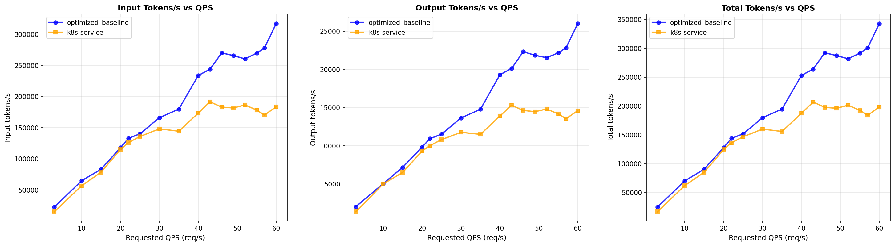
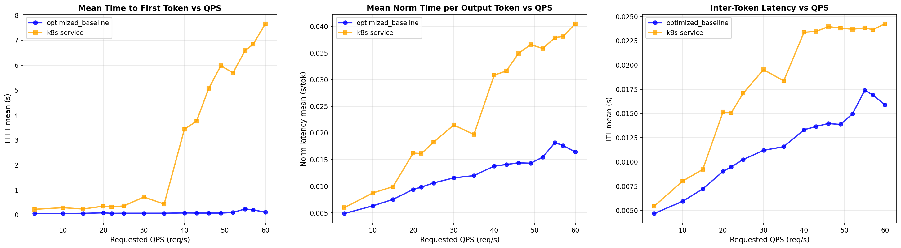
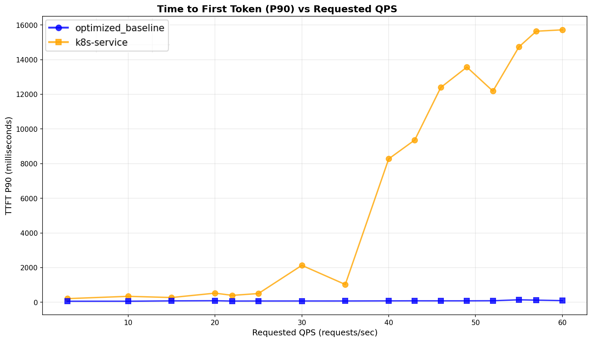

# Benchmark Report

The benchmark runs with decoders model openai/gpt-oss-120b on 16 × H100 GPUs, distributed across 16 H100 model servers with TP=1 and a modified workload template:
Update [guide_optimized-baseline_1.yaml workload template](../README.md#3-run-the-benchmark-profile-for-optimized-baseline) with: `workload.shared_prefix.data.shared_prefix.output_len`: 500 and `workload.shared_prefix.data.shared_prefix.question_len`: 500.

The benchmark run by [compare-llm-d-configurations skill](https://github.com/llm-d-incubation/llm-d-skills/tree/main/skills/compare-llm-d-configurations).

## Comparing llm-d Routing to a Simple Kubernetes Service (vLLM Additional Configuration: gpt-oss-120b)

Graphs below compare optimized-baseline routing to a stock Kubernetes Service that random (OVN-K) requests across the same 16 vLLM pods (no EPP, no scoring).

Summary across the full ladder (rates 3 → 60):

| Metric                  | k8s service (R) | llm-d Optimized | Δ% vs k8s |
| :---------------------- | :-------------- | :-------------- | :-------- |
| Output tokens/sec       | 7,189           | 8,605           | +19.7%    |
| Requests/sec            | 13.44           | 15.59           | +16.0%    |
| TTFT mean (s)           | 4.106           | 0.142           | -96.5%    |
| TTFT p90 (s)            | 11.733          | 0.090           | -99.2%    |
| ITL mean (ms)           | 21.52           | 13.63           | -36.7%    |
| Cache miss/req (tokens) | 68,467          | 281             | -99.6%    |

<b><i>Click</i></b> to view the per-rate breakdown across the full ladder

Output tokens/sec — higher is better; TTFT in seconds — lower is better.

| Rate | k8s Output | llm-d Output | k8s TTFT mean | llm-d TTFT mean | k8s TTFT p90 | llm-d TTFT p90 |
| ---: | ---------: | -----------: | ------------: | --------------: | -----------: | -------------: |
| 3    | 1,351.4.   | 2,026.2.     | 0.2206	       | 0.0539	         | 0.2089	    | 0.0592         |
| 10   | 5,003.9    | 5,032.6      | 0.2864        | 0.0533          | 0.3425       | 0.0594         |
| 15   | 6,495.9    | 7,165.2      | 0.2326        | 0.0594          | 0.2724       | 0.0792         |
| 20   | 9,306.2    | 9,824.8      | 0.3480        | 0.0811          | 0.5255       | 0.0881         |
| 22   | 10,007.8   | 10,916.3     | 0.3189        | 0.0602          | 0.3978       | 0.0697         |
| 25   | 10,801.6   | 11,525.6     | 0.3540        | 0.0634          | 0.5032       | 0.0718         |
| 30   | 11,762.8   | 13,643.3     | 0.7136        | 0.0637          | 2.1299       | 0.0728         |
| 35   | 11,493.7   | 14,777.6     | 0.4310        | 0.0641          | 1.0255       | 0.0735         |
| 40   | 13,894     | 19,309       | 3.4314        | 0.0767          | 8.2725       | 0.0794         |
| 43   | 15,312.5   | 20,118.8     | 3.7534        | 0.0720          | 9.3615       | 0.0826         |
| 46   | 14,633.3   | 22,326.1     | 5.0618        | 0.0717          | 12.3945      | 0.0814         |
| 49   | 14,459.2   | 21,851.7     | 5.9774        | 0.0712          | 13.5660      | 0.0817         |
| 52   | 14,817.1   | 21,543.7     | 5.6899        | 0.0942          | 12.1829      | 0.0871         |
| 55   | 14,172.8   | 22,171.2     | 6.5856        | 0.2357          | 14.7343      | 0.1415         |
| 57   | 13,547.2   | 22,829.8     | 6.8363        | 0.1963          | 15.6380      | 0.1221         |
| 60   | 14,589.8   | 26,013.2     | 7.6587        | 0.1052          | 15.7172      | 0.0939         |

