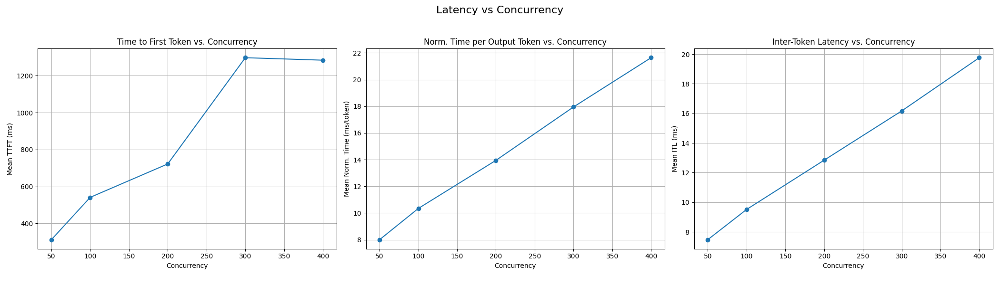
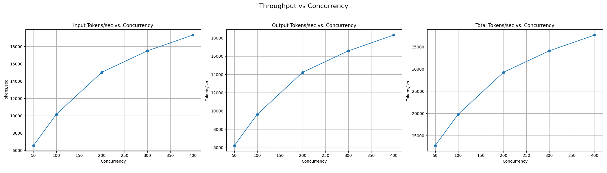
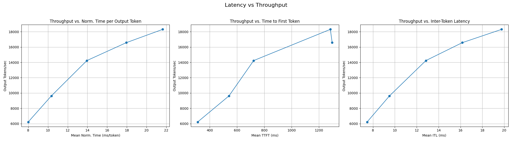

# Well-lit Path: P/D Disaggregation

## Overview

This guide demonstrates how to deploy GPT-OSS-120B using vLLM's P/D disaggregation support with NIXL. This guide has been validated on:

* an 8xH200 cluster with InfiniBand networking
* an 8xH200 cluster on GKE with RoCE networking

> WARNING: We are still investigating and optimizing performance for other hardware and networking configurations

In this example, we will demonstrate a deployment of `openai/gpt-oss-120b` with:

* 4 TP=1 Prefill Workers
* 1 TP=4 Decode Worker

## P/D Best Practices

P/D disaggregation provides more flexibility in navigating the trade-off between throughput and interactivity([ref](https://arxiv.org/html/2506.05508v1)).
In particular, due to the elimination of prefill interference to the decode phase, P/D disaggregation can achieve lower inter token latency (ITL), thus
improving interactivity. For a given ITL goal, P/D disaggregation can benefit overall throughput by:

* Specializing P and D workers for compute-bound vs latency-bound workloads
* Reducing the number of copies of the model (increasing KV cache RAM) with wide parallelism

However, P/D disaggregation is not a target for all workloads. We suggest exploring P/D disaggregation for workloads with:

* Large models (e.g. gpt-oss-120b+, not gpt-oss-20B)
* Longer input sequence lengths (e.g 10k ISL | 1k OSL, not 200 ISL | 200 OSL)
* Sparse MoE architectures with opportunities for wide-EP

As a result, as you tune your P/D deployments, we suggest focusing on the following parameters:

* **Heterogeneous Parallelism**: deploy P workers with less parallelism and more replicas and D workers with more parallelism and fewer replicas
* **xPyD Ratios**: tuning the ratio of P workers to D workers to ensure balance for your ISL|OSL ratio

For very large models leveraging wide-EP, traffic for KV cache transfer may contend with expert parallelism when the ISL|OSL ratio is also high. We recommend starting with RDMA for KV cache transfer before attempting to leverage TCP, as TCP transfer requires more tuning of UCX under NIXL.

## Hardware Requirements

This guide expects 8 Nvidia GPUs of any kind, and RDMA via InfiniBand or RoCE between all pods in the workload.

## Prerequisites

* Have the [proper client tools installed on your local system](../prereq/client-setup/README.md) to use this guide.
* Ensure your cluster infrastructure is sufficient to [deploy high scale inference](../prereq/infrastructure)
* Configure and deploy your [Gateway control plane](../prereq/gateway-provider/README.md).
* Have the [Monitoring stack](../../docs/monitoring/README.md) installed on your system.
* Create a namespace for installation.

  ```bash
  export NAMESPACE=llm-d-pd # or any other namespace (shorter names recommended)
  kubectl create namespace ${NAMESPACE}
  ```

* [Create the `llm-d-hf-token` secret in your target namespace with the key `HF_TOKEN` matching a valid HuggingFace token](../prereq/client-setup/README.md#huggingface-token) to pull models.
* [Choose an llm-d version](../prereq/client-setup/README.md#llm-d-version)

## Installation

Use the helmfile to compose and install the stack. The Namespace in which the stack will be deployed will be derived from the `${NAMESPACE}` environment variable. If you have not set this, it will default to `llm-d-pd` in this example.

### Deploy

```bash
cd guides/pd-disaggregation
helmfile apply -n ${NAMESPACE}
```

**_NOTE:_** You can set the `$RELEASE_NAME_POSTFIX` env variable to change the release names. This is how we support concurrent installs. Ex: `RELEASE_NAME_POSTFIX=pd-2 helmfile apply -n ${NAMESPACE}`

**_NOTE:_** This uses Istio as the default provider, see [Gateway Options](./README.md#gateway-options) for installing with a specific provider.

### Gateway options

To see specify your gateway choice you can use the `-e <gateway option>` flag, ex:

```bash
helmfile apply -e kgateway -n ${NAMESPACE}
```

To see what gateway options are supported refer to our [gateway provider prereq doc](../prereq/gateway-provider/README.md#supported-providers). Gateway configurations per provider are tracked in the [gateway-configurations directory](../prereq/gateway-provider/common-configurations/).

You can also customize your gateway, for more information on how to do that see our [gateway customization docs](../../docs/customizing-your-gateway.md).

#### Infrastructure provider specifics

This guide uses RDMA via InfiniBand or RoCE for disaggregated serving kv-cache transfer. The resource attributes required to configure accelerator networking are not yet standardized via [Kubernetes Dynamic Resource Allocation](https://kubernetes.io/docs/concepts/scheduling-eviction/dynamic-resource-allocation/) and so are parameterized per infra provider in the Helm charts. If your provider has a custom setting you will need to update the charts before deploying.

### Install HTTPRoute

Follow provider specific instructions for installing HTTPRoute.

#### Install for "kgateway" or "istio"

```bash
kubectl apply -f httproute.yaml -n ${NAMESPACE}
```

#### Install for "gke"

```bash
kubectl apply -f httproute.gke.yaml -n ${NAMESPACE}
```

## Verify the Installation

* Firstly, you should be able to list all helm releases to view the 3 charts got installed into your chosen namespace:

```bash
helm list -n ${NAMESPACE}
NAME        NAMESPACE   REVISION    UPDATED                                 STATUS      CHART                       APP VERSION
gaie-pd     llm-d-pd    1           2025-08-24 12:54:51.231537 -0700 PDT    deployed    inferencepool-v1.3.0        v1.3.0
infra-pd    llm-d-pd    1           2025-08-24 12:54:46.983361 -0700 PDT    deployed    llm-d-infra-v1.3.6          v0.3.0
ms-pd       llm-d-pd    1           2025-08-24 12:54:56.736873 -0700 PDT    deployed    llm-d-modelservice-v0.4.5   v0.4.0
```

* Out of the box with this example you should have the following resources:

```bash
kubectl get all -n ${NAMESPACE}
NAME                                                    READY   STATUS    RESTARTS   AGE
pod/gaie-pd-epp-54444ddc66-qv6ds                        1/1     Running   0          2m35s
pod/infra-pd-inference-gateway-istio-56d66db57f-zwtzn   1/1     Running   0          2m41s
pod/ms-pd-llm-d-modelservice-decode-84bf6d5bdd-jzfjn    2/2     Running   0          2m30s
pod/ms-pd-llm-d-modelservice-prefill-86f6fb7cdc-8kfb8   1/1     Running   0          2m30s
pod/ms-pd-llm-d-modelservice-prefill-86f6fb7cdc-g6wmp   1/1     Running   0          2m30s
pod/ms-pd-llm-d-modelservice-prefill-86f6fb7cdc-jx2w2   1/1     Running   0          2m30s
pod/ms-pd-llm-d-modelservice-prefill-86f6fb7cdc-vzcb8   1/1     Running   0          2m30s

NAME                                       TYPE           CLUSTER-IP    EXTERNAL-IP   PORT(S)                        AGE
service/gaie-pd-epp                        ClusterIP      10.16.0.255   <none>        9002/TCP,9090/TCP              2m35s
service/gaie-pd-ip-bb618139                ClusterIP      None          <none>        54321/TCP                      2m35s
service/infra-pd-inference-gateway-istio   ClusterIP      10.16.3.74    10.16.4.3     15021:31707/TCP,80:34096/TCP   2m41s

NAME                                               READY   UP-TO-DATE   AVAILABLE   AGE
deployment.apps/gaie-pd-epp                        1/1     1            1           2m36s
deployment.apps/infra-pd-inference-gateway-istio   1/1     1            1           2m42s
deployment.apps/ms-pd-llm-d-modelservice-decode    1/1     1            1           2m31s
deployment.apps/ms-pd-llm-d-modelservice-prefill   4/4     4            4           2m31s

NAME                                                          DESIRED   CURRENT   READY   AGE
replicaset.apps/gaie-pd-epp-54444ddc66                        1         1         1       2m36s
replicaset.apps/infra-pd-inference-gateway-istio-56d66db57f   1         1         1       2m42s
replicaset.apps/ms-pd-llm-d-modelservice-decode-84bf6d5bdd    1         1         1       2m31s
replicaset.apps/ms-pd-llm-d-modelservice-prefill-86f6fb7cdc   4         4         4       2m31s
```

**_NOTE:_** This assumes no other guide deployments in your given `${NAMESPACE}` and you have not changed the default release names via the `${RELEASE_NAME}` environment variable.

## Using the stack

For instructions on getting started making inference requests see [our docs](../../docs/getting-started-inferencing.md)

## Tuning Selective PD

Selective PD is a feature in the `inference-scheduler` within the context of prefill-decode dissagregation, although it is disabled by default. This features enables routing to just decode even with the P/D deployed. To enable it, you will need to set `threshold` value for the `pd-profile-handler` plugin, in the [GAIE values file](./gaie-pd/values.yaml). You can see the value of this here:

```bash
cat gaie-pd/values.yaml | yq '.inferenceExtension.pluginsCustomConfig."pd-config.yaml"' | yq '.plugins[] | select(.type == "pd-profile-handler")'
type: pd-profile-handler
parameters:
  threshold: 0 # update this
  hashBlockSize: 5
```

Some examples in which you might want to do selective PD might include:

* When the prompt is short enough that the amount of work split inference into prefill and decode phases, and then open a kv transfer between those two GPUs is greater than the amount of work to do both phases on the same decode inference worker.
* When Prefill units are at full capacity.

For information on this plugin, see our [`pd-profile-handler` docs in the inference-scheduler](https://github.com/llm-d/llm-d-inference-scheduler/blob/v0.5.0/docs/architecture.md?plain=1#L205-L210)

## Benchmarking

### Overview
The primary objective of this benchmark is to validate the correctness of the P/D disaggregation setup.

In this example, we deployed the user guide on GKE using the modified [Gateway options](./README.md#gateway-options) described above:

```bash
helmfile apply -e gke_pd_rdma -n ${NAMESPACE}
```
This setup serves the `openai/gpt-oss-120b` model using the following specifications:

* Provider: GKE
* Prefill: 1 instance with TP=8
* Decode: 1 instance with TP=8
* 2 `a3-ultragpu-8g` VMs, 16 GPUs

### Verify the correctness

```sh
kubectl get pods -n $NAMESPACE
NAME                                                READY   STATUS    RESTARTS   AGE
gaie-pd-epp-764f94bb6f-dz9nr                        1/1     Running   0          40m
ms-pd-llm-d-modelservice-decode-cc87cf9dc-bf8g7     2/2     Running   0          40m
ms-pd-llm-d-modelservice-prefill-69444f978b-xlcll   1/1     Running   0          40m
```

Ensure that vLLM debug logging is enabled. Submit the following request to your endpoint:

```sh
curl -i http://<your_endpoint>/v1/chat/completions \
  -H "Content-Type: application/json" \
  -d '{
    "model": "openai/gpt-oss-120b",
    "messages": [
      {
        "role": "user",
        "content": "<your prompt>"
      }
    ]
  }'
```

Expected Results:

On the prefill node, you should see the following log entry:

```
(APIServer pid=1) (EngineCore_DP0 pid=322) DEBUG 01-31 07:12:26 [distributed/.../v1/nixl_connector.py:725] NIXLConnector request_finished(chatcmpl-51b9a341-ca93-43f7-92fc-98b51f41d7e7), request_status=FINISHED_LENGTH_CAPPED, kv_transfer_params={'do_remote_decode': True, 'do_remote_prefill': False, 'remote_block_ids': None, 'remote_engine_id': None, 'remote_host': None, 'remote_port': None}
```

On the decode node, you should see the corresponding completion entry:

```
(APIServer pid=1) (EngineCore_DP0 pid=322) DEBUG 01-31 07:12:26 [distributed/.../v1/nixl_connector.py:725] NIXLConnector request_finished(chatcmpl-51b9a341-ca93-43f7-92fc-98b51f41d7e7), request_status=FINISHED_STOPPED, kv_transfer_params={'do_remote_decode': False, 'do_remote_prefill': False, 'remote_block_ids': [2, 3], 'remote_engine_id': '7520acd6-838a-4c0b-af97-a06e18a4f1c4', 'remote_host': '10.116.24.5', 'remote
```


### Run Benchmark

We use the [inference-perf](https://github.com/kubernetes-sigs/inference-perf/tree/main) benchmark tool to verify the setup by generating random datasets with 1K input length and 1K output length across different concurrency levels.

1. Deploy the inference PD stack following the Installation steps above. Once the stack is ready, obtain the gateway IP:

```bash
export GATEWAY_IP=$(kubectl get gateway/llm-d-inference-gateway -n ${NAMESPACE} -o jsonpath='{.status.addresses[0].value}')
```

The `GATEWAY_IP` environment variable will be used in the [benchmark template](../benchmark/pd_template.yaml).

2. Follow the [benchmark guide](../../guides/benchmark/README.md) to deploy the benchmark tool and analyze the benchmark results. Notably, select the corresponding benchmark template:

```
export BENCHMARK_TEMPLATE="${BENCH_TEMPLATE_DIR}"/pd_template.yaml
```

### Results





<details>
<summary><b><i>Click</i></b> for contents of the overall summary file (<code>summary_lifecycle_metrics.json</code>)</summary>

  ```json
  {
    "load_summary": {
      "count": 10500,
      "schedule_delay": {
        "mean": 77.6067300104108,
        "min": -0.0009471391094848514,
        "max": 193.36847741738893,
        "p0.1": -0.0005135770575143397,
        "p1": -9.381271200254551e-05,
        "p5": 0.0006701549165882171,
        "p10": 6.605916145677412,
        "p25": 31.773801590898074,
        "median": 69.96205037651816,
        "p75": 120.88437926475308,
        "p90": 157.18257419392472,
        "p95": 172.30117548274575,
        "p99": 193.24024071463967,
        "p99.9": 193.34426271322974
      }
    },
    "successes": {
      "count": 10500,
      "latency": {
        "request_latency": {
          "mean": 16.949693734689514,
          "min": 7.430527747026645,
          "max": 23.341206387034617,
          "p0.1": 7.546646456788178,
          "p1": 7.670289718103595,
          "p5": 9.628040663100546,
          "p10": 9.954197152797132,
          "p25": 13.491928927513072,
          "median": 17.363681015442125,
          "p75": 20.775550709746312,
          "p90": 21.703451853734443,
          "p95": 22.43754903097288,
          "p99": 23.146584392286606,
          "p99.9": 23.29399677501375
        },
        "normalized_time_per_output_token": {
          "mean": 0.017395157922218466,
          "min": 0.007569078082287961,
          "max": 0.05599903221818888,
          "p0.1": 0.007666992976993649,
          "p1": 0.007779649437568896,
          "p5": 0.009792350577796686,
          "p10": 0.01019379180393505,
          "p25": 0.013799272786547731,
          "median": 0.01784575978899651,
          "p75": 0.02109968625327706,
          "p90": 0.022346508134797133,
          "p95": 0.02311641331519695,
          "p99": 0.024021365913386925,
          "p99.9": 0.0332398016193207
        },
        "time_per_output_token": {
          "mean": 0.015854782856094884,
          "min": 0.007178500500973314,
          "max": 0.020949103697086684,
          "p0.1": 0.007198484788668575,
          "p1": 0.007428308323330711,
          "p5": 0.009125048257928575,
          "p10": 0.009484055226738564,
          "p25": 0.01283546879797359,
          "median": 0.016228663841495287,
          "p75": 0.01970306675226311,
          "p90": 0.020181560415274,
          "p95": 0.020428766423888738,
          "p99": 0.020664510622657836,
          "p99.9": 0.020713284537798724
        },
        "time_to_first_token": {
          "mean": 1.0639281511114733,
          "min": 0.08917623397428542,
          "max": 4.274269078974612,
          "p0.1": 0.10329887501196935,
          "p1": 0.12344494416029192,
          "p5": 0.18211153338779695,
          "p10": 0.22062120221089573,
          "p25": 0.3119133528089151,
          "median": 0.7006767939892597,
          "p75": 1.1240748403070029,
          "p90": 2.8348029804299584,
          "p95": 3.3259600740275332,
          "p99": 4.240478515403811,
          "p99.9": 4.267909067379777
        },
        "inter_token_latency": {
          "mean": 0.015854732319313614,
          "min": 6.483984179794788e-06,
          "max": 1.31577575893607,
          "p0.1": 1.727902120910585e-05,
          "p1": 0.005857429078314453,
          "p5": 0.0076378712663427,
          "p10": 0.009079416235908865,
          "p25": 0.012070255470462143,
          "median": 0.015335309086367488,
          "p75": 0.017898101534228772,
          "p90": 0.019151526875793936,
          "p95": 0.021329846547450872,
          "p99": 0.04715092248981833,
          "p99.9": 0.19980837515836633
        }
      },
      "throughput": {
        "input_tokens_per_sec": 13641.337272379991,
        "output_tokens_per_sec": 12925.396206067344,
        "total_tokens_per_sec": 26566.733478447335,
        "requests_per_sec": 13.241470097289648
      },
      "prompt_len": {
        "mean": 1030.1980952380952,
        "min": 1014.0,
        "max": 1049.0,
        "p0.1": 1014.0,
        "p1": 1016.0,
        "p5": 1020.0,
        "p10": 1022.0,
        "p25": 1025.0,
        "median": 1030.0,
        "p75": 1034.25,
        "p90": 1039.0,
        "p95": 1043.0,
        "p99": 1048.0,
        "p99.9": 1049.0
      },
      "output_len": {
        "mean": 976.13,
        "min": 390.0,
        "max": 1007.0,
        "p0.1": 561.998,
        "p1": 870.0,
        "p5": 947.0,
        "p10": 961.0,
        "p25": 972.0,
        "median": 981.0,
        "p75": 989.0,
        "p90": 994.0,
        "p95": 996.0,
        "p99": 999.0,
        "p99.9": 1001.0
      }
    },
    "failures": {
      "count": 0,
      "request_latency": null,
      "prompt_len": null
    }
  }
  ```

</details>


## Cleanup

To remove the deployment:

```bash
# Remove the model services
helmfile destroy -n ${NAMESPACE}

# Remove the infrastructure
helm uninstall ms-pd -n ${NAMESPACE}
helm uninstall gaie-pd -n ${NAMESPACE}
helm uninstall infra-pd -n ${NAMESPACE}
```

**_NOTE:_** If you set the `$RELEASE_NAME_POSTFIX` environment variable, your release names will be different from the command above: `infra-$RELEASE_NAME_POSTFIX`, `gaie-$RELEASE_NAME_POSTFIX` and `ms-$RELEASE_NAME_POSTFIX`.

### Cleanup HTTPRoute

Follow provider specific instructions for deleting HTTPRoute.

#### Cleanup for "kgateway" or "istio"

```bash
kubectl delete -f httproute.yaml -n ${NAMESPACE}
```

#### Cleanup for "gke"

```bash
kubectl delete -f httproute.gke.yaml -n ${NAMESPACE}
```

## Customization

For information on customizing a guide and tips to build your own, see [our docs](../../docs/customizing-a-guide.md)
