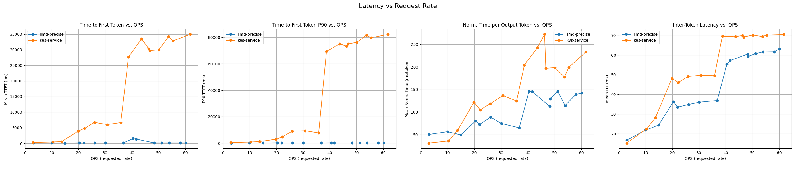
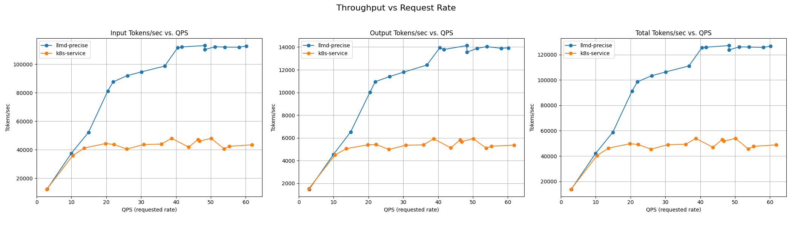

# Feature: Precise Prefix Cache Aware Routing

## Overview

This guide demonstrates how to configure the inference scheduler to use the new precise prefix cache aware routing based on [vLLM KV-Events](https://github.com/vllm-project/vllm/issues/16669) data. Precise prefix cache aware routing pulls up-to-date prefix cache status from serving instances, eliminating the need for additional indexing services and increasing cache hit rate at high throughput.

## Hardware Requirements

This example out of the box uses 16 GPUs (8 replicas x 2 GPUs each) of any supported kind:

- **NVIDIA GPUs**: Any NVIDIA GPU (support determined by the inferencing image used)
- **Intel XPU/GPUs**: Intel Data Center GPU Max 1550 or compatible Intel XPU device

**Using fewer accelerators**: Fewer accelerators can be used by modifying the `values.yaml` corresponding to your deployment. For example, to use only 2 GPUs with the default NVIDIA GPU deployment, update `replicas: 2` in [ms-kv-events/values.yaml](./ms-kv-events/values.yaml#L16-L21).


## Prerequisites

- Have the [proper client tools installed on your local system](../prereq/client-setup/README.md) to use this guide.
- Configure and deploy your [Gateway control plane](../prereq/gateway-provider/README.md).
- Have the [Monitoring stack](../../docs/monitoring/README.md) installed on your system.
- Create a namespace for installation.

  ```bash
  export NAMESPACE=llm-d-precise # or any other namespace (shorter names recommended)
  kubectl create namespace ${NAMESPACE}
  ```

- [Create the `llm-d-hf-token` secret in your target namespace with the key `HF_TOKEN` matching a valid HuggingFace token](../prereq/client-setup/README.md#huggingface-token) to pull models.
- [Choose an llm-d version](../prereq/client-setup/README.md#llm-d-version)

## Installation

Use the helmfile to compose and install the stack. The Namespace in which the stack will be deployed will be derived from the `${NAMESPACE}` environment variable. If you have not set this, it will default to `llm-d-precise` in this example.

### Deploy

```bash
cd guides/precise-prefix-cache-aware
helmfile apply -n ${NAMESPACE}
```

**_Experimental_**: Disaggregated Tokenization
In this path, the precise-prefix-cache-scorer plugin tokenizes and processes the user input in order to eventually compute prefix-cache hits.
By default, the logic for tokenization and preprocessing is embedded within the inference scheduler.

Through this experimental feature, the inference scheduler can delegate the preprocessing and tokenization of inputs to a tokenization-service deployed as a sidecar.
To use, run this command instead of the above:

```bash
cd guides/precise-prefix-cache-aware
DISAGGREGATED_TOKENIZATION=true helmfile apply -n ${NAMESPACE}
```

**_Experimental_**: Pod Discovery Mode
By default, the KV events are published to a centralized ZMQ endpoint on the inference scheduler. With pod discovery mode, each vLLM pod publishes KV events on its own endpoint (`tcp://*:5557`), and the inference scheduler discovers and connects to these endpoints automatically.
This is useful for active-active multi-scheduler deployments - to maintain a global view in each replica.

To enable pod discovery mode:

```bash
cd guides/precise-prefix-cache-aware
POD_DISCOVERY=true helmfile apply -n ${NAMESPACE}
```

**_NOTE:_** Pod discovery mode and disaggregated tokenization are mutually exclusive options.

**_NOTE:_** You can set the `$RELEASE_NAME_POSTFIX` env variable to change the release names. This is how we support concurrent installs. Ex: `RELEASE_NAME_POSTFIX=kv-events-2 helmfile apply -n ${NAMESPACE}`

**_NOTE:_** This uses Istio as the default provider, see [Gateway Options](./README.md#gateway-options) for installing with a specific provider.

### Gateway options

To see specify your gateway choice you can use the `-e <gateway option>` flag, ex:

```bash
helmfile apply -e kgateway -n ${NAMESPACE}
```

To see what gateway options are supported refer to our [gateway provider prereq doc](../prereq/gateway-provider/README.md#supported-providers). Gateway configurations per provider are tracked in the [gateway-configurations directory](../prereq/gateway-provider/common-configurations/).

You can also customize your gateway, for more information on how to do that see our [gateway customization docs](../../docs/customizing-your-gateway.md).

#### Intel XPU deployment

```bash
helmfile apply -e xpu -n ${NAMESPACE} # targets istio as gateway provider with Intel XPU hardware
```

You can also combine Intel XPU hardware with different gateway providers:

```bash
helmfile apply -e xpu-kgateway -n ${NAMESPACE} # targets kgateway as gateway provider with Intel XPU hardware
```

With pod discovery mode:

```bash
POD_DISCOVERY=true helmfile apply -e xpu -n ${NAMESPACE}
```

### Install HTTPRoute

Follow provider specific instructions for installing HTTPRoute.

#### Install for "kgateway" or "istio"

```bash
kubectl apply -f httproute.yaml -n ${NAMESPACE}
```

#### Install for "gke"

```bash
kubectl apply -f httproute.gke.yaml -n ${NAMESPACE}
```

## Verify the Installation

- Firstly, you should be able to list all helm releases to view the 3 charts got installed into your chosen namespace:

```bash
helm list -n ${NAMESPACE}
NAME            NAMESPACE       REVISION        UPDATED                                 STATUS          CHART                           APP VERSION
gaie-kv-events  llm-d-precise  1               2026-01-28 18:16:14.302723 +0200 IST    deployed        inferencepool-v1.3.0            v1.3.0
infra-kv-events llm-d-precise  1               2026-01-28 18:16:08.733157 +0200 IST    deployed        llm-d-infra-v1.3.6              v0.3.0
ms-kv-events    llm-d-precise  1               2026-01-28 18:16:26.907329 +0200 IST    deployed        llm-d-modelservice-v0.4.5       v0.4.0
```

- Out of the box with this example you should have the following resources:

```bash
kubectl get all -n ${NAMESPACE}
NAME                                                          READY   STATUS    RESTARTS   AGE
pod/gaie-kv-events-epp-9c9849bf6-ftcfb                        1/1     Running     0          16h
pod/infra-kv-events-inference-gateway-istio-df9977d89-5zp6z   1/1     Running     0          16h
pod/ms-kv-events-llm-d-modelservice-decode-548bfbc7d6-dqv8d   1/1     Running     0          16h
pod/ms-kv-events-llm-d-modelservice-decode-548bfbc7d6-fcbmf   1/1     Running     0          16h
pod/ms-kv-events-llm-d-modelservice-decode-548bfbc7d6-frpk8   1/1     Running     0          16h
pod/ms-kv-events-llm-d-modelservice-decode-548bfbc7d6-g72ls   1/1     Running     0          16h
pod/ms-kv-events-llm-d-modelservice-decode-548bfbc7d6-kf8r8   1/1     Running     0          16h
pod/ms-kv-events-llm-d-modelservice-decode-548bfbc7d6-kqhd2   1/1     Running     0          16h
pod/ms-kv-events-llm-d-modelservice-decode-548bfbc7d6-t8srp   1/1     Running     0          16h
pod/ms-kv-events-llm-d-modelservice-decode-548bfbc7d6-vnnnv   1/1     Running     0          16h

NAME                                              TYPE           CLUSTER-IP   EXTERNAL-IP   PORT(S)                        AGE
service/gaie-kv-events-epp                        ClusterIP   172.30.193.29    <none>        9002/TCP,9090/TCP,5600/TCP   16h
service/gaie-kv-events-ip-805c964d                ClusterIP   None             <none>        54321/TCP                    16h
service/infra-kv-events-inference-gateway-istio   ClusterIP   172.30.18.110    <none>        15021/TCP,80/TCP             16h

NAME                                                      READY   UP-TO-DATE   AVAILABLE   AGE
deployment.apps/gaie-kv-events-epp                        1/1     1            1           16h
deployment.apps/infra-kv-events-inference-gateway-istio   1/1     1            1           16h
deployment.apps/ms-kv-events-llm-d-modelservice-decode    8/8     8            8           16h

NAME                                                                DESIRED   CURRENT   READY   AGE
replicaset.apps/gaie-kv-events-epp-9c9849bf6                        1         1         1       16h
replicaset.apps/infra-kv-events-inference-gateway-istio-df9977d89   1         1         1       16h
replicaset.apps/ms-kv-events-llm-d-modelservice-decode-548bfbc7d6   8         8         8       16h
```

**_NOTE:_** This assumes no other guide deployments in your given `${NAMESPACE}` and you have not changed the default release names via the `${RELEASE_NAME}` environment variable.

## Testing this "well lit path"

We have docs on getting started sending inference requests [available here](../../docs/getting-started-inferencing.md) that are general to all examples. However, this example has unique instructions to interact with it which will be provided here:

1. First, you will need to send a basic inference request to your gateway. For in depth documentation on how to do this, please see the link above, but a command will be provided to work out of the box with default settings:

```bash
kubectl port-forward -n ${NAMESPACE} service/infra-kv-events-inference-gateway-istio 8000:80
export LONG_TEXT_200_WORDS="Lorem ipsum dolor sit amet, consectetur adipiscing elit. Sed do eiusmod tempor incididunt ut labore et dolore magna aliqua. Ut enim ad minim veniam, quis nostrud exercitation ullamco laboris nisi ut aliquip ex ea commodo consequat. Duis aute irure dolor in reprehenderit in voluptate velit esse cillum dolore eu fugiat nulla pariatur. Excepteur sint occaecat cupidatat non proident, sunt in culpa qui officia deserunt mollit anim id est laborum. Lorem ipsum dolor sit amet, consectetur adipiscing elit. Sed do eiusmod tempor incididunt ut labore et dolore magna aliqua. Ut enim ad minim veniam, quis nostrud exercitation ullamco laboris nisi ut aliquip ex ea commodo consequat. Duis aute irure dolor in reprehenderit in voluptate velit esse cillum dolore eu fugiat nulla pariatur. Excepteur sint occaecat cupidatat non proident, sunt in culpa qui officia deserunt mollit anim id est laborum."

curl -s http://localhost:8000/v1/completions \
  -H "Content-Type: application/json" \
  -d '{
    "model": "Qwen/Qwen3-32B",
    "prompt": "'"$LONG_TEXT_200_WORDS"'",
    "max_tokens": 50
  }' | jq
```

1. Check the inference-scheduler's prefix-cache-scorer's scores with the following command:

```bash
kubectl logs -l inferencepool=gaie-kv-events-epp -n ${NAMESPACE} --tail 100 | grep "Calculated score" | grep "precise-prefix-cache-scorer/precise-prefix-cache-scorer"
```

You should see output similar to:

```json
{"level":"Level(-4)","ts":"2026-01-29T08:59:51Z","caller":"framework/scheduler_profile.go:165","msg":"Calculated score","x-request-id":"b2b768f3-ad23-4867-9505-a69caacc01d3","objectiveKey":"","incomingModelName":"Qwen/Qwen3-32B","targetModelName":"Qwen/Qwen3-32B","priority":0,"plugin":"precise-prefix-cache-scorer/precise-prefix-cache-scorer","endpoint":{"name":"ms-kv-events-llm-d-modelservice-decode-548bfbc7d6-g72ls-rank-0","namespace":"dpikus-precise"},"score":0}
{"level":"Level(-4)","ts":"2026-01-29T08:59:51Z","caller":"framework/scheduler_profile.go:165","msg":"Calculated score","x-request-id":"b2b768f3-ad23-4867-9505-a69caacc01d3","objectiveKey":"","incomingModelName":"Qwen/Qwen3-32B","targetModelName":"Qwen/Qwen3-32B","priority":0,"plugin":"precise-prefix-cache-scorer/precise-prefix-cache-scorer","endpoint":{"name":"ms-kv-events-llm-d-modelservice-decode-548bfbc7d6-kf8r8-rank-0","namespace":"dpikus-precise"},"score":0}
{"level":"Level(-4)","ts":"2026-01-29T08:59:51Z","caller":"framework/scheduler_profile.go:165","msg":"Calculated score","x-request-id":"b2b768f3-ad23-4867-9505-a69caacc01d3","objectiveKey":"","incomingModelName":"Qwen/Qwen3-32B","targetModelName":"Qwen/Qwen3-32B","priority":0,"plugin":"precise-prefix-cache-scorer/precise-prefix-cache-scorer","endpoint":{"name":"ms-kv-events-llm-d-modelservice-decode-548bfbc7d6-kqhd2-rank-0","namespace":"dpikus-precise"},"score":0}
{"level":"Level(-4)","ts":"2026-01-29T08:59:51Z","caller":"framework/scheduler_profile.go:165","msg":"Calculated score","x-request-id":"b2b768f3-ad23-4867-9505-a69caacc01d3","objectiveKey":"","incomingModelName":"Qwen/Qwen3-32B","targetModelName":"Qwen/Qwen3-32B","priority":0,"plugin":"precise-prefix-cache-scorer/precise-prefix-cache-scorer","endpoint":{"name":"ms-kv-events-llm-d-modelservice-decode-548bfbc7d6-dqv8d-rank-0","namespace":"dpikus-precise"},"score":0}
{"level":"Level(-4)","ts":"2026-01-29T08:59:51Z","caller":"framework/scheduler_profile.go:165","msg":"Calculated score","x-request-id":"b2b768f3-ad23-4867-9505-a69caacc01d3","objectiveKey":"","incomingModelName":"Qwen/Qwen3-32B","targetModelName":"Qwen/Qwen3-32B","priority":0,"plugin":"precise-prefix-cache-scorer/precise-prefix-cache-scorer","endpoint":{"name":"ms-kv-events-llm-d-modelservice-decode-548bfbc7d6-t8srp-rank-0","namespace":"dpikus-precise"},"score":0}
{"level":"Level(-4)","ts":"2026-01-29T08:59:51Z","caller":"framework/scheduler_profile.go:165","msg":"Calculated score","x-request-id":"b2b768f3-ad23-4867-9505-a69caacc01d3","objectiveKey":"","incomingModelName":"Qwen/Qwen3-32B","targetModelName":"Qwen/Qwen3-32B","priority":0,"plugin":"precise-prefix-cache-scorer/precise-prefix-cache-scorer","endpoint":{"name":"ms-kv-events-llm-d-modelservice-decode-548bfbc7d6-frpk8-rank-0","namespace":"dpikus-precise"},"score":0}
{"level":"Level(-4)","ts":"2026-01-29T08:59:51Z","caller":"framework/scheduler_profile.go:165","msg":"Calculated score","x-request-id":"b2b768f3-ad23-4867-9505-a69caacc01d3","objectiveKey":"","incomingModelName":"Qwen/Qwen3-32B","targetModelName":"Qwen/Qwen3-32B","priority":0,"plugin":"precise-prefix-cache-scorer/precise-prefix-cache-scorer","endpoint":{"name":"ms-kv-events-llm-d-modelservice-decode-548bfbc7d6-fcbmf-rank-0","namespace":"dpikus-precise"},"score":0}
{"level":"Level(-4)","ts":"2026-01-29T08:59:51Z","caller":"framework/scheduler_profile.go:165","msg":"Calculated score","x-request-id":"b2b768f3-ad23-4867-9505-a69caacc01d3","objectiveKey":"","incomingModelName":"Qwen/Qwen3-32B","targetModelName":"Qwen/Qwen3-32B","priority":0,"plugin":"precise-prefix-cache-scorer/precise-prefix-cache-scorer","endpoint":{"name":"ms-kv-events-llm-d-modelservice-decode-548bfbc7d6-vnnnv-rank-0","namespace":"dpikus-precise"},"score":0}
```

1. Repeat the steps above to see the prefix-cache-scorer in action

You should see output similar to:

```json
{"level":"Level(-4)","ts":"2025-10-07T16:09:21Z","caller":"framework/scheduler_profile.go:165","msg":"Calculated score","x-request-id":"f4c967aa-ad15-4be2-8640-55164da18dfa","objectiveKey":"","incomingModelName":"Qwen/Qwen3-0.6B","targetModelName":"Qwen/Qwen3-0.6B","priority":0,"plugin":"precise-prefix-cache-scorer/precise-prefix-cache-scorer","endpoint":{"name":"ms-kv-events-llm-d-modelservice-decode-75499f8dc5-pbp84","namespace":"llm-d-precise"},"score":0}
{"level":"Level(-4)","ts":"2025-10-07T16:09:21Z","caller":"framework/scheduler_profile.go:165","msg":"Calculated score","x-request-id":"f4c967aa-ad15-4be2-8640-55164da18dfa","objectiveKey":"","incomingModelName":"Qwen/Qwen3-0.6B","targetModelName":"Qwen/Qwen3-0.6B","priority":0,"plugin":"precise-prefix-cache-scorer/precise-prefix-cache-scorer","endpoint":{"name":"ms-kv-events-llm-d-modelservice-decode-75499f8dc5-kgnqh","namespace":"llm-d-precise"},"score":1}
```

**_NOTE:_** These logs will only appear for unique requests, so if you don't see repeated instances of these logs make sure to redo them in a unique way.

Notice that the second time we called the `/v1/completions` endpoint, the prefix-cache-scorer was able to return a score for the pod,
indicating that it had cached the KV-blocks from the first call.

## Benchmarking

To run benchmarks against the installed llm-d stack, you need [run_only.sh](https://github.com/llm-d/llm-d-benchmark/blob/main/existing_stack/run_only.sh), a template file from [guides/benchmark](../benchmark/), and a Persistent Volume Claim (PVC) to store the results. Follow the instructions in the [benchmark doc](../benchmark/README.md).

### Example

This example uses [run_only.sh](https://github.com/llm-d/llm-d-benchmark/blob/main/existing_stack/run_only.sh) with the template [precise_template.yaml](../benchmark/precise_template.yaml).

The benchmark launches a pod (`llmdbench-harness-launcher`) that, in this case, uses `inference-perf` with a shared prefix synthetic workload named `shared_prefix_synthetic`. This workload runs several stages with different rates. The results will be stored on the provided PVC, accessible through the `llmdbench-harness-launcher` pod. Each experiment is saved under the `requests` folder, e.g.,/`requests/inference-perf_<experiment ID>_shared_prefix_precise-guide-<model name>` folder.

Several results files will be created (see [Benchmark doc](../benchmark/README.md)), including a yaml file in a "standard" benchmark report format (see [Benchmark Report](https://github.com/llm-d/llm-d-benchmark/blob/main/docs/benchmark_report.md)).

The `bash` commands below downloads the benchmark runner script (`run_only.sh`), then presents an interactive menu of Precise-Prefix benchmark templates from the llm-d repository's [`guides/benchmark/`](../benchmark/) directory. Once the user selects a template, it downloads that specific YAML configuration file for running benchmarks.

  ```bash
  curl -L -O https://raw.githubusercontent.com/llm-d/llm-d-benchmark/main/existing_stack/run_only.sh
  chmod u+x run_only.sh
  select f in $(
      curl -s https://api.github.com/repos/llm-d/llm-d/contents/guides/benchmark?ref=main |
      sed -n '/[[:space:]]*"name":[[:space:]][[:space:]]*"\(precise.*\_template\.yaml\)".*/ s//\1/p'
    ); do
    curl -LJO "https://raw.githubusercontent.com/llm-d/llm-d/main/guides/benchmark/$f"
    break
  done
  ```

Choose the `precise_template.yaml` template, then run:

  ```bash
  export NAMESPACE=llm-d-precise     # replace with your namespace
  export BENCHMARK_PVC=workload-pvc   # replace with your PVC name
  export GATEWAY_SVC=infra-kv-events-inference-gateway-istio  # replace with your exact service name
  envsubst < precise_template.yaml > config.yaml
  ```

Edit `config.yaml` if further customization is needed, and then run the command

  ```bash
  ./run_only.sh -c config.yaml
  ```

The output will show the progress of the `inference-perf` benchmark as it runs
<details>
<summary><b><i>Click</i></b> here to view the expected output</summary>

  ```text
  ...
  2026-01-28 18:06:20,130 - inference_perf.client.filestorage.local - INFO - Report files will be stored at: /requests/inference-perf_1769623549_shared_prefix-precise-guide-Qwen3-32B
  2026-01-28 18:06:23,584 - inference_perf.loadgen.load_generator - INFO - Stage 0 - run started
  Stage 0 progress: 100%|█████████▉| 0.996/1.0 [01:19<00:00, 35.86s/it]             2026-01-28 18:07:43,989 - inference_perf.loadgen.load_generator - INFO - Stage 0 - run completed
  Stage 0 progress: 100%|██████████| 1.0/1.0 [01:20<00:00, 80.08s/it]
  2026-01-28 18:07:44,990 - inference_perf.loadgen.load_generator - INFO - Stage 1 - run started
  Stage 1 progress: 100%|██████████| 1.0/1.0 [00:38<00:00, 38.04s/it]
  2026-01-28 18:08:23,032 - inference_perf.loadgen.load_generator - INFO - Stage 1 - run completed
  Stage 2 progress:   0%|          | 0/1.0 [00:00<?, ?it/s]2026-01-28 18:08:24,033 - inference_perf.loadgen.load_generator - INFO - Stage 2 - run started
  Stage 2 progress:  98%|█████████▊| 0.98/1.0 [00:42<00:00, 17.81s/it]2026-01-28 18:09:07,078 - inference_perf.loadgen.load_generator - INFO - Stage 2 - run completed
  Stage 2 progress: 100%|██████████| 1.0/1.0 [00:43<00:00, 43.04s/it]
  2026-01-28 18:09:08,079 - inference_perf.loadgen.load_generator - INFO - Stage 3 - run started
  Stage 3 progress: 100%|██████████| 1.0/1.0 [00:43<00:00, 43.05s/it]
  2026-01-28 18:09:51,133 - inference_perf.loadgen.load_generator - INFO - Stage 3 - run completed
  Stage 4 progress:   0%|          | 0/1.0 [00:00<?, ?it/s]2026-01-28 18:09:52,134 - inference_perf.loadgen.load_generator - INFO - Stage 4 - run started
  Stage 4 progress: 100%|██████████| 1.0/1.0 [01:12<00:00, 72.07s/it]
  2026-01-28 18:11:04,214 - inference_perf.loadgen.load_generator - INFO - Stage 4 - run completed
  2026-01-28 18:11:05,215 - inference_perf.loadgen.load_generator - INFO - Stage 5 - run started
  Stage 5 progress: 100%|██████████| 1.0/1.0 [01:07<00:00, 67.08s/it]
  2026-01-28 18:12:12,296 - inference_perf.loadgen.load_generator - INFO - Stage 5 - run completed
  Stage 6 progress:   0%|          | 0/1.0 [00:00<?, ?it/s]2026-01-28 18:12:13,297 - inference_perf.loadgen.load_generator - INFO - Stage 6 - run started
  Stage 6 progress:  99%|█████████▊| 0.9866666666666667/1.0 [01:04<00:00, 28.03s/it]2026-01-28 18:13:18,367 - inference_perf.loadgen.load_generator - INFO - Stage 6 - run completed
  Stage 6 progress: 100%|██████████| 1.0/1.0 [01:05<00:00, 65.06s/it]
  2026-01-28 18:13:19,367 - inference_perf.loadgen.load_generator - INFO - Stage 7 - run started
  Stage 7 progress:  99%|█████████▊| 0.9866666666666667/1.0 [01:01<00:00, 26.38s/it]2026-01-28 18:14:21,444 - inference_perf.loadgen.load_generator - INFO - Stage 7 - run completed
  Stage 7 progress: 100%|██████████| 1.0/1.0 [01:02<00:00, 62.07s/it]
  Stage 8 progress:   0%|          | 0/1.0 [00:00<?, ?it/s]2026-01-28 18:14:22,445 - inference_perf.loadgen.load_generator - INFO - Stage 8 - run started
  Stage 8 progress: 100%|██████████| 1.0/1.0 [00:59<00:00, 59.07s/it]
  2026-01-28 18:15:21,531 - inference_perf.loadgen.load_generator - INFO - Stage 8 - run completed
  2026-01-28 18:15:22,531 - inference_perf.loadgen.load_generator - INFO - Stage 9 - run started
  Stage 9 progress: 100%|██████████| 1.0/1.0 [01:49<00:00, 109.11s/it]
  2026-01-28 18:17:11,663 - inference_perf.loadgen.load_generator - INFO - Stage 9 - run completed
  2026-01-28 18:17:12,665 - inference_perf.loadgen.load_generator - INFO - Stage 10 - run started
  Stage 10 progress: 100%|█████████▉| 0.9974160206718347/1.0 [01:54<00:00, 230.22s/it]2026-01-28 18:19:07,802 - inference_perf.loadgen.load_generator - INFO - Stage 10 - run completed
  Stage 10 progress: 100%|██████████| 1.0/1.0 [01:55<00:00, 115.12s/it]
  Stage 11 progress:   0%|          | 0/1.0 [00:00<?, ?it/s]2026-01-28 18:19:08,803 - inference_perf.loadgen.load_generator - INFO - Stage 11 - run started
  Stage 11 progress: 100%|█████████▉| 0.9980237154150198/1.0 [01:50<00:00, 131.50s/it]2026-01-28 18:20:59,920 - inference_perf.loadgen.load_generator - INFO - Stage 11 - run completed
  Stage 11 progress: 100%|██████████| 1.0/1.0 [01:51<00:00, 111.10s/it]
  2026-01-28 18:21:00,921 - inference_perf.loadgen.load_generator - INFO - Stage 12 - run started
  Stage 12 progress: 100%|█████████▉| 0.998639455782313/1.0 [01:46<00:00, 120.81s/it] 2026-01-28 18:22:48,084 - inference_perf.loadgen.load_generator - INFO - Stage 12 - run completed
  Stage 12 progress: 100%|██████████| 1.0/1.0 [01:47<00:00, 107.13s/it]
  2026-01-28 18:22:49,085 - inference_perf.loadgen.load_generator - INFO - Stage 13 - run started
  Stage 13 progress: 100%|██████████| 1.0/1.0 [01:49<00:00, 157.90s/it]               2026-01-28 18:24:38,230 - inference_perf.loadgen.load_generator - INFO - Stage 13 - run completed
  Stage 13 progress: 100%|██████████| 1.0/1.0 [01:49<00:00, 109.13s/it]
  2026-01-28 18:24:39,231 - inference_perf.loadgen.load_generator - INFO - Stage 14 - run started
  Stage 14 progress: 100%|█████████▉| 0.997979797979798/1.0 [01:45<00:00, 103.83s/it] 2026-01-28 18:26:26,763 - inference_perf.loadgen.load_generator - INFO - Stage 14 - run completed
  Stage 14 progress: 100%|██████████| 1.0/1.0 [01:47<00:00, 107.13s/it]
  2026-01-28 18:26:27,764 - inference_perf.loadgen.load_generator - INFO - Stage 15 - run started
  Stage 15 progress: 100%|██████████| 1.0/1.0 [01:48<00:00, 108.14s/it]
  2026-01-28 18:28:15,925 - inference_perf.loadgen.load_generator - INFO - Stage 15 - run completed
  2026-01-28 18:28:16,926 - inference_perf.loadgen.load_generator - INFO - Stage 16 - run started
  Stage 16 progress: 100%|█████████▉| 0.9973333333333333/1.0 [01:49<00:00, 219.58s/it]2026-01-28 18:30:07,091 - inference_perf.loadgen.load_generator - INFO - Stage 16 - run completed
  Stage 16 progress: 100%|██████████| 1.0/1.0 [01:50<00:00, 110.15s/it]
  2026-01-28 18:30:08,098 - inference_perf.reportgen.base - INFO - Generating Reports...
  ...
  ```

</details>

### Benchmarking Report

There is a report for each stage.
<details>
<summary><b><i>Click</i></b> here to view the report for `rate=60` from the above example</summary>

  ```yaml
  metrics:
    latency:
      inter_token_latency:
        max: 35.43773371190764
        mean: 0.06307339200536964
        min: 1.1860160157084465e-05
        p0p1: 1.4890849590301514e-05
        p1: 2.6392312720417975e-05
        p5: 0.02422614870592952
        p10: 0.029938062420114875
        p25: 0.039873701985925436
        p50: 0.04867863096296787
        p75: 0.0630459520034492
        p90: 0.07344035040587187
        p95: 0.07974660084582862
        p99: 0.14419003639370193
        p99p9: 0.5742944853436264
        units: s/token
      normalized_time_per_output_token:
        max: 14.618343529000413
        mean: 0.14241495066000814
        min: 0.035802515719916155
        p0p1: 0.03782138810012058
        p1: 0.04849005040455956
        p5: 0.05043996872663578
        p10: 0.05188643801778131
        p25: 0.0572424333777196
        p50: 0.06453631682146807
        p75: 0.07404797188383723
        p90: 0.07771680512648735
        p95: 0.30993874906186014
        p99: 2.027729680289318
        p99p9: 2.3493452857011636
        units: s/token
      request_latency:
        max: 78.4193525230512
        mean: 63.33755716286739
        min: 44.93551961495541
        p0p1: 46.37173816980305
        p1: 48.68997510989429
        p5: 50.11959722911706
        p10: 51.29607102330774
        p25: 56.10663582984125
        p50: 60.84283083258197
        p75: 72.43453730636975
        p90: 75.70441831036005
        p95: 76.62079849115108
        p99: 77.9749475785275
        p99p9: 78.3548669303835
        units: s
      time_per_output_token:
        max: 0.0780726449158974
        mean: 0.06307394394338414
        min: 0.04481934450706467
        p0p1: 0.04620728720779856
        p1: 0.04828540956693236
        p5: 0.04969819141475018
        p10: 0.05103103168061934
        p25: 0.055915482704527675
        p50: 0.06060636710643302
        p75: 0.07215238088747719
        p90: 0.07540386062071193
        p95: 0.0763322664985927
        p99: 0.0777544502342969
        p99p9: 0.0780582791631585
        units: s/token
      time_to_first_token:
        max: 0.7212718988303095
        mean: 0.1915973921061183
        min: 0.06682688393630087
        p0p1: 0.07610414329846389
        p1: 0.09087500265799463
        p5: 0.10518365747993812
        p10: 0.11437884196639062
        p25: 0.13774361443938687
        p50: 0.17786012799479067
        p75: 0.22011002426734194
        p90: 0.2595313634723425
        p95: 0.347381148149725
        p99: 0.5639443399198352
        p99p9: 0.6903088580174407
        units: s
    requests:
      failures: 0
      input_length:
        max: 7689.0
        mean: 7584.456
        min: 7515.0
        p0p1: 7516.996
        p1: 7526.0
        p5: 7538.0
        p10: 7546.0
        p25: 7562.0
        p50: 7582.0
        p75: 7603.0
        p90: 7624.0
        p95: 7636.0
        p99: 7668.0
        p99p9: 7687.503
        units: count
      output_length:
        max: 1999.0
        mean: 936.798
        min: 4.0
        p0p1: 29.495
        p1: 33.0
        p5: 192.7
        p10: 944.9
        p25: 992.0
        p50: 998.0
        p75: 1000.0
        p90: 1000.0
        p95: 1000.0
        p99: 1000.0
        p99p9: 1997.004
        units: count
      total: 1500
    throughput:
      output_tokens_per_sec: 13931.990458359842
      requests_per_sec: 14.87192592037968
      total_tokens_per_sec: 126727.45823673902
    time:
      duration: 24.924596473108977
  scenario:
    load:
      args:
        api:
          headers: null
          streaming: true
          type: completion
        circuit_breakers: null
        data:
          input_distribution: null
          output_distribution: null
          path: null
          shared_prefix:
            enable_multi_turn_chat: false
            num_groups: 150
            num_prompts_per_group: 5
            output_len: 1000
            question_len: 1200
            system_prompt_len: 6000
          trace: null
          type: shared_prefix
        load:
          circuit_breakers: []
          interval: 1.0
          num_workers: 224
          request_timeout: null
          stages:
          - concurrency_level: null
            duration: 50
            num_requests: null
            rate: 15.0
          - concurrency_level: null
            duration: 20
            num_requests: null
            rate: 3.0
          - concurrency_level: null
            duration: 20
            num_requests: null
            rate: 10.0
          - concurrency_level: null
            duration: 20
            num_requests: null
            rate: 15.0
          - concurrency_level: null
            duration: 38
            num_requests: null
            rate: 20.0
          - concurrency_level: null
            duration: 34
            num_requests: null
            rate: 22.0
          - concurrency_level: null
            duration: 30
            num_requests: null
            rate: 25.0
          - concurrency_level: null
            duration: 25
            num_requests: null
            rate: 30.0
          - concurrency_level: null
            duration: 21
            num_requests: null
            rate: 35.0
          - concurrency_level: null
            duration: 38
            num_requests: null
            rate: 40.0
          - concurrency_level: null
            duration: 36
            num_requests: null
            rate: 43.0
          - concurrency_level: null
            duration: 33
            num_requests: null
            rate: 46.0
          - concurrency_level: null
            duration: 30
            num_requests: null
            rate: 49.0
          - concurrency_level: null
            duration: 29
            num_requests: null
            rate: 52.0
          - concurrency_level: null
            duration: 27
            num_requests: null
            rate: 55.0
          - concurrency_level: null
            duration: 26
            num_requests: null
            rate: 57.0
          - concurrency_level: null
            duration: 25
            num_requests: null
            rate: 60.0
          sweep: null
          trace: null
          type: poisson
          worker_max_concurrency: 100
          worker_max_tcp_connections: 2500
        metrics: null
        report:
          prometheus:
            per_stage: false
            summary: true
          request_lifecycle:
            per_request: true
            per_stage: true
            summary: true
        server:
          api_key: null
          base_url: http://infra-kv-events-inference-gateway-istio.dpikus-precise.svc.cluster.local:80
          ignore_eos: true
          model_name: Qwen/Qwen3-32B
          type: vllm
        storage:
          google_cloud_storage: null
          local_storage:
            path: /requests/inference-perf_1769623549_shared_prefix_precise-guide-Qwen3-32B
            report_file_prefix: null
          simple_storage_service: null
        tokenizer:
          pretrained_model_name_or_path: Qwen/Qwen3-32B
          token: null
          trust_remote_code: null
      metadata:
        stage: 2
      name: inference-perf
    model:
      name: unknown
  version: '0.1'
  ```

</details>

### Comparing LLM-d scheduling to a simple kubernetes service

The following graphs illustrate the relationship between latency, throughput, and QPS, as generated by the `inference-perf --analyze`. For benchmarking, we compared our results against a standard Kubernetes (k8s) service endpoint that routes traffic directly to vLLM pods.




The following data captures the performance of the last stage conducted at a fixed request rate of **60**. We also compare the result with k8s service.

- **Throughput**: Requests/sec **+159.5%** ; Output tokens/sec **+159.8%**
- **Latency**: TTFT (mean) **-99.5%** ; E2E request latency (mean) **-39.9%**
- **Per-token speed**: Inter-token latency (mean) **-10.4%** (faster)

| Metric | k8s (Mean) | llmd (Mean) | Δ (llmd - k8s) | Δ% vs k8s |
| :--- | :--- | :--- | :--- | :--- |
| Requests/sec | 5.7306 | 14.8719 | +9.1413 | +159.5% |
| Input tokens/sec | 43,417.86 | 112,795.47 | +69,377.61 | +159.8% |
| Output tokens/sec | 5,362.16 | 13,931.99 | +8,569.83 | +159.8% |
| Total tokens/sec | 48,780.02 | 126,727.46 | +77,947.44 | +159.8% |
| Request latency (s) | 105.4133 | 63.3376 | -42.0757 | -39.9% |
| TTFT (s) | 34.9145 | 0.1916 | -34.7229 | -99.5% |
| Inter-token latency (ms) | 70.42 | 63.07 | -7.35 | -10.4% |

## Cleanup

To remove the deployment:

```bash
# Remove the model services
# From examples/precise-prefix-cache-aware
helmfile destroy -n ${NAMESPACE}

# Or uninstall manually
helm uninstall infra-kv-events -n ${NAMESPACE}
helm uninstall gaie-kv-events -n ${NAMESPACE}
helm uninstall ms-kv-events -n ${NAMESPACE}
```

**_NOTE:_** If you set the `$RELEASE_NAME_POSTFIX` environment variable, your release names will be different from the command above: `infra-$RELEASE_NAME_POSTFIX`, `gaie-$RELEASE_NAME_POSTFIX` and `ms-$RELEASE_NAME_POSTFIX`.

## Customization

For information on customizing a guide and tips to build your own, see [our docs](../../docs/customizing-a-guide.md)
