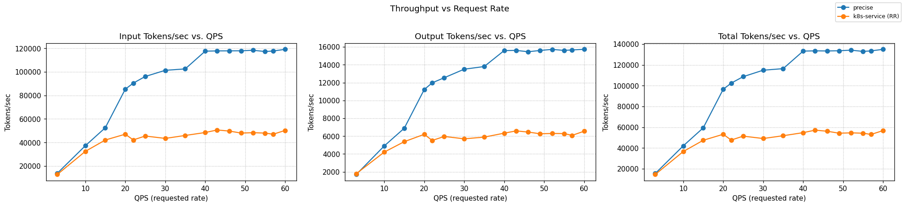
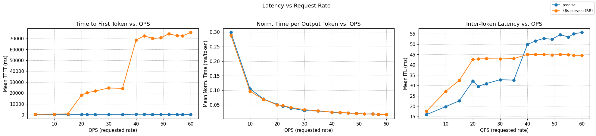
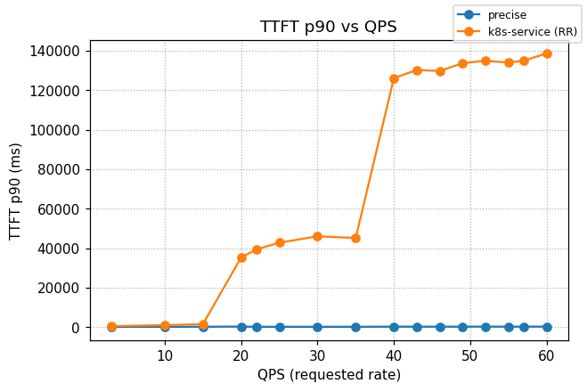

# Precise Prefix Cache Routing

[](https://github.com/llm-d/llm-d/actions/workflows/nightly-e2e-precise-prefix-cache-ocp.yaml) [](https://github.com/llm-d/llm-d/actions/workflows/nightly-e2e-precise-prefix-cache-cks.yaml) [](https://github.com/llm-d/llm-d/actions/workflows/nightly-e2e-precise-prefix-cache-gke.yaml)

## Overview

This guide routes requests on precise per-pod KV-cache state rather than request-traffic heuristics. Each vLLM pod publishes [KV-cache events](https://github.com/vllm-project/vllm/issues/16669) over ZMQ; the router subscribes, builds an index keyed by block hash, and scores candidate pods by the fraction of an incoming request's prefix that is already resident.

Two scorers make up the routing decision alongside the load-aware stack:

- **Precise prefix-cache aware** — the [precise-prefix-cache-scorer](https://github.com/llm-d/llm-d-router/tree/main/pkg/epp/framework/plugins/scheduling/scorer/preciseprefixcache) indexes real KV-block events from vLLM and returns the exact resident-block fraction. Indexer internals (event ingestion, block hashing, dual-key design) are documented in [llm-d-kv-cache architecture](https://github.com/llm-d/llm-d-kv-cache/blob/main/docs/architecture.md).
- **Load-aware** — such as the [kv-cache utilization](https://github.com/llm-d/llm-d-router/tree/main/pkg/epp/framework/plugins/scheduling/scorer/kvcacheutilization) and [queue size](https://github.com/llm-d/llm-d-router/tree/main/pkg/epp/framework/plugins/scheduling/scorer/queuedepth) scorers balance against pod pressure.

## Default Configuration

| Parameter           | Value                                                   |
|---------------------|---------------------------------------------------------|
| Model               | [Qwen/Qwen3-32B](https://huggingface.co/Qwen/Qwen3-32B) |
| Replicas            | 8 (reduce for smaller fleets — see notes below)         |
| Tensor Parallelism  | 2                                                       |
| GPUs per replica    | 2                                                       |
| Total GPUs          | 16                                                      |
| vLLM `--block-size` | 64 (must match scorer `tokenProcessorConfig.blockSize`) |

### Supported Hardware Backends

| Backend              | Directory                  | Default model                           | Notes                                      |
| -------------------- | -------------------------- | --------------------------------------- | ------------------------------------------ |
| NVIDIA GPU           | `modelserver/gpu/vllm/`    | Qwen/Qwen3-32B                          | Default configuration                      |
| AMD GPU              | `modelserver/amd/vllm/`    | Qwen/Qwen3-32B                          | AMD GPU                                    |
| Intel XPU            | `modelserver/xpu/vllm/`    | Qwen/Qwen3-0.6B                         | CI-sized; update router `modelName` for real use |
| Intel Gaudi (HPU)    | `modelserver/hpu/vllm/`    | Qwen/Qwen3-8B                           | `--block-size=128`; update scorer `blockSize` to match |
| Google TPU v6e       | `modelserver/tpu-v6/vllm/` | Llama-3.1-70B-Instruct                  | GKE TPU                                    |
| Google TPU v7        | `modelserver/tpu-v7/vllm/` | Qwen3-Coder-480B-FP8                    | GKE TPU                                    |
| CPU                  | `modelserver/cpu/vllm/`    | Llama-3.2-3B-Instruct                   | CI-sized                                   |

> [!NOTE]
> Some hardware variants use reduced configurations (fewer replicas, smaller models) to enable CI testing for compatibility and regression checks.

> [!NOTE]
> For precise prefix cache scoring to match reality, the `tokenizer` `modelName` and the scorer's `indexerConfig.tokenizersPoolConfig.modelName` in [`router/precise-prefix-cache-routing.values.yaml`](router/precise-prefix-cache-routing.values.yaml) must match the model the overlay deploys. HPU and anything that tunes `--block-size` also requires updating `tokenProcessorConfig.blockSize` on the router side.

> [!NOTE]
> The `gpu/vllm/` overlay defaults to 8 replicas to match the canonical 16×H100 benchmark. For smaller fleets (or quick smoke tests), reduce `replicas` in the deployment patch (`modelserver/gpu/vllm/patch-vllm.yaml`) before applying.

> [!NOTE]
> The router runs in **active-active HA** by default — two replicas behind one Service, each subscribing to every vLLM pod via pod-discovery so both indexes converge. Scale to a single replica with `--set router.epp.replicas=1` if HA isn't needed (small fleets, smoke tests).

## Prerequisites

- Have the [proper client tools installed on your local system](../../helpers/client-setup/README.md) to use this guide.
- Checkout llm-d repo:

```bash
  export branch="main" # branch, tag, or commit hash
  git clone https://github.com/llm-d/llm-d.git && cd llm-d && git checkout ${branch}
```

- Set the following environment variables:

```bash
export GAIE_VERSION=v1.5.0
export ROUTER_CHART_VERSION=v0
export GUIDE_NAME="precise-prefix-cache-routing"
export NAMESPACE="llm-d-${GUIDE_NAME}"
```
- Install the Gateway API Inference Extension CRDs:

```bash
kubectl apply -k "https://github.com/kubernetes-sigs/gateway-api-inference-extension/config/crd?ref=${GAIE_VERSION}"
```

- Create a target namespace for the installation

```bash
kubectl create namespace ${NAMESPACE}
```

  
## Installation Instructions

### 1. Prepare HF Token

Create the `llm-d-hf-token` secret in the namespace. The UDS tokenizer sidecar reads `HF_TOKEN` to reach gated tokenizers — Qwen/Qwen3-32B is public but the secret makes swapping in a gated model a no-op. See [helpers/hf-token.md](../../helpers/hf-token.md) for the full helper.

```bash
kubectl -n ${NAMESPACE} create secret generic llm-d-hf-token --from-literal=HF_TOKEN="${HF_TOKEN}"
```

### 2. Deploy the llm-d Router

#### Standalone Mode

This deploys the llm-d Router in the simple [Standalone Mode](placeholder-link):

```bash
export REPO_ROOT=$(realpath $(git rev-parse --show-toplevel))
helm install ${GUIDE_NAME} \
  oci://ghcr.io/llm-d/charts/llm-d-router-standalone-dev \
  -f ${REPO_ROOT}/guides/recipes/router/base.values.yaml \
  -f ${REPO_ROOT}/guides/${GUIDE_NAME}/router/${GUIDE_NAME}.values.yaml \
  -n ${NAMESPACE} --version ${ROUTER_CHART_VERSION}
```


The release name `${GUIDE_NAME}` is mandatory for standard deployments — the inference pool selector matches a guide label that pairs with this release.

<details>
<summary><h4>Gateway Mode</h4></summary>

To use a Kubernetes Gateway managed proxy instead of the standalone Envoy sidecar, do **not** apply the standalone chart above. Instead:

1. **Deploy a Kubernetes Gateway**. See [the gateway guides](../prereq/gateways) for step-by-step deployment of a Gateway named `llm-d-inference-gateway`.

2. **Deploy the llm-d Router and HTTPRoute** via the `llm-d-router-gateway` chart with `httpRoute.create=true`. Same UDS post-renderer applies:

```bash
export REPO_ROOT=$(realpath $(git rev-parse --show-toplevel))
export PROVIDER_NAME=istio   # options: none, gke, agentgateway, istio
helm install precise-prefix-cache-routing \
  oci://ghcr.io/llm-d/charts/llm-d-router-gateway-dev \
  -f ${REPO_ROOT}/guides/recipes/router/base.values.yaml \
  -f ${REPO_ROOT}/guides/recipes/router/features/httproute-flags.yaml \
  -f ${REPO_ROOT}/guides/${GUIDE_NAME}/router/${GUIDE_NAME}.values.yaml \
  --set provider.name=${PROVIDER_NAME} \
  -n ${NAMESPACE} --version ${ROUTER_CHART_VERSION}
```

</details>

### 3. Deploy the Model Server

Apply the Kustomize overlay for your backend (defaulting to NVIDIA GPU / vLLM):

```bash
export INFRA_PROVIDER=base # base | gke
kubectl apply -n ${NAMESPACE} -k ${REPO_ROOT}/guides/${GUIDE_NAME}/modelserver/gpu/vllm/${INFRA_PROVIDER}/
```

### 4. (Optional) Enable Monitoring

> [!NOTE]
> GKE provides [automatic application monitoring](https://docs.cloud.google.com/kubernetes-engine/docs/how-to/configure-automatic-application-monitoring) out of the box. The llm-d [Monitoring stack](../../docs/monitoring/README.md) is not required for GKE, but it is available if you prefer to use it.

- Install the [Monitoring stack](../../docs/monitoring/README.md).
- Deploy the monitoring resources for this guide:

  ```bash
  kubectl apply -n ${NAMESPACE} -k ${REPO_ROOT}/guides/recipes/modelserver/components/monitoring
  ```

- Enable Prometheus scrape for the router by layering `-f ${REPO_ROOT}/guides/recipes/router/features/monitoring.values.yaml` onto the helm command in step 2.

## Verification

### 1. Get the IP of the Proxy

**Standalone Mode**

```bash
export IP=$(kubectl get service ${GUIDE_NAME}-epp -n ${NAMESPACE} -o jsonpath='{.spec.clusterIP}')
```

<details>
<summary><b>Gateway Mode</b></summary>

```bash
export IP=$(kubectl get gateway llm-d-inference-gateway -n ${NAMESPACE} -o jsonpath='{.status.addresses[0].value}')
```

</details>

### 2. Send Test Requests

**Open a temporary interactive shell inside the cluster:**

```bash
kubectl run curl-debug --rm -it \
    --image=cfmanteiga/alpine-bash-curl-jq \
    --env="IP=$IP" \
    --env="NAMESPACE=$NAMESPACE" \
    -- /bin/bash
```

**Send a completion request:**

```bash
curl -X POST http://${IP}/v1/completions \
    -H 'Content-Type: application/json' \
    -d '{
        "model": "Qwen/Qwen3-32B",
        "prompt": "How are you today?"
    }' | jq
```

## Benchmarking

The benchmark launches a pod (`llmdbench-harness-launcher`) that uses `inference-perf` with a shared-prefix synthetic workload. Each experiment is saved under the specified output folder, e.g. `./results/<experiment ID>/inference-perf_<experiment ID>_precise-guide-<model name>`. See the [benchmark instructions doc](../../helpers/benchmark.md) for details.

### 1. Prepare the Benchmarking Suite

- Download the benchmark script:

  ```bash
  curl -L -O https://raw.githubusercontent.com/llm-d/llm-d-benchmark/main/existing_stack/run_only.sh
  chmod u+x run_only.sh
  ```

- [Create HuggingFace token](../../helpers/hf-token.md)

### 2. Download the Workload Template

```bash
curl -LJO "https://raw.githubusercontent.com/llm-d/llm-d/main/guides/precise-prefix-cache-routing/benchmark-templates/guide.yaml"
```

### 3. Execute Benchmark

```bash
export IP=$(kubectl get service ${GUIDE_NAME}-epp -n ${NAMESPACE} -o jsonpath='{.spec.clusterIP}')
envsubst < guide.yaml > config.yaml
./run_only.sh -c config.yaml -o ./results
```

## Cleanup

```bash
helm uninstall ${GUIDE_NAME} -n ${NAMESPACE}
kubectl delete -n ${NAMESPACE} -k guides/${GUIDE_NAME}/modelserver/gpu/vllm/${INFRA_PROVIDER}/
```

## How It Works

1. **vLLM pods publish KV-cache events** — each pod runs `vllm serve ... --kv-events-config '{...,"publisher":"zmq","endpoint":"$(KV_EVENTS_ENDPOINT)","topic":"kv@$(POD_IP):$(POD_PORT)@<model>"}'` with `KV_EVENTS_ENDPOINT=tcp://*:5556`, binding its own ZMQ socket. On every KV block allocation/eviction, vLLM emits a ZMQ message.
2. **Router subscribes per pod** — pod-discovery (`kvEventsConfig.discoverPods: true`) wires the data-layer `endpoint-notification-source` into the scorer's `ExtractEndpoint`, so each router replica installs a ZMQ subscriber per vLLM pod independently. All replicas converge to the same index.
3. **Scoring** — the `precise-prefix-cache-scorer` returns the fraction of the request's prefix blocks that are resident on each candidate pod. The `max-score-picker` routes to the highest-scoring pod.

The `tokenizer` plugin and the scorer's internal `tokenizersPoolConfig` both point at `/tmp/tokenizer/tokenizer-uds.socket` — a UDS tokenizer sidecar (`ghcr.io/llm-d/llm-d-uds-tokenizer`) owns tokenizer model downloads and caching, keeping tokenization out of the EPP main container.

## Benchmarking Report

The benchmark runs on 16× H100 GPUs, distributed across 8 model servers (2 H100s per server with TP=2).

### Comparing llm-d Scheduling to a Simple Kubernetes Service

Graphs below compare the precise path to a stock Kubernetes Service that round-robins requests across the same 8 vLLM pods (no EPP, no scoring).





Summary across the full ladder (rates 3 → 60):

| Metric              | k8s service (RR) | llm-d Precise | Δ% vs k8s |
| :------------------ | :--------------- | :------------ | :-------- |
| Output tokens/sec   | 5,722            | 12,598        | +120.2%   |
| Requests/sec        | 35.87            | 36.01         | +0.4%     |
| TTFT mean (s)       | 58.10            | 0.247         | −99.57%   |
| TTFT p90 (s)        | 107.43           | 0.262         | −99.76%   |
| ITL mean (ms)       | 44.0             | 47.0          | +6.8%     |

<details>
<summary><b><i>Click</i></b> to view the per-rate breakdown across the full ladder</summary>

Output tokens/sec — higher is better; TTFT in seconds — lower is better.

| Rate | k8s Output | llm-d Output | k8s TTFT mean | llm-d TTFT mean | k8s TTFT p90 | llm-d TTFT p90 |
| ---: | ---------: | -----------: | ------------: | --------------: | -----------: | -------------: |
|  3   | 1,797      | 1,707        | 0.415         | 0.155           | 0.522        | 0.187          |
| 10   | 4,215      | 4,904        | 0.630         | 0.150           | 1.014        | 0.199          |
| 15   | 5,381      | 6,887        | 0.881         | 0.155           | 1.593        | 0.225          |
| 20   | 6,205      | 11,224       | 18.103        | 0.206           | 35.344       | 0.320          |
| 22   | 5,517      | 11,980       | 20.171        | 0.152           | 39.436       | 0.191          |
| 25   | 5,965      | 12,548       | 21.842        | 0.158           | 42.813       | 0.200          |
| 30   | 5,702      | 13,507       | 24.597        | 0.155           | 46.036       | 0.193          |
| 35   | 5,890      | 13,803       | 24.162        | 0.157           | 45.190       | 0.202          |
| 40   | 6,336      | 15,593       | 68.673        | 0.494           | 126.238      | 0.272          |
| 43   | 6,588      | 15,612       | 72.429        | 0.422           | 130.275      | 0.265          |
| 46   | 6,459      | 15,462       | 70.084        | 0.257           | 129.810      | 0.273          |
| 49   | 6,265      | 15,607       | 70.659        | 0.200           | 133.718      | 0.267          |
| 52   | 6,303      | 15,728       | 74.326        | 0.208           | 134.981      | 0.279          |
| 55   | 6,290      | 15,612       | 72.564        | 0.199           | 134.034      | 0.272          |
| 57   | 6,089      | 15,667       | 72.329        | 0.211           | 135.023      | 0.293          |
| 60   | 6,551      | 15,733       | 75.586        | 0.214           | 138.663      | 0.300          |

</details>
