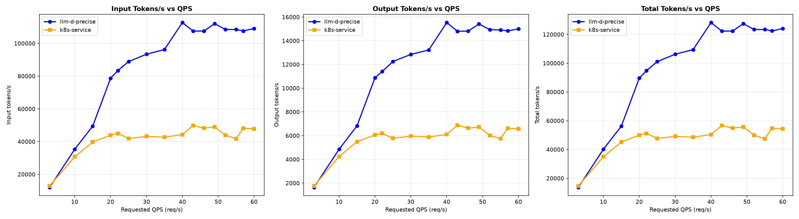
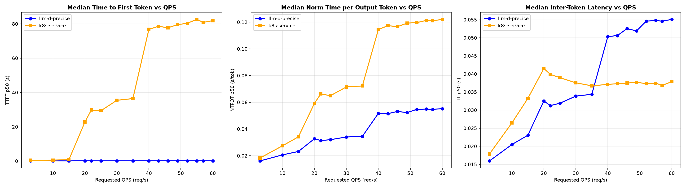
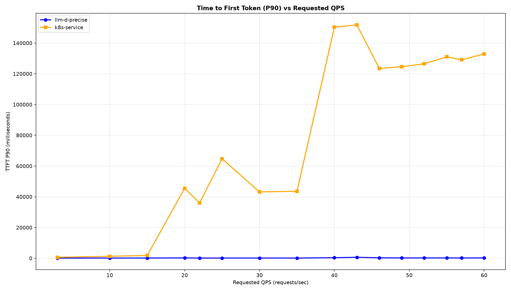

# Qwen/Qwen3-32B Precise Routing Benchmark on SGLang (16×H100)

The benchmark runs on 16× H100 GPUs, distributed across 8 SGLang model servers (2 H100s per server with TP=2, `--page-size=64` matching the scorer's `blockSize`). Workload is the guide's shared-prefix profile (150 distinct prefix groups, 6,000-token shared system prompt + 1,200-token question, 1,000-token output) driven as a Poisson rate ladder (rates 3 → 60).

> [!NOTE]
> These results use the token-based routing stack — `prefix-cache-affinity-filter` + `token-load-scorer` — with the
> affinity filter reading exact resident-block fractions from the `precise-prefix-cache-producer` (KV-cache events over
> ZMQ) instead of the approximate producer, and `peakPrefillThroughput: 15926` as set in this guide's router values —
> the value the [calibration recipe](../../recipes/router/calibration/README.md) measures on this fleet. (The run itself
> used the plugin default, 15928; the two differ by 0.01% and are interchangeable.) The EPP ran as a single replica —
> the guide default for this config, since in-flight token accounting is per-EPP-process. Latency is reported as
> median (p50). Both arms ran the same workload against
> the same 8×TP=2 SGLang configuration — the only difference is whether requests go through the llm-d router or a stock
> Kubernetes Service.

## Comparing llm-d Scheduling to a Simple Kubernetes Service

Graphs below compare the precise path to a stock Kubernetes Service that round-robins requests across the same 8 SGLang pods (no EPP, no scoring).

Summary (throughput is peak sustained; latencies at the top of the ladder, rate 60), 0 failed requests on either arm:

| Metric                   | k8s service (RR) | llm-d Precise | Δ% vs k8s |
| :----------------------- | :--------------- | :------------ | :-------- |
| Peak output tokens/s     | 6,884            | 15,532        | +125.6%   |
| Requests/sec (@ rate 60) | 6.65             | 15.16         | +128.0%   |
| TTFT p50 (s)             | 81.9             | 0.15          | −99.8%    |
| TTFT p90 (s)             | 132.9            | 0.27          | −99.8%    |
| ITL p50 (ms)             | 37.9             | 55.1          | +45.4%    |

The two arms diverge sharply once the fleet saturates. A stock Service spreads requests blindly, so every pod re-prefills the
6,000-token shared prefix: output throughput flattens at ~6–7k tokens/sec from rate 20 onward and first-token latency collapses
(TTFT p90 crosses 35 s at rate 20 and exceeds 130 s at the top of the ladder). Precise prefix-cache-affinity routing
keeps each prefix group resident on the same endpoints, so throughput keeps climbing to ~15.5k tokens/sec (~2.3× the Service)
while TTFT p90 stays **under 0.7 s across the entire ladder**. The ITL regression (+45.4%) is the expected trade: affinity
routing packs more concurrent work onto cache-warm pods, so per-token decode is slower — a good exchange for 2.3× the
throughput and a ~500× better first-token tail.

<b><i>Click</i></b> to view the per-rate breakdown across the full ladder

Output tokens/sec — higher is better; TTFT in seconds — lower is better.

| Rate | k8s Output | llm-d Output | k8s TTFT p50 | llm-d TTFT p50 | k8s TTFT p90 | llm-d TTFT p90 |
| ---: | ---------: | -----------: | -----------: | -------------: | -----------: | -------------: |
| 3    |  1,752     |  1,634       | 0.52         | 0.16           | 0.66         | 0.19           |
| 10   |  4,241     |  4,850       | 0.57         | 0.12           | 1.35         | 0.20           |
| 15   |  5,486     |  6,828       | 0.86         | 0.11           | 1.85         | 0.20           |
| 20   |  6,065     | 10,872       | 22.80        | 0.18           | 45.54        | 0.27           |
| 22   |  6,198     | 11,402       | 29.77        | 0.13           | 36.10        | 0.18           |
| 25   |  5,778     | 12,248       | 29.37        | 0.13           | 64.75        | 0.19           |
| 30   |  5,962     | 12,850       | 35.45        | 0.13           | 43.20        | 0.20           |
| 35   |  5,888     | 13,224       | 36.45        | 0.13           | 43.59        | 0.18           |
| 40   |  6,101     | 15,532       | 76.80        | 0.14           | 150.33       | 0.41           |
| 43   |  6,884     | 14,798       | 78.57        | 0.15           | 151.83       | 0.69           |
| 46   |  6,632     | 14,817       | 77.74        | 0.15           | 123.51       | 0.33           |
| 49   |  6,729     | 15,417       | 79.57        | 0.14           | 124.62       | 0.24           |
| 52   |  6,024     | 14,937       | 80.33        | 0.15           | 126.51       | 0.26           |
| 55   |  5,742     | 14,914       | 82.62        | 0.15           | 131.06       | 0.26           |
| 57   |  6,621     | 14,838       | 80.87        | 0.14           | 129.14       | 0.22           |
| 60   |  6,578     | 14,992       | 81.87        | 0.15           | 132.91       | 0.27           |

