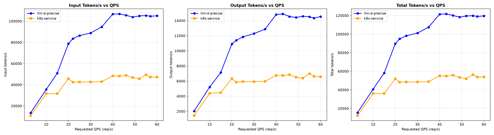
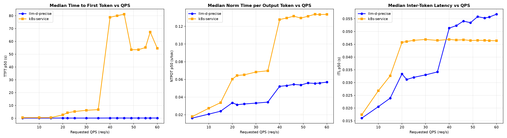
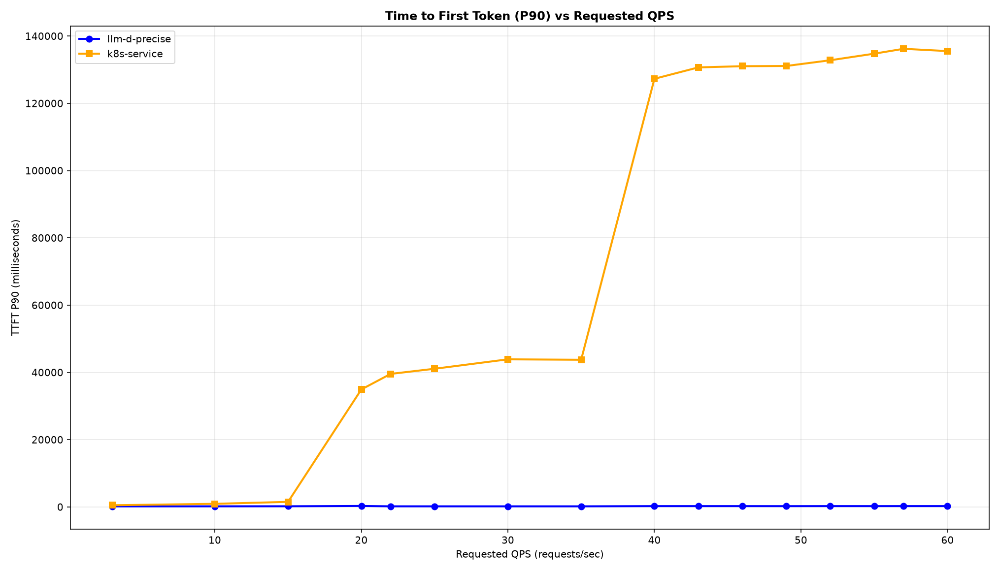

# Qwen/Qwen3-32B Precise Routing Benchmark on vLLM (16×H100)

The benchmark runs on 16× H100 GPUs, distributed across 8 model servers (2 H100s per server with TP=2). Workload is the guide's shared-prefix profile (150 distinct prefix groups, 6,000-token shared system prompt + 1,200-token question, 1,000-token output) driven as a Poisson rate ladder (rates 3 → 60).

> [!NOTE]
> These results use the token-based routing stack — `prefix-cache-affinity-filter` + `token-load-scorer` — with the
> affinity filter reading exact resident-block fractions from the `precise-prefix-cache-producer` (KV-cache events over
> ZMQ) instead of the approximate producer, and `peakPrefillThroughput: 15926` as set in this guide's router values —
> the value the [calibration recipe](../../recipes/router/calibration/README.md) measures on this fleet. (The run itself
> used the plugin default, 15928; the two differ by 0.01% and are interchangeable.) The EPP ran as a single replica —
> the guide default for this config, since in-flight token accounting is per-EPP-process. Latency is reported as
> median (p50). Both arms ran the same workload against
> the same 8×TP=2 vLLM configuration — the only difference is whether requests go through the llm-d router or a stock
> Kubernetes Service.

## Comparing llm-d Scheduling to a Simple Kubernetes Service

Graphs below compare the precise path to a stock Kubernetes Service that round-robins requests across the same 8 vLLM pods (no EPP, no scoring).

Summary (throughput is peak sustained; latencies at the top of the ladder, rate 60), 0 failed requests on either arm:

| Metric                   | k8s service (RR) | llm-d Precise | Δ% vs k8s |
| :----------------------- | :--------------- | :------------ | :-------- |
| Peak output tokens/s     | 6,986            | 14,892        | +113.2%   |
| Requests/sec (@ rate 60) | 6.57             | 14.60         | +122.2%   |
| TTFT p50 (s)             | 54.6             | 0.19          | −99.7%    |
| TTFT p90 (s)             | 135.5            | 0.26          | −99.8%    |
| ITL p50 (ms)             | 46.4             | 56.8          | +22.4%    |

The two arms track each other until the fleet saturates. A stock Service round-robins blindly, so every pod re-prefills the
6,000-token shared prefix: output throughput plateaus at ~6–7k tokens/sec from ~rate 20 and first-token latency collapses
(TTFT p90 crosses 30 s at rate 20 and exceeds 135 s at the top of the ladder). Precise prefix-cache-affinity routing
keeps each prefix group resident on the same endpoints, so throughput keeps climbing to ~14.9k tokens/sec (~2.1× the
Service) while TTFT p90 stays **under 0.3 s across the entire ladder**. The ITL regression (+22.4%) is the expected
trade: affinity routing packs more concurrent work onto cache-warm pods, so per-token decode is marginally slower.

<b><i>Click</i></b> to view the per-rate breakdown across the full ladder

Output tokens/sec — higher is better; TTFT in seconds — lower is better.

| Rate | k8s Output | llm-d Output | k8s TTFT p50 | llm-d TTFT p50 | k8s TTFT p90 | llm-d TTFT p90 |
| ---: | ---------: | -----------: | -----------: | -------------: | -----------: | -------------: |
|  3   | 1,442      | 2,035        | 0.49         | 0.12           | 0.51         | 0.18           |
| 10   | 4,386      | 5,215        | 0.51         | 0.12           | 0.94         | 0.19           |
| 15   | 4,476      | 7,132        | 0.54         | 0.12           | 1.52         | 0.21           |
| 20   | 6,339      | 10,907       | 2.64         | 0.19           | 34.94        | 0.30           |
| 22   | 5,872      | 11,403       | 4.33         | 0.15           | 39.57        | 0.19           |
| 25   | 5,919      | 11,856       | 5.26         | 0.15           | 41.10        | 0.19           |
| 30   | 5,931      | 12,292       | 6.23         | 0.15           | 43.90        | 0.19           |
| 35   | 5,981      | 12,871       | 6.73         | 0.15           | 43.77        | 0.19           |
| 40   | 6,762      | 14,817       | 78.74        | 0.18           | 127.31       | 0.26           |
| 43   | 6,734      | 14,892       | 80.03        | 0.18           | 130.69       | 0.26           |
| 46   | 6,846      | 14,545       | 81.16        | 0.19           | 131.05       | 0.26           |
| 49   | 6,512      | 14,428       | 53.51        | 0.18           | 131.12       | 0.25           |
| 52   | 6,392      | 14,583       | 53.49        | 0.18           | 132.82       | 0.26           |
| 55   | 6,986      | 14,518       | 55.19        | 0.18           | 134.78       | 0.26           |
| 57   | 6,624      | 14,329       | 67.31        | 0.19           | 136.22       | 0.26           |
| 60   | 6,589      | 14,545       | 54.60        | 0.19           | 135.55       | 0.26           |

