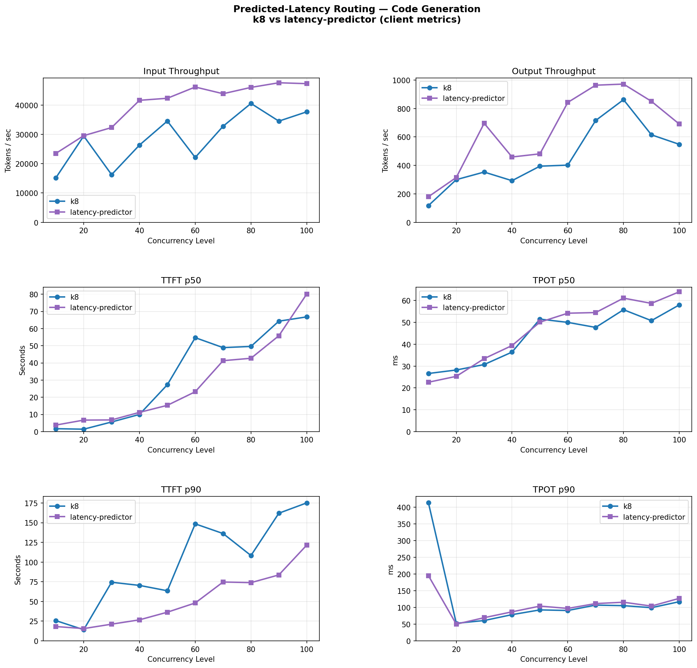

# Predicted Latency-Based Routing

[](https://github.com/llm-d/llm-d/actions/workflows/consolidate-status-predicted-latency-routing-cks-acc-gpu-vllm-x.yaml)
[](https://github.com/llm-d/llm-d/actions/workflows/consolidate-status-predicted-latency-routing-gke-acc-gpu-vllm-x.yaml)
[](https://github.com/llm-d/llm-d/actions/workflows/consolidate-status-predicted-latency-routing-ibm-acc-gpu-vllm-x.yaml)

## Overview

Route each inference request to the model server predicted to serve it fastest — and, optionally, only to a server predicted to meet its TTFT/TPOT SLO.

This path is for operators who want to **adopt** predicted latency-based scheduling in an existing llm-d deployment. For what the component is and how it works internally — the plugin pipeline, the ML model, scaling characteristics, the full metric list — see [architecture/advanced/latency-predictor.md](../../docs/architecture/advanced/latency-predictor.md).

## When to Pick This Path

Pick it when:

- Your workload has **high variance in prompt and completion length**, and queue depth alone is a poor proxy for true load.
- Your clients can express **per-request latency SLOs** (interactive vs. batch) and you want the gateway to enforce them.
- Static weight tuning between cache affinity and load has become **fragile** as traffic shifts.

Skip it when your pool is **heterogeneous** — mixed GPU types, model variants, or serving configurations in the same pool will produce inaccurate predictions, because the predictor assumes a single pod shape.

> [!NOTE]
> OpenShift support for this guide is currently not reliable as-is. The latency-predictor sidecars used by predicted-latency scheduling may require additional OpenShift-specific runtime adjustments beyond the manifests in this guide. Until that is resolved, prefer GKE or CoreWeave for the tested path.

## Prerequisites

- Have the [proper client tools installed on your local system](../../helpers/client-setup/README.md) to use this guide.
- Checkout llm-d repo:

  ```bash
    export branch="main" # branch, tag, or commit hash
    git clone https://github.com/llm-d/llm-d.git && cd llm-d && git checkout ${branch}
  ```

- Set the following environment variables:

  ```bash
    export GAIE_VERSION=v1.5.0
    export ROUTER_CHART_VERSION=v0
    export GUIDE_NAME="predicted-latency-routing"
    export NAMESPACE=llm-d-predicted-latency
    export MODEL_NAME="Qwen/Qwen3-32B"
    export REPO_ROOT=$(realpath $(git rev-parse --show-toplevel))
  ```

- Install the Gateway API Inference Extension CRDs:

  ```bash
    kubectl apply -f https://github.com/kubernetes-sigs/gateway-api-inference-extension/releases/download/${GAIE_VERSION}/v1-manifests.yaml
  ```

- Create a target namespace for the installation:

  ```bash
    kubectl create namespace ${NAMESPACE}
  ```

- [Create the `llm-d-hf-token` secret in your target namespace with the key `HF_TOKEN` matching a valid HuggingFace token](../../helpers/hf-token.md) to pull models.
<!-- llm-d-cicd:skip start -->
  ```bash
  export HF_TOKEN="your-huggingface-token"  # replace with a valid HuggingFace token
  kubectl create secret generic llm-d-hf-token \
    --from-literal="HF_TOKEN=${HF_TOKEN}" \
    --namespace "${NAMESPACE}" \
    --dry-run=client -o yaml | kubectl apply -f -
  ```
<!-- llm-d-cicd:skip end -->

## Installation Instructions

### 1. Deploy the llm-d Router

Two ready-to-use values files ship with this guide:

| File | When to use |
|---|---|
| [`router/predicted-latency.values.yaml`](./router/predicted-latency.values.yaml) | Default — predictor trains on end-to-end latency. Routing-only, no SLO header support. |
| [`router/predicted-latency-slo.values.yaml`](./router/predicted-latency-slo.values.yaml) | SLO-aware — Assumes `x-llm-d-slo-ttft-ms` / `x-llm-d-slo-tpot-ms` are set on requests. Every request must be sent with `"stream": true`. |

Both target model server pods labeled `llm-d.ai/guide=optimized-baseline` since in the next step we will simply reuse the model server manifests from the [optimized-baseline guide](../optimized-baseline).

#### Standalone Mode

This deploys the llm-d Router with an Envoy sidecar, it doesn't set up a Kubernetes Gateway.

```bash
helm install ${GUIDE_NAME} \
    oci://ghcr.io/llm-d/charts/llm-d-router-standalone-dev \
    -f ${REPO_ROOT}/guides/recipes/router/base.values.yaml \
    -f ${REPO_ROOT}/guides/${GUIDE_NAME}/router/predicted-latency.values.yaml \
    -n ${NAMESPACE} --version ${ROUTER_CHART_VERSION}
```

Nightly CI also sets `--set router.monitoring.prometheus.auth.enabled=false` so the validation job can scrape EPP metrics without a bearer token. That override is CI-only; leave metrics auth enabled for normal deployments unless you explicitly need unauthenticated scraping.

For SLO-aware scheduling, swap the values file: `-f guides/${GUIDE_NAME}/router/predicted-latency-slo.values.yaml`.

<details>
<summary><h4>Gateway Mode</h4></summary>

To use a Kubernetes Gateway managed proxy rather than the standalone version, follow these steps instead of applying the previous Helm chart:

1. *Deploy a Kubernetes Gateway* by following one of [the gateway guides](../prereq/gateways).
2. *Deploy the llm-d Router and an HTTPRoute* that connects it to the Gateway as follows:

```bash
export PROVIDER_NAME=gke # options: none, gke, agentgateway, istio
helm install ${GUIDE_NAME} \
    oci://ghcr.io/llm-d/charts/llm-d-router-gateway-dev \
    -f ${REPO_ROOT}/guides/recipes/router/base.values.yaml \
    -f ${REPO_ROOT}/guides/recipes/router/features/httproute-flags.yaml \
    -f ${REPO_ROOT}/guides/${GUIDE_NAME}/router/predicted-latency.values.yaml \
    --set provider.name=${PROVIDER_NAME} \
    -n ${NAMESPACE} --version ${ROUTER_CHART_VERSION}
```

</details>

### 2. Deploy the Model Server

This guide reuses the model server manifests from the optimized-baseline guide (the values files above already select pods labeled `llm-d.ai/guide=optimized-baseline`) and applies RoPE scaling on top to allow longer prompts. Apply the default NVIDIA GPU / vLLM overlay:

```bash
export INFRA_PROVIDER=base # base | gke
kubectl apply -n ${NAMESPACE} -k ${REPO_ROOT}/guides/predicted-latency-routing/modelserver/gpu/vllm/${INFRA_PROVIDER}/
```

For other backends (AMD GPU, Intel XPU, Gaudi, TPU, CPU), see [optimized-baseline → Deploy the Model Server](../optimized-baseline/README.md#2-deploy-the-model-server). For example, for sglang deployments:

```bash
kubectl apply -n ${NAMESPACE} -k ${REPO_ROOT}/guides/optimized-baseline/modelserver/gpu/sglang/${INFRA_PROVIDER}/
```

### 3. Enable monitoring (optional)

Follow [optimized-baseline → Enable monitoring](../optimized-baseline/README.md#3-enable-monitoring-optional) — the same steps apply since this guide reuses the same model server manifests.

## Send Requests

Once enabled, latency-based scheduling works on every request — no header changes needed. The proxy picks the endpoint with the lowest predicted latency.

To opt an individual request into SLO-aware routing, add one or both headers:

- `x-llm-d-slo-ttft-ms` — Time-to-first-token SLO in milliseconds.
- `x-llm-d-slo-tpot-ms` — Time-per-output-token SLO in milliseconds.

### 1. Get the IP of the Proxy

**Standalone Mode**

```bash
export IP=$(kubectl get service ${GUIDE_NAME}-epp -n ${NAMESPACE} -o jsonpath='{.spec.clusterIP}')
```

<details>
<summary> <b>Gateway Mode</b> </summary>

```bash
export IP=$(kubectl get gateway llm-d-inference-gateway -n ${NAMESPACE} -o jsonpath='{.status.addresses[0].value}')
```

</details>

### 2. Send a Test Request

**Open a temporary interactive shell inside the cluster:**

```bash
kubectl run curl-debug --rm -it \
    --image=cfmanteiga/alpine-bash-curl-jq \
    --namespace="$NAMESPACE" \
    --env="IP=$IP" \
    --env="NAMESPACE=$NAMESPACE" \
    --env="MODEL_NAME=$MODEL_NAME" \
    -- /bin/bash
```

**Send a completion request:**

```bash
curl -X POST http://${IP}/v1/completions \
    -H 'Content-Type: application/json' \
    -H 'x-llm-d-slo-ttft-ms: 200' \
    -H 'x-llm-d-slo-tpot-ms: 50' \
    -d '{
        "model": "'${MODEL_NAME}'",
        "prompt": "Explain the difference between prefill and decode.",
        "max_tokens": 200,
        "temperature": 0,
        "stream": true,
        "stream_options": {"include_usage": true}
    }'
```

Sheddable requests (priority < 0) are rejected at admission when no endpoint can meet the SLO, rather than routed to a guaranteed miss.

## Verify

Once traffic is flowing, confirm three things in Prometheus (see the [architecture doc](../../docs/architecture/advanced/latency-predictor.md#observability) for the metric reference):

1. **Predictions are being produced.** `inference_objective_request_ttft_prediction_duration_seconds` has non-zero samples. If it stays empty, the predictor sidecar is not being called — tail the EPP logs for `predicted-latency-producer` errors.
2. **Predictions track reality.** Compare `inference_objective_request_predicted_ttft_seconds` against `inference_objective_request_ttft_seconds` over a rolling window. A healthy deployment converges to within a few percent after warmup.
3. **SLOs are being honored.** If you're sending SLO-annotated traffic, `inference_objective_request_ttft_slo_violation_total` and `..._tpot_slo_violation_total` should increment only under genuine saturation.

## Benchmarking

The benchmark uses `inference-perf` with a synthetic code-generation workload (conversation replay). It models long, multi-turn coding sessions with the following distributions:

- Shared system prompt: 3,000 tokens; dynamic system prompt: 15,000–100,000 tokens (uniform)
- Turns per conversation: normal(mean=6, min=2, max=20)
- Input tokens per turn: lognormal(mean=1,500); output tokens per turn: lognormal(mean=800)

You run one benchmark per concurrency level: set `concurrency_level` in [`guide.yaml`](benchmark-templates/guide.yaml) (keeping `num_conversations = concurrency_level` and `num_requests = 6 × num_conversations`, so every conversation completes its average number of turns) and re-run for each point you want on the curve.

### 1. Prepare the Benchmarking Suite

- Download the benchmark script:

  ```bash
  curl -L -O https://raw.githubusercontent.com/llm-d/llm-d-benchmark/main/existing_stack/run_only.sh
  chmod u+x run_only.sh
  ```

- Prepare the HuggingFace token secret `llm-d-hf-token` in the namespace.

### 2. Download the Workload Template

```bash
curl -LJO "https://raw.githubusercontent.com/llm-d/llm-d/main/guides/${GUIDE_NAME}/benchmark-templates/guide.yaml"
```

### 3. Execute Benchmark

```bash
export IP=$(kubectl get service ${GUIDE_NAME}-epp -n ${NAMESPACE} -o jsonpath='{.spec.clusterIP}')
```

<details>
<summary><b>Click here for Gateway Mode</b></summary>

```bash
export IP=$(kubectl get gateway llm-d-inference-gateway -n ${NAMESPACE} -o jsonpath='{.status.addresses[0].value}')
```

</details>

Set the concurrency level for this run (`NUM_REQUESTS = 6 × CONCURRENCY`), then render and launch:

```bash
export CONCURRENCY=40
export NUM_REQUESTS=$(( CONCURRENCY * 6 ))   # 6 turns per conversation

envsubst < guide.yaml > config.yaml
./run_only.sh -c config.yaml -o ./results
```

To sweep concurrency, set a new `CONCURRENCY` (and `NUM_REQUESTS`) and re-run the block above for each level. Each run is saved under `./results/`.

## Benchmarking Report

The benchmark runs on 10 vLLM decode pods, each with tensor parallelism of 2 (20 × H100 GPUs total), using the `Qwen/Qwen3-32B` model. Results compare predicted-latency routing against a plain Kubernetes Service (round-robin, no EPP).

### Code Generation



| Concurrency | k8 in tok/s | LP in tok/s | k8 out tok/s | LP out tok/s | k8 TTFT p50 (s) | LP TTFT p50 (s) | k8 TTFT p90 (s) | LP TTFT p90 (s) |
| :---: | ---: | ---: | ---: | ---: | ---: | ---: | ---: | ---: |
| 10  | 15,168 | 23,511 |  118 |  180 |  1.7 |  3.8 |  25.7 |  18.2 |
| 20  | 29,451 | 29,568 |  300 |  315 |  1.4 |  6.7 |  14.2 |  15.6 |
| 30  | 16,269 | 32,335 |  353 |  696 |  5.6 |  6.8 |  74.4 |  21.2 |
| 40  | 26,357 | 41,627 |  293 |  459 | 10.0 | 11.2 |  70.4 |  26.7 |
| 50  | 34,552 | 42,329 |  395 |  481 | 27.3 | 15.3 |  63.6 |  36.4 |
| 60  | 22,125 | 46,165 |  402 |  843 | 54.7 | 23.2 | 148.5 |  48.1 |
| 70  | 32,786 | 43,878 |  716 |  964 | 48.9 | 41.3 | 136.2 |  74.7 |
| 80  | 40,560 | 46,032 |  862 |  972 | 49.6 | 42.7 | 108.3 |  73.9 |
| 90  | 34,526 | 47,618 |  615 |  851 | 64.3 | 55.8 | 162.0 |  83.7 |
| 100 | 37,699 | 47,309 |  548 |  691 | 66.8 | 80.1 | 175.1 | 121.5 |
| **avg** | **28,949** | **40,037** | **460** | **645** | **33.0** | **28.7** | **97.8** | **52.0** |
| **Δ% vs k8** | | **+38.3%** | | **+40.2%** | | **−13.0%** | | **−46.8%** |

## Cleanup

To remove the deployed components:

```bash
helm uninstall ${GUIDE_NAME} -n ${NAMESPACE}
kubectl delete  -n ${NAMESPACE} -k ${REPO_ROOT}/guides/predicted-latency-routing/modelserver/gpu/vllm/${INFRA_PROVIDER}
# for sglang deployments
kubectl delete  -n ${NAMESPACE} -k ${REPO_ROOT}/guides/optimized-baseline/modelserver/gpu/sglang/${INFRA_PROVIDER} --ignore-not-found
kubectl delete namespace ${NAMESPACE}
```

## Troubleshooting

| Symptom | Likely cause |
|---------|--------------|
| Prediction duration metrics empty | Predictor sidecar unreachable — EPP falls back to composite heuristic scoring. Check sidecar readiness and `PREDICTION_SERVER_URL`. |
| Large, persistent drift between predicted and actual TTFT | `streamingMode` mismatch (set to `false` on a streaming workload, or vice versa), or workload drifted outside the training window. |
| High TPOT SLO violation rate at low QPS | `streamingMode: false` — TPOT is not being trained. Flip it to `true` and restart. |
| SLO violations cluster on a few pods during spikes | Scoring strategy is `least`; try `most` for more headroom at the cost of utilization. |
| Prediction-based routing degrades to baseline | Predictor error or sidecar restart — expected fallback, not a failure. Investigate sidecar logs. |

## Related

- [Latency Predictor Architecture](../../docs/architecture/advanced/latency-predictor.md) — plugin pipeline, ML model, scaling characteristics, metric reference.
- [llm-d/llm-d-router](https://github.com/llm-d/llm-d-router) — source for the EPP plugins and per-plugin configuration references.
- [llm-d/llm-d-latency-predictor](https://github.com/llm-d/llm-d-latency-predictor) — source for the training and prediction server Python code.
- [Predicted Latency-Based Scheduling for LLMs](https://llm-d.ai/blog/predicted-latency-based-scheduling-for-llms) — design rationale and benchmark results.
