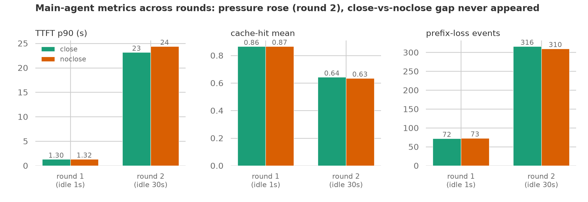
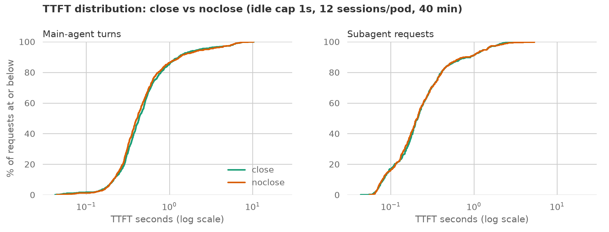
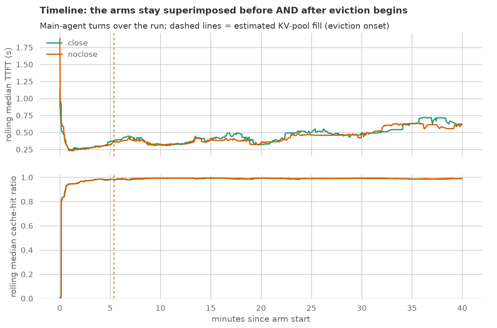
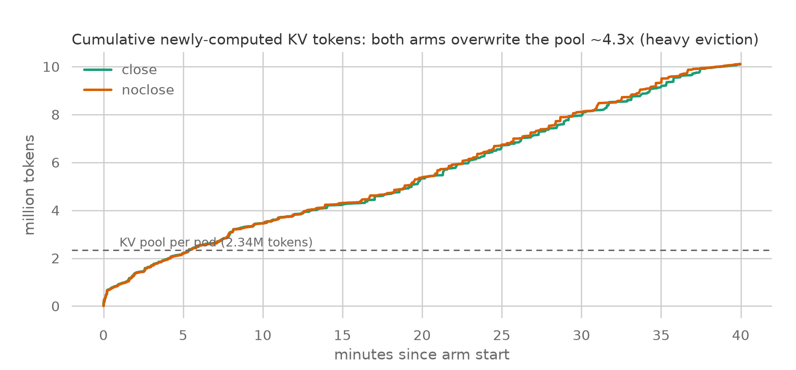
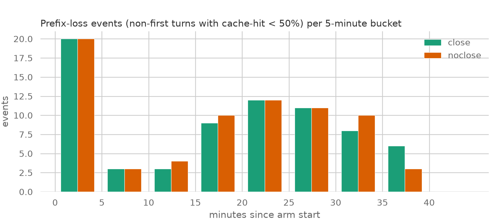
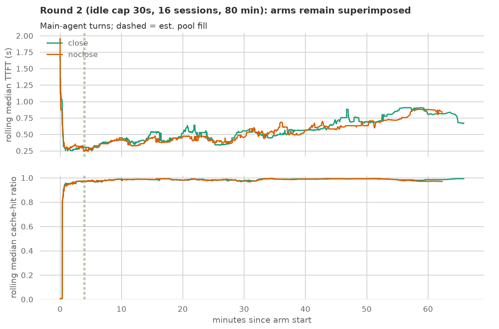
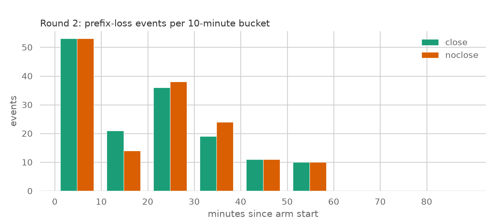
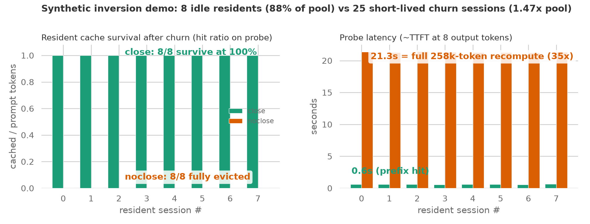
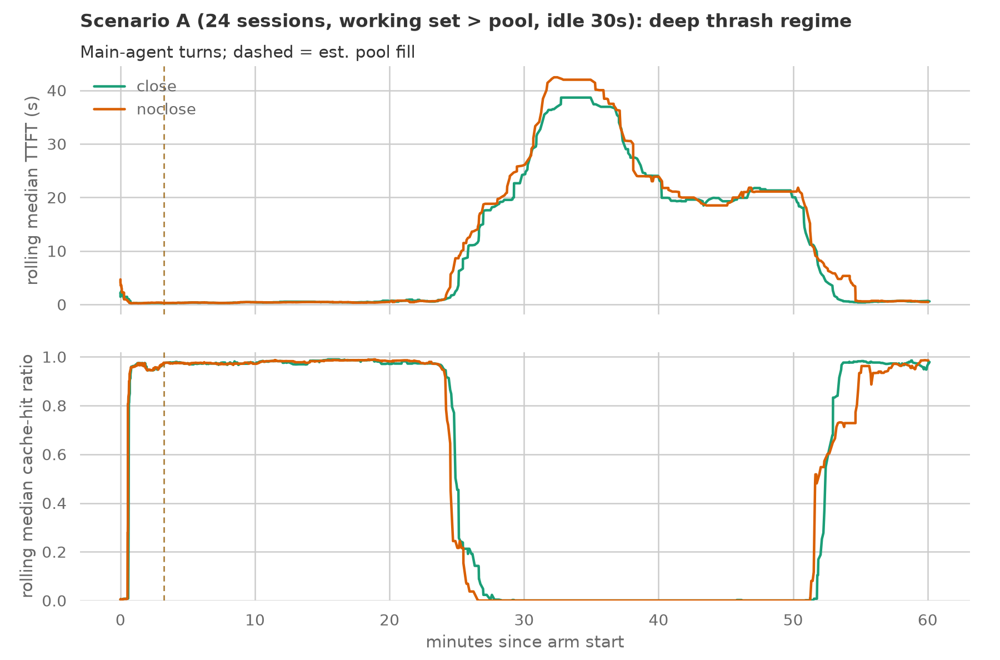
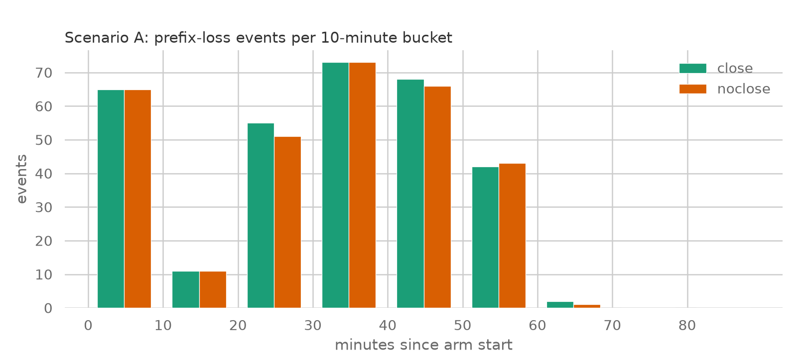

# Close-session A/B on weka trace replay runs

**Question**: does closing finished subagent sessions (`/close_session`, SGLang session-radix) improve main-agent cache hit rate and TTFT under KV pressure, versus never closing?

**Result: no measurable difference, in either round.** Round 1 (idle cap 1s) and round 2 (idle cap 30s, the configuration designed to enable the close-vs-LRU inversion) both show statistically identical arms on every metric in every time window, despite the KV pool being overwritten 4.3x and 6.1x respectively. This is a robust negative result for subagent close-session on this workload class; the mechanism section explains why and what regime would be needed for close to matter.

## Setup

| Item | Value |
|---|---|
| Workload | weka trace replay, 12 traces (10 with subagents, 36 subagent entries, 1389 parent turns + 751 subagent requests scheduled), same traces and seed in both arms |
| Serving | sglang v0.5.17, Qwen3-Coder-30B-A3B-Instruct-FP8, TP2 H100, 262144 ctx, fp8 KV, session-radix on, KV pool 2,340,338 tokens/pod |
| Arms | `close`: body `session_id` tagging + POST `/close_session` after each subagent stream's final response. `noclose`: identical tagging, never closes. Only diff is `session_close_path` in the client config |
| Topology | each arm on its own dedicated sglang pod (independent KV pools, direct pod IP, no router), run concurrently; `flush_cache` before each arm |
| Load | 12 concurrent sessions/pod, `trace_idle_gap_cap_seconds=1.0`, 40 min stage timeout, inference-perf image `session-control-0471bcf` in-cluster Job |

Machinery verification: zero `/close_session` failures logged in the close arm (non-200 would warn); both arms ended with the pool full (kv_evictable 2.338M vs 2.334M of a 2.34M pool); both inference-perf runs exited 0 with zero request failures.

## Headline numbers

| Metric (main-agent turns) | close | noclose |
|---|---|---|
| requests (parent / subagent) | 729 / 477 | 741 / 489 |
| TTFT p50 / p90 / p99 | 0.43 / 1.30 / 6.34 s | 0.41 / 1.32 / 6.28 s |
| cache-hit ratio mean | 0.865 | 0.866 |
| prefix-loss events (non-first turns, hit < 50%) | 72 | 73 |
| post-fill window only: TTFT p50 / hit mean / losses | 0.47 / 0.891 / 52 | 0.43 / 0.891 / 53 |
| subagent hit mean | 0.627 | 0.637 |

Both pools filled at ~5.4 minutes (close 5.37, noclose 5.39), so ~34 of the 40 minutes ran in the eviction regime - the arms match there too.

## Figures

TTFT distributions are superimposed for both main-agent turns and subagent requests, across the full range including the p99 tail.

Rolling median TTFT (top) and cache-hit ratio (bottom) over the run. Dashed verticals mark estimated pool-fill (~5.4 min, both arms). The arms track each other before and after eviction onset. Note the rolling median hit ratio sits near 0.99: the typical turn is a near-perfect prefix hit, and the 0.865 mean is dragged down by a minority of full-recompute events - which the next figure counts directly.

Cumulative newly-computed prefill tokens (`prompt_tokens - cached_tokens`). Both arms wrote ~10M tokens against a 2.34M pool - the cache was overwritten ~4.3x, so eviction pressure was heavy and continuous, not marginal.

Prefix-loss events (a non-first turn whose hit ratio collapsed below 50% = its session's prefix was evicted) per 5-minute bucket. The eviction victims are the same in count and timing in both arms.

## Why the arms are identical (mechanism)

Post-sglang#29173, eviction order is `(is_referenced, session_ref_count, LRU priority)` and session references are soft. In the noclose arm every block stays referenced, so the comparison degenerates to plain LRU. Plain LRU already evicts cold dead blocks (finished subagents, completed sessions) before hot live prefixes. Closing only beats LRU in one scenario: **freshly-dead blocks (recent LRU timestamps, still protected by recency) competing against idle-but-live prefixes (old LRU timestamps)** - close makes the fresh dead evictable immediately, sparing the idle live session.

With the idle gap cap at 1s, main agents re-touch their entire prefix every 2-4 seconds and are never "old" in LRU terms. The inversion scenario cannot occur, so close has nothing to protect. The identical prefix-loss counts (72 vs 73) confirm the evictor chose the same victims either way.

## What this does and does not show

- Does show: on replay-compressed agentic workloads where every turn re-touches the full prefix and think time is squeezed out, LRU alone matches session-aware eviction. Close-session buys nothing here.
- Does not show: that close is useless. The predicted benefit window - real think times (median 1.9s but p90 27s in the raw traces), subagent bursts writing 60-200k fresh tokens while the parent idles - was excluded by the 1s cap, which was chosen to build pressure quickly.

## Round 2: idle cap 30s

Round 1's null could be attributed to the 1s idle cap excluding the inversion scenario. Round 2 removed that objection: `--sessions 16 --timeout-sec 4800 --idle-cap-sec 30` with `max_wait_ms: 30000` (both clamps verified in the deployed config), same two dedicated pods, same trace set plus 4 more medium traces.

| Metric (main-agent turns) | close | noclose |
|---|---|---|
| requests (parent / subagent) | 1104 / 487 | 1081 / 477 |
| TTFT p50 / p90 / p99 | 0.49 / 1.80 / 7.48 s | 0.48 / 1.79 / 8.18 s |
| cache-hit ratio mean | 0.830 | 0.828 |
| prefix-loss events | **150** | **150** |
| post-fill window: hit mean / losses | 0.862 / 112 | 0.859 / 114 |
| pool filled at / total KV written | 4.0 min / 14.3M (6.1x pool) | 3.9 min / 14.3M (6.1x pool) |

Round 2 rolling TTFT and hit ratio: pressure is visibly higher than round 1 (TTFT climbs through the run as contexts grow), and the arms remain superimposed throughout, including 60+ minutes into the eviction regime.

Prefix-loss events per 10-minute bucket: identical totals (150 vs 150) and near-identical timing. Even with 30s idle windows, the evictor selected the same victims with and without close.

## Round 3: synthetic inversion demo - the positive control

To prove the close mechanism itself works (and that the weka nulls are a property of the workload, not broken plumbing), a purpose-built scenario manufactures the fresh-dead vs idle-live inversion directly on one flushed pod ([run_inversion_demo.py](../run_inversion_demo.py)):

1. **Residents**: 8 idle sessions x 258k tokens fill 88.2% of the pool, then go silent.
2. **Churn**: 25 short-lived sessions (137k each, 1.47x the pool in total) run through sequentially; the close arm closes each one after its response, the noclose arm leaves them open.
3. **Probe**: every resident replays its full prefix plus one tiny turn.

| | close | noclose |
|---|---|---|
| residents surviving (hit > 0.5) | **8 / 8** | **0 / 8** |
| resident probe hit ratio | 1.000 (all) | 0.000 (all) |
| probe latency (~TTFT) | 0.6 s | 21.3 s (**35x**, full 258k recompute) |

This is exactly the predicted mechanism: with no cold-debris reservoir (working set ~= pool), the noclose arm's referenced-but-fresh churn blocks outrank the idle residents in LRU order and evict all of them; closing makes each dead churn session immediately evictable, and every resident survives untouched. Close-session works precisely as designed - the weka replay rounds are null because that workload never enters this regime.

## Round 4 (scenario A): working set past the pool - the capacity cliff

The last regime to test on the real workload: push the live working set past the pool so the cold-debris reservoir empties. `--sessions 24 --timeout-sec 4800 --idle-cap-sec 30`, request_timeout raised to 1800s so slow requests cannot kill sessions asymmetrically. Both arms ran all 24 sessions to completion with zero failures (close 1323 requests, noclose 1307). The pool was overwritten **13.5x**.

| Metric (main-agent turns) | close | noclose |
|---|---|---|
| TTFT p50 / p90 / mean | 0.59 / 23.2 / 6.24 s | 0.57 / 24.4 / 6.73 s |
| cache-hit ratio mean | 0.642 | 0.635 |
| prefix-loss events (rate) | 316 (32.2%) | 310 (32.1%) |
| recovery window 50-58 min: hit mean | **0.652** | **0.584** |

The timeline is the real finding - a phase transition, not a gradient:

- **0-24 min**: working set still fits; hit ~0.98, sub-second TTFT in both arms.
- **~24 min, the cliff**: live contexts cross the pool size and both arms collapse into total thrash - rolling hit ratio drops to 0.0 and median TTFT explodes to 20-40s. Every session's prefix is evicted between its own turns; eviction policy is irrelevant because there is nothing safe to evict. Close's only edge here is a slightly shallower worst plateau (39s vs 42s median TTFT).
- **~51 min, recovery**: sessions finish, load drops back below the pool. The close arm recovers visibly earlier (~52 min vs ~55 min back to hit ~0.98; +6.8 points hit in the 50-58 min window) - freed dead sessions shrink the effective working set faster.

A first, salvaged attempt at this configuration (session-killing 900s timeouts, per-request data lost to an expired collection window; session-level numbers recovered from job logs) showed the same direction: pooled hit 72.4% vs 70.6%.

So the working-set-past-pool regime does produce a real, reproducible close advantage on the actual workload - but it is small (~1 point hit overall, ~7% mean TTFT, +7 points during recovery) because the dominant phenomenon is the thrash collapse itself, which close cannot prevent. What WOULD prevent it is not admitting 24 sessions x 100k+ tokens onto a 2.34M pool at all - admission control.

## Final conclusion

Two rounds bracket the idle-time dimension (1s and 30s) and both are null under heavy, verified eviction pressure. The refined mechanistic picture: close-session only beats LRU when the evictor is forced to choose between fresh-dead and idle-live blocks, which requires the cold-debris reservoir to be EXHAUSTED while demand continues. In this workload the reservoir never empties - the pool is overwritten 4-6x, so at any instant 30-40% of cached blocks are cold dead junk that LRU happily evicts first, and a 30s-idle live session never reaches the head of the eviction queue. Subagent close-session therefore adds no cache-hygiene value for replay-style agentic workloads on sglang's session-reference-aware eviction (soft refs, post-#29173).

Where close could still matter, in decreasing plausibility: (1) live working set ~= pool with minimal dead debris (many concurrent long sessions, little churn), where the evictor MUST pick among live and idle sessions; (2) hard-reference semantics (pins rather than soft refs), where unclosed sessions would actually block eviction and closing prevents pool exhaustion - a different failure mode worth testing if sglang adds it; (3) retention/TTL policies where close is the signal that starts a countdown rather than an immediate eviction hint. This matches the sglang#29173 author's own note that reference-aware eviction alone does not prevent KV thrashing and that admission control at the router is the complementary mechanism - for llm-d-router #2003, these results argue the near-term win is admission/concurrency control and retention policy, not close-signal plumbing.

## Artifacts

- Raw data both rounds: [data/](data/) (round 1) and [data-r2/](data-r2/) (round 2) - per-request reports (gzip), summaries, configs, sglang metrics, bench logs
- Chart generator: [make_charts.py](make_charts.py)
- Driver: [../run_close_session_bench.py](../run_close_session_bench.py) (`--mode ab-cluster`)
- inference-perf branch: `zetxqx/inference-perf#2` (`weka-subagent-session-id`), image tag `session-control-0471bcf`
