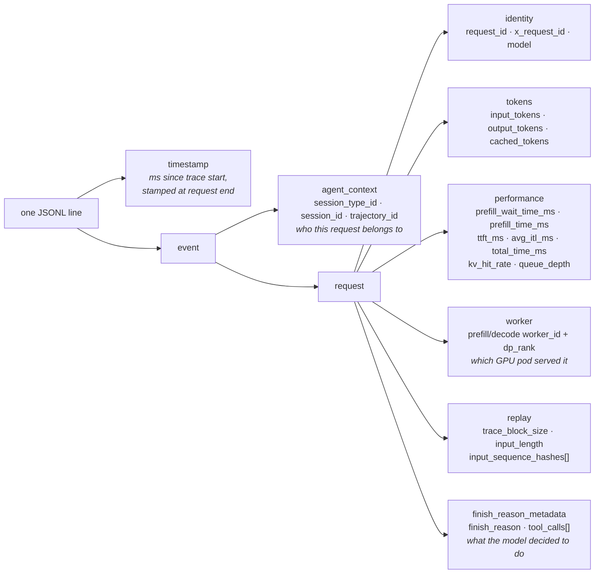
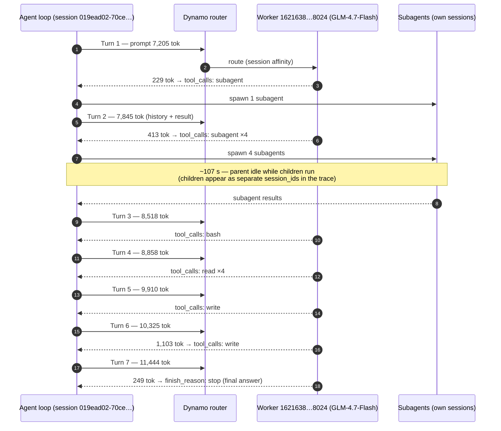
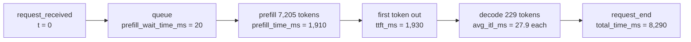

# Reading `trace.jsonl` — anatomy of an agent trace

This file explains how to read the traces in `llm-d/guides/session-control/data/trace.jsonl`, using one real session from the file as a worked example.

## What the file is

`trace.jsonl` contains **358 events**, one JSON object per line. Every event has `schema: dynamo.agent.trace.v1` and `event_type: request_end`, meaning **each line is one completed LLM inference request** as observed by Dynamo (the serving layer). There are no request_start events — everything is emitted when a request finishes.

The 358 requests belong to **69 distinct agent sessions** (`session_id`), all of type `pi_coding_agent`, all served by model `zai-org/GLM-4.7-Flash` on a **single worker** (`prefill_worker_id == decode_worker_id == 16216382247825258024` for every request, i.e. colocated prefill/decode, no disaggregation in this capture). The whole trace spans about 7.5 minutes of wall clock.

An agent session is a multi-turn loop: each "turn" is one LLM request whose output either calls tools (`finish_reason: "tool_calls"`) or produces a final answer (`finish_reason: "stop"`). Across the file: 289 requests ended in tool calls and 69 ended in `stop` — exactly one `stop` per session, i.e. every session ran until it finished its task. The tools used are `write` (112), `bash` (101), `read` (91), `subagent` (68), `edit` (12), `ls` (2).

## Anatomy of one line



Field-by-field:

- **`timestamp`** (top level) — milliseconds since the trace capture started, stamped when the request *ended*. You can verify: `event_time_unix_ms ≈ request_received_ms + total_time_ms`.
- **`agent_context`** — the session-control identity. `session_id` groups all turns of one agent conversation; this is the key the session-aware router uses for affinity. In this trace `trajectory_id` always equals `session_id`.
- **`request.input_tokens` / `output_tokens`** — prompt and completion size. Within a session, `input_tokens` grows every turn because the agent's context accumulates (previous turns + tool results get appended).
- **Latency breakdown** — `prefill_wait_time_ms` (queueing before prefill) + `prefill_time_ms` (prompt processing) ≈ `ttft_ms` (time to first token); then `output_tokens` are decoded at `avg_itl_ms` per token, giving `total_time_ms ≈ ttft_ms + output_tokens × avg_itl_ms`.
- **`kv_hit_rate` / `cached_tokens`** — prefix-cache reuse. Both are 0 for all 358 requests in this capture, so cache hits were either absent or not reported here.
- **`worker`** — which prefill/decode worker served the request. This is what you'd inspect to verify session affinity (in this trace there is only one worker, so affinity is trivially 100%).
- **`replay`** — this block is what makes the file replayable as a benchmark: `input_sequence_hashes` holds one hash per 16-token block (`trace_block_size: 16`, so 7205 input tokens → 451 hashes). A replay tool can regenerate synthetic prompts that reproduce the exact prefix-sharing structure between requests (same hash prefix = same shared prefix) without storing any actual prompt text.
- **`finish_reason_metadata`** — why generation stopped: `tool_calls` (the agent loop will execute the tools and come back) or `stop` (final answer, session over). `tool_calls[]` lists each call's name, so you can see *what the agent did* each turn without seeing the content.

## Useful jq recipes

```bash
# event types / sessions / tools in the file
jq -r '.event.event_type' trace.jsonl | sort | uniq -c
jq -r '.event.agent_context.session_id' trace.jsonl | sort | uniq -c | sort -rn
jq -r '.event.request.finish_reason_metadata.tool_calls[]?.name' trace.jsonl | sort | uniq -c

# follow one session, one line per turn (drop the bulky replay hashes)
jq -c 'select(.event.agent_context.session_id=="<SESSION_ID>") | .event.request
       | {recv: .request_received_ms, in: .input_tokens, out: .output_tokens,
          ttft: (.ttft_ms|floor), total: (.total_time_ms|floor),
          finish: .finish_reason_metadata.finish_reason,
          tools: [.finish_reason_metadata.tool_calls[]?.name]}' trace.jsonl | sort
```

## Worked example: session `019ead02-70ce-73db-b432-52d5e90c0917`

This session has 7 requests (7 agent turns). Ordered by `request_received_ms` (times shown relative to the session's first request):

| Turn | t (s) | input tok | output tok | TTFT (ms) | total (ms) | finish | tools called |
|-----:|------:|----------:|-----------:|----------:|-----------:|--------|--------------|
| 1 | 0.0 | 7,205 | 229 | 1,929 | 8,289 | tool_calls | subagent |
| 2 | 8.3 | 7,845 | 413 | 299 | 16,551 | tool_calls | subagent ×4 |
| 3 | 131.5 | 8,518 | 179 | 493 | 9,277 | tool_calls | bash |
| 4 | 140.8 | 8,858 | 116 | 223 | 5,907 | tool_calls | read ×4 |
| 5 | 146.7 | 9,910 | 401 | 397 | 20,387 | tool_calls | write |
| 6 | 167.1 | 10,325 | 1,103 | 247 | 49,428 | tool_calls | write |
| 7 | 216.5 | 11,444 | 249 | 191 | 9,656 | stop | — (final answer) |

Reading the story out of these numbers:

1. **Turn 1** — the session starts with a ~7.2k-token prompt (system prompt + task). The model responds by spawning one `subagent`.
2. **Turn 2** — the subagent's result comes back appended to context (input grows to 7,845) and the model fans out **four more subagents in parallel**.
3. **The ~107 s gap between turns 2 and 3** is the parent waiting for its child subagents to run. Those children are separate `session_id`s elsewhere in this same trace file — bursts of 4 new sessions appear right after parent turns that called `subagent` ×4 (the trace doesn't record an explicit parent→child link, but the timing correlates).
4. **Turns 3–6** — with subagent results in hand the agent gets to work: runs a `bash` command, `read`s four files, then two `write`s (turn 6 generates 1,103 output tokens over ~49 s — writing a whole file).
5. **Turn 7** — no tools, `finish_reason: stop`: the agent writes its final answer and the session ends, ~3.6 min after it began.

Notice `input_tokens` climbing monotonically (7,205 → 11,444): that's the agent's conversation history accumulating, which is exactly why session-aware routing matters — every turn re-sends a prompt that is a strict prefix-extension of the previous one, so routing all turns to the same worker makes the KV cache reusable. Also note TTFT drops from 1,929 ms on turn 1 to ~200–500 ms afterwards; turn 1 landed simultaneously with ~11 other sessions' first requests (the benchmark launched a wave of sessions at t=0), so its prefill contended with a burst of other 7k-token prefills.



### Inside a single request (turn 1)

Each line's latency fields decompose the request lifecycle like this:



Sanity check: `ttft (1,930) + 228 × itl (27.9) ≈ 8,290 ms = total_time_ms`. ✓

## Big-picture takeaways

- The file is a **captured (and replayable) benchmark workload**: 69 concurrent `pi_coding_agent` sessions launched in waves, each running a multi-turn tool-using loop to completion on one worker.
- To reconstruct any agent's behavior, **group lines by `session_id` and sort by `request_received_ms`** — the `tool_calls` names give you the action sequence, and the growing `input_tokens` shows context accumulation.
- The `replay.input_sequence_hashes` blocks let a replay harness regenerate this exact workload — including which requests share prefixes with which — which is what you'd use to evaluate session-aware routing (KV reuse, TTFT) against this trace.
