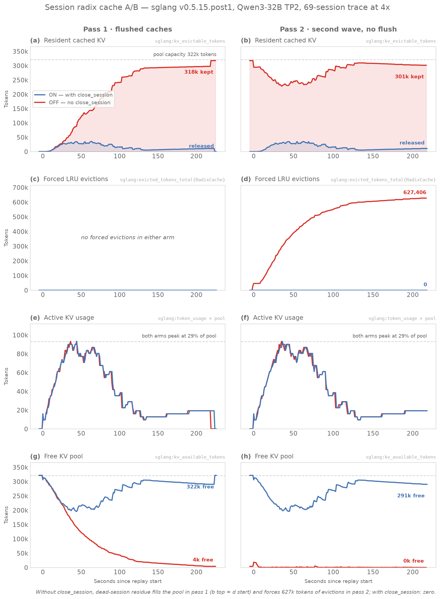

# PR 27058 A/B verification — GKE llm-d-session-control, 2026-07-17

Reproduction of the gist's sglang-native A/B (ishandhanani/35824599a81332714db849f8eb431d46) on the live GKE stack instead of local L40S: 2× existing decode pods, `lmsysorg/sglang:v0.5.13.post1 → v0.5.15.post1`, Qwen3-32B TP2 on H100, KV pool 321,614 tokens/pod (vs 143,872 in the gist), page_size 1.

Step-by-step reproduction instructions: [RUNBOOK.md](RUNBOOK.md). Graph: `gen_charts.py` → `figures/kv-pressure-ab.png`.

## Setup

- Pod A (**ON**, `hzztk`): replay with radix-native sessions + `/close_session` per session.
- Pod B (**OFF**, `svznv`): identical workload, no session lifecycle.
- Both pods run with `--enable-session-radix-cache --radix-eviction-policy=priority`; arms differ only in what the client sends.
- Workload: `golden-trace-12x4.jsonl` — 69 sessions, 358 turns, ~7.2k input tokens/turn (~2M total), `--speedup 4`, `--vocab 151000` (pass 1) / `149000` (pass 2), replayed in-pod (`kubectl exec`) because `kubectl port-forward` collapses under 69 concurrent streams.
- All four runs completed 358/358 turns, 0 errors.

## Pass 1 (flushed caches)

| metric | ON (close_session) | OFF |
|---|---|---|
| min kv_available | 195,583 (60.8% free) | 3,973 (1.2% free) |
| peak kv_evictable | 35,724 (11.1% of pool) | 317,641 (98.8% of pool) |
| kv_evictable after run | 2 | 317,641 (residue never released) |
| forced evictions | 0 | 0 (pool 2.2× gist's — residue *just* fit) |

## Pass 2 (no flush, fresh token ids = new traffic wave)

| metric | ON (fresh session ids) | OFF |
|---|---|---|
| min kv_available | 196,294 (61.0% free) | 9 (0.0% free) |
| peak kv_evictable | 35,208 (10.9%) | 317,641 (98.8%) |
| forced evictions | **0** | **627,406 tokens** |

The OFF pod entered pass 2 with 98.8% of the pool occupied by dead session residue, so the new wave forced 627k tokens of LRU evictions with the pool pinned at 0 free — the cache-thrash failure mode the PR eliminates. The ON pod entered pass 2 clean and stayed below 39% pool usage throughout. Worker logs show `release_session <id>: indexed N leaves, freed M nodes` per close on both passes (e.g. 1,604 nodes freed in pass 2).

## Deviations from the gist / findings about the released API

1. **API rename since the PR**: released v0.5.15+ uses a top-level `session_id` field on `/generate` (implicit open); the gist-era `session_params={"id": ...}` now routes to the old dedicated-slot session controller — requests succeed but nothing is tagged and close frees nothing. `replay_sglang_native.py` here is patched accordingly. The release method is `release_radix_session` (PR called it `release_session`; log line keeps the old name).
2. **Closed session ids are tombstoned** (`_CLOSED_SESSION_TOMBSTONE_LIMIT = 8192`): a reused id is silently never tagged again (`indexed 0 leaves, freed 0 nodes`). First rerun attempt reused trace ids and the ON arm silently degraded to OFF behavior; fixed with `--sid-suffix`. **Implication for llm-d-router#2003: never recycle session tokens after close.**
3. `sglang:kv_evictable_tokens` only refreshes on scheduler activity — stale while idle; use `cached_tokens` from a probe request as ground truth for release.
4. Added `ignore_eos: true` to the replay so gibberish synthetic ids still reproduce the trace's output lengths.

## Verdict

PR 27058's session radix cache works as advertised on v0.5.15.post1: session KV stays LRU-evictable (never pinned), `/close_session` bulk-frees it, and under a workload that thrashes a lifecycle-less baseline (627k forced eviction tokens, 0 free pool) the session-managed arm shows zero forced evictions with >60% pool headroom at all times.

## Files

- `RUNBOOK.md` — detailed step-by-step reproduction instructions.
- `replay_sglang_native.py` — patched replay (released API, `--sid-suffix`, `ignore_eos`).
- `replay_sglang_chat.py` — same A/B via `/v1/chat/completions` (SGLang `session_id` extension field; text-rendered trace — see RUNBOOK § chat variant).
- `microbench/` — self-contained micro benchmark (hero agent vs. churn): script, shared metrics sampler, per-turn CSVs, chart and results write-up. See `microbench/README.md`.
- `gen_charts.py` — renders `figures/kv-pressure-ab.png` from the CSVs (styled with the tvhahn/matplotlib-skill conventions).
- `sample_metrics_ab.sh` — 1 Hz KV-gauge sampler that produced the CSVs below (URL-parameterized variant of the gist's `sample_metrics.sh`).
- `metrics_on.csv` / `metrics_off.csv` — pass 1 samples (1 Hz, in-pod).
- `metrics_on2.csv` — invalid ON rerun (tombstoned ids; kept as evidence for finding 2). `metrics_off2.csv` — OFF rerun.
- `metrics_on3.csv` — corrected ON rerun.
- `README.md`, `golden-trace-12x4.jsonl`, `sample_metrics.sh`, `run_sglang_native.sh`, `replay_session_trace.py` — original gist bundle (upstream RESULTS.md removed; their results were the L40S/GLM-4.7-Flash run).
